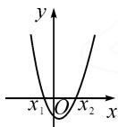
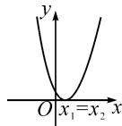
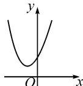

# 一元二次不等式恒成立问题解题策略

# ●甘肃省卓尼县柳林中学 马永福

摘要:利用函数思想解决不等式的取值范围问题是高考的热点.解决一元二次不等式恒成立问题的基础是三个“二次”的相互转化,本文中主要通过数形结合思想,从三个类型入手讲解一元二次不等式恒成立的解题策略,旨在培养学生利用化归、数形结合、函数和分类讨论思想进行解题的意识.

关键词: 函数; 不等式; 恒成立

由一元二次方程、一元二次不等式及二次函数的关系,可以得到解一元二次不等式的一般步骤:(1)化不等式为标准形式 $ax^{2}+bx+c>0$ (或 $ax^{2}+bx+c<$

0) $(a>0)$ ;(2)求方程 $ax^{2}+bx+c=0(a>0)$ 的根，并画出对应函数 $f(x)=ax^{2}+bx+c$ 的图象简图；(3)由图象得出不等式的解集。(如表1)

表1

<table><tr><td></td><td> $\Delta >0$ </td><td> $\Delta = 0$ </td><td> $\Delta < 0$ </td></tr><tr><td>方程  $ax^{2} + bx + c = 0$ ( $a >0$ )的根</td><td>有两个相异的实数根 $x_{1} = \frac{-b - \sqrt{b^{2} - 4ac}}{2a}$  $x_{2} = \frac{-b + \sqrt{b^{2} - 4ac}}{2a}$ </td><td>有两个相等的实数根 $x_{1} = x_{2} = -\frac{b}{2a}$ </td><td>没有实数根</td></tr><tr><td>二次函数  $y = ax^{2} + bx + c (a >0)$ 的图象</td><td></td><td>.</td><td></td></tr><tr><td>二次函数  $y = ax^{2} + bx + c (a >0)$ 的零点</td><td>有两个零点 $x_{1}, x_{2} (x_{1} < x_{2})$ </td><td>有一个零点  $x = -\frac{b}{2a}$ </td><td>无零点</td></tr><tr><td> $ax^{2} + bx + c >0 (a >0)$ 的解集</td><td> $(-\infty, x_{1}) \cup (x_{2}, +\infty)$ </td><td> $\left(-\infty, -\frac{b}{2a}\right) \cup \left(-\frac{b}{2a}, +\infty\right)$ </td><td>R</td></tr><tr><td> $ax^{2} + bx + c < 0 (a >0)$ 的解集</td><td> $(x_{1}, x_{2})$ </td><td> $\emptyset$ </td><td> $\emptyset$ </td></tr></table>

# 1 类型 1: 在 R 上恒成立, 求参数取值范围

(1) 若 $ax^{2} + bx + c > 0 (a \neq 0)$ 恒成立, 需要满足两个条件: ① a > 0, ② $\Delta < 0$ .  
(2) 若 $ax^{2} + bx + c < 0 (a \neq 0)$ 恒成立, 需要满足两个条件: ① a < 0, ② $\Delta < 0$ .

例 1 设 a 为常数, $\forall x \in R, ax^{2} + ax + 1 > 0$ , 求 a 的取值范围.

解析: 当 $a \neq 0$ 时, 根据类型 1 可知, 只需满足 a > 0, $\Delta = (a)^{2} - 4a < 0$ , 即 0 < a < 4; 当 a = 0 时, 1 > 0 恒成立. 所以 a 的取值范围是 [0, 4).

例 2 若存在实数 x，使得 $x^{2}-4bx+3b<0$ 成立，

则 b 的取值范围是 \_\_\_\_.

解析:该题型的关键词为“存在实数 x”，数形结合，可知函数 $f(x)=x^{2}-4bx+3b$ 在 x 轴下方有图象，即对应方程 $x^{2}-4bx+3b=0$ 有两个不等实数根，所以解题关键是 $\Delta=(-4b)^{2}-12b>0$ .

故 b 的取值范围是 $\left\{b \mid b > \frac{3}{4}$ ，或 b < 0 $\}$ .

点评:一元二次不等式 $ax^{2}+bx+c>0$ 或 $ax^{2}+bx+c<0$ 对“任意”的 x 在 R 上恒成立,结合对应函数图象可知,图象与 x 轴没有交点,转化为对应方程没有实数根即 $\Delta<0$ 是解题的桥梁,特别注意开口方向的确定;当条件变为“存在”时,要注意桥梁的转化作用.

# 2 类型 2: 在某区间上恒成立, 求参数取值范围

(1) 若 $ax^2 + bx + c > 0 (a > 0)$ 在 $[m, n]$ 上恒成立，需要考虑函数图象的对称轴 $x = -\frac{b}{2a}$ 的位置：

①对称轴在区间 $[m,n]$ 的左侧，只需 $f(m)>0$ ;  
②对称轴在区间 $[m,n]$ 的右侧，只需 $f(n)>0$ ;  
③对称轴在区间 $[m, n]$ 之中间，只需 $f\left(-\frac{b}{2a}\right) > 0$

(2) 若 $ax^2 + bx + c < 0 (a > 0)$ 在 $[m, n]$ 上恒成立：

①对称轴在区间 $[m, n]$ 的左侧，只需 $f(n) < 0$ ；  
②对称轴在区间 $[m,n]$ 的右侧，只需 $f(m)<0$ ;  
③对称轴在区间 $[m,n]$ 之中间，需 $f(m)<0$ 且 $f(n)<0$ .

(3) 若 $ax^{2} + bx + c > 0 (a < 0)$ 在 $[m, n]$ 上恒成立：

①对称轴在区间 $[m,n]$ 的左侧，只需 $f(n)>0$ ;  
②对称轴在区间 $[m, n]$ 的右侧，只需 $f(m) > 0$ ；  
③对称轴在区间 $[m, n]$ 之中间，需 $f(m) > 0$ 且 $f(n) > 0$ .

(4) 若 $ax^2 + bx + c < 0 (a < 0)$ 在 $[m, n]$ 上恒成立：

①对称轴在区间 $[m,n]$ 的左侧，只需 $f(m)<0$ ;  
②对称轴在区间 $[m,n]$ 的右侧，只需 $f(n)<0$ ;  
③对称轴在区间 $[m, n]$ 之中间，只需 $f\left(-\frac{b}{2a}\right) < 0$ .

例3 关于 $x$ 的函数 $f(x) = mx^2 - mx - 1$ ，对于 $x \in [1,3]$ ， $f(x) < -m + 5$ 恒成立，求 $m$ 的取值范围.

分析:由题意可知 $mx^{2}-mx+m-6<0$ 在 $x\in[1,3]$ 上恒成立.当 $m\neq0$ 时,二次函数图象的对称轴为 $x=\frac{1}{2}$ , 函数在区间 $[1,3]$ 上单调, 则分类讨论可得 m 的取值范围.还要考虑 m=0 的情况.

解:根据题意 $f(x)<-m+5$ , 得

$$
m x ^ {2} - m x + m - 6 <   0.
$$

令 $g(x)=mx^{2}-mx+m-6$ ，当 $m\neq0$ 时， $g(x)$ 的对称轴为 $x=\frac{1}{2}$ ， $g(x)$ 在 $[1,3]$ 上单调.

① 当 m>0 时， $g(x)$ 在 $x\in[1,3]$ 上单调递增，若在 $x\in[1,3]$ 上 $f(x)<-m+5$ 恒成立，则 $g(x)<0$ ，即只需 $g(3)<0$ ，解得 $m<\frac{6}{7}$ ，故 $0<m<\frac{6}{7}$ .  
②当 m<0 时， $g(x)$ 在 $x\in[1,3]$ 上单调递减，若在 $x\in[1,3]$ 上 $f(x)<-m+5$ 恒成立，则 $g(x)<0$ ，即只需 $g(1)<0$ ，解得 m<6，故 m<0。  
③当 m=0 时，-6<0 恒成立.

综上,实数 m 的取值范围为 $\left(-\infty, \frac{6}{7}\right)$ .

点评:一元二次不等式在某个区间上恒成立问题,首先要将不等式化成 $g(x)>0$ 或者 $g(x)<0$ 的标准形式,然后结合对应函数图象及对称轴的位置,求得参数的取值范围.

例4 函数 $f(x) = x^{2} + mx - 1$ ，若对于任意 $x \in [m, m + 1]$ 都有 $f(x) < 0$ 成立，求实数 $m$ 的取值范围.

分析:本题属于类型2中的第(2)种情况,只需满足 $f(m)<0$ 且 $f(m+1)<0$ 即可,

解: 根据题意, 对于任意 $x \in [m, m+1]$ 都有 $f(x) < 0$ 成立, 则 $f(m) < 0$ 且 $f(m+1) < 0$ .

即 $2m^{2}-1<0$ ，且 $2m^{2}+3m<0$ 。

解得 $-\frac{\sqrt{2}}{2}<m<0.$

所以,实数 m 的取值范围为 $\left(-\frac{\sqrt{2}}{2},0\right)$ .

点评: 当二次函数在对应区间上单调, 但对称轴位置不好确定时, 可将区间两个端点函数值符号的确定作为突破口, 进行解答.

# 3 类型 3: 给出参数的范围, 求不等式的解集

例 5 对于任意 $k \in [-1, 1]$ ，关于 x 的函数 $f(x) = x^{2} + (k - 4)x + 4 - 2k > 0$ 恒成立，求 x 的取值范围.

分析:该题型是开口向上的二次函数 $f(x)>0$ 恒成立问题,给出参数取值范围,求自变量 x 的取值范围,直接求解很麻烦,所以可变换主元进行转化,把 k 当作主元,把 x 当作参数利用函数的性质求解其范围.

解: $f(x)=x^{2}+(k-4)x+4-2k$ 换元得 $g(k)=(x-2)k+x^{2}-4x+4$ ，此时原函数 $f(x)$ 变成关于 k 的一次函数 $g(k)$ 。一次函数 $g(k)$ 在其定义域 $[-1,1]$ 上单调，要使 $g(k)>0$ 恒成立，则只需 $\left\{\begin{aligned}g(1)&>0,\\ g(-1)&>0,\end{aligned}\right.$ 即 $\left\{\begin{aligned}x^{2}-5x+6&>0,\\ x^{2}-3x+2&>0,\end{aligned}\right.$ 解得 x>3，或 x<1。

所以 x 的取值范围是 $(-∞,1)∪(3,+∞)$ .

点评:此类问题的求解有两种方法.(1)直接求解,利用分类讨论思想;(2)应用函数思想,以参数为主元,构造关于参数的函数求解.

根据已知条件将恒成立问题向基本类型转化,是解决一元二次不等式恒成立问题的基本思路.解题方法有函数法、最值法、分离参数法、数形结合法等.一元二次不等式恒成立问题的解题过程渗透着换元、化归、数形结合、函数与方程等思想方法,解决问题的过程也是培养学生核心素养的过程.Z