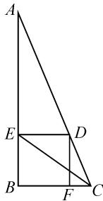
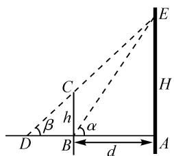
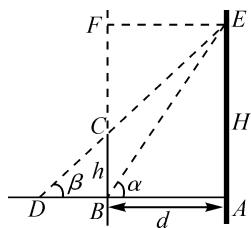
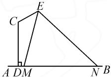
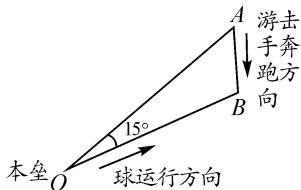

# 以几何图形为载体的实际应用问题探究

# ●福建省宁德市古田县第一中学 林宁宁

三角函数或解三角形问题是高考数学六大主干模块知识中必考的重要内容之一,特别是新高考对该部分基本知识、思想方法与数学能力等方面的考查明显加强,且在命题上逐年创新.以平面几何图形为载体的三角函数或解三角形的实际应用问题,将成为新高考数学试卷命题的热点与亮点之一.

# 1 以三角函数为背景的应用问题

利用平面几何图形的创新情境,以三角函数为创新背景来创设与构建数学问题,结合三角函数的相关知识来分析与解决,进而解决对应的实际应用问题.

例 1 我国勾股定理的论述比西方相应的论述早一千多年,在我国古代著名的数学经典著作《九章算术》中,有相应的问题叙述:“今有勾五步,股十二步,问勾中容方几何?”具体翻译过来的意思为:今有直角三角形 ABC,勾(短直角边)BC 长 5 步,股(长直角边)AB 长 12 步,问该直角三角形能容纳的正方形 DEBF 的边长为多少?如图 1 所示,在 Rt△ABC 中,求得正方形 DEBF 的边长后,可求得 tan ∠ACE = \_\_\_\_.

分析:根据题目条件,设正方形 DEBF 的边长为 a, 结合两直角三角形相似列出对应的方程, 进而求解边长 a 的值, 然后分别求解两对应角的正切值, 最后利用两角差的正切公式加以转化与求值.

解析：如图 1 所示，设正方形 DEBF 的边长为 a，则 AE=12-a.

易知 Rt△AED ∽ Rt△ABC, 则有 $\frac{AE}{AB} = \frac{ED}{BC}$ ，即 $\frac{12 - a}{12} = \frac{a}{5}$ ，解得 $a = \frac{60}{17}$ .
则 $\tan\angle ACB=\frac{12}{5},\tan\angle ECB=\frac{12}{17}.$

所以 $\tan\angle ACE=\tan(\angle ACB-\angle ECB)=\frac{\tan\angle ACB-\tan\angle ECB}{1+\tan\angle ACB\tan\angle ECB}=$

$$
\frac {\frac {1 2}{5} - \frac {1 2}{1 7}}{1 + \frac {1 2}{5} \times \frac {1 2}{1 7}} = \frac {1 4 4}{2 2 9}.
$$

故填答案: $\frac{144}{229}$ .

text_image

Geometric diagram with labeled points A, B, C, D, E, F and line segments forming triangles and quadrilaterals

图1

例 2 [2022 届上海市宝山区高三(上)期末数学试卷(一模)] 吴淞口灯塔 AE 采用世界先进的北斗卫星导航遥测遥控系统, 某校数学建模小组测量其高度 H (单位: m), 示意图如图 2, 垂直放置的标杆 BC

text_image

E
H
C
β
h
α
D
B
d
A

图2

的高度 $h = 3 \, m$ ，使 A, B, D 在同一直线上，也在同一水平面上，仰角 $\angle ABE = \alpha, \angle ADE = \beta.$ （本题的距离精确到 $0.1 \, m$ ）

(1)该小组测得 $\alpha, \beta$ 的一组值为 $\alpha = 51.83^{\circ}, \beta = 47.33^{\circ}$ ，请据此计算 H 的值；  
(2)根据经验数据可知,适当调整标杆到灯塔的距离d(单位:m),使得 $\alpha$ 与 $\beta$ 之差变大时,可以有效提高测量的精确度.若灯塔的实际高度为20.1 m,试问d为何值时, $\alpha-\beta$ 最大?

分析:(1)利用已知条件,结合直角三角形构建关系式,从而利用计算器求具体的值即可;  
(2)延长 BC，由 E 向 BC 作垂线，垂足为 F，结合直角三角形，利用三角恒等变换公式得到 $\tan(\alpha-\beta)$ 的值，再结合基本不等式求得 d 值即可.

解析:(1) 在 Rt△ABE 中, 可得 $AB = \frac{H}{\tan \alpha}$ . 在 Rt△ADE 中, $AD = \frac{H}{\tan \beta}$ , 在 Rt△BDC 中, $BD = \frac{3}{\tan \beta}$ .

由 $\frac{H}{\tan\beta} -\frac{H}{\tan\alpha} = \frac{3}{\tan\beta}$ 得 $H = \frac{3\tan\alpha}{\tan\alpha - \tan\beta}\approx$ $\frac{3\times 1.27214}{1.27214 - 1.08483}\approx 20.4(\mathrm{m}).$

(2)如图3,延长BC,由点E向BC作垂线,垂足为F,则

$$
\begin{array}{l} \tan \alpha = \frac {A E}{A B} = \frac {2 0 . 1}{d}, \\ \tan \beta = \frac {C F}{E F} = \frac {1 7 . 1}{d}. \\ \end{array}
$$

所以 $\tan(\alpha-\beta)=$

$$
\frac {\tan \alpha - \tan \beta}{1 + \tan \alpha \tan \beta} = \frac {3}{d + \frac {3 4 3 . 7 1}{d}}.
$$

text_image

F
E
C
H
β
h
α
D
B
d
A

图3

由 $d > 0$ ，得 $d + \frac{343.71}{d} \geqslant 2\sqrt{343.71} \approx 37.1$ ，当且仅当 $d = \frac{343.71}{d}$ ，即 $d \approx 18.5$ 时，等号成立.

故 d 约为 18.5 m 时, $\alpha - \beta$ 最大.

点评:解决涉及以三角函数为背景的应用问题,借助平面几何图形,特别是三角形、平面四边形等常规几何模型,结合三角函数的定义、三角函数的相关公式(诱导公式、同角三角函数基本关系式、三角恒等变形公式)等知识来解决相关的实际应用问题.

# 2 以解三角形为背景的应用问题

利用平面几何图形的创新情境,以解三角形为创新背景来创设与构建数学问题,结合解三角形的相关知识来分析与解决,进而解决对应的实际应用问题.

例 3 某校要在一条水泥路边安装路灯, 其中灯杆的设计如图 4 所示, AB 为地面, CD, CE 为路灯灯杆, $CD \perp AB$ , $\angle DCE = \frac{2\pi}{3}$ , 在 E 处安装路灯, 且路灯的

  
图 4

照明张角 $\angle MEN=\frac{\pi}{3}$ .已知 $CD=4\ \mathrm{m}, CE=2\ \mathrm{m}$ ,那么当点 $M, D$ 重合时,路灯在路面的照明宽度 $MN=$ \_\_\_\_ m.

分析:根据题目条件,通过点 M,D 重合所构建的三角形,利用余弦定理确定线段 ME 的长度,进而求解 $\angle CDE$ 的余弦值,再结合三角函数的诱导公式以及同角三角函数的基本关系式,并利用正弦定理来转化,即可求解线段 MN 的长度,此即为路灯在路面的照明宽度.

解析: 当点 M, D 重合时, 由余弦定理, 得 $ME = DE = \sqrt{CD^{2} + CE^{2} - 2CD \cdot CE \cdot \cos \angle DCE} = 2\sqrt{7}$ .

所以 $\cos\angle CDE=\frac{CD^{2}+DE^{2}-CE^{2}}{2CD\cdot DE}=\frac{5\sqrt{7}}{14}.$

因为 $\angle CDE + \angle EMN = \frac{\pi}{2}$ 所以 $\sin \angle EMN =$ $\cos \angle CDE = \frac{5\sqrt{7}}{14}.$ 又 $\cos \angle EMN > 0$ ，则

$$
\cos \angle E M N = \sqrt {1 - \sin^ {2} \angle E M N} = \frac {\sqrt {2 1}}{1 4}.
$$

由 $\angle MEN = \frac{\pi}{3}$ , 得 $\sin \angle ENM = \sin \left( \frac{2\pi}{3} - \angle EMN \right) =$ $\sin \frac{2\pi}{3} \cos \angle EMN - \cos \frac{2\pi}{3} \sin \angle EMN = \frac{2\sqrt{7}}{7}$ .

所以在 $\triangle EMN$ 中，由正弦定理，得 $\frac{MN}{\sin \angle MEN} = \frac{ME}{\sin \angle ENM}$ ，即 $\frac{MN}{\frac{\sqrt{3}}{2}} = \frac{2\sqrt{7}}{\frac{2\sqrt{7}}{7}}$ ，解得 $MN = \frac{7\sqrt{3}}{2}$ .

故填答案: $\frac{7\sqrt{3}}{2}$ .

例 4 如图 5 所示, 在奥运会垒球比赛前, C 国教练布置实际战术时, 要求击球手以与连结本垒(如图中的点 O 位置) 及游击手的奔跑方向所在的直线(由

text_image

本垒
O
15°
A
B
游击
手奔
跑方
向
球运行方向

图5

点 A 奔跑向点 B 的方向) 成 $15^{\circ}$ 的方向 ( $\angle AOB = 15^{\circ}$ ) 把球击出, 根据经验及测速仪的显示, 通常情况下球速为游击手最大跑速的 4 倍, 问按这样的预计场景布置, 游击手能不能接着球?

分析:根据题目条件,把实际问题转化为相关的三角形问题.设从击出球到接着球的时间,借助速度构建对应的长度关系,结合正弦定理,利用三角函数值的取值情况,从而判断游击手是否能接着球.

解析:如图5所示,本垒为点O,游击手从点A跑出,假设游击手能接着球,接球点恰好为点B,其中 $\angle AOB=15^{\circ}$ .

设从击出球到接着球的时间为 t，球速为 v，则有 OB = vt, $AB \leqslant \frac{1}{4} vt$ .

在 $\triangle AOB$ 中,由正弦定理,得 $\frac{OB}{\sin\angle OAB}=\frac{AB}{\sin15^{\circ}}$ .

所以 $\sin \angle OAB = \frac{OB}{AB} \cdot \sin 15^{\circ} \geqslant \frac{vt}{\frac{vt}{4}} \times \frac{\sqrt{6} - \sqrt{2}}{4} = \sqrt{6} - \sqrt{2}$ . 而 $(\sqrt{6} - \sqrt{2})^{2} = 8 - 4\sqrt{3} > 8 - 4 \times 1.74 > 1$ ，则知 $\sin \angle OAB > 1$ ，故这样的 $\angle OAB$ 不存在.

因此，按这样的预计场景布置，游击手不能接着球。

点评:解决涉及以解三角形为背景的应用问题,借助实际应用情境,合理数学建模.通过构建对应的平面几何图形,数形结合,利用正弦定理、余弦定理以及解三角形中的相关知识来解决相关的实际应用问题.

以几何图形为载体的三角函数或解三角形的实际应用问题,通常与圆、扇形等平面几何图形相结合.解决此类问题的关键是把各个线段表示出来,进而列出函数的解析式;与最值(范围)有关的问题,常常涉及表面积与体积,解题关键是适当引入参数,然后运用导数进行分析与求解.Z