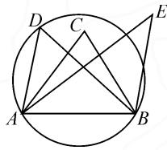

# 以退为进,另辟蹊径

——高中数学解题思路与方法例析

# ●甘肃省武威第七中学 姬成虎

平时解数学题时,我们经常会碰到一些疑惑费解或从未见过的题型,一时难以下手.这时我们不妨冷静思考一下,把这些未知的、较繁杂的题型“退”回到我们熟悉的、较为简易的题型,以便从中找到解题方法或产生解题灵感,最终使原问题化难为易而获解.

下面我们通过对典型例题的解析,来了解和掌握如何运用“以退为进”的策略解题的思路与方法.

# 1 从抽象退回到具体

在解题时,我们会遇到一些比较抽象的问题,往往不容易找到解题思路,甚至让人有种“摸不着边际”的惶惑之感,这时可以尝试把它具体化,或许就能找到解题途径.

例 1 函数 $f(x)$ 的定义域关于原点对称,且满足以下条件:

① $x_{1},x_{2}$ 是 $f(x)$ 定义域中的数，且 $f(x_{1}-x_{2})=\frac{f(x_{1})f(x_{2})+1}{f(x_{2})-f(x_{1})}$ ；② $f(a)=1(a>0)$ ；③当0<x<2a时， $f(x)>0$ .

(1) 判定 $f(x)$ 的奇偶性；

(2) 判定 $f(x)$ 是否是周期函数, 如果是周期函数, 求出周期.

解:(1)令 $x=x_{1}-x_{2}$ ，因为 $f(x)$ 的定义域关于原点对称，所以 $-x=x_{2}-x_{1}$ 也在 $f(x)$ 的定义域内.

由 $f(x_{2} - x_{1}) = \frac{f(x_{1})f(x_{2}) + 1}{f(x_{1}) - f(x_{2})}$ ，可知 $f(x) = -f(x_{1} - x_{2}) = -f(x)$ ，所以 $f(x)$ 为奇函数.

(2) 因为 $f(x + a) = \frac{f(x)f(-a) + 1}{f(-a) - f(x)} = \frac{-f(x)f(a) + 1}{-f(a) - f(x)} = \frac{1 - f(x)}{-1 - f(x)} = \frac{f(x) - 1}{f(x) + 1}$ ，所以

$$
\begin{array}{c} f (x + 2 a) = f [ (x + a) + a ] = \frac {f (x + a) - 1}{f (x + a) + 1} = \\ \frac {f (x) - 1}{f (x) + 1} - 1 \\ \frac {f (x) - 1}{f (x) + 1} + 1 = \frac {- 2}{2 f (x)} = - \frac {1}{f (x)}. \end{array}
$$

由上式, 可得 $f(x+4a)=f[(x+2a)+2a]=-\frac{1}{f(x+2a)}=f(x)$ .

所以 $f(x)$ 为周期函数,且其周期为 4a.

思路与方法:由条件①可以联想到两角差的余切公式 $\cot(\alpha-\beta)=\frac{\cot\alpha\cot\beta+1}{\cot\beta-\cot\alpha}$ ; 由 $\cot\frac{\pi}{4}=1$ , 猜想 $a=\frac{\pi}{4}$ . 通过仔细观察, 又可发现题设条件与余切函数的运算法则和性质相类似, 所以不妨运用“以退为进”的策略, 将题中的函数由抽象转化为具体, “退”回到 $f(x)=\cot x$ , 又 $y=\cot x$ 的周期为 $\pi=4\times\frac{\pi}{4}$ , 由此猜想此题中的结论——(1) $f(x)$ 为奇函数; (2) $f(x)$ 为周期函数, 其周期为 4a.

从本题的解题过程可以看出抽象“退”为具体的思路,有利于启迪思维,能帮助我们找到抽象问题的突破口.当然,在具体求解过程中要对其抽象性进行严格论证.

# 2 从一般退回到特殊

对于有些较复杂的问题,从一般角度难以解决时,不妨退后一步,通过观察和研究它的特殊情况,去寻求其规律和解题方法.

例 2 设数列 $\{a_{n}\}$ 与 $\{b_{n}\}$ 的通项公式分别是 $a_{n}=2^{n}, b_{n}=3n+2$ ，它们的公共项从小到大排列成数列 $\{c_{n}\}$ . 求 $\{c_{n}\}$ 的前 n 项和.

解:由 $\{c_{n}\}$ 的定义,可知 $c_{1}=8$ .设 $\{c_{n}\}$ 中的第n项为 $\{a_{n}\}$ 中的第m项, $\{b_{n}\}$ 中的第k项,即 $c_{n}=2^{m}=3k+2$ ,那么 $\{a_{n}\}$ 中的第 $m+1$ 项为

$a_{m+1}=2^{m+1}=2\cdot2^{m}=2(3k+2)=3(2k+1)+1,$ 这说明 $a_{m+1}$ 不是 $\{b_{n}\}$ 中的项，也不是 $\{c_{n}\}$ 中的项.

而 $\{a_{n}\}$ 中的第 $m+2$ 项为 $a_{m+2}=2^{m+2}=4\cdot2^{m}=4(3k+2)=3(4k+2)+2$ ，这说明 $a_{m+2}$ 是 $\{b_{n}\}$ 的项，从而是 $\{c_{n}\}$ 的第 $n+1$ 项，且 $\frac{c_{n+1}}{c_{n}}=\frac{2^{m+2}}{2^{m}}=4$ .

所以 $\{c_{n}\}$ 是首项为8,公比为4的等比数列,它的

前 n 项和 $S_{n}=\frac{8(2^{2n}-1)}{3}$ .

思路与方法:由于 $\{a_{n}\}$ 的前若干项为2,4,8,16,32,64,128,256,512,……,又 $\{b_{n}\}$ 的项为被3除余2,因此 $\{c_{n}\}$ 的前四项为8,32,128,512.当“退”回到 $\{a_{n}\}$ 中,我们欣喜地发现 $\{c_{n}\}$ 的项可能是 $\{a_{n}\}$ 中除去第一项的所有奇数项,构成以8为首项,公比为4的等比数列.当然,猜想是否正确,需要严格论证.

本题的解题思路是:将数列的一般通项退到特殊项,通过分析特殊情况,掌握 $\{c_{n}\}$ 的结构,进而找到解题方法.所以说,当涉及到以自然数n为序号的问题时可以采用这种“投石问路”的方法.

# 3 从多退回到少

对于某些未知数较多、情况较复杂的问题,可以尝试先从未知数较少的简单情况入手,以此为突破口,再去解答未知数较多的原问题,这也是一种“以退为进”的策略.

例 3 平面上有 $2n+3$ 个点, 其中任何三点不共线, 任何四点不共圆. 问能否过其中三点作一个圆, 使其余 2n 个点, 一半在圆内, 一半在圆外?

分析: 直接考虑这个问题似乎无从下手, 为了认清“庐山真面目”, 我们先把问题退到 n=1, 即 5 个点的情况.如图1，A，B，C，D，E为无三点共线、无四点共圆的五个点，总存在这样的两点（如 $A,B$ ）使其余各点在其连线的同侧.连AB，记 $C,D,E$ 对 $AB$ 的张角分别为 $\angle C,\angle D,\angle E$ ，由于无四点共圆, 故这三个角互不相等, 不妨设 $\angle C > \angle D > \angle E$ , 则点 $A, B, D$ 的外接圆为所求. 这样就不难得到本题的解题思路.

text_image

Geometric diagram showing a circle with inscribed quadrilateral ABCD and external point E, labeled with vertices A, B, C, D, E.

图1

解: 对已知平面上的 $2n+3$ 个点, 总可以找到这样的两点, 使其余的 $2n+1$ 个点在其连线的两侧, 记这两点为 A, B, 其余的 $2n+1$ 个点为 $C_{1}, C_{2}, \cdots, C_{2n}, C_{2n+1}$ . 连结 AB, 并记点 $C_{i}$ 对 AB 的张角为 $C_{i} (i=1,2,\cdots,2n+1)$ , 由于无四点共圆, 所以其余 $2n+1$ 个角彼此不相等. 不妨设 $\angle C_{1}<\angle C_{2}<\cdots<\angle C_{n+1}<\cdots<\angle C_{2n}<\angle C_{2n+1}$ , 则以点 A, B, $C_{n+1}$ 所确定的圆 O, 使其余的 2n 个点有一半在 $\odot O$ 内, 一半在 $\odot O$ 外.

思路与方法:本题乍一看有点“老虎吃天,无从下口”的感觉,为了找到突破口,不妨先退一步,把问题中的 $2n+3$ 个点退到n=1,即5个点的情况来考虑,这就为“进”作好了铺垫,便于找到解题思路.

# 4 从整体退回到局部

对于某些综合性较强的数学题型,如果从整体上不易解决,那我们就先攻其局部;如果攻克了局部的一两个问题,就能逐步扩大战果,从而达到解决整体问题的目的.

例 4 在锐角三角形 ABC 中, 求证: $\sin A + \sin B + \sin C > \cos A + \cos B + \cos C$ .

证法 1: 因为 $\triangle ABC$ 为锐角三角形, 所以 $A + B = \pi - C > \frac{\pi}{2}$ , 则 $A > \frac{\pi}{2} - B$ , 于是 $0 < \frac{\pi}{2} - B < A < \frac{\pi}{2}$ .

根据正弦函数在 $\left[0, \frac{\pi}{2}\right]$ 的增减性，可知 $\sin A > \sin \left(\frac{\pi}{2} - B\right) = \cos B.$

同理, $\sin B>\cos C,\sin C>\cos A$ ,从而可得

$$
\sin A + \sin B + \sin C > \cos A + \cos B + \cos C.
$$

证法 2: 因为 $\sin A + \sin B = 2\sin \frac{A + B}{2} \cos \frac{A - B}{2} = 2\cos \frac{C}{2} \cos \frac{A - B}{2}, \cos A + \cos B = 2\cos \frac{A + B}{2} \cdot \cos \frac{A - B}{2} = 2\sin \frac{C}{2} \cos \frac{A - B}{2}$ ，所以

$$
\begin{array}{l} (\sin A + \sin B) - (\cos A + \cos B) = 2 \left(\cos \frac {C}{2} - \right. \\ \left. \sin \frac {C}{2}\right) \cos \frac {A - B}{2}. \end{array}
$$

由 $0 < \frac{C}{2} < \frac{\pi}{4}$ , 得 $\cos \frac{C}{2} - \sin \frac{C}{2} > 0$ .

又 $-\frac{\pi}{4}<\frac{A-B}{2}<\frac{\pi}{4}$ ，所以 $\cos\frac{A-B}{2}>0.$

于是 $\sin A + \sin B > \cos A + \cos B.$

同理， $\sin B+\sin C>\cos B+\cos C$

$$
\sin C + \sin A > \cos C + \cos A.
$$

将上述三式左右分别相加,即可得证.

思路与方法:本题看似简单,但如果想从整体上解答却难以下手.联想到三角形三个内角的和为 $\pi$ ,以及三角函数间的转换关系,我们可以退后一步,尝试从局部(从一个角的三角函数式或两个角的三角函数式)着手寻求解法.这就是从整体退回到局部方法运用的典型实例.

从上述典例的思路与方法的解析中我们可以看到：“以退为进”其实就是一种间接的解题思路；运用“以退为进”的解题策略具有极大的便捷性、灵活性与实用性。学生如果学会运用这种策略，一定能够帮助他们开阔思路，少走弯路，提高解决较复杂问题的能力。Z