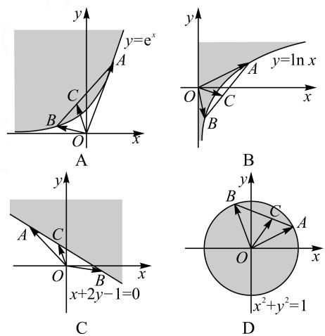
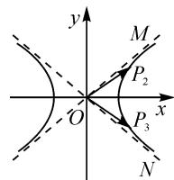
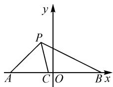

# 借助向量特征,挖掘几何价值

# 山东省烟台第一中学 柳敬福

摘要: 平面向量的概念、运算以及数量积等相关知识具有一定的几何特征与价值, 合理构建或应用平面向量, 利用条件的合理转化与应用, 充分挖掘平面几何图形的价值, 数形结合, 直观形象地解决一些相关问题, 实现不同知识间的交互与整合.

关键词: 平面向量; 平面几何; 三点共线; 夹角; 角平分线

平面向量同时兼备“形”与“数”两个基本特征.合理应用或构建平面向量,抓住平面向量自身“形”的特征或“数”的性质,充分挖掘平面几何图形的几何意义与几何价值,实现“形”与“数”之间的合理转化与直观应用,往往可以巧妙、简单、快捷地处理一些相关数学问题.

# 1 三点共线

根据向量共线定理的深入与拓展, 可知“三点共线向量式定理”: 平面内一组基底 $\overrightarrow{OA}, \overrightarrow{OB}$ 及任一向量 $\overrightarrow{OP}, \overrightarrow{OP} = x \overrightarrow{OA} + y \overrightarrow{OB} (x, y \in \mathbb{R})$ , 则当且仅当 $x + y = 1$ 时, A, P, B 三点共线. 结合平面向量的这一特征, 可以非常明确对应的平面几何量的几何特征, 得到三点共线.

例 1 （2022 届广东模拟预测数学试卷）（多选题）已知集合 E 是由平面向量组成的集合，若对任意 $a, b \in E, t \in (0,1)$ ，均有 $ta + (1 - t)b \in E$ ，则称集合 E 是“凸”的，则下列集合中是“凸”的有（）.

A. $\{(x,y)\mid y\geqslant e^{x}\}$   
B. $\{(x,y)\mid y\geqslant\ln x\}$   
C. $\{(x,y)\mid x+2y-1\geqslant0\}$   
D. $\{(x,y)\mid x^{2}+y^{2}\leqslant1\}$

分析:根据创新定义,结合三点共线的性质确定创新集合的性质特征以及对应向量的关系,利用函数图象所对应的平面区域数形结合,综合创新定义加以分析与判断.

解析: 设 $\overrightarrow{OA}=a, \overrightarrow{OB}=b, \overrightarrow{OC}=ta+(1-t)b$ ，则结合 $t\in(0,1)$ 及三点共线的性质，可知点 C 为线段 AB 上一点。因此，一个集合 E 是“凸”的就是 E 表示的平面区域上任意两点连线上的点仍在该区域内。四个选项中，结合对应的函数图象，作出满足不等式的平面区域，对应选项各集合所表示的平面区域如图 1 中阴影所示。

  
图1

观察选项 A, B, C, D 所对应图形的特征, 只有选项 B 不符合题意, 选项 A, C, D 符合题意.

故选择答案: ACD.

点评:根据平面向量的基底法以及线性运算,结合三点共线的性质,可以很好地转化与平面向量相关的一些线性代数中的平面向量问题,实现“数”向“形”的巧妙转化,为进一步利用平面几何的图形特征与几何意义等提供条件,实现数形结合,直观形象地解决一些相关的创新应用问题.

# 2 夹角

根据向量的数量积公式与几何意义可知, 当 $\overrightarrow{OA} \cdot \overrightarrow{OB} > 0$ 时, 向量 $\overrightarrow{OA}$ 与 $\overrightarrow{OB}$ 的夹角为锐角 (或零角); 当 $\overrightarrow{OA} \cdot \overrightarrow{OB} = 0$ 时, 向量 $\overrightarrow{OA}$ 与 $\overrightarrow{OB}$ 的夹角为直角; 当 $\overrightarrow{OA} \cdot \overrightarrow{OB} < 0$ 时, 向量 $\overrightarrow{OA}$ 与 $\overrightarrow{OB}$ 的夹角为钝角 (或平角).

例 2 （2022 年上海市春季高考数学试卷 • 11）
已知双曲线 $\frac{x^{2}}{a^{2}}-y^{2}=1(a>0)$ ，其右支上有任意两点 $P_{1}(x_{1},y_{1}),P_{2}(x_{2},y_{2})$ ，满足 $x_{1}x_{2}-y_{1}y_{2}>0$ 恒成立，则a的取值范围是\_\_\_\_。

分析:根据题目条件,结合不等式中对应的代数关系式的结构特征,通过坐标语言的转化,综合利用点的对称性以及平面向量的数量积公式与性质(夹角性质),从而将条件翻译并转化为两向量夹角的几何条件问题,数形结合来求解.

解析:如图2所示,设点 $P_{2}(x_{2},y_{2})$ 关于x轴的对称点为点 $P_{3}(x_{2},-y_{2})$ ,则点 $P_{3}$ 仍在双曲线的右支上.因为 $x_{1}x_{2}-y_{1}y_{2}>0$ 恒成立,即 $\overrightarrow{OP_{1}}\cdot\overrightarrow{OP_{3}}=x_{1}x_{2}-y_{1}y_{2}>0$ 恒成立,所以向量 $\overrightarrow{OP_{1}}$ 与 $\overrightarrow{OP_{3}}$ 的夹角恒为锐角，即 $\angle P_{1}OP_{3}$ 恒为锐角，则 $\angle MON \leqslant 90^{\circ}$ . 其中直线 $OM, ON$ 是双曲线的两条渐近线，则知其中一条渐近线 $OM: y = \frac{1}{a} x$ 的斜率 $\frac{1}{a} \leqslant 1$ ，解得 $a \geqslant 1$ ，所以实数 $a$ 的取值范围为 $[1, +\infty)$ . 故填答案： $[1, +\infty)$ .

text_image

y
M
P₂
O
x
P₃
N

图2

点评: 涉及函数、不等式、解三角形、解析几何等相关问题中的一些代数关系式、函数表达式等, 自身具有一定的几何意义与解题价值, 合理与平面向量的相关知识加以巧妙联系, 借助平面向量的概念、运算或性质等来分析, 直观形象. 该问题主要是抓住特殊代数式的几何结构特征, 联想平面向量数量积的几何意义与几何模型, 以“形”助“数”, 使问题变得特别简单.

# 3 角平分线

根据向量投影的定义与几何特征, 若点 P 不在直线 AB 上, 且满足 $\frac{\overrightarrow{PA} \cdot \overrightarrow{PC}}{|\overrightarrow{PA}|} = \frac{\overrightarrow{PB} \cdot \overrightarrow{PC}}{|\overrightarrow{PB}|}$ , 利用投影的定义可得 $|\overrightarrow{PC}| \cos \angle APC = |\overrightarrow{PC}| \cos \angle BPC$ , 则知 $\cos \angle APC = \cos \angle BPC$ , 即 $\angle APC = \angle BPC$ , 那么可以确定 PC 为 $\angle APB$ 的角平分线.

例 3 （2021 年云南模拟数学试卷）设 $\overrightarrow{OA}, \overrightarrow{OB}$ 为不共线的非零向量，且 $\overrightarrow{OC} = \frac{1}{1 + \lambda} \overrightarrow{OA} + \frac{\lambda}{1 + \lambda} \overrightarrow{OB}$ . 定义点集 $M = \left\{ P \left| \frac{\overrightarrow{PA} \cdot \overrightarrow{PC}}{|\overrightarrow{PA}|} = \frac{\overrightarrow{PB} \cdot \overrightarrow{PC}}{|\overrightarrow{PB}|} \right. \right\}$ . 当 $P_{1}, P_{2} \in M$ ，且不在直线 AB 上时，若对任意的 $\lambda \geqslant 2$ ，不等式 $|\overrightarrow{P_{1}P_{2}}| \leqslant m | \overrightarrow{AB}|$ 恒成立，则实数 m 的最小值是 \_\_\_\_.

分析:根据题设中平面向量线性关系的结构特征确定 A, B, C 三点共线, 结合向量数量积中相关投影的几何意义得到 PC 为对应角的平分线, 为进一步利用三角形内角平分线定理构建关系式提供条件, 并构建平面直角坐标系, 结合点 P 的轨迹来确定圆的直径与 AB 的关系, 进而利用函数的知识确定参数的最值.

解析: 在 $\overrightarrow{OC} = \frac{1}{1 + \lambda} \overrightarrow{OA} + \frac{\lambda}{1 + \lambda} \overrightarrow{OB}$ 中, 由于 $\frac{1}{1 + \lambda} + \frac{\lambda}{1 + \lambda} = \frac{1 + \lambda}{1 + \lambda} = 1$ , 因此利用“三点共线向量式定理”可

知 A, B, C 三点共线，且 $\overrightarrow{CA} = \lambda \overrightarrow{BC}$ .

又由于 $\frac{\overrightarrow{PA} \cdot \overrightarrow{PC}}{|\overrightarrow{PA}|} = \frac{\overrightarrow{PB} \cdot \overrightarrow{PC}}{|\overrightarrow{PB}|}$ , 因此有 $|\overrightarrow{PC}|$ · $\cos \angle APC = |\overrightarrow{PC}|\cos \angle BPC$ , 结合点 $P$ 不在直线 $AB$ 上的前提条件, 可知 $\angle APC = \angle BPC$ , 则 $PC$ 为 $\angle APB$ 的角平分线.

借助三角形内角平分线定理，有 $\frac{|PA|}{|PB|}=\frac{|CA|}{|CB|}=\lambda.$

如图 3 所示, 构建平面直角坐标系. 设 AB = 2a (a > 0), $P(x, y)$ , 则 A(-a, 0), B(a, 0),

text_image

y
P
A C O B x

图 3

所以，有 $\left(\frac{PA}{PB}\right)^2 = \frac{(x + a)^2 + y^2}{(x - a)^2 + y^2} = \lambda^2.$

整理并配方有 $\left[x - \frac{a(\lambda^2 + 1)}{\lambda^2 - 1}\right]^2 + y^2 = \left(\frac{2\lambda a}{\lambda^2 - 1}\right)^2.$

于是点 $P$ 的轨迹是以点 $\left(\frac{a(\lambda^2 + 1)}{\lambda^2 - 1}, 0\right)$ 为圆心， $\left|\frac{2\lambda a}{\lambda^2 - 1}\right|$ 为半径的圆.

根据条件,数形结合可得 $\left|\overrightarrow{P_{1}P_{2}}\right|\leqslant\frac{4\lambda a}{\lambda^{2}-1}$ .

由 $|\overrightarrow{P_1P_2}| \leqslant m |\overrightarrow{AB}|$ 恒成立，可得 $\frac{4\lambda a}{\lambda^2 - 1} \leqslant 2ma$ 即 $m \geqslant \frac{2\lambda}{\lambda^2 - 1} = \frac{2}{\lambda - \frac{1}{\lambda}} (\lambda \geqslant 2)$ 恒成立.

令函数 $f(\lambda) = \frac{2}{\lambda - \frac{1}{\lambda}} (\lambda \geqslant 2)$ ，则 $f(\lambda)$ 在 $[2, +\infty)$ 上单调递减，可知 $f(\lambda)$ 的最大值为 $f(2) = \frac{4}{3}$ .

所以 $m \geqslant \frac{4}{3}$ ，即 m 的最小值为 $\frac{4}{3}$ 。故填答案： $\frac{4}{3}$ 。

点评:抓住创新定义并利用平面向量的概念、运算、数量积等加以巧妙转化,充分挖掘内涵与实质,结合平面几何的图形意义或性质特征等来转化,回归平面几何本质,链接初中平面几何与高中相关知识,实现不同数学知识之间的交汇与融合,充分考查数学思维与数学能力.

# 4 结语

平面向量的概念、运算、数量积等自身具有几何意义与直观模型，通过一些相关向量关系的构建与应用，合理挖掘平面几何的价值，借助平面几何的相关知识来分析与解决，数形结合，直观想象，“串联”起相关知识与平面向量、平面几何等之间的联系，实现不同知识之间的交互与整合. Z