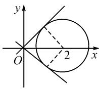
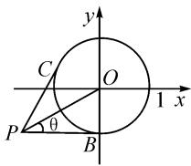
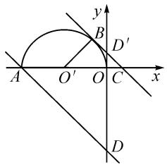
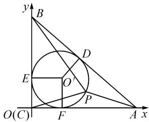
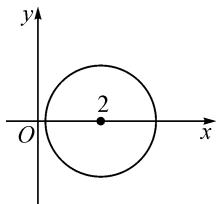
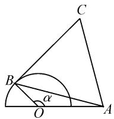

# 圆的最值问题求解四法

# ●云南省普洱市孟连县第一中学 孙宝恩

摘要:与圆有关的最值问题是近年来高考数学的热点之一,它着重考查数形结合与转化思想.求圆的最值问题“四化法”的基本思路是,利用平面几何知识,或利用圆的参数方程,或设圆上点的坐标,将其转化为函数的最值问题.

关键词:化为斜率法;化为截距法;化为距离法;化为三角函数法

与圆有关的最值问题,因为其代数式具有明显的几何意义,所以应优先考虑数形结合法.运用数形结合法求最值,既可以借助图形直观获得简捷解法,又可避免因对限制条件考虑不周造成的失误,还有利于沟通数学各个分支,深化思维,全面提高学生数学综合素质 $^{[1]}$ .

涉及与圆有关的最值问题,可借助圆的几何性质,并根据代数式的几何意义,利用数形结合思想来求解.一般情况下,求形如 $t=\frac{y-b}{x-a}$ 的最值问题,可转化为动直线的斜率问题;求形如 $t=ax+by+c$ 的最值问题,可转化为动直线的截距问题;求形如 $(x-a)^{2}+(y-b)^{2}$ 的最值问题,可转化为动点到定点的距离问题.另外,还可以通过建立目标函数求最值.

与圆有关的最值问题,既是高中数学中的难点问题,又是近年来高考中的热点题型,因此有必要熟悉和掌握其常用的解题思路与方法.

# 1 化为斜率法

例 1 已知实数 x, y 满足方程 $x^{2} + y^{2} - 4x + 1 = 0$ ，求 $\frac{y}{x}$ 的最大值和最小值.

解: 原方程可化为 $(x-2)^{2}+y^{2}=3$ ，表示以 $(2,0)$ 为圆心， $\sqrt{3}$ 为半径的圆。 $\frac{y}{x}$ 的几何意义是该圆上一点与原点连线的斜率，所以设 $\frac{y}{x}=k$ ，即y=kx。

当直线 y=kx 与圆相切时，如图1，斜率 k 取最大值或最小值，此时 $\frac{|2k-0|}{\sqrt{k^{2}+1}}=\sqrt{3}$ ，解得 $k=\pm\sqrt{3}$ .

所以 $\frac{y}{x}$ 的最大值为 $\sqrt{3}$ ，最小值为 $-\sqrt{3}$ .

  
图 1

思路与方法:本题中 $\frac{y}{x}$ 的几何意义是圆上的点与原点连线的斜率,两切线的斜率为其最值,可由 $\frac{|2k-0|}{\sqrt{k^{2}+1}}=\sqrt{3}$ 求切线的斜率,也可将y=kx代入圆的方程,由 $\Delta\geqslant0$ ,求解k的范围.

例 2 求 $y=\frac{1+\sin x}{2+\cos x}$ 的最值.

解: 将原函数式变形为 $y = \frac{\sin x - (-1)}{\cos x - (-2)}$ ，其几何意义是在直角坐标系中，动点 $(\cos x, \sin x)$ 与定点 $P(-2, -1)$ 连线的斜率。动点 P 的轨迹为单位圆（如图 2），由图可知， $k_{PB}$ 最小， $k_{PC}$ 最大。显然， $k_{PB} = 0$ 。

text_image

y
C
O
1 x
P
θ
B

图2

由 $\tan\theta=\frac{|OB|}{|PB|}=\frac{1}{2}$ ，得 $\tan\angle BPC=\tan2\theta=\frac{2\tan\theta}{1-\tan^{2}\theta}=\frac{4}{3}$ ，即 $k_{PC}=\frac{4}{3}$ .

故 y 的最小值为 0, 最大值为 $\frac{4}{3}$ .

思路与方法:从本题的解题思路可以归纳——形如 $\frac{f(x)-a}{g(x)-b}$ 的函数式,可以将其看作点 $(g(x),f(x))$ 与点 $(b,a)$ 连线的斜率,这也是最常见的解题方法.

# 2 化为截距法

例 3 在圆 $O: x^{2} + y^{2} = 1$ 上求一点 P，使得过点 P 的切线与两条坐标轴所围成的三角形面积最小.

解法 1: 设 $P(x_{1}, y_{1})$ ，则切线 l 为 $x_{1}x + y_{1}y = 1$ ，即 $\frac{x}{\frac{1}{x_{1}}} + \frac{y}{\frac{1}{y_{1}}} = 1$ ，截距 $a = \frac{1}{x_{1}}, b = \frac{1}{y_{1}}$ 。所以，过点 P 的

切线与两坐标轴所围成的三角形面积为 $S=\frac{1}{2}|a|$

$$
| b | = \frac {1}{2} \left| \frac {1}{x _ {1}} \right| \cdot \left| \frac {1}{y _ {1}} \right| = \frac {1}{\left| 2 x _ {1} y _ {1} \right|} \geqslant \frac {1}{x _ {1} ^ {2} + y _ {1} ^ {2}} = \frac {1}{1} = 1,
$$

当且仅当 $|x_1| = |y_1| = \frac{\sqrt{2}}{2}$ 时，取等号， $S$ 的最小值为1.

故所求点 $P$ 的坐标为 $\left(\frac{\sqrt{2}}{2},\frac{\sqrt{2}}{2}\right),\left(\frac{\sqrt{2}}{2}, - \frac{\sqrt{2}}{2}\right),$ $\left(-\frac{\sqrt{2}}{2}, - \frac{\sqrt{2}}{2}\right),\left(-\frac{\sqrt{2}}{2},\frac{\sqrt{2}}{2}\right).$

解法 2: 因为点 P 在圆 $x^{2} + y^{2} = 1$ 上, 可设 $P(\cos \varphi, \sin \varphi)$ , 所以切线 $l: x \cos \varphi + y \sin \varphi = 1$ , 其截距 $a = \frac{1}{\cos \varphi}, b = \frac{1}{\sin \varphi}$ . 因此, 过点 P 的切线与两坐标轴所围成的三角形面积为 $S = \frac{1}{2} |a| \cdot |b| = \frac{1}{2} \cdot \left| \frac{1}{\cos \varphi} \right| \cdot \left| \frac{1}{\sin \varphi} \right| = \frac{1}{|\sin 2\varphi|} \geqslant 1$ .

当 $\sin 2\varphi = \pm 1$ ，即 $\varphi = \pm \frac{\pi}{4}$ ， $\pm \frac{3}{4}\pi$ 时，S 取最小值，且最小值为 1.

故所求点 $P$ 的坐标为 $\left(\frac{\sqrt{2}}{2},\frac{\sqrt{2}}{2}\right),\left(\frac{\sqrt{2}}{2}, - \frac{\sqrt{2}}{2}\right),$ $\left(-\frac{\sqrt{2}}{2}, - \frac{\sqrt{2}}{2}\right),\left(-\frac{\sqrt{2}}{2},\frac{\sqrt{2}}{2}\right).$

思路与方法:本题的两种解法都是将与圆有关的求三角形的最值问题转化为直线与圆相切的截距型问题.通过设点 P 的坐标,先求出截距,然后再根据三角形面积公式推出 $S_{\triangle} \geqslant 1$ ,最后确定点 P 的位置.

例 4 设 x, y 满足 $y = \sqrt{-x^{2} - 2x}$ ，求 $S = x + y$ 的最大值和最小值.

解： $y = \sqrt{-x^2 - 2x} = \sqrt{1 - (x + 1)^2}$ ，其图象为如图3所示的半圆 $O'$ ， $S$ 的最大值与最小值分别是直线 $y = -x + S$ 和半圆 $O'$ 有公共点时截距的最大值与最小值.

text_image

y
B
D'
A
O'
O
C
x
D

图3

由 $A(-2,0), k_{AD} = -1$ ，得 $D(0, -2)$ ，即 $S_{\min} = -2$ 。又 $|O'B| = |BC| = 1$ ，所以 $|O'C| = \sqrt{2}$ ，得 $|OC| = \sqrt{2} - 1 = |OD'\|$ ，则点 $D'$ 的坐标为 $(0, \sqrt{2} - 1)$ ，即 $S_{\max} = \sqrt{2} - 1$ 。

故 S 的最大值与最小值分别为 $\sqrt{2}-1,-2$ .

思路与方法:本题是将其转化、变形为截距型最值问题,并对半圆、直线截距的几何意义进行了由“隐”到“显”的挖掘,其中紧扣“S 的最大值与最小值分别是直线 $y = -x + S$ 和半圆 $O'$ 有公共点时截距 S 的最大值与最小值”是关键.

# 3 化为距离法

例 5 在 $\triangle ABC$ 中， $\angle A, \angle B, \angle C$ 所对的边分别为 a, b, c，且 $c = 10, \frac{\cos A}{\cos B} = \frac{b}{a} = \frac{4}{3}$ ，P 为 $\triangle ABC$ 的内切圆上的动点，求点 P 到顶点 A, B, C 的距离的平方和的最大值与最小值.

解法 1: 由 $\frac{\cos A}{\cos B} = \frac{b}{a}$ ，得 $\frac{\cos A}{\cos B} = \frac{\sin B}{\sin A}$ ，即 $\sin 2A = \sin 2B$ .

在 $\triangle ABC$ 中，因为 $A \neq B$ ，所以 $2A + 2B = \pi$ ，则 $A + B = \frac{\pi}{2}$ ，故 $\triangle ABC$ 为直角三角形.

由 $c = 10, \frac{b}{a} = \frac{4}{3}$ , 可得 $a = 6, b = 8$ . 建立如图4所示的平面直角坐标系, 设 $\triangle ABC$ 的内切圆圆心为 $O'$ , 切点分别为 $D, E, F$ , 则 $|AD| + |DB| +$

text_image

y
B
D
E
O'
P
O(C)
F
A x

图4

$|EC|=\frac{1}{2}(10+8+6)=12$ ，内切圆的半径 $r=|EC|=12-10=2$ ，则内切圆 $O'$ 方程为 $(x-2)^{2}+(y-2)^{2}=4$ .

设圆 $O^{\prime}$ 上动点 $P$ 的坐标为 $(x,y)$ ，则点 $P$ 到顶点 $A,B,C$ 的距离的平方和为 $S = |PA|^2 + |PB|^2 + |PC|^2 = (x - 8)^2 + y^2 + x^2 + (y - 6)^2 + x^2 + y^2 = 3[(x - 2)^2 + (y - 2)^2] - 4x + 76 = 88 - 4x$ .

由点 P 在圆上, 可知, $0 \leqslant x \leqslant 4$ , 于是 S 的最大值为 88, 最小值为 $88 - 4 \times 4 = 72$ .

解法 2: 同解法 1, 得 $\triangle ABC$ 是直角三角形, 其内切圆半径 r=2. 设圆上动点 P 的坐标为 $(2+2\cos\alpha, 2+2\sin\alpha)(0\leqslant\alpha\leqslant2\pi)$ , 则点 P 到顶点 A, B, C 的距离的平方和为 $S=|PA|^{2}+|PB|^{2}+|PC|^{2}=(2\cos\alpha-6)^{2}+(2+2\sin\alpha)^{2}+(2+2\cos\alpha)^{2}+(2\sin\alpha-4)^{2}+(2+2\cos\alpha)^{2}+(2+2\sin\alpha)^{2}=80-8\cos\alpha$ .

因为 $0 \leqslant \alpha \leqslant 2\pi$ ，所以 S 的最大值为 $=80 + 8 = 88$ ，最小值为 $=80 - 8 = 72$ 。

思路与方法:本题可转化为点到直线的距离型最值问题.解法1是由三角形的边、角关系推证出 $\triangle ABC$ 为直角三角形,然后建立平角直角坐标系,通过设三角形内切圆,求三角形三边的长度获解;解法2在已知 $\triangle ABC$ 为直角三角形的基础上,通过设动点坐标,利用三角函数求出最值.

例 6 已知实数 x, y 满足方程 $x^{2} + y^{2} - 4x + 1 = 0$ ，求 $x^{2} + y^{2}$ 的最大值和最小值.

解: $x^{2}+y^{2}-4x+1=0$ 可化为 $(x-2)^{2}+y^{2}=3$ ，它表示以 $C(2,0)$ 为圆心， $\sqrt{3}$ 为半径的圆。如图5所示， $x^{2}+y^{2}$ 表示圆上的一点与坐标原点距离的平方。由平面几何知识可知，在坐标原点和圆心连线与圆的两个交点处取得最大值和最小值. 又因为圆心 C 到原点的距离为 2, 所以 $x^{2} + y^{2}$ 的最大值是 $(2 + \sqrt{3})^{2} = 7 + 4\sqrt{3}$ , $x^{2} + y^{2}$ 的最小值是 $(2 - \sqrt{3})^{2} = 7 - 4\sqrt{3}$ .

text_image

y
2
O
x

图5

思路与方法:本题中的 $x^{2}+y^{2}$ 可看作是圆上的点与原点距离的平方,所以可以借助平面几何知识,利用数形结合法快速求解.

# 4 化为三角函数法

例 7 已知圆 $C:(x-3)^{2}+(y-4)^{2}=1$ 和两点 $A(-m,0)$ , $B(m,0)(m>0)$ . 若圆 C 上存在点 P，使得 $\angle APB=90^{\circ}$ ，则 m 的最大值为（）.

A.7

B.6

C.5

D.4

解: 设点 $P(x_{0}, y_{0})$ ，则 $\left\{\begin{aligned}x_{0}&=3+\cos\theta,\\ y_{0}&=4+\sin\theta\end{aligned}\right.$ ( $\theta$ 为参数).

由 $\angle APB=90^{\circ}$ ，得 $\overrightarrow{AP} \cdot \overrightarrow{BP}=0$ ，即 $(x_{0}+m)(x_{0}-m)+y_{0}^{2}=0$ ，则 $m^{2}=x_{0}^{2}+y_{0}^{2}=26+6\cos\theta+8\sin\theta=26+10\sin(\theta+\varphi)\leqslant36$ （其中 $\tan\varphi=\frac{3}{4}$ ）.

所以 $0 < m \leqslant 6$ ，即 m 的最大值为 6。

故选答案:B.

思路与方法:本题是通过建立目标函数来求最值.由于 $\angle APB=90^{\circ}$ ，则点P也在以AB为直径的圆上，因此问题还可转化为两圆有公共点，求m的最大值，即两圆内切时，m有最大值6.

例 8 半圆 O 的直径为 2, A 为直径延长线上一点, OA = 2, B 为半圆上任意一点, 以 AB 为一边作等边三角形 ABC. 问点 B 在什么位置时, 四边形 OACB 的面积最大, 并求这个最大值.

解：如图6，设 $\angle AOB = \alpha$ $(0 < \alpha < \pi)$ ，在 $\triangle AOB$ 中，又 $OB = 1, OA = 2$ ，由余弦定理，得

$$
\begin{array}{c} A B ^ {2} = O A ^ {2} + O B ^ {2} - 2 O A \cdot \\ O B \cos \alpha = 5 - 4 \cos \alpha . \end{array}
$$

设四边形 OACB 的面积为 S，则

text_image

C
B
α
O
A

图6

$$
\begin{array}{l} S = \frac {1}{2} O A \cdot O B \sin \alpha + \frac {\sqrt {3}}{4} A B ^ {2} \\ = \sin \alpha + \frac {\sqrt {3}}{4} (5 - 4 \cos \alpha) \\ = \frac {5 \sqrt {3}}{4} + (\sin \alpha - \sqrt {3} \cos \alpha) \\ = \frac {5 \sqrt {3}}{4} + 2 \sin \left(\alpha - \frac {\pi}{3}\right), \\ \end{array}
$$

当且仅当 $\sin\left(\alpha-\frac{\pi}{3}\right)=1$ ，即 $\alpha=\frac{5\pi}{6}$ 时，四边形 OACB 的面积最大，且最大值为 $\frac{5\sqrt{3}}{4}+2$ .

思路与方法:本题通过运用余弦定理,将与圆有关的四边形面积的最值问题,转化为三角函数问题来求解.从解题过程不难看出,对 $y=a\sin x+b\cos x(a,b\neq0)$ 引入辅角 $\theta$ ,则 $y=\sqrt{a^{2}+b^{2}}\sin(x+\theta)$ (其中 $\tan\theta=\frac{b}{a}$ ),其最值一目了然.

根据以上典例及“四化法”的运用情况,可以把与圆有关的最值问题大致归纳总结为以下几种类型:①定点与圆上的点的距离的最值题型,可将其转化为“定点到圆心的距离±半径”;②定直线与圆上点的距离的最值题型,可将其转化为“圆心到直线的距离±半径”;③形如 $t=\frac{y-b}{x-a}$ 的最值题型,可将其转化为动直线的斜率问题(切线处取得最值);④形如 $t=ax+by+c$ 的最值题型,可将其转化为动直线的截距问题(切线处取得最值);⑤形如 $(x-a)^{2}+(y-b)^{2}$ 的最值问题,可将其转化为定点到圆上动点的最值问题.

圆是一种很规则的图形,解答与圆有关的最值问题很适合采用数形结合法.运用“四化法”解题的关键,是在准确理解题意的基础上进行合理联想和类比,将代数式通过转化、变形、给予几何解释 $^{[2]}$ .

上述典型例题的解析可以帮助学生学会从“形”中觅“数”的思路与方法，掌握如何根据图形去寻求数量关系的技巧，能够娴熟地将几何问题代数化，通过不断加强这类题型的解题训练，最终达到触类旁通、举一反三、开阔思路、运用自如、综合提高的目的。

# 参考文献：

[1] 杜超. 例谈与圆有关的最值问题 [J]. 理科考试研究, 2021 (9): 16-18.  
[2]程会海.与圆有关的最值问题的解题策略例说[J].中学数学,2022(5):64-65.Z