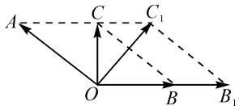
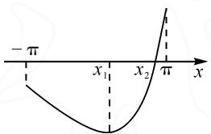
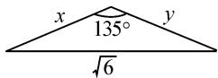

# 巧借数形结合,妙解数学问题

# ●江苏省沭阳如东中学 江 浩

摘要: 数形结合是数学解题中的一种常用技巧方法与数学思想. 结合具体实例, 从一些问题中常见的几何内涵、代数意义、公式结构等层面入手, 合理挖掘与科学构建, 确定与之相吻合的几何模型, 借助几何直观来综合分析与应用, 助力解题研究与复习备考.

关键词: 数形结合; 向量; 函数; 三角形; 余弦定理

著名数学家华罗庚说过：“数缺形时少直观，形少数时难入微；数形结合百般好，隔离分家万事休。”“数”与“形”作为数学问题中两个最主要的基本要素与研究对象，二者相互独立，又紧紧相联，构建成一个和谐完美的统一体，相互融合，相互渗透，相互转化。特别在解决一些函数与方程、平面向量、解三角形以及平面解析几何等相关问题时，经常由题中“数”的基本属性概括出“形”的结构特征，数形结合，直观形象地分析与解决对应的问题。

# 1 借助几何内涵挖掘图形特征

一些平面几何、解三角形、平面解析几何等相关问题，由于其自身具有几何内涵与实质，通过进一步挖掘与直观图形的构建，数形结合，可以从几何层面加以合理逻辑推理，进而很好地处理与解决相关问题.

例 1 （湖北省部分重点中学 2023 届高三第一次联考数学试卷）设 $\left|a\right|=2,\left|b\right|=\sqrt{3}$ ，若对 $\forall x\in R$ ， $\left|a+xb\right|\geqslant\left|a+b\right|$ ，则 a 与 b 的夹角等于（）.

A. $30^{\circ}$

B. $60^{\circ}$

C. $120^{\circ}$

D. $150^{\circ}$

分析:根据平面向量的几何内涵,将题设中的代数信息加以几何化处理,合理构建对应的平面几何图形——三角形,借助向量的线性运算确定对应的动点的轨迹,以及图形的结构特征,确定平面几何图形的性质,进而通过解直角三角形,利用平面向量的夹角概念等来直观分析与判断.

解析: 如图 1 所示, 设 $\overrightarrow{OA} = a, \overrightarrow{OB} = b, \overrightarrow{OC} = a + b, \overrightarrow{OB_{1}} = xb, \overrightarrow{OC_{1}} = a + xb$ , 其中四边形 OBCA 与

text_image

A
C
C₁
O
B
B₁

图1

四边形 $OB_{1}C_{1}A$ 均为平行四边形，即 $AC_{1} \parallel OB_{1}$ .

当 $x \in R$ 时，点 $C_{1}$ 的轨迹是直线 AC.

由 $|a+xb|\geqslant|a+b|$ 恒成立，可得 $|\overrightarrow{OC_{1}}|\geqslant|\overrightarrow{OC}|$ 恒成立，即 $|\overrightarrow{OC_{1}}|_{\min}=|\overrightarrow{OC}|$ ，则 $OC\perp AC$ .

在 Rt△ACO 中，由 $\left|OA\right|=2,\left|AC\right|=\sqrt{3}$ ，可得 $\sin\angle AOC=\frac{\left|AC\right|}{\left|OA\right|}=\frac{\sqrt{3}}{2}$ ，则 $\angle AOC=60^{\circ}$ ，从而可得 $\angle AOB=60^{\circ}+90^{\circ}=150^{\circ}$ ，所以 a 与 b 的夹角等于 $150^{\circ}$ 。故选：D.

点评:平面向量自身具有“数”的基本属性,其本质要通过代数运算来进行分析与应用;而借助平面向量中“形”的结构特征,利用图形直观来解决平面向量问题,能更加直观简捷地表达对应的代数表达式或代数关系等,直观形象地处理与解决平面向量中的相关问题.

# 2 借助代数意义构建直观图形

在解决一些函数或方程、函数与导数等相关代数问题时，结合函数、方程以及导数的相关代数意义或几何意义等，合理构建与之相关的几何模型或抓准其结构特征，将代数问题进一步转化为相关的“数”或“形”的形式来解决与处理.

例 2 [2022—2023 学年江苏省南京市高三(上)学情调研数学试卷(9 月份)] 若函数 $f(x)=2x-\sin x-a$ 在 $(-π,π)$ 上存在唯一的零点 $x_{1}$ ，函数 $g(x)=x^{2}+\cos x-ax+a$ 在 $(-π,π)$ 上存在唯一的零点 $x_{2}$ ，且 $x_{1}<x_{2}$ ，则实数 a 的取值范围为 \_\_\_\_.

分析:根据函数的单调性和函数零点存在定理,利用代数意义合理构建几何模型,通过数形结合进行分析与求解.借助巧妙设置,这里函数 $f(x)$ 的零点 $x_{1}$ 为函数 $g(x)$ 的极值点,相当于 $g(x)$ 的一个“隐零点”，注意利用函数的图象，数形结合来辅助解题，进而得以构建对应的不等式(组).

解析:由 $f(x)=2x-\sin x-a$ ，可得 $f'(x)=2-\cos x>0$ ，则函数 $f(x)=2x-\sin x-a$ 在 $(-π,π)$ 上单调递增.

而函数 $f(x)=2x-\sin x-a$ 在 $(-π,π)$ 上存在唯一的零点 $x_{1}$ ，结合函数零点存在定理，可得 $\left\{\begin{aligned}f(-\pi)&=-2\pi-a<0,\\ f(\pi)&=2\pi-a>0,\end{aligned}\right.$ 解得 $-2\pi<a<2\pi.$

又由 $g(x)=x^{2}+\cos x-ax+a$ ，求导可得 $g'(x)=2x-\sin x-a=f(x)$ .

而函数 $f(x) = 2x - \sin x - a$ 在 $(- \pi, \pi)$ 上存在唯一的零点 $x_1$ ，且 $f(x)$ 在 $(- \pi, \pi)$ 上单调递增，则当 $x \in (-\pi, x_1)$ 时， $g'(x) < 0$ ，当 $x \in (x_1, \pi)$ 时， $g'(x) > 0$ .

于是可得函数 $g(x)$ 在 $(-\pi, x_1)$ 上单调递减，在 $(x_1, \pi)$ 上单调递增.

又函数 $g(x) = x^{2} + \cos x - ax + a$ 在 $(- \pi, \pi)$ 上存在唯一的零点 $x_{2}$ ，且 $x_{1} < x_{2}$ ，如图2.

数形结合，可得 $\left\{\begin{aligned}g(-\pi)=\pi^{2}-1+a\pi+a&\leqslant0,\\ g(\pi)=\pi^{2}-1-a\pi+a&>0.\end{aligned}\right.$

text_image

-π
x₁
x₂
π
x

图2

解得 $a \leqslant 1 - \pi$ .

综上可得， $-2\pi<a\leqslant1-\pi$ ，即实数a的取值范围为 $(-2\pi,1-\pi]$ 。故填答案： $(-2\pi,1-\pi]$ 。

点评:在解决此类涉及函数零点的问题时,经常利用导数确定函数的单调性,结合函数与方程中相关问题的代数意义,利用函数的零点及其对应的取值范围,合理构建对应的几何图形,进而结合函数的图象、函数零点存在定理等来分析与处理.

# 3 借助公式结构类比几何模型

在解决一些涉及代数式、公式等相关代数问题时,往往要对相应的代数式进行合理的恒等变形,结合公式自身的结构特征,合理与对应的几何模型加以联系,如类比勾股定理、余弦定理、点到直线的距离公式等,合理构建几何模型来直观处理.

例 3 [2022 届江西省八所重点中学高三联考数学(理)试卷]已知正数 x, y 满足 $\frac{x}{y} + \frac{y}{x} = \frac{6}{xy} - \sqrt{2}$ ,$z=(x+y)(\sqrt{12-x^{2}}+\sqrt{12-y^{2}})$ ，则 z 的取值范围是 \_\_\_\_.

分析: 结合题设中关系式的恒等变形与合理转化, 抓住关系式的结构特征, 合理类比余弦定理的形式, 进而构建与之相吻合的三角形这一几何直观图形. 通过图形直观与几何性质, 并结合关系式加以代数运算与处理, 结合基本不等式以及三角形几何性质来综合应用.

解析：由 $\frac{x}{y} +\frac{y}{x} = \frac{6}{xy} -$ $\sqrt{2}$ ，整理可得 $x^{2} + y^{2} = 6-$ $\sqrt{2} xy$ ，即 $x^{2} + y^{2} + \sqrt{2} xy = 6.$

  
图3

结合余弦定理的结构特征构建如图3所示的平面几何图形——三角形，其三边长分别为 $x, y, \sqrt{6}$ .

而 $12 - x^{2} = 2(x^{2} + y^{2} + \sqrt{2} xy) - x^{2} = (x + \sqrt{2} y)^{2}$ 同理可得 $12 - y^{2} = (\sqrt{2} x + y)^{2}$ .

于是 $z = (x + y)(\sqrt{12 - x^2} +\sqrt{12 - y^2}) =$ $(x + y)(x + \sqrt{2} y + \sqrt{2} x + y) = (\sqrt{2} +1)(x + y)^2.$

结合三角形的几何性质, 可得 $x + y > \sqrt{6}$ , 即 $z = (\sqrt{2} + 1)(x + y)^{2} > 6(\sqrt{2} + 1)$ .

利用基本不等式，有 $(x + y)^2 = 6 - \sqrt{2} xy + 2xy = 6 + (2 - \sqrt{2})xy\leqslant 6 + (2 - \sqrt{2})\cdot \frac{(x + y)^2}{4}.$

解得 $(x + y)^2 \leqslant \frac{24}{2 + \sqrt{2}} = 12(2 - \sqrt{2})$ ，即 $z = (\sqrt{2} + 1)(x + y)^2 \leqslant 12\sqrt{2}$ .

所以 z 的取值范围是 $(6+6\sqrt{2},12\sqrt{2}]$ .

故填答案： $(6+6\sqrt{2},12\sqrt{2}]$ .

点评:根据条件中代数式的变形与转化,结合公式的结构特征类比对应的几何模型(此题中为解三角形中的余弦定理),合理构建与之对应的几何图形,并结合关系式的变形以及图形性质,从不同层面加以分析与处理.“形”与“数”综合处理,体现“数”“形”的和谐统一与完美配合.

数形结合,由“数”化“形”,借助问题的数量关系,概括出对应的几何意义或结构特征,等价转化为相关的图形性质,合理构建;结合图形的直观分析,巧妙打破不同数学知识间的壁垒,充分发挥想象力,使复杂问题简单化,抽象问题具体化,形象直观,豁然开朗.