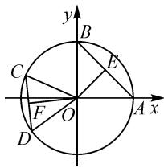
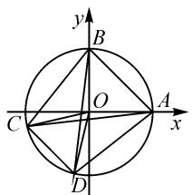

# 巧思维“一题多解”,妙视角变式拓展

# ●广东省佛山市顺德区容山中学 杨时香

摘要:数学解题与研究是数学教学与学习的一个基本过程,可以帮助学生看透更多的问题,积累更多的知识与经验,掌握发现问题、提出问题、分析问题与解决问题的方法,提升数学核心素养.结合一道高考向量综合模拟题,展开思维剖析,展示方法技巧,深入拓展研究,凸显数学本质,有效发散数学思维,提升数学能力.

关键词: 单位圆; 数量积; 最值; 基底; 坐标

波利亚曾说过：“掌握数学就是意味着善于解题。”数学解题不仅仅是为了做对具体的一道题，更多的是为了巩固对数学基础知识的理解与掌握，有效积累解题经验，合理强化解题方法，善于发现解题规律，系统掌握解题策略，形成解题意识，从而培养学生坚韧不拔、锲而不舍的数学意志品质与数学核心素养。

# 1 问题呈现

问题 单位圆 $O: x^{2} + y^{2} = 1$ 上有两定点 A(1,0)，B(0,1) 及两动点 C, D，且 $\overrightarrow{OC} \cdot \overrightarrow{OD} = \frac{1}{2}$ ，则 $\overrightarrow{CA} \cdot \overrightarrow{CB} + \overrightarrow{DA} \cdot \overrightarrow{DB}$ 的最大值是（）.

$$
\mathrm{A.} 2 + \sqrt {6} \quad \mathrm{B.} 2 + 2 \sqrt {3} \quad \mathrm{C.} \sqrt {6} - 2 \quad \mathrm{D.} 2 \sqrt {3} - 2
$$

该问题以平面解析几何为场景进行合理创设,结合单位圆上的两定点与两动点来设置“动”与“静”的和谐统一画面,进而根据平面向量数量积的条件,确定涉及平面向量数量积代数式的最值问题.

具体解决问题时,可以从平面向量的“形”的结构特征与“数”的基本属性等不同视角切入,也可以结合几何图形的性质利用特殊思维来实现问题的突破.

# 2 问题破解

# 2.1 思维视角一: 几何思维

方法 1: 基底法.

解析:如图1,设线段AB的中点为E,线段CD的中点为F,则 $|OE|=\frac{\sqrt{2}}{2}$ ,且 $\overrightarrow{OA}+\overrightarrow{OB}=2\overrightarrow{OE}$ , $\overrightarrow{OC}+\overrightarrow{OD}=2\overrightarrow{OF}$ .

由 $\overrightarrow{OC} \cdot \overrightarrow{OD} = \frac{1}{2}$ , 可得 $|\overrightarrow{OC}|$

text_image

y
B
C
E
F
O
A x
D

图1

$|\overrightarrow{OD}|\cos\angle COD=\cos\angle COD=\frac{1}{2}$ ，则有 $\angle COD=\frac{\pi}{3}$ .

因此， $\triangle OCD$ 为等边三角形，则 $|OF| = \frac{\sqrt{3}}{2}$ .

所以 $\overrightarrow{CA} \cdot \overrightarrow{CB} + \overrightarrow{DA} \cdot \overrightarrow{DB} = (\overrightarrow{OA} - \overrightarrow{OC}) \cdot (\overrightarrow{OB} - \overrightarrow{OC}) + (\overrightarrow{OA} - \overrightarrow{OD}) \cdot (\overrightarrow{OB} - \overrightarrow{OD}) = 2\overrightarrow{OA} \cdot \overrightarrow{OB} + \overrightarrow{OC^2} + \overrightarrow{OD^2} - (\overrightarrow{OA} + \overrightarrow{OB}) \cdot (\overrightarrow{OC} + \overrightarrow{OD}) = 2 - 4\overrightarrow{OE} \cdot \overrightarrow{OF} \leqslant 2 + 4|\overrightarrow{OE}| |\overrightarrow{OF}| = 2 + 4 \times \frac{\sqrt{2}}{2} \times \frac{\sqrt{3}}{2} = 2 + \sqrt{6}$ , 当且仅当 $\overrightarrow{OE}$ 与 $\overrightarrow{OF}$ 方向相反时, 等号成立.

所以 $\overrightarrow{CA}\cdot\overrightarrow{CB}+\overrightarrow{DA}\cdot\overrightarrow{DB}$ 的最大值是 $2+\sqrt{6}$ .

故选择答案:A.

解后反思:根据平面向量自身“形”的结构特征,通过几何图形直观,借助平面向量的基底法或极化恒等式法等加以转化,结合平面向量的线性运算,进而确定相关数量积的最值问题.几何思维更加直观有效,往往是处理平面向量问题的首选思维,即综合几何图形加以逻辑推理与应用.

# 2.2 思维视角二: 代数思维

方法 2: 坐标法.

解析:由 $\overrightarrow{OC}\cdot\overrightarrow{OD}=\frac{1}{2}$ ，可得 $|\overrightarrow{OC}||\overrightarrow{OD}|\cos\angle COD=$ $\cos\angle COD=\frac{1}{2}$ ，则有 $\angle COD=\frac{\pi}{3}$ .

不失一般性,不妨设 $C(\cos\theta,\sin\theta),\theta\in[0,2\pi)$ ,
则 $D\left(\cos\left(\theta+\frac{\pi}{3}\right),\sin\left(\theta+\frac{\pi}{3}\right)\right)$ ，则有

$$
\overrightarrow {C A} \cdot \overrightarrow {C B} + \overrightarrow {D A} \cdot \overrightarrow {D B} = (1 - \cos \theta , - \sin \theta) \cdot
$$

$$
(- \cos \theta , 1 - \sin \theta) + \left(1 - \cos \left(\theta + \frac {\pi}{3}\right), - \sin \left(\theta + \frac {\pi}{3}\right)\right) \cdot
$$

$$
\left(- \cos \left(\theta + \frac {\pi}{3}\right), 1 - \sin \left(\theta + \frac {\pi}{3}\right)\right) = 2 - \cos \theta - \sin \theta -
$$

$$
\cos \left(\theta + \frac {\pi}{3}\right) - \sin \left(\theta + \frac {\pi}{3}\right) = 2 + \left(\frac {\sqrt {3}}{2} - \frac {3}{2}\right) \sin \theta -
$$

$$
\left(\frac {\sqrt {3}}{2} + \frac {3}{2}\right) \cos \theta = 2 - \sqrt {6} \sin (\theta + \varphi) \leqslant 2 + \sqrt {6},
$$

此时 $\tan \varphi = 2 + \sqrt{3}$ ，当且仅当 $\sin (\theta +\varphi) = -1$ 时.等号成立，即 $\overrightarrow{CA}\cdot \overrightarrow{CB} +\overrightarrow{DA}\cdot \overrightarrow{DB}$ 的最大值是 $2 + \sqrt{6}$

故选择答案:A.

解后反思:根据平面向量自身“数”的基本属性,借助坐标法巧妙引入点或夹角等参数,通过点的坐标、向量的坐标及其对应的运算、数量积公式等,综合三角函数等其他相关知识来运算转化.代数思维更加方便数学运算,往往利用相应的数学运算即可得到最终结论.

# 2.3 思维视角三: 特殊思维

方法 3: 对称性.

解析: 由 $\overrightarrow{OC} \cdot \overrightarrow{OD} = \frac{1}{2}$ ，可得 $|\overrightarrow{OC}| \cdot |\overrightarrow{OD}| \cdot \cos \angle COD = \cos \angle COD = \frac{1}{2}$ ，则 $\angle COD = \frac{\pi}{3}$ .

text_image

y
B
O
C
A
x
D

图2

根据所求关系式 $\overrightarrow{CA}\cdot\overrightarrow{CB}+\overrightarrow{DA}\cdot\overrightarrow{DB}$ 的结构特征,结合对称性, 可知当 $AB \parallel CD$ 时取得最值, 如图 2 所示, 此时 $\angle ACB = \frac{\pi}{4}, \angle BOC = \frac{7\pi}{12}, |\overrightarrow{OA} + \overrightarrow{OB}| = \sqrt{2}$ .

故 $\overrightarrow{CA}\cdot\overrightarrow{CB}+\overrightarrow{DA}\cdot\overrightarrow{DB}$ 的最大值为 $2\overrightarrow{CA}\cdot\overrightarrow{CB}=2(\overrightarrow{OA}-\overrightarrow{OC})\cdot(\overrightarrow{OB}-\overrightarrow{OC})=2[\overrightarrow{OA}\cdot\overrightarrow{OB}+\overrightarrow{OC}^{2}-\overrightarrow{OC}\cdot(\overrightarrow{OA}+\overrightarrow{OB})]=2\left[1-1\times\sqrt{2}\times\cos\left(\frac{\pi}{4}+\frac{7\pi}{12}\right)\right]=2+\sqrt{6}$ .故选择答案:A.

解后反思:根据所求关系式的轮换结构特征,吻合对称性思维,结合单项选择题的特点,借助特殊思维,从对称性的特殊位置来分析与求解,从而实现问题的简化.利用特殊思维处理时,要注意不同特殊场景的应用.以上图形2中所求关系式是取得最大值,而当 $AB \parallel CD$ 且CD位于第一象限时,所求关系式取得最小值.

# 3 变式拓展

# 3.1 同级类比拓展

变式 1 单位圆 $O: x^{2} + y^{2} = 1$ 上有两定点 A(1, 0), B(0, 1) 及两动点 C, D，且 $\overrightarrow{OC} \cdot \overrightarrow{OD} = \frac{1}{2}$ ，则 $\overrightarrow{CA} \cdot \overrightarrow{CB} + \overrightarrow{DA} \cdot \overrightarrow{DB}$ 的最小值是 \_\_\_\_。（答案： $2 - \sqrt{6}$ .）

变式 2 单位圆 $O: x^{2} + y^{2} = 1$ 上有两定点 A(1, 0), B(0, 1) 及两动点 C, D，且 $\overrightarrow{OC} \cdot \overrightarrow{OD} = \frac{1}{2}$ ，则 $\overrightarrow{CA} \cdot \overrightarrow{CB} + \overrightarrow{DA} \cdot \overrightarrow{DB}$ 的取值范围是 \_\_\_\_。（答案： $[2 - \sqrt{6}, 2 + \sqrt{6}]$ .）

# 3.2 升级类比拓展

变式 3 单位圆 $O: x^{2} + y^{2} = 1$ 上有两定点 A(1,0), $B(0,1)$ 及两动点 C, D, 且 $\overrightarrow{OC} \cdot \overrightarrow{OD} = a$ , 其中常数 $a \in (-1,1]$ , 则 $\overrightarrow{CA} \cdot \overrightarrow{CB} + \overrightarrow{DA} \cdot \overrightarrow{DB}$ 的取值范围是 \_\_\_\_. (答案: $[2-2\sqrt{a+1}, 2+2\sqrt{a+1}]$ .)

# 3.3 创新类比拓展

变式 4 （原创题）单位圆 $O: x^{2} + y^{2} = 1$ 上有两动点 $C(x_{1}, y_{1}), D(x_{2}, y_{2})$ ，且满足 $x_{1}x_{2} + y_{1}y_{2} = \frac{1}{2}$ ，则 $x_{1} + x_{2} + y_{1} + y_{2}$ 的最大值是 \_\_\_\_。（答案： $\sqrt{6}$ ）

由变式 4 还可以得到以下三个变式创新问题.

变式 5 （原创题）单位圆 $O: x^{2} + y^{2} = 1$ 上有两动点 $C(x_{1}, y_{1}), D(x_{2}, y_{2})$ ，且满足 $x_{1}x_{2} + y_{1}y_{2} = \frac{1}{2}$ ，则 $x_{1} + x_{2} + y_{1} + y_{2}$ 的最小值是 \_\_\_\_。（答案： $-\sqrt{6}$ .）

变式 6 （原创题）单位圆 O: $x^{2} + y^{2} = 1$ 上有两动点 $C(x_{1}, y_{1}), D(x_{2}, y_{2})$ ，且满足 $x_{1}x_{2} + y_{1}y_{2} = \frac{1}{2}$ ，则 $x_{1} + x_{2} + y_{1} + y_{2}$ 的取值范围是 \_\_\_\_。（答案： $[-\sqrt{6}, \sqrt{6}]$ .）

变式 7 （原创题）单位圆 O: $x^{2} + y^{2} = 1$ 上有两动点 $C(x_{1}, y_{1}), D(x_{2}, y_{2})$ ，且满足 $x_{1}x_{2} + y_{1}y_{2} = a$ ，其中常数 $a \in (-1, 1]$ ，则 $x_{1} + x_{2} + y_{1} + y_{2}$ 的取值范围是 \_\_\_\_。（答案： $[-2\sqrt{a+1}, 2\sqrt{a+1}]$ .）

# 4 教学启示

# 4.1 “一题多解”, 发散思维

善于解题是系统理解与掌握数学基础知识与基本思想方法等的一个综合体现,是学生独立思考与探索能力的一个主要途径,对学生知识的积累与数学思维方法的完善有很好的促进与提升作用.

借助一些典型数学问题的“一题多解”，在数学学习的基础上，合理加以深入与研究，在掌握破解问题的常规思维与“通性通法”的层面上，深化对相关数学知识与数学思想方法等方面的理解，有效发散数学思维，提升数学能力，形成良好的数学品质。

# 4.2 变式拓展，“一题多得”

在平时的数学解题教学过程中要给学生树立正确的解题观,让学生认识到解对一道题仅仅是解题的初成,看透一个问题才是解题的追求.合理有效地深入挖掘与拓展,方能养成良好的数学品质.

借助数学问题的变式拓展,可以更加系统理解并掌握对应的数学知识与解题方法,并在些基础上提升问题的综合性、灵活性与创新性,巧妙深入探索,实现“一题多变”,达到“一题多用”,实现“一题多得”的良好效果,数学思维和数学能力等方面都得到更好的拓宽和加强. Z