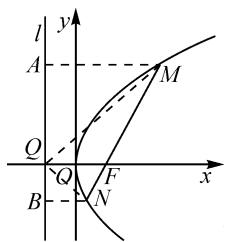

# 开展“一题多解”,探究“一题多变”

——一道解析几何题的破解

●江苏省海安高级中学 朱函颖

摘要：“一题多解”，可以开阔解题思路、发散学生思维；“一题多变”，可以拓展数学知识、聚合学生思维。合理解题探究与变式拓展可以很好提升解题效益，避免题海战术。结合一道抛物线问题实例，通过“一题多解”与“一题多变”，在研究中寻找通法，在探究中升华能力，促使学生形成良好的数学品质。

关键词: 抛物线; 准线; 直线; 斜率; 变式

根据现代思维的科学研究,问题是展开思维与应用的起点,“疑”是根本,“解疑”是目标,最容易引起定向探究反射与问题的深入思考.而在数学教学与数学学习过程中,更要合理培养与形成探究意识,从问题的内涵、问题的解法、问题的深入与问题的探究等多方面入手,合理拓展思维的深度与广度,进行必要合理创新应用,从而形成良好的数学品质.

# 1 问题呈现

问题〔燕博园2023届高三年级综合能力测试(CAT)数学(新高考[卷)试卷]已知抛物线 $y^{2}=ax$ 的焦点为F,准线l交x轴于点Q,过点F的直线交抛物线于M,N两点,则直线QM与直线QN的斜率之和为\_\_\_\_.

该题以抛物线为问题场景,对直线与抛物线的位置关系加以合理创设.借助过焦点的动直线的变化,以“动”态创设场景,利用两直线的斜率之和为常数,以“静”态形式设问,巧妙融合解析几何与平面几何中的相关知识,难度中等.

利用圆锥曲线这一主干知识,抓住直线与圆锥曲线位置关系这一热点问题,合理创设,巧妙“动”与“静”变化,“数”与“形”融合,构建一幅完美的画卷.

实际破解问题时,抓住问题内涵与实质,从问题根本入手,可以借助解析几何思维、平面几何思维与特殊情况思维等来展开,从不同的技巧方法视角来切入,实现问题的巧妙转化与应用.

# 2 问题破解

# 2.1 通性通法

方法 1: 解析几何思维法.

解析:依题知,焦点 $F\left(\frac{a}{4},0\right)$ , 准线方程为 $x=-\frac{a}{4}$ , $Q\left(-\frac{a}{4},0\right)$ . 设过焦点 F 的直线方程为 $x=$

联立 $\left\{ \begin{array}{l} x = my + \frac{a}{4}, \\ y^2 = ax, \end{array} \right.$ 消去参数 $x$ ，整理可得 $y^2 - y^2 = ax$

$amy-\frac{a^{2}}{4}=0$ ，则 $y_{1}+y_{2}=am, y_{1}y_{2}=-\frac{a^{2}}{4}$ 。于是有

$$
\begin{array}{l} m y + \frac {a}{4}, M (x _ {1}, y _ {1}), N (x _ {2}, y _ {2}). \\ k _ {Q M} + k _ {Q N} \\ = \frac {y _ {1}}{x _ {1} + \frac {a}{4}} + \frac {y _ {2}}{x _ {2} + \frac {a}{4}} \\ = \frac {x _ {1} y _ {2} + x _ {2} y _ {1} + \frac {a}{4} \left(y _ {1} + y _ {2}\right)}{\left(x _ {1} + \frac {a}{4}\right) \left(x _ {2} + \frac {a}{4}\right)} \\ = \frac {\left(m y _ {1} + \frac {a}{4}\right) y _ {2} + \left(m y _ {2} + \frac {a}{4}\right) y _ {1} + \frac {a}{4} \left(y _ {1} + y _ {2}\right)}{\left(x _ {1} + \frac {a}{4}\right) \left(x _ {2} + \frac {a}{4}\right)} \\ = \frac {2 m y _ {1} y _ {2} + \frac {a}{2} \left(y _ {1} + y _ {2}\right)}{\left(x _ {1} + \frac {a}{4}\right) \left(x _ {2} + \frac {a}{4}\right)} \\ = \frac {2 m \times \left(- \frac {a ^ {2}}{4}\right) + \frac {a}{2} \times a m}{\left(x _ {1} + \frac {a}{4}\right) \left(x _ {2} + \frac {a}{4}\right)} = 0. \\ \end{array}
$$

所以直线 QM 与直线 QN 的斜率之和为 0.

故填答案:0.

解后反思:在解决直线与圆锥曲线的位置关系问题中,最基本的“通性通法”就是解析几何思维法.通过设置相关的点的坐标、直线的方程、圆锥曲线的方程等,联立直线与圆锥曲线方程,结合函数与方程思维来进一步分析与转化,进而实现问题的解决.解析几何思维法的缺点之一就是数学运算量大,它也是制约部分学生深入分析与应用的一个重要因素.

# 2.2 数形结合法

方法 2: 平面几何思维法.

解析: 不失一般性, 如图 1 所示, 过 M, N 两点分别作准线 l 的垂线, 垂足分别为 A, B,

由于 $MA \parallel FQ \parallel NB$ ，因此可得 $\frac{|MF|}{|NF|} = \frac{|AQ|}{|BQ|}$ . 根据抛物线的定义，可得 $|MA| = |MF|$ ，且 $|NB| = |NF|$ ，则 $\frac{|MA|}{|NB|} =$ $\frac{|AQ|}{|BQ|}$ ，可得 $\triangle MAQ \sim \triangle NBQ$ ，于是 $\angle MQA = \angle NQB$ ，所以 $\angle MQF = \angle NQF$ 。

text_image

l
y
A
M
Q
Q
F
x
B
N

图1

所以直线 QM 与直线 QN 的倾斜角互补, 即直线 QM 与直线 QN 的斜率之和为 0. 故填答案: 0.

解后反思:回归曲线的本质,结合平面几何图形的基本性质与特征,数形结合,逻辑推理,这是解决解析几何综合应用问题比较常用的一种技巧与方法,也是平面几何思维法处理的关键.

# 2.3 巧技妙法

方法 3: 特殊情况法.

解析: 当过点 F 的直线垂直于 x 轴时, 根据抛物线 $y^{2}=ax$ 关于 x 轴对称, 可知点 M, N 关于 x 轴对称, 则知直线 QM 与直线 QN 的倾斜角互补.

所以直线 QM 与直线 QN 的斜率之和为 0.

故填答案:0.

解后反思:结合矛盾的普遍性寓于特殊性之中,通过填空题这一特殊形式的设置,借助“动”直线在运动变化过程中的某一特殊情况,以特殊代替一般,又从特殊回归到一般,实现解决问题的“巧技妙法”.特殊思维法在解决解析几何“运动”问题中经常用到,借助点、直线、角或相关元素的运动变化情况,以特殊代替一般,实现问题的普遍性与特殊性的辩证转化.

# 3 变式拓展

# 3.1 类比拓展

圆锥曲线中的不同曲线之间具有一定的相似性与可类比性，在以上抛物线背景下，改变圆锥曲线的类型以及对应曲线的场景，借助其焦点与相应准线的位置关系，也有类似的变式问题.

变式 1 已知椭圆 $C: \frac{x^{2}}{a^{2}} + \frac{y^{2}}{b^{2}} = 1 (a > b > 0)$ 的右焦点为 F，右准线 $l: x = \frac{a^{2}}{c}$ 交 x 轴于点 Q，过点 F 的直线交椭圆 C 于 M, N 两点，则直线 QM 与直线 QN 的斜率之和为 \_\_\_\_.（答案：0.）

变式 2 已知双曲线 $C: \frac{x^{2}}{a^{2}} - \frac{y^{2}}{b^{2}} = 1 (a > 0, b > 0)$ 的右焦点为 F，右准线 $l: x = \frac{a^{2}}{c}$ 交 x 轴于点 Q，过点 F 的直线交双曲线 C 于 M, N 两点，则直线 QM 与直线 QN 的斜率之和为 \_\_\_\_.（答案：0.）

以上两个变式问题的解析过程,可以参照原问题的方法1、方法3来展开,这里不多加赘述.当然,也可以将问题转化为探求两直线倾斜角的关系问题(两直线的倾斜角互补)进行探究.

# 3.2 逆向拓展

在解题研究中,逆向思维也是变式拓展的一种基本思维方式.借助问题题设条件与结论之间的关系,通过数学思维的逆向操作与应用,合理加以探究与拓展,经常会有不错的收获.

变式 3 已知抛物线 $y^{2}=ax$ 的焦点为 F，过点 F 的直线交抛物线于 M, N 两点，在 x 轴上存在异于点 F 的定点 Q，使得直线 MN 变化时，直线 QM 与直线 QN 的斜率之和为 0，则定点 Q 的坐标为 \_\_\_\_.

变式 4 已知椭圆 $C: \frac{x^{2}}{a^{2}} + \frac{y^{2}}{b^{2}} = 1 (a > b > 0)$ 的右焦点为 F，过点 F 的直线交椭圆 C 于 M, N 两点，在 x 轴上存在异于点 F 的定点 Q，使得直线 MN 变化时，直线 QM 与直线 QN 的斜率之和为 0，则定点 Q 的坐标为 \_\_\_\_.

变式 5 已知双曲线 $C: \frac{x^{2}}{a^{2}} - \frac{y^{2}}{b^{2}} = 1 (a > 0, b > 0)$ 的右焦点为 F，过点 F 的直线交双曲线 C 于 M, N 两点，在 x 轴上存在异于点 F 的定点 Q，使得直线 MN 变化时，直线 QM 与直线 QN 的斜率之和为 0，则定点 Q 的坐标为 \_\_\_\_.

变式 3～5 的答案为： $\left(-\frac{a}{4},0\right),\left(\frac{a^{2}}{c},0\right),\left(\frac{a^{2}}{c},0\right)$ .

以上三个变式问题的解析过程也可以参照原问题的方法 1.

# 4 教学启示

在解决一些典型的数学综合应用问题时,要合理引导学生深入挖掘,适当探究拓展,充分掌握问题的本质与内涵,剖析对应的数学基础知识与数学基本能力,从而实现“一题多解”“一题多研”“一题多变”,不断提升与拓展破解数学问题的基本技能与策略,提高数学思维品质的变通性,真正达成“一题多练”“一题多得”.同时,有效调动学生数学解题的积极主动性与参与性,合理辨析概念、公式等的异同,深刻反思并有效拓展,努力培养发现问题的能力与深入质疑问题的探究精神.Z