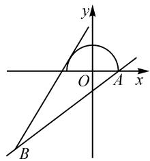

# 数学思想视域下函数值域的求法浅析

# ●河北唐山迁西县第一中学 于满慧

摘要: 求函数值域有很多方法, 比如常用的单调性法、换元法、图象法、判别式法等, 不同的函数具有不同的结构, 所以不好掌握, 这对值域的教学提出了新的要求. 事实上, 不同求解方法的思想可能是统一的, 如果掌握了其内在思想, 那么解决相关问题就能得心应手, 这也是新课标所提倡的.

关键词: 函数值域; 数学思想; 一般观念; 数学素养

函数值域问题常常是一些综合问题中的关键过渡,掌握函数值域的求法是学生掌握数学基础知识、领会数学基本思想的体现.在以往的教学中,教师的通常做法是帮助学生梳理出常用的求函数值域的方法,并总结出每一个方法所针对的题型以实现学生对方法的应用.在讲解每一个具体的方法时,学生都能够很好地解决问题,但综合时往往不知所措,可见方法总结只是停在表面很难让学生真正理解和应用,因此要让学生明白方法背后的数学思想.

核心素养下的数学教育更注重数学思想的贯彻和落实,这样学生才能形成良好的数学思维和数学素养.函数值域问题,其关键就是函数与方程的思想和数形结合的思想,这两个思想统领了求函数值域的各种方法,它们是所有方法的灵魂所在,是熟练使用各种方法的精神内核.

# 1 从函数角度出发,利用函数思想解决值域问题

例1 求函数 $y = \frac{x^2 + 2x + 4}{x}$ 的值域.

分析: 这是一道比较简单的求函数值域问题, 也是在解决一些综合问题中经常遇到的求范围的问题. 解决这个问题首先可以对函数进行变形, 得 $y = x + \frac{4}{x} + 2$ , 函数定义域为 $\{x \mid x \neq 0\}$ . 这是高中阶段常遇到的一类重要的函数——“对勾函数”的变形, 可以引导学生根据单调性的定义求出函数的单调区间, 进而得出函数的值域, 可称之为“单调性法”. 当然, 在学习完导数相关知识后, 也可以利用导数获得函数的单调区

间,进而得出函数的极值、最值,最后获得值域;或者可以引导学生画出函数的草图,利用图象得到值域,这就是“图象法”;再或者也可以从基本不等式的角度出发,注意到前两项的积是定值,利用基本不等式(当然要注意变元的范围问题)得到值域,可称之为“基本不等式法”.

从数学思想的角度来看,这些方法都是从函数这一关键概念出发,关注函数值与自变量的对应关系,从不同的角度研究对应的特点,从而得出函数值的取值集合,也就是统领这些方法的思想是函数思想,即通过研究函数的性质来获取值域.这是教学中应当渗透给学生的“一般观念”!

规律总结:方法可能繁多且凌乱,思想却始终如一!因此,思想是贯穿各种方法的那根隐形的线.没有思想,各种方法只是一堆宝贵的珍珠,零散且容易丢失,不能发挥更大的作用;而当有了思想,珍珠可以被整合成项链,变得统一,不再容易散落,并能发挥更大的作用.所以数学思想的统领非常重要!

例 2 求函数 $y=2x+4\sqrt{1-x}$ 的值域 $^{[1]}$ .

分析:相比于例1,本题稍显复杂,但仍可以从函数的角度出发,探索函数的变化规律.求出函数的定义域,探索函数的单调性;或者从函数解析式中不同形式式子之间的联系入手,把复杂的函数看成是简单函数的复合,而函数的值域保持不变.

法一: 易知该函数的定义域为 $(-∞,1]$ ，直接判断函数单调性不太容易，可借助求导，得 $y'=\frac{2(\sqrt{1-x}-1)}{\sqrt{1-x}}$ 。根据导数值的正负可知函数在 $(-∞,$

0]上单调递增，在(0,1]上单调递减，则在0处取得最大值4.又当 $x\to-\infty$ 时， $y\to-\infty$ ，则知函数的值域为 $(-∞,4]$ .

法二:除了直接考虑整体对应关系外,从代数式的次数上入手,可以使用换元法.令 $t=\sqrt{1-x}\geqslant0$ , 则有 $y=2(1-t^{2})+4t=-2t^{2}+4t+2$ , 这样的转化本质上就是把一个函数看成两个函数的复合, 外层函数是一个二次函数, 只是定义域不是 R, 而是非负实数集, 二次函数的对称轴为 t=1>0, 对称轴处的函数值为 4, 比较容易求出其值域为 $(-∞,4]$ . 这是一个由繁到简, 层层拆解的过程, 最后解决了问题.

规律总结:法一的着眼点是函数值与自变量之间的直接对应关系,通过探求函数的单调性和取值极限情况获取函数的最值从而获得值域.法二是从根式与整式之间次数的关系出发,通过换元将一个较为复杂的函数拆成两个简单函数的复合形式,当然这个过程要注意中间变元的取值范围,最后通过外层函数的值域获得原函数值域.在整个过程中,不管是单调性法还是换元法,本质上还是从函数出发,通过研究函数获得值域.这就启发学生在学习过程中要注重数学思想的理解和应用,而不是死记各种方法,不然容易混淆,降低学习效果.

例3 求函数 $y = |\sin x + \cos x| + |\sin x - \cos x|$ 的值域.

分析:整体来看,解析式中有绝对值,要弄清楚变化规律势必要去绝对值,这时可以把两个绝对值里面的式子化成同一个角的三角函数.由于正弦函数、余弦函数都具有周期性,因此在一个最小正周期范围内按照三角函数值的正负分类讨论即可.如果不想分类讨论,可对上述方法进行一定的改进,使用换元法将其化成新的函数进而求得值域;或者先整体把握再进行细节处理,既然函数是两个绝对值的和的形式,而且两个绝对值内式子的平方和是定值,那就可以考虑先将函数式平方,确定 $y^{2}$ 的范围,再求函数的值域.

法一: 将原函数化为 $y = \left| \sqrt{2} \sin \left( x + \frac{\pi}{4} \right) \right| + \left| \sqrt{2} \cos \left( x + \frac{\pi}{4} \right) \right|$ . 设 $t = x + \frac{\pi}{4}$ ，则上式可变为 y =$\sqrt{2} (|\sin t| + |\cos t|)$ . 由于正弦函数与余弦函数都具有周期性, 不妨设 $t \in [0, 2\pi)$ , 按照三角函数值的正负将该区间分成四个小区间进行分类讨论, 即可得到函数值域为 $[\sqrt{2}, 2]$ .

法二: 可以对上述法一进行一定的改进. 对于函数 $y=\sqrt{2}(|\sin t|+|\cos t|)$ ，考虑到绝对值的特点和关系，进行换元. 令 $\left\{\begin{aligned}\left|\sin t\right|&=\cos\theta,\\ \left|\cos t\right|&=\sin\theta,\end{aligned}\right.$ $\theta\in\left[0,\frac{\pi}{2}\right]$ ，则得 $y=2\sin\left(\theta+\frac{\pi}{4}\right)$ ，从而可得值域为 $[\sqrt{2},2]$ .

法三:先整体把握再进行细节处理.既然函数是两个绝对值的和的形式,函数值非负,且两个绝对值内式子的平方和是定值,可先将函数式平方,得 $y^{2}=2+2|\cos 2x|$ .这样就能够方便快捷地得到 $y^{2}\in[2,4]$ ,从而得到函数的值域为 $[\sqrt{2},2]$ .

规律总结: 法一从函数的整体变化规律入手, 由于绝对值的存在, 解决过程稍显繁杂, 因为涉及到了的分类讨论. 法二对方法一进行了一定的改进, 其本质是关注两个式子之间的关系从而进行换元. 法三先整体再细节, 考虑到函数值的取值范围, 再顾及内部式子的具体联系, 因此先求函数值平方的范围, 再求函数值域. 法三是非常简洁的方法, 也就是说, 在求解一道题目的时候我们进行的思维含量越高, 那么解题就越简洁, 这是生搬硬套所不能达到的境界. 因此教学的过程中一定要注重学生数学能力的培养, 数学思维品质的锻炼, 数学素养的加强等.

# 2 从方程角度出发,利用方程思想解决值域问题

除了立足函数角度,有时也可以立足方程角度求函数值域.由于函数解析式也可以看成是二元方程,是方程就可以进行合理的等价变形,或更换主元等,因此直接求值域不是很简洁时,采用方程的手段往往能带来另一种惊喜!

例4 求函数 $y = \frac{x^2 - 2x + 4}{x^2 + 2x + 4}$ 的值域.

分析: 易知本题中函数定义域是 R, 该函数是两个二次式相除所成, 分子分母均不可进行因式分解. 对于分式型函数, 可以考虑分离常数, 降低分子多项式的次数,再进行换元讨论即可解决问题.这是从函数角度出发能采用的办法.除此以外,还可以从方程的角度考虑问题.对于每一个自变量 x,都有唯一确定的 y 值与之对应;反过来想,如果 y 值取自值域,那么就有与之对应的自变量,如果 y 值不是取自值域,那么就没有与之对应的自变量.也就是说,从方程的角度来讲,那些使得关于 x 的方程有解的 y 值构成了值域.

解析: 将原函数解析式整理成关于 x 的方程, 即

$$
(y - 1) x ^ {2} + 2 (y + 1) x + 4 (y - 1) = 0. \quad ①,
$$

当 y=1 时, 方程①有解.

当 $y \neq 1$ 时，方程①有解则需 $\Delta = 4(y + 1)^2 - 16(y - 1)^2 \geqslant 0$ ，解得 $\frac{1}{3} \leqslant y \leqslant 3$ ，且 $y \neq 1$ .

综上知，当 $y \in \left[\frac{1}{3}, 3\right]$ ，①式有解，即对于此范围内的 $y$ ，存在实数 $x$ 使得方程①成立，也即 $y = \frac{x^2 - 2x + 4}{x^2 + 2x + 4}$ . 故函数的值域为 $\left[\frac{1}{3}, 3\right]$ .

规律总结:这里将函数解析式变换成方程,从方程有解的角度解出相应的函数值的取值范围,即从方程的角度出发,解决了求函数值域的问题,这种求函数值域的方法通常叫做“判别式法”,是方程思想解决值域问题的典型.当然,如果函数定义域不是R时,要考虑方程根的分布问题,与方程的思想是类似的.

# 3 利用数形结合思想解决值域问题

例5 求函数 $y = \frac{\sqrt{-x^2 + 4x - 3} + 3}{x + 1}$ 的值域.

分析:本题的函数解析式较为复杂,其单调性不容易弄清,常用的一些方法也不能直接加以应用,这时应该从形式上挖掘关系,再深入研究内在关联寻找突破口.

法一: 函数的定义域为 $[1,3]$ ，其解析式可整理为 $y=\frac{\sqrt{1-(x-2)^{2}}+3}{x+1}$ 。根据根式内的形式，可以考虑三角换元。令 $x-2=\cos\theta,\theta\in[0,\pi]$ ，函数可化为 $y=\frac{\sin\theta+3}{\cos\theta+3}(y>0)$ 。若从方程的角度出发，可以整理成 $\sin\theta-y\cos\theta=3y-3$ ，利用辅助角公式，可得

$$
\sqrt {y ^ {2} + 1} \sin (\theta - \varphi) = 3 y - 3, \tan \varphi = y,
$$

即 $\sin (\theta -\varphi) = \frac{3y - 3}{\sqrt{y^2 + 1}}.$ 由于 $-\sin \varphi \leqslant \sin (\theta -\varphi)\leqslant$ 1，则可得 $\frac{-y}{\sqrt{y^2 + 1}}\leqslant \frac{3y - 3}{\sqrt{y^2 + 1}}\leqslant 1$ ，从而解得 $y$ 的取值范围，即所求函数的值域为 $\left[\frac{3}{4},\frac{9 + \sqrt{17}}{8}\right].$

法二:除方程外,也可以考虑数形结合思想.考虑到同角三角函数的关系,以及比例式的特点,可以转化函数解析式的形式为 $y=\frac{\sin\theta-(-3)}{\cos\theta-(-3)}$ ,其几何意义为点

text_image

y
O A x
B

图1

$(\cos \theta, \sin \theta)$ 与 $B(-3, -3)$ 连线的斜率. 易知, 点 $(\cos \theta, \sin \theta)$ 在单位圆的上半圆上, 点 $B$ 为第三象限内的一个定点, 如图1所示. 设 $A(1,0)$ , 则过定点 $B$ 的直线也过点 $A$ 时, 其斜率最小, 为 $\frac{3}{4}$ ; 过定点 $B$ 的直线与半圆相切时, 其斜率取得最大值, 利用圆心到直线的距离等于半径, 求得斜率最大值为 $\frac{9 + \sqrt{17}}{8}$ . 故所求函数的值域为 $\left[\frac{3}{4}, \frac{9 + \sqrt{17}}{8}\right]$ .

规律总结:本题从数形结合的角度解题更为简洁,将函数解析式和对应的几何图形结合起来往往能够比较清晰明了地展现问题的本质,使得抽象和具体有机结合起来,强化了数学思想,弱化了生搬硬套和表面模仿,使得教学更有深度,更有意义.

数学核心素养的培养与落实是一个长期的过程，在教学过程中要不断让学生经历数学知识的发生和发展，引导他们学会思考，发现问题，从数学思想的角度解决问题，锻炼数学思维，提高数学能力，这样才能够达到立德树人的教育目的。教育者更要注重学习的本质，清楚方法的本源，这样才能影响一代代学子。

# 参考文献：

[1]陈燕华.谈谈求函数值域的四种路径[J].语数外学习(高中版上旬),2022(6):36-37.Z