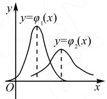

# 新高考背景下正态分布的探究与应用

# ●江苏省海门中学 孙海峰

摘要:近年来,大学本科阶段所学习的部分数学知识被“下放”到了中学数学中.其中,“概率论与数理统计”的正态分布内容逐渐成为部分地区高考的考点,尤其是在新高考背景下,正态分布作为概率统计中的一个重要分布,考查要求有所提高.本文中以历年高考题为依托,基于新高考背景,将正态分布高考考点和题型有效结合在一起,归纳总结了一些正态分布和标准正态分布的性质和关系,为高三复习备考提供帮助.

关键词: 新高考; 正态分布; 标准正态分布; $3\sigma$ 原则

正态分布是自然界和实际生活情境中最常见的一种概率分布.例如,某地区男性成年人的体重(或身高)、测量某产品零件长度的误差、某次数学考试的成绩等,都服从或近似服从正态分布.这些数据都具有“两头小,中间大”的特点.如果随机变量是由大量相互独立的随机因素的综合影响所形成,而每一种因素在总的影响下所起到的作用都是微小的,不能起到压倒一切的主导作用,一般具有这种特点的随机变量,都可以认为近似服从正态分布.如果样本容量足够大的话,在大学本科阶段还会学习相关内容——中心极限定理.

# 1 相关知识点

# 1.1 正态分布

定义 若连续型随机变量 X 具有概率密度

$$
f (x) = \frac {1}{\sqrt {2 \pi} \sigma} \mathrm{e} ^ {- \frac {(x - \mu) ^ {2}}{2 \sigma^ {2}}}, x \in \mathbf {R},
$$

其中 $\sigma(\sigma>0)$ 为形态参数， $\mu$ 为位置参数，则称 X 服从参数为 $\mu, \sigma$ 的正态分布或高斯分布，记作 $X \sim N(\mu, \sigma^{2})$ . $y = f(x)$ 的图象称为正态密度曲线.

函数 $F(x)=\int_{-\infty}^{x}f(t)dt=\frac{1}{\sqrt{2\pi}\sigma}\mathrm{e}^{-\frac{(x-\mu)^{2}}{2\sigma^{2}}}$ 称为随机变量 X 的分布函数.

# 1.2 标准正态分布

当 $\mu=0,\sigma=1$ 时，称随机变量 X 服从标准正态分布，其密度函数和分布函数分别用 $\varphi(x),\Phi(x)$ 表示，即有 $\varphi(x)=\frac{1}{\sqrt{2\pi}}\mathrm{e}^{-\frac{x^{2}}{2}},\Phi(x)=\frac{1}{\sqrt{2\pi}}\int_{-\infty}^{x}\mathrm{e}^{-\frac{t^{2}}{2}}dt.$

性质1 $\Phi (0) = \frac{1}{2},\Phi (-a) = 1 - \Phi (a).$

证明： $\Phi (-x) = \frac{1}{\sqrt{2\pi}}\int_{-\infty}^{-x}\mathrm{e}^{-\frac{t^2}{2}}dt$

$$
= \frac {1}{\sqrt {2 \pi}} \int_ {x} ^ {+ \infty} \mathrm{e} ^ {- \frac {t ^ {2}}{2}} d t = 1 - \Phi (x).
$$

# 1.3 正态分布与标准正态分布的关系

一般的正态分布 $N(\mu, \sigma^{2})$ 与标准正态分布 $N(0, 1)$ 之间存在着换算关系，针对标准正态分布 $N(0, 1)$ ，人们已编制了 $\Phi(x)$ 的函数表，从而可以得到一般正态分布的函数值.

性质 2 若 $X \sim N(\mu, \sigma^{2})$ ，则 $\frac{X - \mu}{\sigma} = N(0, 1)$ .

接下来笔者针对高中阶段常考的题型,总结出五种常见正态分布题型的解题策略.

# 2 五种常见正态分布题型及解题策略

# 2.1 题型一: 正态分布的概念与性质

考点 1 $y=f(x)$ 曲线下方和 x 轴上方区域范围内的面积为 1.

$$
\begin{array}{l} \frac {1}{\sqrt {\pi}} \int_ {- \infty} ^ {+ \infty} \mathrm{e} ^ {- \frac {(x - \mu) ^ {2}}{2 \sigma^ {2}}} d \left(\frac {x - \mu}{\sqrt {2} \sigma}\right) = \frac {1}{\sqrt {\pi}} \int_ {- \infty} ^ {+ \infty} \mathrm{e} ^ {- t ^ {2}} d t = \\ \frac {2}{\sqrt {\pi}} \int_ {0} ^ {+ \infty} \mathrm{e} ^ {- t ^ {2}} d t = \frac {2}{\sqrt {\pi}} \times \frac {\sqrt {\pi}}{2} = 1. \\ \end{array}
$$

证明： $\int_{-\infty}^{+\infty}f(x)dx = \frac{1}{\sqrt{2\pi}\sigma}\int_{-\infty}^{+\infty}\mathrm{e}^{-\frac{(x - \mu)^2}{2\sigma^2}}dx =$

考点 2 $y=f(x)$ 的图象关于直线 $x=\mu$ 对称，即当 0<l<h 时， $f(\mu-h)=f(\mu+h)$ ，则

$$
P (\mu - h <   X \leqslant \mu) = P (\mu <   X \leqslant \mu + h),
$$

$$
P (\mu - h <   X \leqslant \mu - l) = P (\mu + l <   X \leqslant \mu + h).
$$

推论 若 $X \sim N(\mu, \sigma^2)$ , 则

$$
P (X \leqslant \mu) = P (X > \mu) = \frac {1}{2}.
$$

考点 3 若 x 离 $\mu$ 越近, 则正态密度函数 $f(x)$ 的值越大, 这就意味着对同样长的区间, 当区间离 $\mu$ 越近, X 落入这个区间的概率越大.

考点 4 当 $\mu$ 固定时, $\sigma$ 决定 $y = f(x)$ 的集中程度, $\sigma$ 越小, $y = f(x)$ 的图形越尖、越高, X 落在 $\mu$ 附近的概率越大(概率密度更多地集中在 $\mu$ 附近).

例 1 （2021 盐城模拟）已知随机变量 X 服从正态分布 $N(10, \sigma^{2})$ , $\sigma > 0$ , 且 $P(X \leqslant 16) = 0.76$ , 则

$$
P (4 <   X \leqslant 1 0) = \underline {{{\quad}}}.
$$

解析: 因为 $X \sim N(10, \sigma^{2})$ ，所以正态曲线关于直线 x = 10 对称，即 $P(X < 10) = 0.5$ .

于是 $P(10 \leqslant X \leqslant 16) = P(X \leqslant 16) - P(X < 10) = 0.76 - 0.5 = 0.26.$

故 $P(4 < X \leqslant 10) = P(10 \leqslant X \leqslant 16) = 0.26$ .

思维升华:对于正态分布 $N(\mu,\sigma^{2})$ ，由 $x=\mu$ 是正态曲线的对称轴，可得出以下四个结论.

(1) $P(X \leqslant \mu) = P(X < \mu) = P(X > \mu) = P(X \geqslant \mu) = \frac{1}{2}$ ;   
(2)对任意 a，都有 $P(X<\mu-a)=P(X>\mu+a)$ ;   
(3) $P(X <   x_{0}) = 1 - P(X\geqslant x_{0});$   
(4) $P(a < X < b) = P(X < b) - P(X \leqslant a)$ .

例 2 （2020 辽宁沈阳模拟）
已知两个正态分布密度函数

$$
\varphi_ {i} (x) = \frac {1}{\sqrt {2 \pi} \sigma_ {i}} \mathrm{e} ^ {\frac {(x - \mu_ {i}) ^ {2}}{2 \sigma_ {i} ^ {2}}} (x \in \mathbf {R}, i = 1,
$$

2)的图象如图1所示,则().

line

| x    | y=φ₁(x) | y=φ₂(x) |
| ---- | ------- | ------- |
| 0    | 0       | 0       |
| Peak | ~0.8    | ~0.6    |
| Peak at x≈0.5 | ~0.2   | ~0.3    |
| Peak at x≈1    | ~0.1    | ~0.1    |

图1

A. $\mu_{1}<\mu_{2},\sigma_{1}<\sigma_{2}$   
B. $\mu_{1}>\mu_{2},\sigma_{1}<\sigma_{2}$   
C. $\mu_{1}<\mu_{2},\sigma_{1}>\sigma_{2}$   
D. $\mu_{1}>\mu_{2},\sigma_{1}>\sigma_{2}$

解析: 因为 $X \sim N(\mu, \sigma^{2})$ ，所以正态曲线关于直线 $x = \mu$ 对称。由图可知 $\mu_{1} < \mu_{2}$ 。又因为 $\sigma$ 代表数据的聚集程度，由图可知 $\sigma_{1} < \sigma_{2}$ 。故选：A.

思维升华:对于正态分布 $N(\mu,\sigma^{2})$ , $\mu$ 为位置参数, $\mu$ 越大, 则表示正态曲线对称轴越靠右; $\sigma(\sigma>0)$ 为形态参数, 代表数据的聚集程度, $\sigma$ 越小, 则正态曲线越尖、越高, 反之, $\sigma$ 越大, 则正态曲线越缓、越矮.

# 2.2 题型二: 正态分布的 $3\sigma$ 原则

考点 5 正态总体在三个特殊区间内取值的概率值:

①落在区间 $(\mu-\sigma,\mu+\sigma)$ 上的概率约为68.26%;  
②落在区间 $(\mu-2\sigma,\mu+2\sigma)$ 上的概率约为95.44%;  
③落在区间 $(\mu-3\sigma,\mu+3\sigma)$ 上的概率约为99.74%.

例 3 （2021 邢台模拟）已知随机变量 X 服从正态分布 $N(100,4)$ ，若 $P(102<X<m)=0.1359$ ，则 m= \_\_\_\_.

解析: 因为 $P(\mu - \sigma < X < \mu + \sigma) = 0.6826$ ，且 $P(\mu - 2\sigma < X < \mu + 2\sigma) = 0.9544$ ，所以

$$
0. 1 3 5 9 = P (1 0 2 <   X <   m) = P (\mu + \sigma <   X <   \mu + 2 \sigma).
$$

故 $m=\mu+2\sigma=100+2\times2=104.$

思维升华:对于正态分布 $N(\mu,\sigma^{2})$ ，以 $3\sigma$ 原则为基础，结合正态分布的对称性，可得.

# 2.3 题型三: 正态分布的期望与方差

考点6 正态密度函数 $y=f(x)$ 最高点的坐标是 $\left(\mu,\frac{1}{\sqrt{2\pi}\sigma}\right)$ .

考点 7 若随机变量 X 服从正态分布 $N(\mu, \sigma^{2})$ ,

则 X 的数学期望为 $E(X)=\mu$ ，方差为 $D(X)=\sigma^{2}$ .

考点 8 若 $X \sim N(\mu_{1}, \sigma_{1}^{2})$ , $Y \sim N(\mu_{2}, \sigma_{2}^{2})$ ，则 $E(aX + bY) = a\mu_{1} + b\mu_{2}$ , $D(aX \pm bY) = a^{2}\sigma_{1}^{2} + b^{2}\sigma_{2}^{2}$ .

例 4 （2021 通榆模拟）若随机变量 X 服从正态分布，其正态曲线上的最高点的坐标是 $\left(10, \frac{1}{2}\right)$ ，则该随机变量的方差等于（）.

A.10

B.100

C. $\frac{2}{\pi}$

D. $\sqrt{\frac{2}{\pi}}$

解析: 因为正态密度曲线上的最高点的坐标是 $\left(\mu, \frac{1}{\sqrt{2\pi}\sigma}\right)$ ，所以 $\frac{1}{\sqrt{2\pi}\sigma} = \frac{1}{2}$ ，则 $\sigma = \sqrt{\frac{2}{\pi}}$ ，即方差 $\sigma^{2} = \frac{2}{\pi}$ 。故选：C.

思维升华:对于正态分布 $N(\mu,\sigma^{2})$ ，第一个参数 $\mu$ 为期望，第二个参数 $\sigma$ 为标准差， $\sigma^{2}$ 为方差，正态曲线在对称轴 $x=\mu$ 处取得最大值，即正态曲线最高点坐标为 $\left(\mu,\frac{1}{\sqrt{2\pi}\sigma}\right)$ .

# 2.4 题型四: 正态分布的实际应用

例 5 （2021 潮州模拟）一试验田某种作物一株生长果实个数 x 服从正态分布 $N(90, \sigma^{2})$ ，且 $P(x < 70) = 0.2$ ，从试验田中随机抽取 10 株，果实个数在 [90, 110] 的株数记作随机变量 X，且 X 服从二项分布，则 X 的方差为（）.

A.3

B.2.1

C.0.3

D.0.21

解析: 因为 $x \sim N(90, \sigma^{2})$ ，且 $P(x < 70) = 0.2$ ，所以 $P(x > 110) = 0.2$ ，于是 $P(90 \leqslant x \leqslant 110) = 0.5 - 0.2 = 0.3$ ，则 $X \sim B(10, 0.3)$ .

故 $D(X)=10\times0.3\times(1-0.3)=2.1$ .

思维升华: 解决本题的关键在于求出随机变量 X 的分布, 即 $X \sim B(n, p)$ 中的 n 和 p. 由题意得 n = 10, 则此题重点转化为求随机变量 x 落在区间 [90, 110] 上的概率 p. 通过正态分布的对称性与已知条件, 即可求出 $P(90 \leqslant x \leqslant 110)$ .

# 2.5 题型五: 一般正态分布转化为标准正态分布

在正态分布中, 最基础、最简单的是标准正态分布, 即期望等于 0, 方差等于 1 的分布. 这种情况下, 可以方便查表计算. 而标准化, 就是让非标准正态分布转换为标准正态分布, 即若 $X \sim N(\mu, \sigma^{2})$ , 则 $\frac{X - \mu}{\sigma} \sim N(0, 1)$ .

上述例题,是新高考中常见的正态分布题型.正态分布的学习不仅仅是为了适应新高考,更是为大学的学习打下坚实的基础.大学将会在正态分布的基础上继续学习一个新的知识——中心极限定理,也就是确定在什么条件下,大量随机变量之和的分布逼近于正态分布.因此,考生需要对正态分布的学习进行归纳总结,进而为大学的学习打下坚实的基础.Z