# 用运动的观点揭示“幂指对”函数图象关系的“全景”

山东省桓台第一中学 苏同安

摘要:本文中从一道涉及“幂指对”三种函数关系的问题出发,用“运动”的观点,由两函数图象的一个“特殊”位置关系开始逐步演变,深刻地揭示了幂函数、指数函数、对数函数图象关系的“全景”——真可谓“一题释全景”.

关键词: 运动观点; 幂指对函数; 图象关系; 全景

课程标准指出,幂函数、指数函数与对数函数是最基本的、应用最广泛的函数,是进一步学习数学的基础 $^{[1]}$ .因此,对它们及其关系的正确理解与深刻认识是重要且必要的.

对于幂函数、指数函数与对数函数,每种函数的图象和性质都容易理解和掌握,但若有问题涉及到它们两两之间的关系,甚至是“三种函数”同时出现在一个问题中,需要厘清“三者”之间的关系时,就不那么简单了,而且容易出现认知误区或思维障碍.

下文从一道涉及“幂指对”三个函数关系的问题出发，分析容易出现的错误认识及原因。然后，用运动的观点，由两函数图象的一个特殊位置关系开始逐步演变，生成“幂指对”函数图象两两之间关系的“全景”，进而准确把握“三者”之间的图象关系。

# 1 提出问题(一道题引发的全面思考)

问题 是否存在 $x_{0}$ ，使得 $a^{x_{0}} < x_{0}^{a} < \log_{a} x_{0} (a > 0, a \neq 1)$ ?

分析:由此题的结构形式可知,它考查幂函数、指数函数、对数函数三者之间的关系.首先看下面的解答结果或思想认识是否正确.

解析: 当 0 < a < 1 时, 画出函数 $y = a^{x}$ , $y = x^{a}$ , $y = \log_{a} x$ 的图象, 如图 1, 设 $y = x^{a}$ 与 $y = a^{x}$ , $y = \log_{a} x$ 的图象的交点分别为 A, B.

结合图形可知，当 $x_{A}<x_{0}<x_{B}$ 时， $a^{x_{0}}<x_{0}^{a}<\log_{a}x_{0}$ 成立.

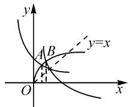

text_image

y
A B
O
x
y=x

图1

此时可得出以下结论：

当 0 < a < 1，存在 $x_{0}$ ，使得 $a^{x_{0}} < x_{0}^{a} < \log_{a} x_{0}$ .

评析:以上结论,虽然运用了数形结合思想,但只是画出了大致图象,缺乏“数”的运算推证做支持,其“形”是不确定的 $^{[2]}$ .所以,解答是否正确,需要分析三个函数图象两两之间的位置关系是否表达全面且准确.

首先分析互为反函数的 $y = a^{x}$ 与 $y = \log_{a} x$ 图象之间的位置关系: 以上解答过程运用的两图象关系如图 2, 认为两函数图象只有一个在其对称轴上的公共点, 这也是大多数人的第一感觉或认识. 是否只有这一种位置关系呢?

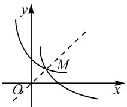

text_image

y
M
O
x

图2

下面看一对具体的函数 $f(x)=\left(\frac{1}{16}\right)^{x}$ 与 $g(x)=\log_{\frac{1}{16}}x$ ，显然 $P\left(\frac{1}{4},\frac{1}{2}\right),Q\left(\frac{1}{2},\frac{1}{4}\right)$ 也是两函数图象的公共点（如图3）.所以，两函数 $y = a^{x}$ 与 $y = \log_a x$ 图象的位置关系不是只有图2这一种情况.因此，上述解答给出的结论也就不正确或不全面了.

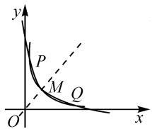

text_image

y
P
M
Q
O'
x

图3

要正确解答此题,需对“幂指对”函数图象之间的位置关系做“全景式”探究,得其准确位置关系.

# 2 全景探究(用运动的观点进行全景探究)

根据幂函数的对称性及对数函数的定义域,只需研究它们在第一象限内的图象关系即可.

“幂指对”函数图象及位置关系是随参数的变化而连续变化的,可考虑从一个特殊的位置关系出发,用运动的观点直观地探究其图象之间的位置关系.

# 2.1 指数函数与对数函数

(1) 当 $0 < a < 1$ 时

以下,用“运动”的观点,从两点 P,Q(如图 3)重合于点 M 的“一刻”开始研究,即两函数图象在 M 处有共同的“切线”(如图 4)的情形.然后再推演出其他情况的位置关系.

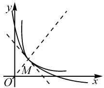

text_image

y
M
O'
x

图 4

设 $f(x)=a^{x}$ 和 $g(x)=\log_{a}x$ 与其“共同的切线”切于点 $M(x_{0},y_{0})$ .

求导, 得 $f'(x)=a^{x}\ln a$ , $g'(x)=\frac{1}{x\ln a}$ .

由 $f(x_{0})=g(x_{0})$ 且 $f'(x_{0})=g'(x_{0})=-1$ （两图象关于 y=x 对称），

解得 $x_{0}=\frac{1}{e}$ . 进而得 $a=\frac{1}{e^{e}}$ .

由此,再用运动的观点结合两函数图象的性质得如下结论:

①当 $0 < a < \frac{1}{\mathrm{e}^{\mathrm{e}}}$ 时，函数 $f(x) = x^{a}$ 与 $g(x) = \log_a x$ 的图象有且仅有三个公共点（如图3）；  
②当 $a=\frac{1}{e^{c}}$ 时，函数 $f(x)=x^{a}$ 与 $g(x)=\log_{a}x$ 的图象有且仅有一个公共点（相切）（如图4）；  
③当 $\frac{1}{e^{c}}<a<1$ 时，函数 $f(x)=x^{a}$ 与 $g(x)=\log_{a}x$ 的图象有且仅有一个公共点(如图1).

（因为本文主要突出运动观点的特点——用一个“运动”过程提炼出几个密切相连的结论，所以将部分结论的严格论证略去。）

(2) 当 $a > 1$ 时

同样,用运动的观点先研究指数函数与对数函数图象在点 M 处有共同切线(如图 5)的情况. $^{[3]}$

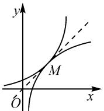  
图5

设 $f(x)=a^{x}$ 和 $g(x)=\log_{a}x$ 与其“共同的切线”切于点 $M(x_{0},y_{0})$ .

由 $f(x_{0})=g(x_{0})$ 且 $f'(x_{0})=$ 图5 $g'(x_{0})=1$ （两图象关于 y=x 对称），解得 $x_{0}=e$ 。进而得 $a=e^{\frac{1}{c}}$ 。

由此,再用运动的观点结合两函数图象的性质得如下结论:

①当 $1 < a < e^{\frac{1}{c}}$ 时，函数 $f(x) = a^{x}$ 与 $g(x) = \log_{a} x$ 的图象有且仅有两个公共点（如图 6）；

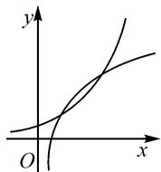  
图6

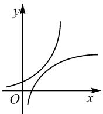  
图 7

②当 $a = e^{\frac{1}{c}}$ 时，函数 $f(x) = a^{x}$ 与 $g(x) = \log_{a} x$ 的图象有且仅有一个公共点（相切，如图 5）；  
③当 $a > \mathrm{e}^{\frac{1}{\mathrm{e}}}$ 时，函数 $f(x) = a^{x}$ 与 $g(x) = \log_a x$

的图象没有公共点(如图 7).

# 2.2 幂函数与指数函数

(1) 当 $0 < a < 1$ 时

此条件下,它们的图象关系较易判断,可构造函数 $\varphi(x)=x^{a}-a^{x}$ , 利用其在 $(0,+\infty)$ 内单调递增且 $\varphi(a)=a^{a}-a^{a}=0$ , 推得它们在第一象限有且只有一个交点(如图 8).

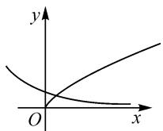  
图8

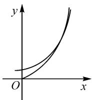  
图9

(2) 当 $a > 1$ 时

首先,分析两函数的图象有“公共切线”的情形(如图9).

设函数 $f(x)=a^{x}$ 和 $g(x)=x^{a}$ 与“共同的切线”切于点 $M(x_{0},y_{0})$ .

求导, 得 $f'(x)=a^{x}\ln a$ , $g'(x)=ax^{a-1}$ .

由 $f'(x_{0}) = g'(x_{0})$ ，且 $f(x_{0}) = g(x_{0})$ ，解得 $x_{0} = \frac{a}{\ln a}$ .

函数 $\varphi(a)=\frac{a}{\ln a}$ 在 $(1,\mathrm{e})$ 上单调递减，在 $(\mathrm{e},+\infty)$ 上单调递增，且当 $a\to1$ 或 $a\to+\infty$ 时， $\varphi(a)\to+\infty$ . 又 $x_{0}$ 唯一，且 $e=\frac{e}{\ln e}$ ，故 $x_{0}=e, a=e$ .

所以，函数 $f(x)=\mathrm{e}^{x}$ 和函数 $g(x)=x^{\mathrm{e}}$ 与“共同的切线”切于点 $M(\mathrm{e},\mathrm{e}^{\mathrm{e}})$ .

而函数 $f(x)=a^{x}$ 与 $g(x)=x^{a}$ 的图象一定至少有交点 $(a,a^{a})$ ，由此，再用运动的观点结合两图象的性质得如下结论：

①当 a=e 时，函数 $f(x)=a^{x}$ 与 $g(x)=x^{a}$ 的图

象在第一象限有且仅有一个公共点（相切）（如图 9）；  
② 当 $a \in (1, e) \cup (e, +\infty)$ 时，函数 $f(x) = a^{x}$ 与函数 $g(x) = x^{a}$ 的图象在第一象限有且仅有两个公共点（如图 10）.

# 2.3 幂函数与对数函数

(1) 当 0 < a < 1 时

构造函数 $g(x)=x^{a}-\log_{a}x$ . $g(x)$ 在 $(0,+\infty)$ 内单调递增，而 $g(a)\cdot g(1)=a^{a}-1<0$ ，所以，函数 $y=x^{a}$ 与函数 $y=\log_{a}x$ 的图象在第一象限有且只有一个交点（如图 11）.

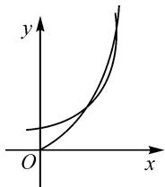

text_image

y
O
x

图10

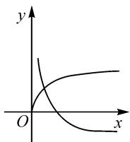  
图11

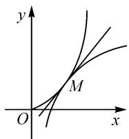  
图12

(2) 当 $a > 1$ 时

首先,分析两函数的图象有“公共切线”的情形(如图 12).

设函数 $f(x)=x^{a}$ 和函数 $g(x)=\log_{a}x$ 与其“共同的切线”切于点 $M(x_{0},y_{0})$ .

求导, 得 $f'(x)=ax^{a-1}, g'(x)=\frac{1}{x \ln a}$ .

由 $f'(x_{0}) = g'(x_{0})$ ，且 $f(x_{0}) = g(x_{0})$ ，解得 $x_{0} = e^{\frac{1}{a}}$ 。进而得到 $a^{a} = e^{\frac{1}{e}}$ 。

由此,用运动的观点结合两函数图象的性质得如下结论:

①当 $1 < a^{a} < e^{\frac{1}{c}}$ 时，函数 $f(x) = x^{a}$ 与 $g(x) = \log_{a}x$ 的图象有且仅有两个公共点；  
②当 $a^{a}=e^{\frac{1}{c}}$ 时，函数 $f(x)=x^{a}$ 与 $g(x)=\log_{a}x$ 的图象有且仅有一个公共点（相切）；  
③当 $a^{a} > e^{\frac{1}{e}}$ 时，函数 $f(x) = x^{a}$ 与 $g(x) = \log_{a}x$ 的图象没有公共点.

以上,用运动的观点,从两函数图象相切的特殊位置关系出发,直观地论述了“幂指对”函数图象的位置关系及形成的过程,揭示了两两关系的“全景图”.基于对“幂指对”函数直观清晰、全面正确的认识,一开始提出的问题便会有正确而全面的结论了.

# 3 解决问题(本文开始给出的体现“幂指对”函数关系全景的问题)

回到开始提出的问题: 是否存在 $x_{0}$ ，使得 $a^{x_{0}} < x_{0}^{a} < \log_{a} x_{0} (a > 0, a \neq 1)$ ?

结合以上全景探究得出的结论,进行分类讨论.

(1) 当 $\frac{1}{\mathrm{e}^{\mathrm{e}}}\leqslant a < 1$ 时

如图 13, 幂函数图象一定过 $N(1,1)$ , 点 N 在 M 的上方, 与其他两函数图象的交点分别为 A, B.

所以, 存在 $x_{0}$ , 当 $x_{A}<x_{0}<x_{B}$ 时, $a^{x_{0}}<x_{0}^{a}<\log_{a}x_{0}$ 成立.

(2) 当 $0 < a < \frac{1}{\mathrm{e}^{\mathrm{e}}}$ 时

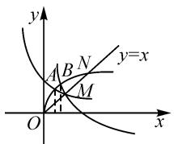

text_image

y
A B N y=x
M
O x

图13

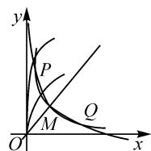  
图14

如图 14, 需要分析幂函数与其他两函数图象的交点是在点 P 的上方还是下方. 若在上方, 则存在 $x_{0}$ 满足不等式; 否则, 不存在.

从特殊位置开始讨论. 设 $y = x^{a}$ 的图象过 $y = \log_{a}x$ 与 $y = a^{x}$ 的交点 P.

设点 P 横坐标为 $x_{0}$ ，则 $a^{x_{0}} = x_{0}^{a} = \log_{a} x_{0}$ .

解得 $x_{0}=\frac{a}{1-a}>1$ , 不可能.

所以，幂函数 $y=x^{a}$ 的图象不可能经过 $y=\log_{a}x$ 与 $y=a^{x}$ 的图象的交点.

又 $y=\log_{a}x$ 与 $y=a^{x}$ 的图象只有一个公共点 M （切点）时， $y=x^{a}$ 与它们的交点在点 M 上方。所以，由“运动观点”及图象变化的连续性知： $y=x^{a}$ 的图象与 $y=\log_{a}x$ ， $y=a^{x}$ 的图象的交点一定在交点 P 的上方，所以存在 $x_{0}$ ，使得 $a^{x_{0}}<x_{0}^{a}<\log_{a}x_{0}$ 成立。

(3) 当 $a \geqslant \mathrm{e}^{\frac{1}{\mathrm{c}}}$ 时

函数 $y=a^{x}$ 与 $y=\log_{a}x$ 的图象没有公共点或只有一个切点（如图 5，图 7），不存在 $x_{0}$ ，使得 $a^{x_{0}}<x_{0}^{a}<\log_{a}x_{0}$ 成立.

(4) 当 $1 < a < e^{\frac{1}{e}}$ 时

函数 $y=a^{x}$ 与 $y=\log_{a}x$ 的图象有两个公共点 S, T (如图 15).

而幂函数 $y = x^{a}$ 过点(1,1)后，图象在直线 y = x 上方，故点 S, T 在 $y = x^{a}$ 图象的下方。因此，需要分析幂函数 $y = x^{a}$ 与对数函数 $y = \log_{a} x$ 图象的关系。

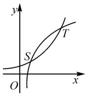  
图15

由前面用运动的观点所得结论可知， $y = x^{a}$ 与 $y = \log_{a}x$ 的图象相切时，有 $a^{a} = e^{\frac{1}{e}}$ . 所以，当 $1 < a^{a} < e^{\frac{1}{e}}$ 时，存在 $x_{0}$ ，使得 $a^{x_{0}} < x_{0}^{a} < \log_{a}x_{0}$ 成立；否则，不存在.

综上,问题结论为:当 $0 < a^{a} < e^{\frac{1}{c}}$ 且 $a \neq 1$ 时,存在 $x_{0}$ ,使得 $a^{x_{0}} < x_{0}^{a} < \log_{a} x_{0}$ 成立;当 $a^{a} \geqslant e^{\frac{1}{c}}$ 时,不存在 $x_{0}$ ,使 $a^{x_{0}} < x_{0}^{a} < \log_{a} x_{0}$ 成立.

上文中不仅提出的问题得到了全面正确的解决，而且由问题所引发的用运动的观点对“幂指对”函数图象关系的“全景”探究，生动直观、全面深刻地揭示了幂函数、指数函数、对数函数图象关系的内涵和本质——真可谓“一题释全景”.

# 参考文献：

[1]中华人民共和国教育部.普通高中数学课程标准(2017年版)[S].北京:人民教育出版社,2018.  
[2]章建跃.用函数图象和代数运算的方法研究“幂指对”函数[J].数学通报,2020(10):1-11.  
[3]戚有建.幂指对型超越方程根的个数[J].数学通报,2013(12):39-41.Z