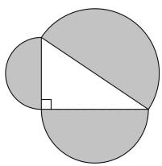
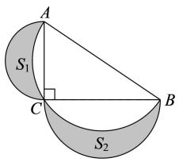
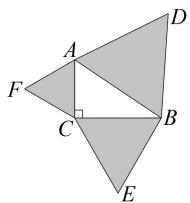
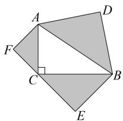
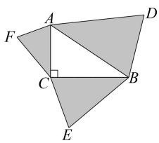
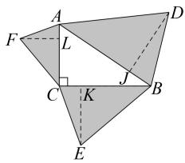

# 一道教材习题引发的变式探究及其教学启示

# 沈喜娟

(福建省诏安第一中学, 福建 漳州 363500)

摘 要:笔者以北师大版初中数学教材中的一道习题为例,深入探究在直角三角形三边上所作图形的面积之间的关系,并通过详细解析习题,展示多种变式,如改变半圆位置、图形形状、条件等,得出相应的结论.因此,在初中数学教学中,教材习题在知识巩固与思维培养方面具有重要价值,教师应深入挖掘教材习题,培养学生思维的灵活性,提高学生运用所学知识分析问题和解决问题的能力,提升学生的数学核心素养,从而促进其全面发展.

关键词:教材习题;勾股定理;变式探究;教学启示

中图分类号：G632

文献标识码：A

文章编号:1008-0333(2025)17-0041-03

教材中的习题是数学教学的重要资源,看似简单的习题往往蕴含着丰富的数学内涵.在初中数学教学中,对教材习题进行适当变式探究,可以挖掘其潜在的教育价值 $^{[1]}$ ,帮助学生更好地掌握所学知识,发展学生的数学核心素养.笔者以北师大版数学教材八年级上册中的一道习题为例,展示其变式探究过程和从中获得的教学启示,供读者参考.

# 1 习题呈现

北师大版八年级数学上册第 17 页第 6 题如下:

问题 1 如图 1, 直角三角形三边上的半圆面积之间有什么关系?

natural_image

Geometric diagram showing a triangle inscribed in a circle, with no text or symbols present.

图1 问题1图

此问题是“勾股定理”复习题中的一道习题，主要用于巩固勾股定理知识，提高学生的问题解决能力. 此习题涉及半圆面积公式、勾股定理等知识, 它将几何图形的面积与直角三角形三边关系巧妙结合, 让学生运用勾股定理解决实际问题, 发展学生的抽象能力、运算能力、推理能力、几何直观等核心素养.

# 2 习题解析

设直角三角形的两条直角边长分别为 a, b，斜边长为 c。根据半圆面积公式 $S = \frac{1}{2} \pi r^{2}$ 可知，两条直角边上的半圆的面积分别为 $S_{1} = \frac{1}{2} \pi \left( \frac{a}{2} \right)^{2} = \frac{\pi a^{2}}{8}$ ， $S_{2} = \frac{1}{2} \pi \left( \frac{b}{2} \right)^{2} = \frac{\pi b^{2}}{8}$ ，斜边上的半圆的面积为 $S_{3} = \frac{1}{2} \pi \left( \frac{c}{2} \right)^{2} = \frac{\pi c^{2}}{8}$ 。根据勾股定理可知 $a^{2} + b^{2} = c^{2}$ ，所以 $\frac{\pi \left( a^{2} + b^{2} \right)}{8} = \frac{\pi c^{2}}{8}$ ，即 $S_{1} + S_{2} = S_{3}$ 。因此，斜边上的半圆的面积等于两条直角边上的半圆的面积之和。

点评 以上解答过程体现了转化与化归的数学思想方法. 首先根据半圆的面积公式, 将三个半圆的

收稿日期:2025-03-15

作者简介: 沈喜娟, 本科, 一级教师, 从事初中数学教学研究.

面积关系转化为直角三角形三条边的长度关系,然后运用勾股定理得到结论.

# 3 习题变式

改变原习题中半圆的位置,可得到如下变式:

变式 1 如图 2, 在 Rt△ABC 中, AC⊥BC, 分别以边 AB, AC, BC 为直径作半圆. 探究所得的阴影部分的面积与△ABC 的面积之间的关系.

text_image

A
S₁
C
B
S₂

图 2 变式 1 示意图

解析 设 BC = a, AC = b, AB = c，由勾股定理得 $c^{2} = a^{2} + b^{2}$ 。根据半圆面积公式可知，AB 边上的半圆的面积 $S_{\text{半圆 }AB} = \frac{1}{2}\pi\left(\frac{AB}{2}\right)^{2} = \frac{1}{8}\pi c^{2}$ ，AC 边上的半圆的面积 $S_{\text{半圆 }AC} = \frac{1}{2}\pi\left(\frac{AC}{2}\right)^{2} = \frac{1}{8}\pi b^{2}$ ，BC 边上的半圆的面积 $S_{\text{半圆 }BC} = \frac{1}{2}\pi\left(\frac{BC}{2}\right)^{2} = \frac{1}{8}\pi a^{2}$ ，所以 $S_{1} + S_{2} = S_{\text{半圆 }AC} + S_{\text{半圆 }BC} - (S_{\text{半圆 }AB} - S_{\triangle ABC}) = S_{\text{半圆 }AC} + S_{\text{半圆 }BC} - S_{\text{半圆 }AB} + S_{\triangle ABC} = \frac{1}{8}\pi b^{2} + \frac{1}{8}\pi a^{2} - \frac{1}{8}\pi c^{2} + S_{\triangle ABC} = \frac{1}{8}\pi \cdot (b^{2} + a^{2} - c^{2}) + S_{\triangle ABC} = S_{\triangle ABC}.$

即阴影部分的面积之和等于 $\triangle ABC$ 的面积.

变式 1 结论优美,阴影部分形似月牙,因此被称为月形定理 $^{[2]}$ .

将原习题中的半圆改为正三角形,可得如下变式:

变式 2 如图 3, 在 Rt△ABC 中, AC⊥BC, 分别以 AB, BC, AC 为边作正三角形. 探究所得的三个正三角形的面积之间的关系.

text_image

Geometric diagram with labeled points A, B, C, D, E, F and right angle at C

图3 变式2示意图

解析 设 BC = a, AC = b, AB = c，由勾股定理，得 $c^{2} = a^{2} + b^{2}$ 。根据正三角形面积公式可知，AB 边上的正三角形的面积 $S_{\triangle ABD} = \frac{\sqrt{3}}{4}c^{2}$ ，BC 边上的正三角形的面积 $S_{\triangle BCE} = \frac{\sqrt{3}}{4}a^{2}$ ，AC 边上的正三角形的面积 $S_{\triangle ACF} = \frac{\sqrt{3}}{4}b^{2}$ ，所以 $S_{\triangle BCE} + S_{\triangle ACF} = \frac{\sqrt{3}}{4}a^{2} + \frac{\sqrt{3}}{4}b^{2} = \frac{\sqrt{3}}{4}c^{2} = S_{\triangle ABD}$ 。因此，直角边上的两个正三角形的面积之和等于斜边上的正三角形的面积。

事实上,变式2可以进一步推广,将正三角形改为正n边形,可得如下变式:

变式 3 在 Rt△ABC 中, AC⊥BC, 分别以 AB, BC, AC 为边作正 n 边形. 探究所得的三个正 n 边形的面积之间的关系.

解析 设 BC = a, AC = b, AB = c，由勾股定理，得 $c^{2} = a^{2} + b^{2}$ 。根据正 n 边形面积公式可知，BC 边上的正 n 边形的面积 $S_{1} = \frac{na^{2}}{4\tan180^{\circ}/n}$ ，AC 边上的正 n 边形的面积 $S_{2} = \frac{nb^{2}}{4\tan(180^{\circ}/n)}$ ，AB 边上的正 n 边形的面积 $S_{3} = \frac{nc^{2}}{4\tan180^{\circ}/n}$ 。所以 $S_{1} + S_{2} = \frac{na^{2}}{4\tan180^{\circ}/n} + \frac{nb^{2}}{4\tan180^{\circ}/n} = \frac{nc^{2}}{4\tan180^{\circ}/n} = S_{3}$ 。因此，直角边上的两个正 n 边形的面积之和等于斜边上的正 n 边形的面积。

将变式 2 中的正三角形改为其他三角形,是否有类似的结论呢?

变式 4 如图 4, 在 Rt△ABC 中, AC⊥BC, 分别以 AB, BC, AC 为斜边作等腰直角 △ABD, △BCE, △ACF. 探究所得的三个等腰直角三角形的面积之间的关系.

text_image

Geometric diagram with labeled points A, B, C, D, E, F and a right angle at C, showing shaded polygons and a right angle marker.

图 4 变式 4 示意图

解析 设 BC = a, AC = b, AB = c，由勾股定理，得 $c^{2} = a^{2} + b^{2}$ 。易知 $AD = BD = \frac{\sqrt{2}}{2}AB = \frac{\sqrt{2}}{2}a$ ，所以 $S_{\triangle ABD} = \frac{1}{2}AD \cdot BD = \frac{1}{4}c^{2}$ 。同理可得 $S_{\triangle BCE} = \frac{1}{4}a^{2}$ ， $S_{\triangle ACF} = \frac{1}{4}b^{2}$ ，所以 $S_{\triangle BCE} + S_{\triangle ACF} = \frac{1}{4}a^{2} + \frac{1}{4}b^{2} = \frac{1}{4}c^{2} = S_{\triangle ABD}$ 。因此，直角边上的两个等腰直角三角形的面积之和等于斜边上的等腰直角三角形的面积。

在变式 2 和变式 4 中,所作的三角形都是相似的,将其一般化为任意相似三角形,可得如下变式:

变式 5 如图 5, 在 Rt△ABC 中, AC⊥BC, 分别以 AB, BC, AC 为边作相似三角形, 即 △ABD ∼ △BCE ∼ △ACF. 探究所得的三个相似三角形的面积之间的关系.

text_image

Geometric diagram with labeled points A, B, C, D, E, F and a right angle at C

图 5 变式 5 示意图

解析 如图6, 过点 $D$ 作 $AB$ 边上的高, 垂足为 $J$ . 过点 $E$ 作 $BC$ 边上的高, 垂足为 $K$ . 过点 $F$ 作 $AC$ 边上的高, 垂足为 $L$ . 易知 $AB$ 边上的三角形的面积 $S_{\triangle ABD} = \frac{1}{2} AB \cdot DJ, BC$ 边上的正三角形的面积 $S_{\triangle BCE} = \frac{1}{2} BC \cdot EK, AC$ 边上的正三角形的面积 $S_{\triangle ACF} = \frac{1}{2} AC \cdot FL$ . 因为 $\triangle ABD \sim \triangle BCE \sim \triangle CAF$ , 所以 $\frac{DJ}{AB} = \frac{EK}{BC} = \frac{FL}{CA}$ , 故 $EK = \frac{DJ \cdot BC}{AB}, FL = \frac{DJ \cdot AC}{AB}$ , 所以 $S_{\triangle BCE} = \frac{1}{2} BC \cdot EK = \frac{DJ \cdot BC^2}{2AB}, S_{\triangle ACF} = \frac{1}{2} AC \cdot FL = \frac{DJ \cdot AC^2}{2AB}$ . 于是 $S_{\triangle BCE} + S_{\triangle ACF} = \frac{DJ \cdot BC^2}{2AB} + \frac{DJ \cdot AC^2}{2AB} = \frac{DJ \cdot (BC^2 + AC^2)}{2AB}$ . 由勾股定理可知 $BC^2 + AC^2 = AB^2$ , 所以 $S_{\triangle BCE} + S_{\triangle ACF} = \frac{DJ \cdot AB^2}{2AB} = \frac{DJ \cdot AB}{2} = S_{\triangle ABD}$ . 因此, 直角边上的两个三角形的面积之和等于斜边上的三角形的面积.

text_image

Geometric diagram with labeled points and shaded regions, likely from a math problem or proof

图6 变式5解析示意图

# 4 教学启示

# 4.1 深入挖掘教材习题

在初中数学教学中,教师应意识到教材习题不仅是简单的练习,更是知识拓展和思维培养的重要素材.在教学进程中,教师要深入剖析习题背后涉及的多个知识点以及它们之间的联系,引导学生尝试对习题进行变式推广,帮助他们巩固所学知识,构建更完整的知识体系,为进一步学习奠定基础.

# 4.2 培养学生思维的灵活性

教师通过多种变式探究,能够有效培养学生思维的灵活性.例如,本文所探究的习题,从半圆位置的变换到图形形状的变换,再到条件的多样化,能够促使学生深入理解问题的本质.同时,这有助于培养学生的类比思维(如从半圆的结论类比到正多边形的情况)和归纳思维(如总结出在不同三角形条件下面积关系的共性).

# 5 结束语

教材习题是一座宝藏,等待着教师和学生共同去挖掘.这道习题的变式探究显现出了它在知识巩固、思维培养等多方面的价值.在今后的教学中,教师应更加重视教材习题的开发利用,引导学生积极参与探究活动.与此同时,学生也应学会主动思考、勇于创新,从教材习题中汲取营养,不断提高数学学习能力和综合素养.

# 参考文献：

[1] 梅鹏. 一道教材习题的多解探究与教学价值 [J]. 数理化学习 (初中版), 2024(6): 25-27.  
[2] 华兴恒. 有趣的月形定理 [J]. 数理天地 (初中版), 2020(7): 34-35.

[责任编辑:李慧娇]