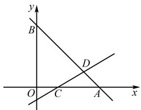
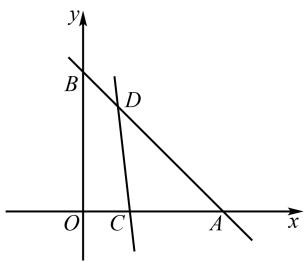

# 基于波利亚解题理论的初中数学解题教学

——以 2024 年南通市中考数学第 18 题为例

# 庄树慧

(如皋市实验初中, 江苏 如皋 226500)

摘 要:问题是数学的“心脏”,所以解决问题是初中数学学习的重要组成部分,它不仅能够使学生巩固所学知识,而且能够提高学生运用所学知识分析问题和解决问题的能力,促进学生全面发展.基于此,文章以2024年南通市中考数学第18题为例,通过分析问题、拟定计划、实施计划和回顾反思四个步骤,展示波利亚解题理论在初中数学解题教学中的实际应用,旨在提高学生的解题能力和思维水平,培养学生的自主学习和创新能力,进而提升其数学核心素养.

关键词: 波利亚解题理论; 初中数学; 解题教学

中图分类号：G632

文献标识码：A

文章编号:1008-0333(2025)17-0062-03

随着新课程改革的不断深入,学生的问题解决能力备受关注.解题是初中数学教学的重要组成部分,它不仅能够检验学生对所学数学知识的掌握程度,而且能够培养学生的数学思维能力和创新精神,提升学生的数学核心素养 $^{[1]}$ .波利亚解题理论作为一种经典的思维方法和解题方法,在初中数学解题教学中发挥着重要作用 $^{[2]}$ .笔者以2024年南通市中考数学第18题为例,详细阐述波利亚解题理论在初中数学解题教学中的应用,供读者参考.

# 1 波利亚解题理论概述

波利亚解题理论既是解题的一般思路,又蕴含着丰富的问题解决心理机制.它主要包括四个步骤:理解问题、拟定计划、实施计划和回顾反思 $^{[3]}$ .

# 1.1 理解问题

在初中数学解题过程中,理解问题是解题的第一步.学生首先需要认真阅读题目,明确已知条件和所求问题.在理解问题的过程中,学生可以借助画图、列表、举例等方式将问题直观化,以便更好地把握问题的本质,为问题解决创造有利条件.

# 1.2 拟定计划

拟定计划是解题的关键步骤,要求学生根据已知条件和所求问题,寻找解题的基本思路和方法.在拟定计划的过程中,学生需要回顾所学的知识与方法,回忆以前是否解决过类似的问题,并思考能否利用以前的解题思路和方法解决现在的问题.

# 1.3 实施计划

实施计划是解题的具体过程,要求学生按照拟定的计划写出详细的解题过程.在实施计划的过程中,学生要注意计算的准确性、证明的严谨性和书写的规范性,确保解题过程的准确无误.

# 1.4 回顾反思

回顾反思是解题的最后一步,要求学生对解题过程进行回顾和反思,总结解题经验和方法.在回顾反思的过程中,学生可以思考以下问题:解题方法是否正确?是否有其他更好的解题方法?类似的方法能否解决其他问题?以此提高运用所学知识分析问题和解决问题的能力.

# 2 试题呈现

试题 1 （2024 年南通市中考数学第 18 题）在平面直角坐标系 xOy 中，已知 A(3,0)，B(0,3). 直线 $y = kx + b$ (k, b 为常数，且 k > 0) 经过点 (1,0)，并把 $\triangle AOB$ 分成两部分，其中靠近原点部分的面积为 $\frac{15}{4}$ ，则 k 的值为 \_\_\_\_.

# 3 基于波利亚解题理论的解题教学过程

# 3.1 理解问题

问题 1 已知条件是什么?

已知点 $A(3,0), B(0,3)$ , 它们与坐标原点确定了一个直角三角形, 即 $\triangle AOB$ . 直线 $y = kx + b$ 满足 $k > 0$ 且过点 $C(1,0)$ . 直线 $y = kx + b$ 把 $\triangle AOB$ 分成两部分, 其中靠近原点部分的面积为 $\frac{15}{4}$ .

问题 2 未知量是什么?

$\triangle AOB$ 的面积和直线 $y = kx + b$ 的解析式.

问题 3 题目要求什么?

根据题意易知,本题需要求 k 的值.

问题 4 这是一道什么问题?

这是一道平面几何与一次函数相结合的问题.

问题 5 你能根据条件画出相应的图形吗?

根据题意可得如图 1 所示的图形, 点 D 是直线 AB 与直线 $y = kx + b$ 的交点.

text_image

y
B
D
O C A x

图1 试题1图

# 3.2 拟定计划

回顾相关知识引导学生回忆一次函数的相关知识.例如,怎样求一次函数的解析式、怎样求两条直线的交点坐标及三角形面积公式等相关知识.

联想相似问题,引导学生回顾以前是否见过类似的问题.学生经过回忆,联想到以下类似的问题.

试题 2 已知直线 $l_{1}$ 过 $A(0,2)$ , $B(2,0)$ 两点,直线 $l_{2}: y = mx + b$ 过点 $(1,0)$ ，且把 $\triangle AOB$ 分成两部分，其中靠近原点的部分是一个三角形。设此三角形的面积为 S，求 S 关于 m 的函数解析式及自变量 m 的取值范围。

问题 6 解决试题 2 的思路是什么?

首先求出直线 $l_{2}: y = mx + b$ 与相关直线的交点坐标, 然后根据问题中的面积关系确定参数之间的关系, 进而解决问题.

问题 7 你可以仿照以上思路拟定试题 1 的解决方案吗?

仿照以上思路,拟定试题1的如下解题方案.

第一步,求出直线 AB 的解析式;

第二步,根据直线 $y=kx+b$ 过点 $C(1,0)$ , 求出参数 k, b 之间的关系;

第三步,求出直线 AB 与直线 $y = kx + b$ 的交点 D 的坐标(用字母表示);

第四步,根据条件 $S_{四边形OCDB} = \frac{15}{4}$ 列出方程,解方程求出 k 的值.

# 3.3 实施方案

设直线 AB 的解析式为 $y = mx + n$ ，把 $A(3,0)$ ， $B(0,3)$ 代入，可得 $\left\{\begin{aligned}3m+n=0,\\ n=3,\end{aligned}\right.$ 解得 $\left\{\begin{aligned}m=-1,\\ n=3.\end{aligned}\right.$ 从而可知直线 AB 的解析式为 $y=-x+3$ 。因为直线 $y=kx+b$ 经过点 $C(1,0)$ ，将点 $C(1,0)$ 代入，得 $k+b=0$ ，即 b=-k，所以 y=kx-k。联立方程组得

$\left\{ \begin{array}{l} y = kx - k, \\ y = -x + 3, \end{array} \right.$ 解得 $\left\{ \begin{array}{l} x = \frac{k + 3}{k + 1}, \\ y = \frac{2k}{k + 1}. \end{array} \right.$ 从而可得

$D\left(\frac{k+3}{k+1},\frac{2k}{k+1}\right)$ . 易知 OB = 3, OA = 3, AC = 2, 所以 $S_{\triangle ABO}=\frac{1}{2}\cdot OB\cdot OA=\frac{9}{2}$ . 根据题意 $S_{四边形OCDB}=\frac{15}{4}$ ,

所以 $S_{\triangle ACD} = S_{\triangle ABO} - S_{四边形OCDB} = \frac{9}{2} - \frac{15}{4} = \frac{3}{4}$ ，故 $\frac{1}{2} \cdot$

$y_{D} \cdot AC = \frac{3}{4}$ , 即 $\frac{1}{2} \times \frac{2k}{k + 1} \times 2 = \frac{3}{4}$ , 解得 $k = \frac{3}{5}$ .

# 3.4 回顾反思

问题 8 如何检验所得的结果是否正确?

将 $k=\frac{3}{5}$ 和 b=-k 代入直线 $y=kx+b$ ，求出直线 CD 的解析式为 $y=\frac{3}{5}x-\frac{3}{5}$ ，再与直线 AB 的解析式 $y=-x+3$ 联立，可求出点 D 的坐标为 $\left(\frac{9}{4},\frac{3}{4}\right)$ ，从而 $S_{\triangle ACD}=\frac{1}{2}\cdot y_{D}\cdot AC=\frac{3}{4}$ ，所以 $S_{四边形OCDB}=S_{\triangle ABO}-S_{\triangle ACD}=\frac{9}{2}-\frac{3}{4}=\frac{15}{4}$ ，故结果正确.

问题 9 还有其他解法吗?

根据条件易知 $S_{\triangle ACD} = S_{\triangle ABO} - S_{四边形OCDB} = \frac{9}{2} - \frac{15}{4} = \frac{3}{4}$ . 设点 D 的纵坐标为 $y_{D}$ ，则 $S_{\triangle ACD} = \frac{1}{2} \cdot y_{D} \cdot AC = \frac{3}{4}$ ，又因为 AC = 2，所以 $y_{D} = \frac{3}{4}$ . 易知直线 AB 的解析式 $y = -x + 3$ ，将 $y_{D} = \frac{3}{4}$ 代入可得点 D 的横坐标为 $\frac{9}{4}$ . 将点 $C(1,0)$ 和点 $D\left(\frac{9}{4}, \frac{3}{4}\right)$ 代入 y = kx + b 得 $\left\{\begin{aligned}&k + b = 0,\\ &\frac{9}{4}k + b = \frac{3}{4},\end{aligned}\right.$ 解得 $\left\{\begin{aligned}&k = \frac{3}{5},\\ &b = -\frac{3}{5}.\\\end{aligned}\right.$ 从而可知 $k = \frac{3}{5}$ .

问题 10 你能用此方法解决类似的问题吗?

引导学生尝试改编原试题,得到以下变式.

变式 如图2,在平面直角坐标系 $xOy$ 中,已知 $A(3,0),B(0,3)$ ,直线直线 $y = kx + b(k,b$ 为常数,且 $k > 0)$ 经过点 $C(1,0)$ ,并把 $\triangle AOB$ 分成面积相等的两部分,则 $k$ 的值为\_.

text_image

y
B
D
O C A x

图 2 变式题图

解法 1 如图 2, 设直线 AB 与直线 $y = kx + b$ 交于点 D. 类似前文可知直线 AB 的解析式为 $y = -x + 3$ , 直线 CD 的解析式为 y = kx - k, 点 D 的坐标为$\left(\frac{k+3}{k+1},\frac{2k}{k+1}\right)$ . 因为 $S_{\triangle ABO}=\frac{1}{2}\cdot OB\cdot OA=\frac{9}{2}$ ，根据条件可知 $S_{\triangle ACD}=\frac{1}{2}S_{\triangle ABO}=\frac{9}{4}$ ，故 $\frac{1}{2}\cdot y_{D}\cdot AC=\frac{9}{4}$ ，即 $\frac{1}{2}\times\frac{2k}{k+1}\times2=\frac{9}{4}$ ，解得 k=-9.

解法2 根据条件易知 $S_{\triangle ACD} = \frac{1}{2} S_{\triangle ABO} = \frac{9}{4}$ . 设点 $D$ 的纵坐标为 $y_D$ , 则 $S_{\triangle ACD} = \frac{1}{2} \cdot y_D \cdot AC = \frac{9}{4}$ . 又因为 $AC = 2$ , 所以 $y_D = \frac{9}{4}$ . 由解法1可知直线 $AB$ 的解析式 $y = -x + 3$ , 将 $y_D = \frac{9}{4}$ 代入可得点 $D$ 的横坐标为 $\frac{3}{4}$ . 将点 $C(1,0)$ 和点 $D\left(\frac{3}{4}, \frac{9}{4}\right)$ 代入 $y = kx + b$ 得 $\left\{\begin{array}{l} k + b = 0, \\ \frac{3}{4}k + b = \frac{9}{4}, \end{array}\right.$ 解得 $\left\{\begin{array}{l} k = -9, \\ b = 9. \end{array}\right.$ 从而可知 $k = -9$ .

# 4 结束语

波利亚解题理论涵盖理解问题、拟定计划、实施计划和回顾反思四个步骤,这四个步骤构成了一个完整的解题体系,它不仅仅关注解题的结果,更注重解题的过程,引导学生从多个角度去思考问题,逐步建立起正确的解题思路,进而培养学生严谨的思维习惯和解决问题的能力.

# 参考文献：

[1] 尹秋云, 莫兴展. 基于波利亚“怎样解题表”的中考试题教学实践研究: 以2023年广东省中考数学第23题为例[J]. 理科考试研究, 2024(14):2-6.

[2] 波利亚. 怎样解题: 数学思维的新方法 [M]. 涂泓, 冯承天, 译. 上海: 上海科技教育出版社, 2018.

[3] 刘忠新, 张素红. 基于波利亚“四部曲”提高解题教学效率: 以 2020 年北京市中考题第 26 题教学为例 [J]. 中小学数学 (初中版), 2020 (11): 24-27.

[责任编辑:李慧娇]