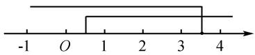
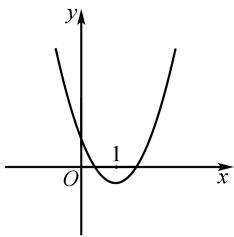
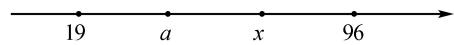
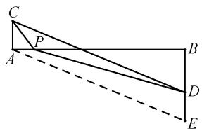
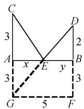
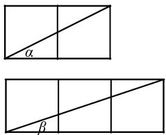
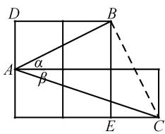
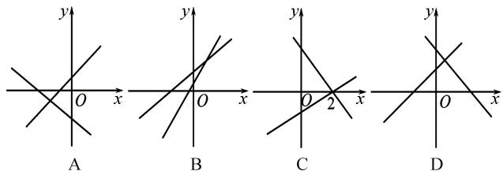
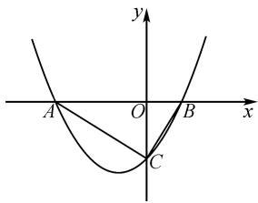
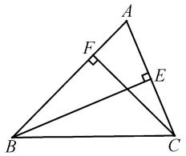

# 数形结合在初中数学解题中的应用探索

# 于海波

(哈尔滨市第二十一中学校, 黑龙江 哈尔滨 150056)

摘 要: 在数学领域, 数形结合思想就像桥梁, 它能够巧妙地将抽象的“数”与直观的“形”连接起来, 为问题解决提供独特的视角和强大的工具. 数形结合不仅蕴含着数学的深邃智慧, 而且是数学思维的重要体现, 更是解决数学问题的有效策略. 数与式能够精确地反映图形的结构特性, 而图形则使得数与式的表达更为形象直观. 通过数形结合, 学生能够更深入地理解数学问题中的数量关系与空间结构, 将复杂的数学问题简化为直观易懂的形式. 此外, 数形结合还能帮助学生迅速洞察问题的核心, 找到解题的关键点, 从而提升解题的效率和准确性. 基于此, 笔者通过具体例题, 探讨数形结合在解题过程中的应用, 旨在帮助学生更有效地掌握数形结合的解题策略.

关键词: 初中数学; 数形结合; 解题策略; 应用

中图分类号：G632 文献标识码：A

在初中数学领域,数与代数、空间与图形构成了数学的两大核心内容,而“数”与“形”之间的联系即为数形结合 $^{[1]}$ . 我国杰出数学家华罗庚曾强调: 数形结合百般好,隔裂分家万事非. 作为一种数学思想方法,数形结合的应用可大致划分为两种情形,一是借助图形解决数与式的问题;二是借助数与式的计算解决图形问题. 据此,笔者通过实际说明数形结合在初中数学解题中的应用策略,供读者参考.

# 1 借助图形解决数与式的问题

以“形”助“数”指的是运用图形阐释和揭示数学问题的本质,借助图形的直观性降低问题的抽象性 $^{[2]}$ .以“形”助“数”即意味着将“数”的问题,依托于“形”的框架展开研究,使其变得直观和形象化,进而直观地探究“数”的内在规律.

# 1.1 借助数轴解决不等式及根式化简问题

例 1 如图 1, 数轴上 A, B 两点分别对应实数 a, b, 则下列结论正确的是().

文章编号:1008-0333(2025)14-0065-04

A. $|a| > |b|$   
B. $a + b > 0$   
C. ab < 0   
D. $|b| = b$

$$
\begin{array}{c c c c c} & B & & A \\ \hline & - 2 & b & - 1 & O \\ \hline \end{array}
$$

图1 例1图

解析 由 A, B 两点在数轴上的位置直接可得答案为 C.

例 2 不等式组 $\left\{\begin{aligned}9x-a&\geqslant0,\\ 8x-b&<0\end{aligned}\right.$ 的整数解只有 1,2,3, 则 a 的整数值有 \_\_\_\_ 个, b 的整数值有 \_\_\_\_ 个.

解析 此题是一道一元一次不等式问题,通过解此不等式组可得 $\frac{a}{9}\leqslant x<\frac{b}{8}$ .至此,学生可能无法构建“不等式组的整数解只有1,2,3”与“ $\frac{a}{9}\leqslant x<\frac{b}{8}$ ”之间的逻辑关系,从而陷入解题困境.在求解过程中,若能借助数轴,结合不等式组的整数解为1,2,3,由

收稿日期:2025-03-15

作者简介:于海波,本科,高级教师,从事初中数学教学研究.

图2可以直观看出 $0 < \frac{a}{9} \leqslant 1, 3 < \frac{b}{8} \leqslant 4$ . 由 $0 < \frac{a}{9} \leqslant 1$ 可得 $0 < a \leqslant 9$ . 由此可知 $a = 1, 2, 3, 4, 5, 6, 7, 8, 9$ , 共9个. 由 $3 < \frac{b}{8} \leqslant 4$ 可得 $24 < b \leqslant 32$ , 所以 $b = 25$ , 26, 27, 28, 29, 30, 31, 32, 共8个.

text_image

-1 O 1 2 3 4

图 2 例 2 解析示意图

# 1.2 借助函数图象解决一元二次方程问题

例 3 设关于 x 的方程 $ax^{2} + (a + 2)x + 9a = 0$ 有两个不相等的实数根 $x_{1}, x_{2}$ 且 $x_{1} < 1 < x_{2}$ ，那么 a 的取值范围是（）.

A. $-\frac{2}{7} < a < \frac{2}{5}$

B. $a > \frac{2}{5}$

C. $a < -\frac{2}{7}$

D. $-\frac{2}{11} < a < 0$

解析 根据已知条件可知,方程 $ax^{2}+(a+2)x+9a=0$ 有两个不相等实数根,显然说明此方程为一元二次方程,则 $a\neq0$ . 由此可将原方程可变形为 $x^{2}+(1+\frac{2}{a})x+9=0$ . 令 $y=x^{2}+(1+\frac{2}{a})x+9$ , 则此抛物线开口向上,如图3所示.

text_image

y
1
O
x

图 3 例 3 解析示意图

由 $x_{1}<1<x_{2}$ 知, 此抛物线与 x 轴交点在 $(1,0)$ 的两侧. 显然, 当 x=1 时, y<0, 即 $1+\left(1+\frac{2}{a}\right)+9<0$ , 解得 $-\frac{2}{11}<a<0$ , 故选 D.

# 1.3 利用图形解决最值问题

例 4 已知函数 $y = |x - a| + |x + 19| + |x - a - 96|$ ，其中 a 为常数，且满足 19 < a < 96，当自变量 x 的取值范围为 $a \leqslant x \leqslant 96$ 时，y 的最大值是 \_\_\_\_.

解析 绝对值与数轴有着密切的关系,因此可考虑用数轴直观解决此题.由已知条件可得到如图4的数轴,显然 $y = x - a + 19 + x + a + 96 - x = x + 115$ . 因为 y 随 x 的增大而增大,所以当 x = 96 时,y 有最大值 $y_{max} = 96 + 115 = 211$ .

  
图 4 例 4 解析示意图

例 5 代数式 $\sqrt{x^{2}+4}-\sqrt{(12-x)^{2}+9}$ 的最小值是 \_\_\_\_.

解析 由所给代数式易发现, $x^{2}+4=x^{2}+2^{2}$ , $(12-x)^{2}+9=(12-x)^{2}+3^{2}$ . 由此易联想到勾股定理,从而想到构造直角三角形,以“形”助“数”,为问题解决创造有利条件. 如图5所示,AB=12,AC=2,BD=3,AC⊥AB,BD⊥AB,P为AB上一个动点,设AP=x,则PB=12-x. 由勾股定理可得 $PC=\sqrt{x^{2}+4}$ , $PD=\sqrt{(12-x)^{2}+9}$ . 从而可得 $PC+PD\geqslant CD$ ,即 $\sqrt{x^{2}+4}-\sqrt{(12-x)^{2}+9}\geqslant CD$ . 过A作 $AE\parallel CD$ ,交BD的延长线于E,易知 $CD=AE=\sqrt{12^{2}+5^{2}}=13$ ,所以, $\sqrt{x^{2}+4}-\sqrt{(12-x)^{2}+9}$ 的最小值为13.

text_image

Geometric diagram with labeled points A, B, C, D, E, P and lines forming triangles and a dashed auxiliary line

图 5 例 5 解析示意图

例 6 已知 x、y 都是正数, $x + y = 5$ , 求代数式 $\sqrt{x^{2} + 9} + \sqrt{x^{2} + 4}$ 的最小值.

解 如图 6, 作线段 AB = 5, 在线段 AB 上截取 AE, BE, 使 AE = x, EB = y, 构造 Rt $\triangle CAE$ 和 Rt $\triangle DBE$ , 使 AC = 3, BD = 2, 由勾股定理可得 CE = $\sqrt{x^{2} + 9}$ , BD = $\sqrt{y^{2} + 4}$ , 从而可将 $\sqrt{x^{2} + 9} + \sqrt{x^{2} + 4}$ 的最小值转化为求 CE + ED 的最小值, 即把代数式求最值问题转化为几何中的“将军饮马”问题.

如图6,作点 C 关于直线 AB 的对称点 G, 连接 DG, 由勾股定理可求得式子 $\sqrt{x^{2}+9} + \sqrt{x^{2}+4}$ 的最小值为 $DG = \sqrt{5^{2}+5^{2}} = 5\sqrt{2}$ , 即 $\sqrt{x^{2}+9} + \sqrt{x^{2}+4}$

的最小值是 $5\sqrt{2}$ .

text_image

C
3
A
x
E
y
B
D
2
3
G
5
F

图 6 例 6 解析示意图

# 1.4 利用几何图形进行证明

例 7 已知 $\tan\alpha=\frac{1}{2},\tan\beta=\frac{1}{3}$ ，求证： $\alpha+\beta=45^{\circ}$ .

分析 由正切三角函数的定义,可借助正方形网格构造符合条件的角 $\alpha, \beta$ , 如图 7. 再通过图形变换构造出这两个角的和 $\alpha + \beta$ , 如图 8.

证明 根据已知条件,可构造如图1所示的正方形网格,显然满足 $\tan\alpha=\frac{1}{2},\tan\beta=\frac{1}{3}$ . 如图8,连接 BC, 易证明 $\triangle ABD\cong\triangle CBE$ , 进而证明 $\triangle ABC$ 是等腰直角三角形, 从而得到 $\alpha+\beta=45^{\circ}$ .

text_image

α
β

图 7 构造 $\alpha, \beta$ 示意图  

text_image

D
B
A
α
β
E
C

图 8 例 7 解法示意图

由此可以看出,数形结合在代数问题的解决中发挥着至关重要的作用. 数形结合思想能够有效地将抽象的代数关系与直观的图形联系起来,使学生以更直观的方式理解和解决复杂的代数问题. 在代数问题中,数形结合主要体现在数轴、函数图象的应用及方程(组)和不等式的求解等方面.

# 2 借助数与式解决图形问题

“以数辅形”指的是运用数学的精确性解析和描述图形,通过代数式的推导和计算,将图形问题数量化,进而将几何问题转化为代数问题,以此具体探索“形”的结构和性质 $^{[3]}$ .

# 2.1 借助方程组解决一次函数交点问题

例 8 已知 b > a，一次函数 $y = bx + a$ 与 $y = ax + b$ 的图象在同一平面直角坐标系中，下列图象可能正确的是（）.

text_image

y
x
O
A
y
x
O
B
y
x
O
2
C
y
x
O
D

分析 设两直线的交点坐标为 $(x, y)$ , 则 $(x, y)$ 为方程组 $\left\{ \begin{array}{l} y = bx + a, \\ y = ax + b \end{array} \right.$ 的解, 易得此方程组的解为 $\left\{ \begin{array}{l} x = 1, \\ y = a + b. \end{array} \right.$ 从而可知两条直线的交点坐标为 $(1, a + b)$ . 由交点横坐标是 1 可知 A、C 选项都不对. 对于选项 B、D 而言, 由 $b > a > 0$ 可知交点的纵坐标 $a + b > b > a$ , 故选 B.

# 2.2 借助数解决抛物线问题

例 9 如图 9 所示, 抛物线 $y = ax^{2} + bx + c (a \neq 0)$ 与 x 轴交于 A, B 两点, 与 y 轴交于点 C, 若 $\triangle ABC$ 是直角三角形, 则 ac = \_\_\_\_.

text_image

y
A O B x
C

图9 例9图

解析 设 $A(x_{1},0)$ , $B(x_{2},0)$ ，则 $x_{1}$ , $x_{2}$ 异号，且 $x_{1}x_{2}=\frac{c}{a}<0$ 。易得 $c^{2}=|x_{1}|\cdot|x_{2}|=-x_{1}x_{2}=-\frac{c}{a}$ 。由此可得 ac=-1。

例 10 直线 $y = bx + c$ 与抛物线 $y = ax^{2}$ 相交，两个交点的横坐标分别为 $x_{1}, x_{2}$ ，直线 $y = bx + c$ 与 x 轴的交点的横坐标为 $x_{3}$ 。求证： $\frac{1}{x_{3}} = \frac{1}{x_{1}} + \frac{1}{x_{2}}$ .

分析 在解决抛物线与直线相交问题时,因为无法确定参数 a, b, c 的符号, 所以无法直接确定抛物线和直线在平面直角坐标系中的确切位置. 因而此问题需要通过分类讨论解决, 其涉及多种情况, 处理起来较为繁琐. 若将此问题转化为代数形式, 利用方程思想通过计算解决问题, 便可以避免分类讨论, 从而使解答过程更为简洁明了.

解 因为直线 $y = bx + c$ 与 x 轴的交点的横坐标为 $x_{3}$ ，所以 $bx_{3} + c = 0$ ，所以 $x_{3} = -\frac{c}{b} \cdot \frac{1}{x_{3}} = -\frac{b}{c}$ 。因为直线 $y = bx + c$ 与抛物线 $y = ax^{2}$ 两个交点的横坐标分别为 $x_{1}, x_{2}$ ，所以 $x_{1}, x_{2}$ 是关于 x 的一元二次方程 $ax^{2} - bx - c = 0$ 的两个实数根，所以 $x_{1} + x_{2} = \frac{b}{a}, x_{1}x_{2} = -\frac{c}{a}$ 。从而可知 $\frac{1}{x_{1}} + \frac{1}{x_{2}} = \frac{x_{1} + x_{2}}{x_{1}x_{2}} = -\frac{b}{c}$ ，所以 $\frac{1}{x_{3}} = \frac{1}{x_{1}} + \frac{1}{x_{2}}$ 。

在几何证明中,数形结合显得尤为重要.运用方程思想,借助代数运算分析图形问题,能够使证明过程更加直观和简洁,有效降低问题解决难度.

# 2.3 借助勾股定理

例 11 已知 $\triangle ABC$ 的三边长分别为 $x^{2}-y^{2}, 2xy$ 和 $x^{2}+y^{2}(x, y$ 均为正整数，且 x>y). 求 $\triangle ABC$ 的面积 (用含 x, y 的式子表示).

分析 在一般三角形中,已知三边求面积的问题被称为“三斜求积”. 此问题可以利用“海伦公式”解决,但计算可能较为复杂. 观察此题中给出的三角形三边长的代数式可以发现, $(x^{2}-y^{2})^{2}+(2xy)^{2}=(x^{2}+y^{2})^{2}$ , 显然 $\triangle ABC$ 是一个直角三角形.

解 因为 $(x^{2}-y^{2})^{2}+(2xy)^{2}=(x^{2}+y^{2})^{2}$ ，所以 $\triangle ABC$ 是直角三角形，所以此三角形的面积 $S=\frac{1}{2}(x^{2}-y^{2})(2xy)=xy(x^{2}-y^{2})$ .

在此问题中,代数运算扮演了关键角色. 掌握数与式的计算是学好数学的基础技能. 在计算面积和体积时, 数形结合法能够帮助学生将抽象的计算过程转化为直观的图形操作, 达到化难为易的目的.

# 2.4 用代数计算解决几何证明问题

例 12 如图 10, 在 $\triangle ABC$ 中, AB > AC, CF、BE 分别是 $\triangle ABC$ 的高. 证明: $AB + CF \geqslant AC + BE$ .

text_image

Geometric diagram of triangle ABC with perpendiculars from points F and E on sides AB and AC, respectively

图10 例12图

证明 易知 $AB > AC > CF, AB > BE$ . 因为 $S_{\triangle ABC} = \frac{1}{2} AB \cdot CF = \frac{1}{2} AC \cdot BE$ , 所以 $\frac{AB}{BE} = \frac{AC}{CF}$ , 所以 $\frac{AB - BE}{AB} = \frac{AC - CF}{AC}$ , 所以 $AB - BE > AC - CF$ , 所以 $AB + CF > AC + BE$ . 当 $\angle A = 90^{\circ}$ 时, $AB + CF = AC + BE$ . 综上所述, $AB + CF \geqslant AC + BE$ .

在几何证明中,数形结合策略显得尤为重要. 在解题过程中,合理运用数形结合法,可以使几何证明过程更加直观和简洁,从而提高学生的解题效率.

在初中数学教学中,数形结合的思想和方法十分重要.这种方法通过将抽象的数学概念与直观的几何图形相结合,为解决问题创造有利条件,其特别强调数学思维的灵活性,引导学生在面对数学问题时,能够自由地在“数”与“形”之间转换,从而多角度审视问题,探索解决问题的多种途径.

# 3 结束语

在初中数学教学中,数形结合的思想和方法在建立知识间联系、激活学生思维、提升学生数学能力方面具有显著成效.因此,在教学过程中,教师应有意识地培养和提升学生运用数形结合思想的能力,以此提高学生运用所学知识分析问题和解决问题的能力,提升其数学核心素养.

# 参考文献：

[1] 周娟. 数形结合思想在中学数学教学中的应用 [J]. 试题与研究, 2023(23): 28-30.  
[2] 许国荣. “数形结合” 让初中数学“化繁为简”
[J]. 读写算, 2023(22): 101-103.   
[3] 张凤鲜. 数形结合法在初中数学解题中的应用技巧 [J]. 数学学习与研究, 2024(4): 158-160.

[责任编辑:李慧娇]