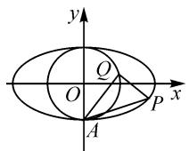
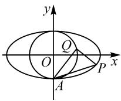
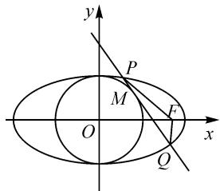

# 两道椭圆与圆综合问题的拓展探究

# ● 甘肃省秦安县第二中学 罗文军

摘要: 椭圆和圆综合起来命制的解析几何定值、定点和取值范围问题, 可以很好地考查数形结合思想、函数与方程思想和分类讨论思想, 以及着力考查数学运算、逻辑推理和直观想象等数学核心素养, 因此倍受命题专家的青睐. 本文中运用类比和特殊到一般的研究方法, 对两道椭圆与圆的综合问题进行拓展探究, 为教师命制模考试题提供参考.

关键词: 椭圆; 姊妹圆; 斜率; 拓展; 探究

圆和椭圆都是高中数学解析几何部分的重要知识,也是高考考查的重点内容.椭圆与圆综合起来命制的解析几何定值、定点和取值范围问题,可以很好地考查数形结合思想、函数与方程思想和分类讨论思想,以及着力考查数学运算、逻辑推理和直观想象的数学核心素养,因此倍受命题专家的青睐.以下运用类比和特殊到一般的研究方法,对两道椭圆和圆的综合问题进行拓展探究,以期对教师命制模考试题提供参考.

# 1 试题呈现

试题 1 （江苏省南京市金陵中学 2022 届高三检测改编题）已知椭圆 $E: \frac{x^{2}}{a^{2}} + \frac{y^{2}}{b^{2}} = 1 (a > b > 0)$ 的离心率为 $\frac{\sqrt{3}}{2}$ ，P 为 E 上一点，Q 为圆 $x^{2} + y^{2} = b^{2}$ 上一点， $|PQ|$ 的最大值为 3 (P, Q 异于椭圆 E 的上下顶点)，如图 1.

(1)求椭圆 E 的方程.

(2) A 为椭圆 E 的下顶点, 直线 AP, AQ 的斜率分别记为 $k_{1}$ , $k_{2}$ , 且 $k_{2}=4k_{1}$ , 求证:

  
图1

① $\triangle APQ$ 为直角三角形；
②直线 PQ 过定点，并求出此定点的坐标.

试题 2 （广东佛山 2022 年高考模拟题）已知椭圆 $C: \frac{x^{2}}{a^{2}} + \frac{y^{2}}{b^{2}} = 1 (a > b > 0)$ ，其右焦点为 $F(\sqrt{3}, 0)$ ，点 M 在圆 $x^{2} + y^{2} = b^{2}$ 上但不在 y 轴上，过点 M 作圆的切线交椭圆于 P, Q 两点，当点 M 在 x 轴上时， $|PQ| = \sqrt{3}$ .

(1)求椭圆 C 的标准方程；  
(2) 当点 M 在圆上运动时, 试探究 $\triangle FPQ$ 周长的

取值范围.

# 2 试题拓展

试题1中，涉及到圆 $x^{2} + y^{2} = b^{2}$ ，该圆的圆心为椭圆 $E:\frac{x^2}{a^2} +\frac{y^2}{b^2} = 1(a > b > 0)$ 的中心，且一条直径为椭圆 $E$ 的短轴，称圆 $x^{2} + y^{2} = b^{2}$ 是椭圆 $E$ 的一个“姊妹圆”.试题1的第(1)问中求出椭圆 $E:\frac{x^2}{4} +y^2 = 1$ ，第(2)问中 $k_{2} = 4k_{1}$ ，发现恰好有 $\frac{a^2}{b^2} = 4.$ 通过拓展探究，可得到以下关于椭圆及其“姊妹圆”性质的四个命题[1].

命题 1 如图 2, 已知 P 为椭圆 $E: \frac{x^{2}}{a^{2}} + \frac{y^{2}}{b^{2}} = 1 (a > b > 0)$ 上的一点, Q 为圆 $x^{2} + y^{2} = b^{2}$ 上一点, A 为椭圆 E 的下顶点, 直线 AP,

  
图2

AQ 的斜率分别记为 $k_{1}, k_{2}$ ，且 $k_{2} = \frac{a^{2}}{b^{2}} k_{1}$ ，则有：

(1) $\angle AQP = 90^{\circ}$ ;   
(2) 直线 PQ 过定点 $(0, b)$ .

证明:(1)直线 AP 的方程为 $y=k_{1}x-b(k_{1}\neq0)$ .

联立方程组 $\left\{\begin{aligned}\frac{x^{2}}{a^{2}}+\frac{y^{2}}{b^{2}}=1,\\ y=k_{1}x-b,\end{aligned}\right.$ 消去 y，得

$$
\left(a ^ {2} k _ {1} ^ {2} + b ^ {2}\right) x ^ {2} - 2 a ^ {2} b k _ {1} x = 0,
$$

则 $x_{P} = \frac{2a^{2}bk_{1}}{a^{2}k_{1}^{2} + b^{2}},y_{P} = \frac{a^{2}bk_{1}^{2} - b^{3}}{a^{2}k_{1}^{2} + b^{2}}.$

所以 $P\left(\frac{2a^2bk_1}{a^2k_1^2 + b^2},\frac{a^2bk_1^2 - b^3}{a^2k_1^2 + b^2}\right).$

直线 AQ 的方程为 $y=\frac{a^{2}}{b^{2}}k_{1}x-b$ ，联立方程组

$$
\begin{array}{l} \left\{ \begin{array}{l l} x ^ {2} + y ^ {2} = b ^ {2}, \\ y = \frac {a ^ {2}}{b ^ {2}} k _ {1} x - b, \end{array} \right. \text {消去} y, \text {得} \\ \left(a ^ {4} k _ {1} ^ {2} + b ^ {4}\right) x ^ {2} - 2 a ^ {2} b ^ {3} k _ {1} x = 0, \\ \end{array}
$$

则 $x_{Q} = \frac{2a^{2}b^{3}k_{1}}{a^{4}k_{1}^{2} + b^{4}},y_{Q} = \frac{a^{4}bk_{1}^{2} - b^{5}}{a^{4}k_{1}^{2} + b^{4}}.$

所以 $Q\left(\frac{2a^2b^3k_1}{a^4k_1^2 + b^4},\frac{a^4bk_1^2 - b^5}{a^4k_1^2 + b^4}\right)$

于是，可得 $k_{PQ}=\frac{\frac{a^{4}bk_{1}^{2}-b^{5}}{a^{4}k_{1}^{2}+b^{4}}-\frac{a^{2}bk_{1}^{2}-b^{3}}{a^{2}k_{1}^{2}+b^{2}}}{\frac{2a^{2}b^{3}k_{1}}{a^{4}k_{1}^{2}+b^{4}}-\frac{2a^{2}bk_{1}}{a^{2}k_{1}^{2}+b^{2}}}$

$$
\frac {2 a ^ {2} b ^ {3} \left(a ^ {2} - b ^ {2}\right) k _ {1} ^ {2}}{2 a ^ {4} b \left(b ^ {2} - a ^ {2}\right) k _ {1} ^ {3}} = - \frac {b ^ {2}}{a ^ {2} k _ {1}} = - \frac {1}{\frac {a ^ {2}}{b ^ {2}} k _ {1}} = - \frac {1}{k _ {2}}.
$$

所以 $k_{PQ} \cdot k_{2} = -1$ ，即 $PQ \perp AQ$ .

故 $\angle AQP = 90^{\circ}$

(2)由(1)，可得直线 PQ 的方程为

$$
y - \frac {a ^ {2} b k _ {1} ^ {2} - b ^ {3}}{a ^ {2} k _ {1} ^ {2} + b ^ {2}} = - \frac {1}{\frac {a ^ {2}}{b ^ {2}} k _ {1}} \left(x - \frac {2 a ^ {2} b k _ {1}}{a ^ {2} k _ {1} ^ {2} + b ^ {2}}\right). \quad ①
$$

在上述方程①中，令 x=0 ，可得

$$
y - \frac {a ^ {2} b k _ {1} ^ {2} - b ^ {3}}{a ^ {2} k _ {1} ^ {2} + b ^ {2}} = - \frac {b ^ {2}}{a ^ {2} k _ {1}} \left(- \frac {2 a ^ {2} b k _ {1}}{a ^ {2} k _ {1} ^ {2} + b ^ {2}}\right).
$$

即 $y - \frac{a^2bk_1^2 - b^3}{a^2k_1^2 + b^2} = \frac{2b^3}{a^2k_1^2 + b^2}.$

于是 $y=\frac{a^{2}bk_{1}^{2}+b^{3}}{a^{2}k_{1}^{2}+b^{2}}=\frac{b(a^{2}k_{1}^{2}+b^{2})}{a^{2}k_{1}^{2}+b^{2}}=b$ ，所以直线 PQ 过定点 $(0,b)$ .

同理可证得下面命题 2～4.

命题 2 已知 P 为椭圆 $E: \frac{x^{2}}{a^{2}} + \frac{y^{2}}{b^{2}} = 1 (a > b > 0)$ 上的一点，Q 为圆 $x^{2} + y^{2} = b^{2}$ 上一点，A 为椭圆 E 的上顶点，直线 AP, AQ 的斜率分别记为 $k_{1}, k_{2}$ ，且 $k_{2} = \frac{a^{2}}{b^{2}} k_{1}$ ，则有：

(1) $\angle AQP=90^{\circ}$ ;   
(2) 直线 PQ 过定点 $(0, -b)$ .

命题 3 已知 Q 为椭圆 E: $\frac{y^{2}}{a^{2}} + \frac{x^{2}}{b^{2}} = 1 (a > b > 0)$ 上的一点, P 为圆 $x^{2} + y^{2} = a^{2}$ 上一点, A 为椭圆 E 的上顶点, 直线 AQ, AP 的斜率分别记为 $k_{1}, k_{2}$ , 且 $k_{2} =$ $\frac{b^{2}}{a^{2}}k_{1}$ ，则有：

(1) $\angle APQ=90^{\circ}$ ;   
(2) 直线 PQ 过定点 $(0, -a)$ .

命题 4 已知 Q 为椭圆 $E: \frac{y^{2}}{a^{2}} + \frac{x^{2}}{b^{2}} = 1 (a > b > 0)$ 上的一点，P 为圆 $x^{2} + y^{2} = a^{2}$ 上一点，A 为椭圆 E 的下顶点，直线 AQ, AP 的斜率分别记为 $k_{1}, k_{2}$ ，且 $k_{2} = \frac{b^{2}}{a^{2}} k_{1}$ ，则有：

(1) $\angle APQ = 90^{\circ}$ ;   
(2) 直线 PQ 过定点 $(0, a)$ .

通过对试题 2 进行拓展探究, 可得椭圆及其“姊妹圆”相关性质的命题 5.

命题 5 如图 3, 已知椭圆 $C: \frac{x^{2}}{a^{2}} + \frac{y^{2}}{b^{2}} = 1 (a > b > 0)$ , 其右焦点为 F, 点 M 在圆 $x^{2} + y^{2} = b^{2}$ 上但不在 y 轴上, 过点 M 作圆的切线交椭圆于 P, Q 两点, 当点 M 在圆上运动时, 则 $\triangle FPQ$ 周长的取值范围为 $[2a, 4a]$ .

text_image

y
P
M
O
F
x
Q

图 3

证明略.

# 3 结束语

著名数学教育家波利亚说过：“发现问题比解决问题更重要。”这句话告诉我们，要学好高中数学，就要认真审视习题，通过对习题的观察，探索习题中蕴含的规律。本文中的解题，没有仅停留在题目的解出上，而是通过观察题设条件中式子的结构特征，运用类比推理和演绎推理的研究方法，顺势对试题进行拓展探究，得到了关于椭圆及其“姊妹圆”性质的五个命题，揭示了这类问题的题根，为高中生数学探究能力的培养提供了素材，为打造高品质高中数学习题课提供了案例。

# 参考文献：

[1]姜坤崇.椭圆的“姊妹椭圆”与“姊妹圆”及其性质[J].中学教研(数学),2011(12):34-37.Z