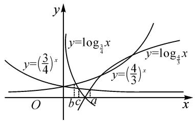
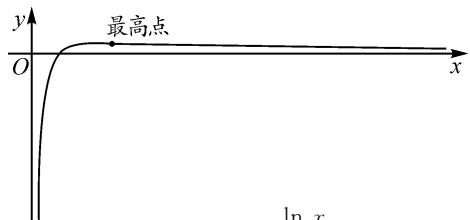

# 函数思想在比较大小问题中的应用

——以“幂指对函数”单元为例

# ● 哈尔滨师范大学教师教育学院 潘婷

摘要: 数学与我们的生活密切相关, 数学中蕴含的思想更是十分宝贵. 利用函数思想, 可以解决高中阶段的众多难题. 本文中以幂指对函数为背景, 将函数思想借助变式训练应用于解题教学中, 旨在训练学生的思维能力, 为高考积累解题经验.

关键词: 高中数学; 函数思想; 变式教学; 解题能力

新课程改革不仅对教师的学术专业能力和授课技巧有了更高层次的要求,对学生的学习能力相比以前也有了更高挑战.在新课程改革背景下,教师不仅要传授学生知识和技能、更要培养学生独立思考、解决问题的能力以及严谨认真的思维素质,尤其在数学学科中,日常要进行大量且多种变式的数学练习,以提高学生对众多题型的系统把握程度,这将直接影响学生的解题水平.本文中将简述在学习了基本初等函数中的幂指对函数后,如果遇到比较大小之类的问题,该如何系统地分析与解决.

# 1 理论背景

# 1.1 函数思想

函数是描述现实世界中变量之间关系的数学语言,反映了一个事物随着另一个事物的变化而变化的规律.函数思想是指运用运动和变化的观点去研究和分析有关问题中的数量关系,通过建立函数模型或者构造辅助函数,运用函数的图象和性质去分析问题、转化问题和解决问题,是探究变量变化规律的工具;同时,函数思想也是客观世界中事物运动变化、相互联系、相互制约的普遍规律在数学中的反映,它的本质是变量之间的对应.学习函数的同时要更注重函数思想的渗透 $^{[1]}$ .

# 1.2 幂指对函数的单调性

(1)幂函数 $y=x^{\alpha}$ 的单调性

当 $\alpha>0$ 时，幂函数 $y=x^{\alpha}$ 在 $(0,+\infty)$ 上单调递增；

当 $\alpha<0$ 时，幂函数 $y=x^{\alpha}$ 在 $(0,+\infty)$ 上单调递减.

(2) 指数函数 $y = a^{x} (a > 0, \text{且 } a \neq 1)$ 的单调性

当 0 < a < 1 时，指数函数 $y = a^{x}$ 在 $(-∞, +∞)$ 上单调递减；

当 $a > 1$ 时，指数函数 $y = a^{x}$ 在 $(- \infty, + \infty)$ 上单

调递增.

(3)对数函数 $y=\log_{a}x(a>0$ , 且 $a\neq1)$ 的单调性

当 0 < a < 1 时，对数函数 $y = \log_{a} x$ 在 $(0, +\infty)$ 上单调递减；

当 a>1 时，对数函数 $y=\log_{a}x$ 在 $(0,+\infty)$ 上单调递增.

# 2 实践应用

# 2.1 利用函数的性质

例 1 设 $a=\left(\frac{4}{3}\right)^{\frac{2}{3}}$ , $b=\left(\frac{4}{3}\right)^{\frac{3}{4}}$ , $c=\left(\frac{3}{2}\right)^{\frac{3}{4}}$ , 则 a, b, c 的大小关系是().

$$
\mathrm{A}. a > c > b
$$

$$
\mathrm{B}. a > b > c
$$

$$
\mathrm{C.} c > b > a
$$

$$
\mathrm{D}. b > c > a
$$

解题分析:由题可知,a 与 b 的底数一样,b 与 c 的指数一样.由指数函数 $y=\left(\frac{4}{3}\right)^{x}$ 在 R 上是增函数,得 a<b;由幂函数 $y=x^{\frac{3}{4}}$ 在 $(0,+\infty)$ 上是增函数,得 b<c.答案为选项 C.此题利用了函数的单调性来比较大小.

# 2.2 找中间值

变式训练 1 设 $a=\left(\frac{3}{4}\right)^{\frac{2}{3}}$ , $b=\left(\frac{2}{3}\right)^{\frac{3}{4}}$ , $c=\left(\frac{3}{2}\right)^{\frac{3}{4}}$ , 则 a, b, c 的大小关系是 \_\_\_\_.

解题分析:与例 1 不同之处在于,三个式子底数不一致,所以不能简单借助函数的性质比较大小.观察题目可知,a 与 b 的底数都小于 1,c 的底数大于 1,同时它们的指数都小于 1,所以 c>1,则只需要比较 a 与 b 的大小.观察 a 和 b,发现它们的底数和指数反对应相等,可以引入一个数 $\left(\frac{3}{4}\right)^{\frac{3}{4}}$ ,起到桥梁的作用,然后继续借助函数的性质来比较大小.此题通过找一个中间值作为两个数的纽带来比较大小.

# 2.3 利用函数的图象

变式训练 2 已知 $\left(\frac{3}{4}\right)^{a}=\log_{\frac{4}{3}}a,\left(\frac{4}{3}\right)^{b}=$ $\log_{\frac{3}{4}}b,\left(\frac{3}{4}\right)^{c}=\log_{\frac{3}{4}}c$ ，则 a,b,c 的大小关系是（）.

A. $c < b < a$

B. $a < b < c$

C. $b < c < a$

D. $b < a < c$

解题分析: 含有未知数的等式叫做方程, 但题目中的方程我们解不出来, 因此可借助函数的图象求解. 画出两个函数的图象, 如图1, 由

text_image

y
y=log₄/₃x
y=(3/4)ₓ
y=log₄/₃x
y=(4/3)ₓ
O
b c
a
x

图1

图象交点横坐标的大小, 可知 b<c<a, 故选答案 C. 此题通过画出函数图象, 观察交点位置来比较大小.

# 2.4 取特殊值

变式训练3 已知 $a, b, c$ 满足 $a = \log_5(2^b + 3^b)$ ， $c = \log_3(5^b - 2^b)$ ，则（ ）.

A. $|a-c|\geqslant|b-c|$ , $|a-b|\geqslant|b-c|$   
B. $|a-c|\geqslant|b-c|$ , $|a-b|\leqslant|b-c|$   
C. $|a-c|\leqslant|b-c|$ , $|a-b|\geqslant|b-c|$   
D. $|a - c| \leqslant |b - c|, |a - b| \leqslant |b - c|$

解题分析:由题目可知,a 是 b 的函数,c 也是 b 的函数.由函数三要素中的定义域,可知 b>0.

当 b=1 时, a=1, c=1.

当 $b = 2$ 时， $a = \log_513, c = \log_521$ ，即 $c > b > a$ ，于是 $|c - a| \geqslant |c - b|$ ，故排除选项C，D；

又 $c - b = \log_321 - \log_39 = \log_3\frac{7}{3} >\log_3\sqrt{3} = \frac{1}{2},$ $b - a = \log_525 - \log_513 = \log_5\frac{25}{13} <  \log_5\sqrt{5} = \frac{1}{2}$ ，所以 $c - b > b - a > 0.$ 故选：B.

此题通过赋值法,简单快捷地比较出来了大小.由此可知,在一些形式稍为繁杂的题目中,赋值法不失为一种好方法,值得一试.

# 2.5 合理构造函数

变式训练 4 已知 $a=\frac{\ln 2}{2}$ , $b=\frac{\ln 3}{3}$ , $c=\frac{\ln 5}{5}$ ，则 a, b, c 的大小关系是().

A. $b < c < a$

B. $c < a < b$

C. $c < b < a$

D. $a < c < b$

解题分析: 观察题目可知, a, b, c 形式非常相似, 即分子为对数形式, 分母为一个数, 由此想到构造函数 $f(x)=\frac{\ln x}{x}$ , 其图象如图 2 所示.

text_image

y
O
最高点
x
ln x

图 2 函数 $f(x)=\frac{\ln x}{x}$ 的图象

变形, 得 $a = f(2) = \frac{\ln 2}{2} = \frac{2\ln 2}{4} = \frac{\ln 4}{4}$ ，由导数易知，函数 $f(x)$ 在 $(e, +\infty)$ 单调递减。因为 3 < 4 < 5，所以 $\frac{\ln 3}{3} > \frac{\ln 4}{4} > \frac{\ln 5}{5}$ ，即 c < a < b。故选：B.

变式训练 5 已知 $a=\frac{2(2-\ln2)}{\mathrm{e}^{2}}$ , $b=\frac{\ln2}{2}$ , $c=\frac{1}{\mathrm{e}}$ , 则 a, b, c 的大小关系是().

A.a<b<c

B. $b < a < c$

C. $a < c < b$

D. $b < c < a$

解题分析: 变形, 得 $a=\frac{2-\ln 2}{\frac{e^{2}}{2}}=\frac{\ln \frac{e^{2}}{2}}{\frac{e^{2}}{2}}, b=\frac{\ln 2}{2}=$ $\frac{2\ln 2}{4}=\frac{\ln 4}{4}, c=\frac{\ln e}{e}$ . 构造函数 $f(x)=\frac{\ln x}{x}$ , 其在 $(e,+\infty)$ 单调递减. 因为 $e<\frac{e^{2}}{2}<4$ , 所以 b<a<c.

故选：B.

# 3 结论

通过对以上比较大小问题的不同变式训练的求解可以看出,函数思想是高考考查的重要数学思想之一,所以,掌握函数思想不仅有助于帮助学生找到解题思路,提高解题效率,积累解题经验,还能培养学生严谨的思维素质.因此,在巩固学生基础知识和基本技能的同时,更应该注重题目中出现的数学思想方法,促进学生核心素养的形成 $^{[2]}$ .

# 参考文献：

[1]刘兰茵.函数思想在高考解题中的应用[J].高中数学教与学,2022(17):42-45.  
[2]闵安俊.变式训练教学模式在高中数学解题中的应用思考[J].数学之友,2023(3):66-68.Z