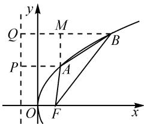

# 创新设计,巧妙破解,探究拓展

——2021年高考数学上海卷第11题的探究

# ● 江苏省宿迁中学 徐士权

直线与抛物线的位置关系问题,一直是高考数学试卷中的一类常见考点,设置巧妙,形式各样,变化多端.2021年高考数学上海卷第11题就是以抛物线为问题背景,通过直线与抛物线的位置关系所产生的具体三角形的三边长,创新设置问题,新颖别致,是一道令人眼前一亮的创新题,值得好好研究、挖掘.

# 1 真题呈现

高考真题（2021年高考数学上海卷第11题）已知抛物线 $C:y^{2} = 2px(p > 0)$ ，若第一象限内的点 $A$ ， $B$ 在抛物线 $C$ 上，焦点为 $F$ ，且 $|AF| = 2, |BF| = 4, |AB| = 3$ ，则直线 $AB$ 的斜率为 \_\_\_\_.

# 2 真题剖析

该题以抛物线为问题背景,结合抛物线的焦点,以及抛物线上的两点所构造的边长确定的三角形为载体,进而确定抛物线上的两点所对应的直线的斜率.

具体破解时,可以通过直线的斜率公式,结合点差法的应用来处理;也可以通过解析几何的平面几何化,利用斜率的定义,数形结合来直观处理;还可以利用题目中已知的弦长,结合弦长公式代入来求解.无论采用何种方法破解,都离不开抛物线的定义及其应用,借助抛物线定义的转化,或代数运算,或数形结合,或公式应用等,都可以很好地达到目的.

# 3 真题破解

方法 1: 点差法.

解析: 设 $A\left(\frac{y_{1}^{2}}{2p}, y_{1}\right)$ , $B\left(\frac{y_{2}^{2}}{2p}, y_{2}\right)$ ，其中 $y_{2} > y_{1} > 0$ .

结合抛物线的定义, 可得 $\left|AF\right|=x_{1}+\frac{p}{2}=\frac{y_{1}^{2}}{2p}+\frac{p}{2}=2,\left|BF\right|=x_{2}+\frac{p}{2}=\frac{y_{2}^{2}}{2p}+\frac{p}{2}=4$ , 则有 $\frac{y_{2}^{2}}{2p}-\frac{y_{1}^{2}}{2p}=2$ .

又结合 $|AB|=3$ ，可得 $|AB|^{2}=\left(\frac{y_{2}^{2}}{2p}-\frac{y_{1}^{2}}{2p}\right)^{2}+(y_{2}-y_{1})^{2}=4+(y_{2}-y_{1})^{2}=9.$

由于 $y_{2} > y_{1} > 0$ ，因此 $y_{2} - y_{1} = \sqrt{5}$

利用点差法，得直线 $AB$ 的斜率 $k = \frac{y_2 - y_1}{\frac{y_2^2}{2p} - \frac{y_1^2}{2p}} = \frac{\sqrt{5}}{2}$ .

故填答案: $\frac{\sqrt{5}}{2}$ .

点评:设出两点的坐标,结合抛物线的定义与两点间的距离公式确定参数之间的关系,利用点差法及直线的斜率公式即可求解.利用抛物线定义可以有效转化焦半径问题,实现焦半径与相应点的坐标之间的联系,在处理一些长度问题中经常用到.点差法是处理直线斜率问题比较常用的方法.

方法 2: 平面几何法.

解析:如图1所示,过点A,B分别作抛物线C的准线的垂线,垂足分别为P,Q,作AM⊥BQ,垂足为M.

根据抛物线的定义, 可知 $\left|AP\right|=\left|MQ\right|=\left|AF\right|=2$ , $\left|BQ\right|=\left|BF\right|=4$ , 则 $\left|BM\right|=2$ .

text_image

y
Q
M
P
A
B
O
F
x

图 1

在 Rt△AMB 中，结合 $\left|AB\right|=3$ ，可得 $\left|AM\right|=\sqrt{\left|AB\right|^{2}-\left|BM\right|^{2}}=\sqrt{5}$ .

故直线 $AB$ 的斜率 $k = \tan \angle ABM = \frac{|AM|}{|BM|} = \frac{\sqrt{5}}{2}$ .

故填答案: $\frac{\sqrt{5}}{2}$ .

点评:结合抛物线的定义,建立对应的平面几何图形,在直角三角形中,利用勾股定理,以及三角函数来求解对应直线的斜率.利用平面几何法处理解析几何问题,更加直观形象,关键是建立平面几何中点、线、角与对应解析几何中元素的关系,合理应用,巧妙转化.

方法 3: 弦长公式法 1.

解析: 设 $A(x_{1}, y_{1})$ , $B(x_{2}, y_{2})$ , 其中 $x_{2} > x_{1} > 0$ .

结合抛物线的定义, 可得 $\left|AF\right|=x_{1}+\frac{p}{2}=2$ , $\left|BF\right|=x_{2}+\frac{p}{2}=4$ ，则 $x_{2}-x_{1}=2$ .

设直线 AB 的斜率为 k，且 k > 0。

利用弦长公式，得 $|AB| = \sqrt{1 + k^2} |x_2 - x_1| = 3$ ，解得 $k^2 = \frac{5}{4}$ ，则 $k = \frac{\sqrt{5}}{2}$ . 故填答案： $\frac{\sqrt{5}}{2}$ .

点评: 利用弦长公式法求解, 简单快捷. 借助弦长公式的应用建立相应的关系式, 代入相关的数值即可巧妙求解.

方法 4: 弦长公式法 2.

解析: 同方法 1, 可得 $y_{2}-y_{1}=\sqrt{5}$ .

设直线 AB 的斜率为 k，且 k > 0。

利用弦长公式，得 $|AB|=\sqrt{1+\frac{1}{k^{2}}}|y_{2}-y_{1}|=3$ ，
解得 $k^{2}=\frac{5}{4}$ ，则 $k=\frac{\sqrt{5}}{2}$ . 故填答案： $\frac{\sqrt{5}}{2}$ .

点评:利用弦长公式 $|AB|=\sqrt{1+\frac{1}{k^{2}}}|y_{2}-y_{1}|$ 也可以达到求解的目的.破解的关键是确定抛物线上的两点对应纵坐标的差值,同时注意两个弦长公式之间的联系与区别,不要产生混淆.实际破解问题中,要根据问题的情境选择合适的弦长公式加以分析与应用.

# 4 变式拓展

探究 1: 保留题目背景, 交换题目部分条件与结论之间的位置——已知抛物线上两点所对应直线的斜率, 进而确定这两点间的距离问题. 这样变式处理, 考查的知识点基本不变, 难度比原问题有所下降.

变式 1 已知抛物线 $C: y^{2} = 2px (p > 0)$ ，若第一象限内的点 A, B 在抛物线 C 上，焦点为 F，且 $|AF| = 2, |BF| = 4$ ，直线 AB 的斜率为 $\frac{\sqrt{5}}{2}$ ，则 $|AB| =$ \_\_\_\_ .

解析: 设 $A(x_{1}, y_{1})$ , $B(x_{2}, y_{2})$ , 其中 $x_{2} > x_{1} > 0$ .

结合抛物线的定义, 可得 $\left|AF\right|=x_{1}+\frac{p}{2}=2$ , $\left|BF\right|=x_{2}+\frac{p}{2}=4$ ，则 $x_{2}-x_{1}=2$ .

由直线 $AB$ 的斜率 $k = \frac{\sqrt{5}}{2}$ ，利用弦长公式可得 $|AB| = \sqrt{1 + k^2} |x_2 - x_1| = \sqrt{1 + (\frac{\sqrt{5}}{2})^2} \times 2 = \frac{3}{2} \times 2 = 3.$ 故填答案：3.

点评: 直接根据题目条件, 在利用抛物线定义进行转化的基础上, 确定两点对应横坐标的差值, 再直接利用弦长公式求解对应的弦长即可达到目的. 设置更加直接, 处理起来更加方便快捷.

探究 2:保留题目背景与部分条件,改变原来两点均在第一象限的位置关系,转化为其中一点在第一象限,另一点在第四象限,同时改变这两点间的距离,得到变式2,考点一致,难度相当.

变式 2 已知抛物线 $C: y^{2} = 2px (p > 0)$ ，焦点为 F，若第一象限内的点 A 与第四象限内的点 B 均在抛物线 C 上，且 $|AF| = 2, |BF| = 4, |AB| = 5$ ，则直线 AB 的斜率为 \_\_\_\_.

解析: 同方法 1, 可得 $\frac{y_{2}^{2}}{2p}-\frac{y_{1}^{2}}{2p}=2$ .

又由 $|AB|=5$ ，可得 $|AB|^{2}=\left(\frac{y_{2}^{2}}{2p}-\frac{y_{1}^{2}}{2p}\right)^{2}+(y_{2}-y_{1})^{2}=4+(y_{2}-y_{1})^{2}=25.$

由 $y_{1}>0, y_{2}<0$ , 可得 $y_{2}-y_{1}=-\sqrt{21}$ .

利用点差法,可得直线 AB 的斜率 $k=\frac{y_{2}-y_{1}}{\frac{y_{2}^{2}}{2p}-\frac{y_{1}^{2}}{2p}}=$ $-\frac{\sqrt{21}}{2}$ . 故填答案: $-\frac{\sqrt{21}}{2}$ .

点评:同样,除了利用抛物线的定义进行转化,借助平面几何知识来处理,也可以利用弦长公式求解.具体解答过程可以参照真题的破解方法,这里不多加叙述.当然,改变两点在不同象限内的情况,还可以得到相应的变式问题.

# 5 教学启示

(1) 回归抛物线的本质, 抛物线的定义先行

抛物线的定义反映了抛物线自身的本质特征,揭示了相关曲线存在的几何性质与特征规律.在实际破解相关问题中,合理回归、巧妙应用抛物线定义,实现“抛物线上的点到焦点的距离”与“该点到准线的距离”二者之间的合理变形与转化,实现“两点距离”或“点线距离”之间的合理过渡、变形、转化,是破解抛物线问题最常用的一个基本技巧方法.

(2)抓住平面几何特征,破解解析几何问题

解析几何问题本质上离不开平面几何的图形特征,具有平面几何的本质特征.在具体破解问题时,合理引导学生通过数形结合对图形特征、线段数量关系、边角位置关系等加以直观认识,从而转化为相应的问题(三角函数、解三角形、平面向量或平面几何等)进行处理.在解题教学中要有意识地引导和培养学生,利用独特的思维去探索数学,欣赏数学的美.

在实际数学解题教学过程中,不能只停留在解题的表面上,应适当强化解题研究,挖掘问题本质,摒弃题海战术,讲究教学艺术,这样才能真正全面提升学生的解题能力、综合能力、创新能力与应用能力等.