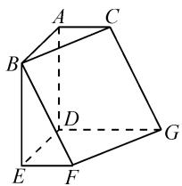
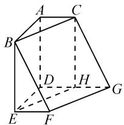
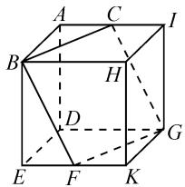

# 变换视角,扭转乾坤

——参悟转化与化归思想

# 江苏省张家港市沙洲中学 刘华珍

摘要: 转化与化归思想是一切数学思想方法的核心, 借助转化与化归思想的常用策略与技巧方法, 在实际解决问题中遵循熟悉化原则、简单化原则、直观化原则以及正难则反原则等基本原则进行转化.

关键词: 转化与化归思想; 一般; 特殊; 正反; 变量

“抓基础知识,重化归转化”是学好中学数学的一把“金钥匙”,也是一个基本窍门.事实上,数学学习中的转化与化归思想比比皆是,方方面面,林林总总.在认知层面上有未知向已知的转化,在思维层面上有高维向低维的转化,在空间感观上有空间向平面的转化,等等,其中都有转化与化归思想的“影子”与体现.

# 1 一般与特殊的相互转化

例 1 过抛物线 $y=ax^{2}(a>0)$ 的焦点 F，作一直线交抛物线于 P, Q 两点。若线段 PF 与 FQ 的长度分别为 p, q，则 $\frac{1}{p}+\frac{1}{q}$ 等于（）.

A. $2a$ B. $\frac{1}{2a}$ C. $4a$ D. $\frac{4}{a}$

分析:根据题目条件,过焦点 F 作垂直于 y 轴的直线交抛物线于 P,Q 两点,可以快速确定线段 PF 与 FQ 的长度.

解析: 抛物线 $y=ax^{2}(a>0)$ 的标准方程为 $x^{2}=\frac{1}{a}y(a>0)$ ，焦点 $F\left(0,\frac{1}{4a}\right)$ .

不妨过焦点 F 作垂直于 y 轴的直线，则 $\left|PF\right|=\left|QF\right|=\frac{1}{2a}$ ，所以 $\frac{1}{p}+\frac{1}{q}=4a$ .

故选择答案:C.

点评:此题若利用直线与抛物线的位置关系来处理,过程比较复杂,运算量也比较大.而利用特殊化处理,简单快捷.特别是涉及此类定值或常值问题,往往可以化一般值为特殊值,从而更加简洁迅速得到所需要的答案.

# 2 正与反的相互转化

例 2 若二次函数 $f(x)=4x^{2}-2(p-2)x-2p^{2}-p+1$ 在区间 $[-1,1]$ 内至少存在一个值 c，使得 $f(c)>0$ ，则实数 p 的取值范围为 \_\_\_\_.

分析:根据题目条件,利用正与反的化归与转化,先求解不等式 $f(c) \leqslant 0$ 恒成立时 p 的取值范围,再通过取补集来确定所求的实数 p 的取值范围.

解析: 若在区间 $[-1,1]$ 内不存在 c 值满足 $f(c)>0$ ，则有 $\left\{\begin{aligned}f(1)&\leqslant0,\\ f(-1)&\leqslant0,\end{aligned}\right.$ 即 $\left\{\begin{aligned}2p^{2}+3p-9&\geqslant0,\\ 2p^{2}-p&-1\geqslant0.\end{aligned}\right.$

解得 $\left\{\begin{aligned}p&\leqslant-3,\\ p&\geqslant\frac{3}{2},\\ p&\leqslant-\frac{1}{2},\end{aligned}\right.$ 或 $p\geqslant\frac{3}{2}.$

所以，取补集得 $-3 < p < \frac{3}{2}$ ，此即为满足条件的 $p$ 的取值范围。

所以实数 p 的取值范围为 $\left(-3, \frac{3}{2}\right)$ .

故填答案: $\left(-3,\frac{3}{2}\right)$ .

点评:此题的解析过程充分展示了正与反的转化,直接从所求结论入手往往情况较多且复杂,而取其结论的反面,一般所求情况比较单一或直接,这样处理就真正体现了“正难则反”的原则.利用“正难则反”原则处理问题时,经常通过取补集利用间接法,解决一些含有“至多”“至少”及否定性命题情形的相关问题.

# 3 常量与变量的相互转化

例 3 （2021 年浙江省普通高中学业水平合格性考试数学仿真模拟卷）设函数 $y=(\log_{2}x)^{2}+(t-2)\cdot\log_{2}x-t+1$ ，若 $t\in[-2,2]$ 时，y 恒取正值，则 x 的取值范围是 \_\_\_\_.

分析:根据题目条件,借助转化与化归思想改变常量与变量的关系,构建一次函数 $y = f(t) = (\log_{2}x - 1)t + (\log_{2}x)^{2} - 2\log_{2}x + 1$ , 根据变量 $t \in [-2, 2]$ 时,y 恒取正值,得到对应的不等式组,通过求解不等式(组)来确定变量 x 的取值范围.

解析: 构建函数 $y = f(t) = (\log_{2}x - 1)t +$ $(\log_{2}x)^{2}-2\log_{2}x+1$ ，则知函数 $f(t)$ 是关于参数 t 的一次函数.

当 $t \in [-2, 2]$ 时，由不等式 $f(t) > 0$ 恒成立，知 $f(-2) > 0$ ，且 $f(2) > 0$ ，代入可得

$$
\left\{ \begin{array}{l} (\log_ {2} x) ^ {2} - 4 \log_ {2} x + 3 > 0, \\ (\log_ {2} x) ^ {2} - 1 > 0. \end{array} \right.
$$

解得 $\log_{2}x<-1$ , 或 $\log_{2}x>3$ .

所以 $0 < x < \frac{1}{2}$ ，或 x > 8。

故填答案: $\left(0,\frac{1}{2}\right)\cup(8,+\infty)$ .

点评:此题若按常规法视 x 为主元来解,需要分类讨论,这样会很繁琐.而通过常量与变量的转化,将原问题巧妙转化为一次函数的相关问题,即可完美解决.特别是在处理多变元的数学综合问题时,经常借助题设中的常数(或参数)转变视角,合理化归,巧妙减元,实现“主”与“次”的转化.

# 4 相等与不等的相互转化

例 4 [中学生标准学术能力诊断性测试 2021 年 10 月测试(新高考)数学理科试卷·15] 已知 a > 0, b > 0，满足 $\frac{3}{a} + 2b = 4$ ，则 $\frac{2a}{a+1} + \frac{3}{2b}$ 的最小值为 \_\_\_\_.

分析:通过双变元方程的消元处理,结合目标构建对应的方程,利用关于参数a的一元二次方程有正数解,通过判别式非负建立不等式,实现相等与不等之间的转化,进而求解对应的参数值的最值问题.

解析:由 $\frac{3}{a}+2b=4$ ,可得 $2b=4-\frac{3}{a}$ .

设 $t=\frac{2a}{a+1}+\frac{3}{2b}=\frac{2a}{a+1}+\frac{3}{4-\frac{3}{a}}=\frac{2a}{a+1}+\frac{3a}{4a-3}>$

0, 整理可得 $(11-4t)a^{2}-(t+3)a+3t=0$ .

当 $t=\frac{11}{4}$ 时， $a=\frac{33}{23}$ ，则 $b=\frac{21}{22}$ .

当 $t \neq \frac{11}{4}$ 时，以上关于参数 a 的一元二次方程有正数解，则知判别式 $\Delta = (t + 3)^{2} - 12t (11 - 4t) \geqslant 0$ ，结合开口方向分类讨论，解得 $t \geqslant \frac{9 + 6\sqrt{2}}{7}$ ，且当 $a = \frac{33 + 21\sqrt{2}}{23}$ ， $b = \frac{7\sqrt{2} - 7}{2}$ 时， $\frac{2a}{a + 1} + \frac{3}{2b}$ 取最小值 $\frac{9 + 6\sqrt{2}}{7}$ .

故填答案: $\frac{9+6\sqrt{2}}{7}$ .

点评:例 4 结合题目“相等”关系的应用,通过相关数学知识构建“不等”关系,合理转化与化归.特别地,在解决一些函数与方程、基本不等式、导数等问题中,经常用到相等与不等的相互转化思维,巧妙合理建立二者的内在联系与转化纽带.

# 5 几何体之间的相互转化

例 5 如图 1 所示, 已知多面体 ABCDEFG 中, AB, AC, AD 两两互相垂直, 平面 ABC // 平面 DEFG, 平面 BEF // 平面 ADGC, AB = AD = DG = 2, AC = EF = 1, 则该多面体的体积为 \_\_\_\_.

text_image

A
C
B
D
G
E
F

图1

分析:根据题目条件,直接求解该多面体的体积无法下手,而合理借助空间几何体的分割法或补形法,即可实现空间几何体的转化与化归.

解法 1: (分割法) 过点 C 作 $CH \perp DG$ 于点 H, 连接 EH, 如图 2, 将不规律的多面体分割成一个直三棱柱 DEH-ABC 和一个斜三棱柱 BEF-CHG.

text_image

A
C
B
D
H
G
E
F

图2

由题意, 可知 $V_{三棱柱DEH-ABC} = \frac{1}{2} \times 2 \times 1$ 图 2 $S_{\triangle DEH} \cdot AD = \left( \frac{1}{2} \times 2 \times 1 \right) \times 2 = 2, V_{三棱柱BEF-CHG} = S_{\triangle BEF} \cdot DE = \left( \frac{1}{2} \times 2 \times 1 \right) \times 2 = 2.$

所以 $V_{多面体ABCDEFG}=2+2=4.$

故填答案:4.

解法 2: (补形法) 如图 3, 进行补形处理, 将原多面体放置于棱长为 2 的正方体中, 结合图形的结构特征, 可知所求多面体的体积恰好是该正方体体积的一半.

text_image

Geometric diagram of a cube with labeled vertices and internal points, used for spatial geometry problems.

图3

所以 $V_{多面体 ABCDEFG}=\frac{1}{2}\times8=4.$

故填答案:4.

点评:几何体之间的相互转化,往往要借助空间几何图形的特征分析,利用空间想象思维,通过空间图形的切、补、叠、转等方式来合理转化,使得不规则空间几何体便于观察与数学运算.在形、体位置关系的相互转化中,要保持线段长度、角大小等图形的几何特征与结构的不变性.

在数学解题中,转化与化归思想表现极其活跃,充分把握化归对象(把什么问题进行转化)、化归目标(化归到何处)、化归方法(如何进行化归)等指导思想,结合一些常见的方法,如直接转化法、换元法、数形结合法、构造法、坐标法、类比法、特殊化方法、等价问题法、加强命题法、补集法等相应的方法来处理,揭示问题间的内部联系,分析问题,创造条件,创新应用,实现转化与化归的目的. Z