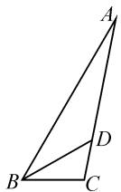
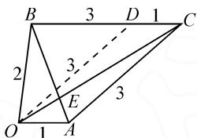
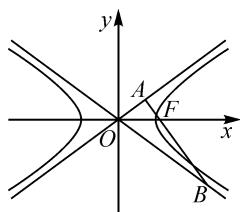

# 回归平面几何视角,妙用角平分线定理

# - 四川省大竹中学 林 棚

摘要:作为平面几何中的一个重要定理,三角形的角平分线定理在判断图形结构特征与构建线段比例关系等方面具有重要的作用.结合高中数学中解三角形、平面向量、平面解析几何等模块中的问题,借助三角形角平分线定理的应用,总结解题研究与技巧方法,全面培养学生数学核心素养.

关键词:三角形;角平分线;平面几何;解三角形;平面向量

在高中数学中,涉及解三角形、平面向量、平面解析几何等相关模块的问题,往往都离不开平面几何的相关知识及其应用.在实际解决此类问题时,往往回归平面几何的图形特征与本质,通过平面几何的直观视角,借助对应的基础知识与技巧方法等来处理与应用.特别地,根据题设条件与图形直观特征,利用三角形的角平分线定理以及一些相关的知识来构建关系式,是破解此类问题中比较常用的一种基本思维方法.

# 1 在解三角形中的应用

通过三角形的相关几何性质以及对应的角平分线等条件,借助三角形的角平分线定理来构建对应边长之间的关系式,并综合解三角形中的正弦(或余弦)定理等来转化,利用函数或方程、不等式、三角函数等知识来综合与应用.

例 1 （2023 届河南省郑州市高考数学第二次质检试卷）在 $\triangle ABC$ 中，角 A, B, C 所对的边分别是 a, b, c，其中 $\sin C = 3\sin A, B = 60^{\circ}, b = \sqrt{7}$ ，若 B 的角平分线 BD 交 AC 于点 D，则 BD = \_\_\_\_.

分析:根据三角形的角平分线定理构建对应线段的比例关系,进而确定对应的边长,并进一步利用余弦定理来确定线段 BD 的长度,利用平面几何的性质对所求结果加以辨析并作出正确的判断.

解析: 如图 1, 由 BD 是 $\angle ABC$ 的角平分线, $B = 60^{\circ}$ , 可得 $\angle ABD = \angle CBD = \frac{1}{2} \angle ABC = 30^{\circ}$ .

由 $\sin C=3\sin A$ ，结合正弦定理可得 c=3a。

  
图1

利用角平分线定理, 可得 $\frac{AB}{BC} = \frac{AD}{CD} = \frac{c}{a} = 3$ .

又 $b = \sqrt{7}$ ，所以在 $\triangle ABC$ 中，由余弦定理，可得 $b^{2} = a^{2} + c^{2} - 2ac\cos B = a^{2} + c^{2} - ac$ ，即 $7a^{2} = 7$ ，解得 $a = 1$

于是 $c = 3a = 3, AD = \frac{3}{4} b = \frac{3\sqrt{7}}{4}$ .

在 $\triangle ABD$ 中，由余弦定理，可得 $AD^{2}=BD^{2}+c^{2}-2BD\cdot c\cos30^{\circ}$ ，即 $16BD^{2}-48\sqrt{3}BD+81=0$ ，解得 $BD=\frac{3\sqrt{3}}{4}$ 或 $BD=\frac{9\sqrt{3}}{4}$ .

在 $\triangle ABC$ 中，由正弦定理，可得 $\frac{a}{\sin A} = \frac{b}{\sin B} = \frac{\sqrt{7}}{\frac{\sqrt{3}}{2}}$ ，解得 $\sin A = \frac{\sqrt{21}}{14} < \frac{1}{2} = \sin \angle ABD$ ，根据三角形

中大角对大边的性质, 知 BD<AD, 所以 $BD=\frac{3\sqrt{3}}{4}$ .

故填答案: $\frac{3\sqrt{3}}{4}$ .

点评:在实际解三角形问题中,经常回归平面几何中的三角形本质,通过三角形的角平分线定理来构建相关线段的比例关系或对应的关系式,进一步利用平面几何知识、解三角形中的正弦定理或余弦定理等,综合加以变形与应用,从而得以正确分析,合理数形结合,巧妙数学运算 $^{[1]}$ .

# 2 在平面向量中的应用

通过平面向量中的“数”来转化“形”的特征问题，或数形结合，借助“形”的几何特征利用三角形的角平分线定理来构建对应的关系式；或借助“数”的代数属性利用三角形的角平分线定理的逆向思维等来确定几何图形的结构特征等。这些都是平面向量问题中比较常用的技巧方法与综合应用。

例 2 [2022 届浙江省宁波市第二学期高考模拟考试(二模)数学试卷]已知平面向量 a, b, c 满足 $|a|=1, |b|=2, |a-c|=|b-c|=3, c=\lambda a+\mu b (\lambda>0, \mu>0)$ . 当 $\lambda+\mu=4$ 时， $|c|=(\quad)$ .

A. $\frac{\sqrt{58}}{2}$

B. $\frac{\sqrt{62}}{2}$

C. $\frac{\sqrt{66}}{2}$

D. $\frac{\sqrt{70}}{2}$

分析:根据题目条件中平面向量的几何意义,利用平面图形的几何性质与直观性,通过辅助线的构建,结合三角形的角平分线定理、余弦定理等,合理逻辑推理与数学运算,进而分析、计算出对应线段的长度.

解析:作 $\overrightarrow{OA}=a,\overrightarrow{OB}=b,\overrightarrow{OC}=c$ ，由题意 $|a-c|=|\overrightarrow{CA}|=3,|b-c|=|\overrightarrow{CB}|=3.$

设直线 OC 与直线 AB 交于点 E，由 $c = \lambda a + \mu b$ ( $\lambda > 0, \mu > 0$ )，知点 E 在线段 AB 上（不含端点）.

又 $\lambda + \mu = 4$ ，结合“等和线”性质，可知 $\overrightarrow{OC} = 4\overrightarrow{OE}$ ，即 $\frac{|OE|}{|EC|} = \frac{1}{3}$ 。又 $\frac{|AO|}{|AC|} = \frac{1}{3}$ ，由三角形的角平分线定理，知 AB 是 $\angle OAC$ 的角平分线，即 $\angle OAB = \angle CAB = \angle ABC$ ，所以 $OA \parallel BC$ 。

如图 2 所示,作平行四边形 OACD, 则 $\left|CD\right|=\left|OA\right|=1$ , $\left|OD\right|=\left|AC\right|=3$ , 可得 $\left|BD\right|=2=\left|OB\right|$ , 所以 $\triangle OBD$ 是等腰三角形.

text_image

B 3 D 1 C
2 3
E 3
O 1 A

图2

在等腰三角形 OBD 中, 根据余弦定理, 可得 $\cos\angle ODB=\frac{3}{4}$ , 则 $\cos\angle ODC=-\cos\angle ODB=-\frac{3}{4}$ .

在 $\triangle OCD$ 中,利用余弦定理,可得 $OC^{2}=OD^{2}+CD^{2}-2|OD|\cdot|CD|\cdot\cos\angle ODC=\frac{29}{2}$ .

所以 $\left|c\right|=\left|OC\right|=\sqrt{\frac{29}{2}}=\frac{\sqrt{58}}{2}$ . 故选择答案: A.

点评:回归平面向量“形”的特征,从平面几何的图形直观视角切入,借助三角形角平分线定理的逆向思维来确定对应的角平分线,从而回归平面几何直观来分析与处理问题.在解决具体的平面向量问题时,经常从“数”中确定“形”,由“形”来直观处理.

# 3 在平面解析几何中的应用

通过平面解析几何中涉及角平分线的题设条件的直接应用或角平分线性质的内涵挖掘，借助三角形的角平分线定理确定并构建相应线段的比例关系，为进一步利用圆锥曲线的定义、性质与方程来解决问题提供条件，并综合函数与方程、三角函数、不等式以及平面向量等相关知识来合理转化与巧妙应用 $^{[2]}$ .

例 3 [2023 届陕西省咸阳市高考模拟检测(一)数学试卷(咸阳一模)] 直线 l 过双曲线 $C: \frac{x^{2}}{a^{2}} - \frac{y^{2}}{b^{2}} = 1$ (a > 0, b > 0) 的右焦点 F，与双曲线 C 的两条渐近线

分别交于 A, B 两点, O 为原点, 且 $\overrightarrow{OA} \cdot \overrightarrow{AF} = 0$ , $3 \overrightarrow{AF} = \overrightarrow{FB}$ , 则双曲线 C 的离心率为().

A. $\sqrt{2}$

B. $\sqrt{3}$

C. $\frac{\sqrt{5}}{2}$

D. $\frac{\sqrt{6}}{2}$

分析:通过对题设条件的合理挖掘与巧妙转化,在直角三角形内,引入双曲线渐近线的倾斜角与斜率,结合渐近线的几何性质,利用三角形的角平分线定理来合理构建对应线段的比例关系,再借助向量关系式的转化与三角函数中的相关公式,即可求解双曲线的离心率.

解析:如图3,由 $\overrightarrow{OA}\cdot\overrightarrow{AF}=0$ ,知 $\overrightarrow{OA}\perp\overrightarrow{AF}$ ,即 $\angle OAB=\frac{\pi}{2}$ .

在 Rt△OAB 中, 设 $\angle AOF = \theta$ , 则 $\angle AOF = \angle BOF = \theta$ , 且 $\tan \theta = \frac{b}{a}$ .

text_image

y
A
F
O
x
B

图3

利用三角形的角平分线定理与三角函数的定义，可得 $\frac{|OA|}{|OB|} = \frac{|\overrightarrow{AF}|}{|\overrightarrow{FB}|} = \frac{1}{3} = \cos 2\theta.$

结合三角函数的万能公式 $\cos 2\theta=\frac{1-\tan^{2}\theta}{1+\tan^{2}\theta}$ ，可得 $\frac{1-\tan^{2}\theta}{1+\tan^{2}\theta}=\frac{1}{3}$ ，解得 $\tan^{2}\theta=\frac{1}{2}=\frac{b^{2}}{a^{2}}$ .

所以双曲线 C 的离心率 $e=\frac{c}{a}=\sqrt{1+\frac{b^{2}}{a^{2}}}=\frac{\sqrt{6}}{2}$ .

故选择答案:D.

点评: 回归平面解析几何中曲线自身所具有的平面几何本质与内涵, 通过平面几何的直观与数形结合思维, 挖掘其中角平分线的实质与条件, 进而利用三角形的角平分线定理来构建对应线段的比例关系, 往往为问题的解决开拓一个全新的局面, 也是问题切入的一个主要视角. 这里的角平分线性质有时会直接给出, 有时要结合平面解析几何中图形的实质来挖掘与应用.

回归平面几何的思维视角与图形直观,借助三角形的角平分线定理来处理与解决一些相应的高中数学问题,是初中平面几何知识的深入应用,处理问题直观有效,更多体现数学知识的基础性、连续性与延展性,更好地展示数学思想方法与思维方式,拓展并提升数学能力,全面培养学生数学核心素养.

# 参考文献：

[1]林淑金.立足教材 灵活拓展——《角平分线的性质定理》教学研究[J].中学教学参考,2021(35):18-20.

[2]郑建斌.由教学“角平分线定理的逆定理”引发的问题探究[J].中小学数学(初中版),2016(Z2):127-128.Z