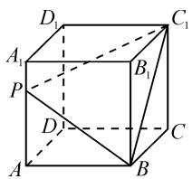
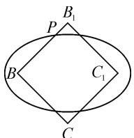
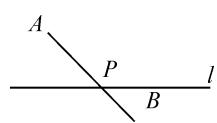
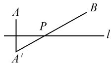
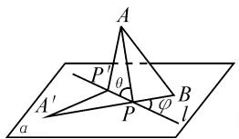
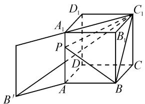

# 在一道有“问题”的高中数学试题中 追根源、释全景

山东省桓台第一中学 苏同安

摘要:针对一道有“问题”的试题,全面分析了试题出现问题的原因,并围绕此问题进行追根求源、拓展推广,提炼出其本质内涵,生成从“二维”到“三维”相关知识方法的“全景图”,体现出“一题释全景”的思想理念.

关键词: 立体几何; 问题; 根源; 全景

在一些名校或地区的 2021 届高三数学试卷中出现了一道有“问题”的试题,不仅答案错误,而且所给的选项中也没有正确答案.

然而,试题题干本身不仅没有问题,而且还与“初中”的一类典型问题密切相关、本质相同,是值得探究和推广的.以下针对此题,运用“一题释全景”的方法,全面分析问题出现的原因,并围绕此问题进行追根求源、拓展推广,提炼出其本质内涵,生成从“二维”到“三维”相关知识方法的“全景图”.

# 1 试题及分析

试题 如图 1, 在棱长为 2 的正方体 $ABCD-A_{1}B_{1}C_{1}D_{1}$ 中, 点 P 是该正方体棱上一点, 若满足 $|PB| + |PC_{1}| = m (m > 0)$ 的点 P 的个数为 4, 则 m 的取值范围是 ( ).

text_image

D₁
A₁
P
D
A
B
C₁
B₁
C

图1

A. $\left[2\sqrt{2},4\right]$

B. $\left[4,2+2\sqrt{3}\right]$

C. $\left[4,4\sqrt{2}\right]$

D. $\left[2+2\sqrt{3},4\sqrt{2}\right]$

命题者给出的参考答案为 B, 其理由是:

(1) 当点 P 在平面 $BCC_{1}B_{1}$ 内, m 的取值范围是 $[2\sqrt{2}, 4]$ .

由椭圆(如图2)的性质,知:

当 $m=2\sqrt{2}$ 时，点 P 的个数为 2；

当 $2\sqrt{2}<m<4$ 时，点 P 的个数为 4；

text_image

B₁
P
B
C₁
C

图2

当 m=4 时, 点 P 的个数为 2.

(2) 当点 P 在棱 AB 或 $C_{1}D_{1}$ 上时, m 的取值范围是 $[2\sqrt{2}, 2 + 2\sqrt{3}]$ .  
(3) 当点 P 在棱 $A_{1}B_{1}$ 或 CD 上时, m 的取值范围是 $[4, 4\sqrt{2}]$ .  
(4) 当点 P 在棱 $A_{1}D_{1}, DD_{1}, AD, AA_{1}$ 上时，m 的取值范围为 $[2+2\sqrt{3}, 4\sqrt{2}]$ .

分析:以上(1)(2)(3)三种情况的分析没有问题,问题来自于对点 P 在平面 $ADD_{1}A_{1}$ 内的认识情况——误认为此平面中棱上的点 P 所对应的 m 值是“单调”的，范围是 $[2 + 2\sqrt{3}, 4\sqrt{2}]$ . 因而出现了错误答案，而且所给选项中也没有正确答案.

实际上，点 P 从点 A 到点 $A_{1}, m$ 的值并不是单调递增，是先“递减”再“递增”——这里涉及到一个大家早已熟知且非常典型的初中的最短路径问题，把此问题进行推广（二维到三维），便能诠释当前问题的“本质内涵”，并自然生成相关知识方法的“全景图”。

# 2 问题探源

首先追根求源,给出初中的最短路径问题.

求源问题: 在平面内, 一条直线 l 和该直线外的两点 A 与 B, P 是直线 l 上一点, 求 $PA + PB$ 的最小值, 并确定点 P 的位置.

解决此问题分两种情况：

一是点 A 与点 B 在直线 l 的异侧(如图 3). 只要连接 AB, 其与直线 l 的交点便是所求的点 P, 此时 $PA + PB$ 的最小值为 AB 的长度;

  
图3

  
图4

二是点 A 与 B 在直线 l 的同侧(如图 4).作出 A 关于直线 l 的对称点 $A'$ ，连接 $A'B$ ，其与直线 l 的交点便是所求的点 P，此时 $PA + PB$ 的最小值为 $A'B$ 的长度.

# 3 问题推广

在空间中,一条直线 l 和该直线外的两点 A 与 B, 点 P 是直线 l 上一点, 求 $PA + PB$ 的最小值, 并确定点 P 的位置.

解决此问题,分为如下两种情形.

(1) 当两点 AB 与直线 l 共面时, 属于上面的求源问题.  
(2) 当直线 AB 与直线 l 异面时, 就是本文所分析的试题中易出问题的情形: 点 P 在平面 $ADD_{1}A_{1}$ 内

的棱上(其中的四条棱所在直线均与直线 $BC_{1}$ 异面).

情形(2)通过图形变换可转化成为情形(1)，并得到“统一性的结论”.

如图 5, 设点 B 与直线 l 所确定的平面为 $\alpha$ .

将点 A 与直线 l 所确定的平面以 l 为轴“旋转”（或折叠）到与平面 $\alpha$ “重合”，点 A的对应点为 $A'$ (让点 $A'$ 与点 B 在 l 异侧).

text_image

A
P'
θ
A'
P
φ
B
l
a

图5

连接 $A^{\prime}B$ ，则 $A^{\prime}P=AP$ （也可看作是以 AP 为母线，l 为轴旋转形成圆锥侧面的两条母线）.

所以， $PA + PB = PA' + PB \geqslant A'B$ ，当且仅当 $A', P, B$ 三点共线时，等号成立.

这样已转化为情形(1)( $A^{\prime}B$ 与直线l共面)，由此可总结出具有“共性”的一般结论.

一般结论: 点 P 将直线 l 分为两条射线, 分别与 AP, BP 所成角为 $\theta$ 和 $\varphi$ (如图 5), 当且仅当 $\theta = \varphi$ 时, $PA + PB$ 取最小值. (共面或异面的共性特征.)

此结论不仅诠释了各种情形的本质联系和共性特征,也可进一步思悟联想光线反射中的“入射角”与“反射角”相等的自然本质.

# 4 方法总结

根据上面的分析可知, $PA+PB$ 最小值的求法及相应点P的确定,主要有如下三种方法.

(1)图形变换法:利用相关图形的折叠或旋转,把“异面”转化为“共面”.  
(2)等角计算法:利用 $\theta=\varphi$ , 确定点 P 的位置。(比如利用 $\tan\theta=\tan\varphi$ 进行计算.)  
(3)设参求解法:围绕点 P, 设出恰当参数 x, 表示出 $PA + PB = f(x)$ , 然后求 $f(x)$ 的最值.

# 5 回到原题

此时再回看原题,不但一清二楚,而且还能悟出此题的本质.

下面用上述三种方法简略解析本试题.重点分析当点 P 在棱 $A_{1}A$ 上时的情况.

方法一:如图 6, 将正方形 $ABB_{1}A_{1}$ 以 $AA_{1}$ 为轴旋转到与矩形 $ACC_{1}A_{1}$ 共面, 点 B 的对应点为 $B'$ .

连接 $B^{\prime}C_{1}$ ，显然与棱 $AA_{1}$ 有交点.

所以, 可知 $\left|PB\right| + \left|PC_{1}\right| \geqslant \left|B'C_{1}\right|$ .

易得 $|B'C_1| = \sqrt{2^2 + (2 + 2\sqrt{2})^2} = \sqrt{16 + 8\sqrt{2}} = 2\sqrt{4 + 2\sqrt{2}}$ .

因为 $(2+2\sqrt{3})^{2}=16+8\sqrt{3}>16+8\sqrt{2}$ ，所以当点P在棱 $AA_{1}$ 时，m的取值范围为 $[2\sqrt{4+2\sqrt{2}},4\sqrt{2}]$ .

因此，有“问题”的试题

text_image

Geometric diagram of a cube with labeled vertices and internal points, used for spatial geometry problems.

图6

答案应为 $\left[4,2\sqrt{4+2\sqrt{2}}\right)$ .

方法二:由 $\tan\angle A_{1}PC_{1}=\tan\angle BPA$ ，设 $A_{1}P=x$ ，则有 $\frac{2\sqrt{2}}{x}=\frac{2}{2-x}$ .

解得 $x=4-2\sqrt{2}$ ，进而得到 $\left|PB\right|+\left|PC_{1}\right|$ 的最小值为 $2\sqrt{4+2\sqrt{2}}$ 。

方法三: 设 $A_{1}P = x$ ，则得到 $\left|PB\right| + \left|PC_{1}\right| = \sqrt{2^{2} + (2 - x)^{2}} + \sqrt{(2\sqrt{2})^{2} + x^{2}}$ .

变形, 得 $\left|PB\right| + \left|PC\right| = \sqrt{(x-2)^{2} + (0-2)^{2}} + \sqrt{(x-0)^{2} + (0+2\sqrt{2})^{2}}$ .

上式的几何意义为点 $(x,0)$ 到两点 $M(2,2)$ ， $N(0,-2\sqrt{2})$ 的距离之和，易得最小值为线段MN的长度.

# 6 原题拓展

有了以上的全景分析和方法总结,自然会产生更全面深入的思考,再将原题进行拓展.

# (1) 正方体棱长一般化

首先想到的是,把原题中正方体的棱长2改为字母a.用以上总结的方法,能快速求出m的取值范围为 $\left[2a,\sqrt{a^{2}+\left(a+\sqrt{2}a\right)^{2}}\right)$ ,进一步体现出问题的内涵和本质.

# (2) 正方体变为长方体

进而想到的是,把正方体变为长方体.

把试题中的正方体改为长方体,并设 AB=a, BC=b, $AA_{1}=c$ .

用“方法一”会快速求出点 P 在棱 $AA_{1}$ （或 $DD_{1}$ ）与棱 AD（或 $A_{1}D_{1}$ ）上时， $|PB| + |PC_{1}|$ 的最小值分别为 $\sqrt{c^{2} + (a + \sqrt{a^{2} + b^{2}})^{2}}$ 和 $\sqrt{b^{2} + (a + \sqrt{a^{2} + c^{2}})^{2}}$ .

讨论 $b + c$ 与其最小者的大小即可：

当 $b + c \geqslant \min \left\{\sqrt{c^2 + (a + \sqrt{a^2 + b^2})^2}, \sqrt{b^2 + (a + \sqrt{a^2 + c^2})^2}\right\}$ 时，满足题意的 $m$ 值不存在；

当 $b + c < \min \left\{\sqrt{c^2 + (a + \sqrt{a^2 + b^2})^2}, \sqrt{b^2 + (a + \sqrt{a^2 + c^2})^2}\right\}$ 时，满足题意的 $m$ 的取值范围为 $[b + c, \min \left\{\sqrt{c^2 + (a + \sqrt{a^2 + b^2})^2}, \sqrt{b^2 + (a + \sqrt{a^2 + c^2})^2}\right\})$ 。

这样,在更为一般的情境下,更能体会到此问题的本质和价值,也会激发进一步的探究兴趣(比如围绕点 P 的个数进行拓展),这也是本文更广泛的意义.

以上,通过对“问题”试题进行的探究分析、追根求源、拓展推广所形成的“全景图”以及追根求源、纵横拓展的研学方法,充分体现出“一题释全景”思想理念的价值,为学习数学知识方法的“本真”带来一些启迪.