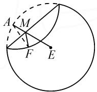
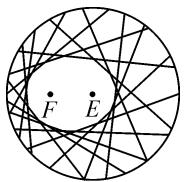
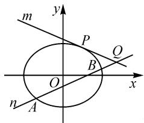
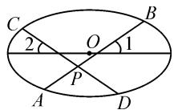
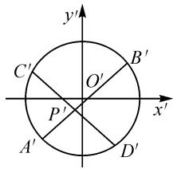

# 坐标伸缩变换视角下的椭圆探究

# 安徽省蚌埠市第四中学 穆颖

摘要:从坐标伸缩变换的视角,对蚌埠市2022届高三二质检理科卷第20题和人教版数学选修4-4第38页例题进行探究,充分体现坐标伸缩变换的应用价值.

关键词: 坐标伸缩变换; 椭圆探究

# 1 起因

蚌埠市 2022 届高三年级第二次教学质量检查考试理科卷第 20 题考查了椭圆问题,原试题如下:

“工艺折纸”是一种把纸张折成各种不同形状物品的艺术活动，在我国源远流长，某些折纸活动蕴含丰富的教学内容。例如，用一张圆形纸片，按如下步骤折纸（如图1）：

  
图1

步骤 1: 设圆心是 E, 在圆内异于圆心处取一点, 标记为 F;

步骤 2: 把纸片折叠, 使圆周正好通过点 F;

步骤 3: 把纸片展开, 并留下一道折痕;

步骤 4: 不停重复步骤 2 和 3, 就能得到越来越多的折痕(如图 2).

已知这些折痕所围成的图形是一个椭圆. 若取半径为 4 的圆形纸片, 设定点 F 到圆心 E 的距离为 2, 按上述方法折纸.

  
图2

(1)以点 F, E 所在的直线为 x 轴, 线段 EF 的中垂线为 y 轴, 建立平面直角坐标系, 求折痕所围成的椭圆 C (即图 1 中 M 点的轨迹) 的标准方程.

(2)如图3,若直线 $m:y=-\frac{1}{2}x+s(s>0)$ 与椭圆 C 相切于点 P, 斜率为 $\frac{1}{2}$ 的直线 n 与椭圆 C 分别交于点 A, B (异于点 P), 与直线 m 交于点 Q.

text_image

m
y
P
Q
B
O
x
n
A

图3

证明： $|AQ|$ ， $|PQ|$ ， $|BQ|$ 成等比数列.

参考答案如下：

解:(1)易得椭圆 $C:\frac{x^{2}}{4}+\frac{y^{2}}{3}=1.$

(2)证明：由 $\left\{ \begin{array}{l} \frac{x^2}{4} + \frac{y^2}{3} = 1, \\ y = -\frac{1}{2} x + s, \end{array} \right.$ 得 $x^{2} - sx + s^{2} - 3 = 0.$

由直线 m 与椭圆 C 相切于点 P, 可知

$$
\Delta = s ^ {2} - 4 (s ^ {2} - 3) = 0.
$$

又 s>0，所以解得 s=2。

由 $x^{2}-2x+1=0$ ，解得 x=1。

所以 $x_{P}=1, y_{P}=\frac{3}{2}$ ，即 $P\left(1, \frac{3}{2}\right)$ .

设直线 $n: y = \frac{1}{2}x + t$ ，由 $\left\{\begin{aligned} y &= -\frac{1}{2}x + 2, \\ y &= \frac{1}{2}x + t, \end{aligned}\right.$ 得 $x_{Q}=$ 2-t，且 $x_{Q} \neq 1$ ，即 $t \neq 1$ .

联立 $\left\{\begin{aligned}\frac{x^{2}}{4}+\frac{y^{2}}{3}=1,\\ y=\frac{1}{2}x+t,\end{aligned}\right.$ 得 $x^{2}+tx+t^{2}-3=0$ ，则

$$
\left\{ \begin{array}{l} x _ {A} + x _ {B} = - t, \\ x _ {A} x _ {B} = t ^ {2} - 3. \end{array} \right.
$$

所以，可得 $|PQ|^{2}=\left[\sqrt{(1+\left(-\frac{1}{2}\right)^{2}}\left|x_{P}-x_{Q}\right|\right]^{2}=$ $\frac{5}{4}(t-1)^{2}>0,$

$$
\begin{array}{l} \mid A Q \mid \cdot \mid B Q \mid = \sqrt {1 + \left(\frac {1}{2}\right) ^ {2}} \mid x _ {Q} - x _ {A} \mid \times \\ \sqrt {1 + \left(\frac {1}{2}\right) ^ {2}} \left| x _ {Q} - x _ {B} \right| = \frac {5}{4} \left| x _ {Q} ^ {2} - (x _ {A} + x _ {B}) x _ {Q} + x _ {A} x _ {B} \right| = \\ \frac {5}{4} \left| (2 - t) ^ {2} - (2 - t) (- t) + t ^ {2} - 3 \right| = \frac {5}{4} (t - 1) ^ {2} > 0. \\ \end{array}
$$

即 $|PQ|^{2} = |AQ| \cdot |BQ|$ .

故 $|AQ|$ , $|PQ|$ , $|BQ|$ 成等比数列.

# 2 分析

在第(2)问的证明中,为了求出 $|AQ|$ , $|PQ|$ , $|BQ|$ 的表达式,需要多次把直线方程和椭圆方程、直线与直线方程联立,再使用弦长公式,运算量着实比较大.我们可否另辟蹊径,找到一种简捷的处理方法呢？在本题中直线 PQ 是椭圆 C 的切线，直线 AB 是椭圆 C 的割线。在研究圆时，已学习过圆的切割线定理。若把椭圆伸缩变换成圆，再借助圆的切割线定理，是不是就可以得证了呢？变换中还需要关注变换前两点间距离与变换后两点间距离是否成比例。

# 3 探究

在人教 A 版数学选修 4-4 中, 学习了坐标伸缩变换, 伸缩变换的常用性质主要有以下几点:

性质 1 点 $A(x_{1},y_{1})$ , $B(x_{2},y_{2})$ 在坐标伸缩变换 $\varphi:\left\{\begin{aligned}x^{\prime}&=\lambda x(\lambda>0),\\ y^{\prime}&=\mu y(\mu>0)\end{aligned}\right.$ 作用下的对应点的坐标分别为 $A^{\prime}(x_{1}^{\prime},y_{1}^{\prime}),B^{\prime}(x_{2}^{\prime},y_{2}^{\prime})$ . 若直线 AB 的斜率为 $k(k\neq0)$ ，则 $\frac{|A^{\prime}B^{\prime}|}{|AB|}=\frac{\sqrt{\lambda^{2}+\mu^{2}k^{2}}}{\sqrt{1+k^{2}}}$ .

证明：由 $\left\{ \begin{array}{l}x_{1}^{\prime} = \lambda x_{1},\\ y_{1}^{\prime} = \mu y_{1}, \end{array} \right.\left\{ \begin{array}{l}x_{2}^{\prime} = \lambda x_{2},\\ y_{2}^{\prime} = \mu y_{2}, \end{array} \right.$ 得 $k_{A'B'} = \frac{y_2' - y_1'}{x_2' - x_1'} =$ $\frac{\mu y_2 - \mu y_1}{\lambda x_2 - \lambda x_1} = \frac{\mu k}{\lambda}.$

所以 $\left|A^{\prime}B^{\prime}\right|=\sqrt{1+\frac{\mu^{2}k^{2}}{\lambda^{2}}}\left|x_{2}^{\prime}-x_{1}^{\prime}\right|=\sqrt{1+\frac{\mu^{2}k^{2}}{\lambda^{2}}}$ $\left|\lambda(x_{2}-x_{1})\right|=\sqrt{\lambda^{2}+\mu^{2}k^{2}}\left|x_{2}-x_{1}\right|$ ，于是可得

$$
\frac {\left| A ^ {\prime} B ^ {\prime} \right|}{\left| A B \right|} = \frac {\sqrt {\lambda^ {2} + \mu^ {2} k ^ {2}} \left| x _ {2} - x _ {1} \right|}{\sqrt {1 + k ^ {2}} \left| x _ {2} - x _ {1} \right|} = \frac {\sqrt {\lambda^ {2} + \mu^ {2} k ^ {2}}}{\sqrt {1 + k ^ {2}}}.
$$

若 k=0，则 $\frac{|A^{\prime}B^{\prime}|}{|AB|}=\lambda$ 。若直线 AB 的斜率不存在，则 $\frac{|A^{\prime}B^{\prime}|}{|AB|}=\mu$ 。

特殊地, 若 A, B, C 三点共线, 则 $A', B', C'$ 三点也共线, 且满足对应线段的比值不变, 即 $\frac{|A'B'|}{|AB|} = \frac{|A'C'|}{|AC|}$ .

性质 2 若坐标伸缩变换前直线与曲线相切(相交、相离), 则坐标伸缩变换后直线与曲线依然相切(相交、相离).

性质 3 若直线在坐标伸缩变换前的斜率为 k，则直线在坐标伸缩变换后的斜率为 $k' = \frac{\mu k}{\lambda} (\lambda \neq 0)$ .

性质 4 若坐标伸缩变换前图形的面积为 S，则坐标伸缩变换后图形的面积 $S' = \lambda \mu S$ .

# 4 巩固练习

无独有偶,在人教版数学选修 4-4 第 38 页有如下一道例题:

如图 4 所示, AB, CD 是中心为点 O 的椭圆的两条相交弦, 交点为 P, 两弦 AB, CD 与椭圆长轴的夹角分别为 $\angle1, \angle2$ , 且 $\angle1 = \angle2$ , 求证: $|PA| \cdot |PB| = |PC| \cdot |PD|$ .

  
图 4

课本通过设直线的参数方程并与椭圆方程联立，借助参数 $t$ 的几何意义，推出 $\vert PA\vert \cdot \vert PB\vert = \vert PC\vert \cdot$ $\vert PD\vert$ ，这样需要进行大量的纯字母运算.那么，可否找到一种快捷的解法呢？在本题中线段 $AB,CD$ 都是椭圆 $C$ 的弦.在研究圆时，已学习过圆的相交弦定理.若把椭圆伸缩变换成圆，再借助此定理，就可以得证

新解: 设 $\varphi:\left\{\begin{aligned}x^{\prime}&=x,\\ y^{\prime}&=\frac{a}{b}y,\end{aligned}\right.$ 则椭圆 $\frac{x^{2}}{a^{2}}+\frac{y^{2}}{b^{2}}=1$ 变换为

圆 $C': x'^{2} + y'^{2} = a^{2}$ . 点 A, B, C, D, P 在坐标伸缩变换 $\varphi$ 作用下的对应点分别为 $A', B', C', D'$ , $P'$ (如图 5). 设直线 AB 的斜率为 $k (k \neq 0)$ ，由 $\angle 1 = \angle 2$ ，可知直线 CD 的斜率为 -k. 于是有

text_image

y'
C'
O'
B'
P'
A'
D'
x'

图 5

$$
\frac {\left| A ^ {\prime} P ^ {\prime} \right|}{\left| A P \right|} = \frac {\sqrt {1 ^ {2} + \left(\frac {a}{b}\right) ^ {2} k ^ {2}}}{\sqrt {1 + k ^ {2}}},
$$

$$
\frac {\left| B ^ {\prime} P ^ {\prime} \right|}{\left| B P \right|} = \frac {\sqrt {1 ^ {2} + \left(\frac {a}{b}\right) ^ {2} k ^ {2}}}{\sqrt {1 + k ^ {2}}},
$$

$$
\frac {\left| C ^ {\prime} P ^ {\prime} \right|}{\left| C P \right|} = \frac {\sqrt {1 ^ {2} + \left(\frac {a}{b}\right) ^ {2} (- k) ^ {2}}}{\sqrt {1 + (- k) ^ {2}}},
$$

$$
\frac {\left| D ^ {\prime} P ^ {\prime} \right|}{\left| D P \right|} = \frac {\sqrt {1 ^ {2} + \left(\frac {a}{b}\right) ^ {2} (- k) ^ {2}}}{\sqrt {1 + (- k) ^ {2}}}.
$$

所以 $\frac{|A^{\prime}P^{\prime}|}{|AP|}\times\frac{|B^{\prime}P^{\prime}|}{|BP|}=\frac{|C^{\prime}P^{\prime}|}{|CP|}\times\frac{|D^{\prime}P^{\prime}|}{|DP|}.$

由圆的相交弦定理,知 $\left|A^{\prime}P^{\prime}\right|\cdot\left|B^{\prime}P^{\prime}\right|=\left|C^{\prime}P^{\prime}\right|\cdot\left|D^{\prime}P^{\prime}\right|$ ,故 $\left|PA\right|\cdot\left|PB\right|=\left|PC\right|\cdot\left|PD\right|$ .

# 5 结束语

从以上的解答中,我们或许会惊叹:这简直不像是解析几何题了,几乎没有计算量!是的,坐标伸缩变换可将椭圆转换为圆,而圆具有椭圆不具备的许多特殊性质,并且和圆有关的问题还可以借助初中平面几何知识来解答,从而避免繁杂冗长的计算,提高解题效率.Z