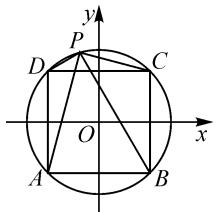
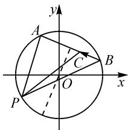

# 平面向量问题常用方法

# ● 甘肃省会宁县第四中学 张成武

摘要: 结合实例, 归纳总结出解决平面向量问题的一些常规解题思维视角与技巧策略, 剖析解题技巧, 总结常规策略, 提高复习备考效率.

关键词: 平面向量; 数形结合; 定义; 基底; 坐标

平面向量集“形”“数”于一体，是沟通代数、几何与三角函数等相关知识的一种重要工具。平面向量作为高中数学中一个特殊的知识点，成为衔接代数与几何的纽带，沟通“数”与“形”，是数形结合的典范，因此解决相应的平面向量问题时，需要具有多种技巧策略与思维意识。

# 1 定义法

定义法是解决平面向量问题的一种最基本的方法,对于平面向量的相关知识来说,例如知道了相关向量的“模”和“夹角”,数量积问题就可以从定义本身入手加以解决.

例 1 已知平面上三点 A, B, C 满足 $\left|\overrightarrow{AB}\right|=3$ , $\left|\overrightarrow{BC}\right|=4$ , $\left|\overrightarrow{CA}\right|=5$ , 则 $\overrightarrow{AB} \cdot \overrightarrow{BC} + \overrightarrow{BC} \cdot \overrightarrow{CA} + \overrightarrow{CA} \cdot \overrightarrow{AB}=$ \_\_\_\_.

分析:根据题目条件,利用三点所对应的三角形为直角三角形,结合平面向量的数量积定义即可处理;结合平面向量中的关系式特征,通过整体思维法来处理,也是一种不错的选择.

解法 1: (定义法)由题意可知, A, B, C 三点构成直角三角形. 于是, 由平面向量的数量积定义, 得 $\overrightarrow{AB} \cdot \overrightarrow{BC} = |\overrightarrow{AB}| \mid |\overrightarrow{BC}| \cos \langle \overrightarrow{AB}, \overrightarrow{BC} \rangle = 3 \times 4 \times \cos 90^{\circ} = 0$ , $\overrightarrow{BC} \cdot \overrightarrow{CA} = |\overrightarrow{BC}| \cdot |\overrightarrow{CA}| \cos \langle \overrightarrow{BC}, \overrightarrow{CA} \rangle = 4 \times 5 \times \left(-\frac{4}{5}\right) = -16$ , $\overrightarrow{CA} \cdot \overrightarrow{AB} = |\overrightarrow{CA}| \mid |\overrightarrow{AB}| \cos \langle \overrightarrow{CA}, \overrightarrow{AB} \rangle = 3 \times 5 \times \left(-\frac{3}{5}\right) = -9$ .

所以 $\overrightarrow{AB}\cdot\overrightarrow{BC}+\overrightarrow{BC}\cdot\overrightarrow{CA}+\overrightarrow{CA}\cdot\overrightarrow{AB}=-25.$

故填：-25.

解法 2: (整体思维) 由 $\overrightarrow{AB} + \overrightarrow{BC} + \overrightarrow{CA} = 0$ ，平方可得 $(\overrightarrow{AB} + \overrightarrow{BC} + \overrightarrow{CA})^{2} = 0$ .

左边展开，得 $\overrightarrow{AB^2} +\overrightarrow{BC^2} +\overrightarrow{CA^2} +2(\overrightarrow{AB}\cdot \overrightarrow{BC}+$ $\overrightarrow{BC}\cdot \overrightarrow{CA} +\overrightarrow{CA}\cdot \overrightarrow{AB}) = 0.$

于是 $2(\overrightarrow{AB} \cdot \overrightarrow{BC} + \overrightarrow{BC} \cdot \overrightarrow{CA} + \overrightarrow{CA} \cdot \overrightarrow{AB}) = -(\overrightarrow{AB^2} + \overrightarrow{BC^2} + \overrightarrow{CA^2}) = -(3^2 + 4^2 + 5^2) = -50.$

所以 $\overrightarrow{AB} \cdot \overrightarrow{BC} + \overrightarrow{BC} \cdot \overrightarrow{CA} + \overrightarrow{CA} \cdot \overrightarrow{AB} = -25$ .

故填：-25.

点评:定义法是解决问题的本质方法,涉及夹角、数量积、投影、模等相关知识的问题,抓住平面向量中的相关定义,一般都可以得到很好的解决.定义是数学知识的根本,也是解决问题的主要依据.

# 2 基底法

基底法是指利用平面向量的基本定理以及平面向量的线性运算,将问题中的平面向量转化为已知的两个不共线的平面向量的线性关系,结合平面向量的模、夹角、数量积等公式来分析与求解.

例 2 （辽宁省沈阳市 2022 届高三质量监测数学试卷·7） $\triangle ABC$ 中，AB=4, AC=2, D 为 AB 的中点， $\overrightarrow{BE}=2\overrightarrow{EC}$ ，则 $\overrightarrow{CD}\cdot\overrightarrow{AE}=(\quad)$ .

A.0

B.2

C.-2

D.-4

分析:根据题目条件,确定 $\overrightarrow{AB}$ 与 $\overrightarrow{AC}$ 为一组基底,将向量 $\overrightarrow{CD}$ 与 $\overrightarrow{AE}$ 都表示成基底向量的线性关系,结合平面向量的数量积加以展开与应用,进而得以确定其数量积的值,实现问题的突破与解决.

解析:由 $\overrightarrow{BE}=2\overrightarrow{EC}$ ，得 $\overrightarrow{AE}-\overrightarrow{AB}=2(\overrightarrow{AC}-\overrightarrow{AE})$ ，整理有 $\overrightarrow{AE}=\frac{1}{3}\overrightarrow{AB}+\frac{2}{3}\overrightarrow{AC}$ .

$$
\text { 又 } \overrightarrow {C D} = \overrightarrow {A D} - \overrightarrow {A C} = \frac {1}{2} \overrightarrow {A B} - \overrightarrow {A C}.
$$

$$
\begin{array}{r l} & {\text {所以} \overrightarrow {C D} \bullet \overrightarrow {A E} = \left(\frac {1}{2} \overrightarrow {A B} - \overrightarrow {A C}\right) \bullet \left(\frac {1}{3} \overrightarrow {A B} + \right.} \\ & {\left. \frac {2}{3} \overrightarrow {A C}\right) = \frac {1}{6} \overrightarrow {A B ^ {2}} - \frac {2}{3} \overrightarrow {A C ^ {2}} = \frac {1}{6} \times 4 ^ {2} - \frac {2}{3} \times 2 ^ {2} = 0.} \end{array}
$$

故选：A.

点评:根据题目条件确定一组相应的基底向量,是基底法解决平面向量问题的关键所在.一般满足条件的基底是各自的模确定或二者之间的夹角确定的一组不共线的向量,借助平面向量的线性运算加以合理化归与转化,进而结合向量的概念、性质以及模、数量积公式等来分析与解决.

# 3 坐标法

坐标法是建立适当的平面直角坐标系,将平面向量用坐标的形式表示出来,结合对应的坐标运算,利用函数与方程思想来分析与求解.有时坐标法可以用来解决一些较为复杂的平面向量问题.

例 3 （湖北省“荆、荆、襄、宜”四地七校联盟2021—2022学年高三上学期11月联考数学试卷·8）已知 ABCD 是半径为 $\sqrt{2}$ 的圆 O 的内接正方形，P 是圆 O 上的任意一点，则 $\overrightarrow{PA^{2}} + \overrightarrow{PB^{2}} + \overrightarrow{PC^{2}} + \overrightarrow{PD^{2}}$ 的值为（）.

A.8

B.16

C.32

D. 不能确定

分析:根据平面向量自身“数”的因素,通过图形特征,合理构建平面直角坐标系,结合对应点坐标的确定以及动点的设置,利用平面向量的坐标运算与模的公式来构建对应的关系式,进而结合条件来分析与处理.

解析: 由于四边形 ABCD 是半径为 $\sqrt{2}$ 的圆 O 的内接正方形, 易知正方形 ABCD 的边长为 2.

建立如图 1 所示的平面直角坐标系 xOy，则可知 A(-1,-1)，B(1,-1)，C(1,1)，D(-1,1). 设 P(x,y)，则有 $x^{2}+y^{2}=2$ .

text_image

y
P
D
C
O
x
A
B

图1

所以 $\overrightarrow{PA}^2 +\overrightarrow{PB}^2 +\overrightarrow{PC}^2 +\overrightarrow{PD}^2 = |\overrightarrow{PA}|^2 +|\overrightarrow{PB}|^2+$ $|\overrightarrow{PC}|^2 +|\overrightarrow{PD}|^2 = (x + 1)^2 +(y + 1)^2 +(x - 1)^2+$ $(y + 1)^2 +(x - 1)^2 +(y - 1)^2 +(x + 1)^2 +(y - 1)^2 =$ $4(x^{2} + y^{2}) + 8 = 16.$ 故选：B.

点评:利用坐标法解决平面向量问题时,合理构建平面直角坐标系是解决问题的基础.借助坐标的确定与坐标运算,综合平面解析几何的相关知识来分析与处理,是解决平面向量问题中比较常用的一种技巧策略,也是研究平面向量问题的一种“通技通法”.

# 4 代数化法

代数化法是利用平面向量自身所具备的“数”的性质,通过代数语言翻译已知平面向量问题中的条件和所求结论,借助代数运算来分析与解决相应的平面向量问题,充分体现化归与转化思想等.

例 4 已知向量 a, b 满足 $\left|a\right|=\sqrt{2},\left|b\right|=1$ ，且对一切实数 x, $\left|a+xb\right|\geqslant\left|a+b\right|$ 恒成立，则 a 与 b 的夹角的大小是 \_\_\_\_.

分析:结合平方处理,将平面向量模的不等式恒成立问题转化为二次不等式恒成立问题,结合函数与方程思维,利用判别式非负来构建三角不等式,进而得以确定向量的夹角问题.

解析: 设向量 a 与 b 的夹角为 $\theta$ .

由 $|a+xb|^{2}\geqslant|a+b|^{2}$ ，可得

$$
\boldsymbol {a} ^ {2} + 2 x \boldsymbol {a} \cdot \boldsymbol {b} + x ^ {2} \boldsymbol {b} ^ {2} \geqslant \boldsymbol {a} ^ {2} + 2 \boldsymbol {a} \cdot \boldsymbol {b} + \boldsymbol {b} ^ {2}. \tag {①}
$$

又由 $|a|=\sqrt{2}$ ， $|b|=1$ ，可得 $a^{2}=2,b^{2}=1,a\cdot$

$$
\boldsymbol {b} = \sqrt {2} \cos \theta .
$$

代入不等式①并整理，可得 $x^{2} + 2\sqrt{2} x\cos \theta - 2\sqrt{2}\cos \theta - 1 \geqslant 0$ 对一切实数 $x$ 恒成立.

所以判别式 $\Delta = (2\sqrt{2}\cos \theta)^2 + 4(2\sqrt{2}\cos \theta + 1) \leqslant 0$ ，即 $(\sqrt{2}\cos \theta + 1)^2 \leqslant 0$ .

解得 $\cos\theta=-\frac{\sqrt{2}}{2}$ . 而 $\theta\in[0,\pi]$ ，故 $\theta=\frac{3\pi}{4}$ . 故填: $\frac{3\pi}{4}$ .

点评:通过平面向量自身具有的“数”的性质,从“数”的视角切入,结合函数与方程、不等式等代数思维进行转化与运算,也是解决平面向量问题中的一种化归与转化思想与技巧策略.

# 5 几何法

几何法是把平面向量问题利用平面几何的思想和方法,转化为平面几何问题,再利用平面几何的相关知识与方法来分析与解决.几何法中有几个基本的问题必须并清楚,如共线问题、共点问题、构造三角形、解三角形等.

例 5 已知 AB 是单位圆上的弦, P 为单位圆上的动点, 设函数 $f(\lambda) = |\overrightarrow{BP} - \lambda \overrightarrow{BA}|$ 的最小值为 M, 若 M 的最大值为 $\frac{3}{2}$ , 则 $|\overrightarrow{AB}|$ 的值等于 \_\_\_\_.

分析:根据题目条件,整体构建平面向量,通过平面向量的线性运算加以转化,结合题目背景加以几何化处理,数形结合,直观形象地确定圆的弦长问题.

解析: 设 $\lambda \overrightarrow{BA} = \overrightarrow{BC}$ ，则函数 $f(\lambda) = |\overrightarrow{BP} - \lambda \overrightarrow{BA}| = |\overrightarrow{BP} - \overrightarrow{BC}| = |\overrightarrow{CP}|$ .

因为 $\lambda\overrightarrow{BA}=\overrightarrow{BC}$ ，所以点 C 在直线 AB 上，（如图 2），则知函数 $f(\lambda)$ 的最小值 M 为点 P 到直线 AB 的距离。因为 M 的最大值为$\frac{3}{2}$ , 所以 $|\overrightarrow{AB}| = 2\sqrt{1 - \left(\frac{3}{2} - 1\right)^2} =$ $\sqrt{3}$ .故填答案: $\sqrt{3}$ .

text_image

y
A
C
B
O
x
P

图2

点评:通过平面向量自身具有的“形”的特征,从“形”的视角来切入,利用平面几何图形、平面解析几何曲线等加以数形结合,直观形象地从几何意义视角来分析与解决相应的平面向量问题.合理的“形”直观,巧妙的形象处理,实现特殊平面向量问题的几何意义化与直观化.

平面向量具有“数”与“形”的双重特点,是数形结合自然一体的“桥梁”.这也为解决相关平面向量问题提供了更为广阔的空间.既可以将几何问题代数化,借助坐标、符号、数量等,将推理转化为数学运算来处理;也可以将代数问题几何化,借助几何意义、图形等,将运算转化为直观模型来解决.选择最为合适的思维视角与技术策略,是解决平面向量问题的关键一环.Z