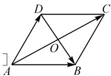
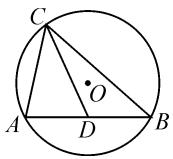
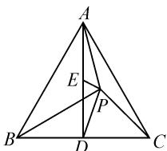
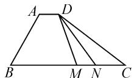
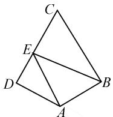

# 极化恒等式妙解向量数量积最值问题

# ● 哈尔滨师范大学 李思琦

# 1 极化恒等式

# 1.1 代数形式

极化恒等式的代数形式为

$$
\boldsymbol {a} \cdot \boldsymbol {b} = \frac {1}{4} \left[ (\boldsymbol {a} + \boldsymbol {b}) ^ {2} - (\boldsymbol {a} - \boldsymbol {b}) ^ {2} \right].
$$

推导过程：

$$
(a + b) ^ {2} = a ^ {2} + 2 a \cdot b + b ^ {2}, \tag {①}
$$

$$
(a - b) ^ {2} = a ^ {2} - 2 a \cdot b + b ^ {2}, \tag {②}
$$

①-②，得 $(a+b)^{2}-(a-b)^{2}=4a\cdot b.$

即 $a \cdot b = \frac{1}{4}[(a + b)^{2} - (a - b)^{2}]$ 就是极化恒等式.

# 1.2 几何意义

如图1，在平行四边形ABCD中，设 $\overrightarrow{AB} = a$ ， $\overrightarrow{AD} = b$ ，则

$$
\boldsymbol {a} \cdot \boldsymbol {b} = \frac {1}{4} [ (\boldsymbol {a} + \boldsymbol {b}) ^ {2} - (\boldsymbol {a} - \boldsymbol {b}) ^ {2} ]
$$

$$
= \frac {1}{4} (\overrightarrow {A C ^ {2}} - \overrightarrow {D B ^ {2}})
$$

$$
= \frac {1}{4} \left[ (2 \overrightarrow {A O}) ^ {2} - (2 \overrightarrow {O B}) ^ {2} \right]
$$

$$
= A O ^ {2} - O B ^ {2}.
$$

  
图1

这样,我们就可以把一组不共线的向量数量积问题转化为以这两个向量为邻边的平行四边形两条对角线平方差的四分之一;在三角形中,可以将其转化为三角形中线长与底边长一半的平方差.

# 2 极化恒等式的应用

例 1 已知点 A, B, C 均在半径为 $\sqrt{2}$ 的圆上，若 $|AB| = 2$ ，则 $\overrightarrow{AC} \cdot \overrightarrow{BC}$ 的最大值为（）.

$$
\mathrm{A.} 3 + 2 \sqrt {2}
$$

$$
\mathrm{B.} 2 + 2 \sqrt {2}
$$

$$
\mathrm{C.4}
$$

$$
\mathrm{D.} \sqrt {2}
$$

解法一:坐标法.

设 A, B, C 在以原点 O 为圆心，半径为 $\sqrt{2}$ 的圆上。由题易知 $OA \perp OB$ ，以 OB, OA 为 x 轴与 y 轴建立平面直角坐标系，则 $A(0, \sqrt{2})$ , $B(\sqrt{2}, 0)$ 。设 $C(\sqrt{2} \cos \theta, \sqrt{2} \sin \theta)$ ，则 $\overrightarrow{AC} \cdot \overrightarrow{BC} = (\sqrt{2} \cos \theta, \sqrt{2} \sin \theta - \sqrt{2}) \cdot (\sqrt{2} \cos \theta - \sqrt{2}, \sqrt{2} \sin \theta) = 2 - 2\sqrt{2} \sin \left(\theta + \frac{\pi}{4}\right)$ 。当

$\sin\left(\theta+\frac{\pi}{4}\right)=-1$ 时， $\overrightarrow{AC}\cdot\overrightarrow{BC}$ 取得最大值 $2+2\sqrt{2}$ .

故选：B.

解法二: 极化恒等式法.

如图 2, $\left|AB\right|=2$ , C 为圆 O 上一点, 取 AB 中点 D, 连接 CD, 所以 $\overrightarrow{AC} \cdot \overrightarrow{BC} = \overrightarrow{CA} \cdot \overrightarrow{CB} = CD^{2} - DB^{2} = CD^{2} - 1$ .

  
图2

当 $CD \perp AB$ 时， $CD = \sqrt{2} + OD$ .

而 $OD = \sqrt{OA^{2} - AD^{2}} = 1$ ，则 $CD_{\max} = \sqrt{2} + 1$ .

故 $\overrightarrow{AC}\cdot\overrightarrow{BC}$ 的最大值为 $2+2\sqrt{2}$ .

评析:根据向量的坐标运算将向量数量积的最值问题转化为三角函数的最值问题,运算量较大.本题可先将问题转化为同起点两向量的数量积求最值,化动为定,落点于初中几何问题,大大减少运算量.

例 2 （2017·新课标Ⅱ卷）已知△ABC 是边长为 2 的等边三角形，P 为平面 ABC 内一点，则 $\overrightarrow{PA} \cdot (\overrightarrow{PB} + \overrightarrow{PC})$ 的最小值为 \_\_\_\_.

解法一:坐标法.

以等边三角形 ABC 的底边 BC 所在直线为 x 轴，以 BC 的垂直平分线为 y 轴，建立平面直角坐标系，则 $A(0, \sqrt{3})$ , $B(-1, 0)$ , $C(1, 0)$ . 设 $P(x, y)$ ，则 $\overrightarrow{PA} = (-x, \sqrt{3} - y)$ , $\overrightarrow{PB} = (-1 - x, -y)$ , $\overrightarrow{PC} = (1 - x, -y)$ ，于是 $\overrightarrow{PB} + \overrightarrow{PC} = (-2x, -2y)$ .

所以， $\overrightarrow{PA} \cdot (\overrightarrow{PB} + \overrightarrow{PC}) = 2x^2 + 2y(y - \sqrt{3}) = 2x^2 + 2\left(y - \frac{\sqrt{3}}{2}\right)^2 - \frac{3}{2}$ . 故当 $x = 0, y = \frac{\sqrt{3}}{2}$ 时， $\overrightarrow{PA} \cdot (\overrightarrow{PB} + \overrightarrow{PC})$ 取得最小值，且最小值为 $-\frac{3}{2}$ .

解法二: 极化恒等式法.

如图 3, 取 BC 中点 D, 连接 AD, 则 $AD = \sqrt{3}$ . 由平行四边形法则, 可知 $\overrightarrow{PB} + \overrightarrow{PC} = 2\overrightarrow{PD}$ , 则 $\overrightarrow{PA} \cdot (\overrightarrow{PB} + \overrightarrow{PC}) = 2\overrightarrow{PA} \cdot \overrightarrow{PD}$ .

在 $\triangle PAD$ 中,取AD中点E,
则 $AE=\frac{\sqrt{3}}{2}$ ，于是有 $2\overrightarrow{PA}\cdot\overrightarrow{PD}=$

text_image

Geometric diagram of triangle ABC with internal points D, E, P and connecting lines forming smaller triangles

图3

$2(PE^{2}-AE^{2})=2\left(PE^{2}-\frac{3}{4}\right)$ . 由于 P 是平面 ABC 内一点，当点 P 与 E 重合，即 PE=0 时， $2\overrightarrow{PA}\cdot\overrightarrow{PD}$ 取最小值，且最小值为 $-\frac{3}{2}$ .

评析:三角形与向量的综合题属于高考经典题,解决此类问题的通法是坐标法,直接、易想,但有时计算量较大.本题用坐标法实现向量与代数的转化,最终将问题转化为求二元二次函数的最值问题.而利用极化恒等式可以完美地把它转化为简单的几何问题.

例 3 （2020·天津卷）如图 4，在四边形 ABCD 中， $\angle B = 60^{\circ}$ ，AB = 3，BC = 6，且 $\overrightarrow{AD} = \lambda \overrightarrow{BC}$ ， $\overrightarrow{AD} \cdot \overrightarrow{AB} = -\frac{3}{2}$ ，则实数$\lambda$ 的值为 \_\_\_\_；若 $M, N$ 是线段 $BC$ 上的动点，且 $|\overrightarrow{MN}| = 1$ ，则 $\overrightarrow{DM} \cdot \overrightarrow{DN}$ 的最小值为 \_\_\_\_。

  
图4

第一空,由基底法易得 $\lambda=\frac{1}{6}$ . 第二空在此给出两种方法的详解.

解法一: 基底法.

$$
\begin{array}{r l} & {\text {设} \mid \overrightarrow {B M} \mid = x, \text {又} \overrightarrow {A D} = \frac {1}{6} \overrightarrow {B C}, \text {则} \overrightarrow {D M} \bullet \overrightarrow {D N} =} \\ & {(\overrightarrow {D A} + \overrightarrow {A B} + \overrightarrow {B M}) \bullet (\overrightarrow {D A} + \overrightarrow {A B} + \overrightarrow {B N}) = \overrightarrow {A M ^ {2}} + \overrightarrow {A B} \bullet} \\ & {\overrightarrow {D A} + \overrightarrow {B M} \bullet \overrightarrow {D A} = x ^ {2} - 4 x + \frac {2 1}{2} = (x - 2) ^ {2} + \frac {1 3}{2} \geqslant \frac {1 3}{2}.} \end{array}
$$

所以当 x=2 时， $\overrightarrow{DM}\cdot\overrightarrow{DN}$ 取最小值 $\frac{13}{2}$ .

解法二: 极化恒等式法.

取 $MN$ 中点 $O$ , 因为 $|\overrightarrow{MN}| = 1$ , 所以 $ON = \frac{1}{2}$ . 在 $\triangle DMN$ 中, $\overrightarrow{DM} \cdot \overrightarrow{DN} = DO^2 - ON^2$ . 因为 $D$ 为定点, 点 $O$ 随 $MN$ 在线段 $BC$ 上移动, 所以 $DO \perp BC$ 时, $DO$ 取最小值, 即为梯形的高. 由平面几何知识易求得梯形的高为 $\frac{3\sqrt{3}}{2}$ , 即 $|DO|_{\min} = \frac{3\sqrt{3}}{2}$ , 所以 $\overrightarrow{DM} \cdot \overrightarrow{DN}$ 的最小值为 $\left(\frac{3\sqrt{3}}{2}\right)^{2}-\frac{1}{4}=\frac{13}{2}.$

例 4 （2018·天津）如图 5，在平面四边形 ABCD 中， $AB \perp BC$ ， $AD \perp CD$ ， $\angle BAD = 120^{\circ}$ ， $AB = AD = 1$ 。若 E 为边 CD 上的动点，则 $\overrightarrow{AE} \cdot \overrightarrow{BE}$ 的最小值为（）。

  
图5

A. $\frac{21}{16}$

B. $\frac{3}{2}$

C. $\frac{25}{16}$

D.3

解法一: 基底法.

连接 BD，由题可知 $\triangle ABD$ 为等腰三角形。又 $AB \perp BC, AD \perp CD, \angle BAD = 120^{\circ}$ ，易证 $\triangle BCD$ 为等边三角形，且 $BD = \sqrt{3}$ 。

设 $\overrightarrow{DE} = t\overrightarrow{DC}$ （ $0\leqslant t\leqslant 1$ )，则 $\overrightarrow{AE}\cdot \overrightarrow{BE} = (\overrightarrow{AD} +$ $\overrightarrow{DE})\cdot (\overrightarrow{BD} +\overrightarrow{DE}) = \overrightarrow{AD}\cdot \overrightarrow{BD} +\overrightarrow{DE}\cdot (\overrightarrow{AD} +\overrightarrow{BD})+$ $\overrightarrow{DE}^2 = \frac{3}{2} +\overrightarrow{BD}\cdot \overrightarrow{DE} +\overrightarrow{DE}^2 = 3t^2 -\frac{3}{2} t + \frac{3}{2} =$ $3\left(t - \frac{1}{4}\right)^2 +\frac{21}{16}.$

又 $0 \leqslant t \leqslant 1$ ，所以当 $t = \frac{1}{4}$ 时，上式取最小值 $\frac{21}{16}$ .

解法二: 极化恒等式法.

取 AB 中点 F，连接 EF，因为 AB=1，所以 $FB=\frac{1}{2}$ . 在 $\triangle EAB$ 中， $\overrightarrow{AE} \cdot \overrightarrow{BE} = \overrightarrow{EA} \cdot \overrightarrow{EB} = EF^{2} - FB^{2} = EF^{2} - \frac{1}{4}$ .

因为 F 为定点, E 为边 CD 上的动点, 所以 EF 的最小值为过点 F 作 CD 的垂线段 FG 的长.

过点 B 作 $BH \perp CD$ 于点 H，在直角梯形 ADHB 中， $\angle BAD = 120^{\circ}$ ，由平面解析几何知识，易得直角梯形 ADHB 的中位线 $FG = \frac{5}{4}$ 。所以 $\overrightarrow{AE} \cdot \overrightarrow{BE}$ 的最小值为 $\left(\frac{5}{4}\right)^{2} - \frac{1}{4} = \frac{25}{16} - \frac{1}{4} = \frac{21}{16}$ 。

评析:例 3 和例 4 分别为高考试卷中填空题和选择题的压轴题,难度较大.对于数量积的最值问题,多数人在解题时会选择利用坐标法或者基底法分解向量,二者本质上都是将问题转化成函数求最值,过程繁冗且计算量较大,容易出错.

例 3、例 4 的解法对比,充分体现了极化恒等式在解决平面向量数量积最值问题的精妙之处,在一些题目复杂难解、计算量大的情况下,有化繁为简、出奇制胜的作用.

坐标法和基底法作为解决向量数量积最值问题的常规方法虽然易想，但有时过于循规蹈矩导致运算复杂，解题效率不高。而极化恒等式是解决同起点向量数量积问题的强有力手段，完美展现向量与几何之间的转换，快速简化问题。这充分体现了小题小做、小题巧做的思想，为读者提供一种新的解题思路。

解题之道,贵在审时度势,因题择宜.在实际求解向量数量积最值问题时,要根据题目条件和问题表征,从数与形两个角度分析问题,选择行之有效的解题方法和策略.Z