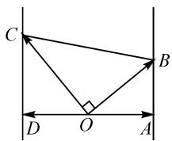

# 构造与解题齐飞,技能共素养一色

# 安徽省淮南市第二十一中学 杨丹旸

摘要:联想是数学思维的翅膀,构造是数学解题的利器.数学作为具有创造性的学科,自身蕴含着丰富的美,而构造法就是其中创新性美的一个典型.借助实际数学解题与应用,合理联想,巧妙构造数学模型来解决问题,提升学生解题技能与数学素养,指导数学教学与解题研究.

关键词: 构造; 解题; 技巧; 素养; 创新

构造法是数学学科中一个非常特殊且优美的解题方法,具有悠久的历史.一些著名的数学家,如欧几里得、欧拉、高斯等人,都有成功借助构造法解决一些数学难题的记载与传说.特别地,随着新高考改革的逐步推进与深入,利用构造法解决数学问题也成为一个创新点与亮点,在高考数学命题、自主招生以及数学竞赛等中都有着非常重要的地位,倍受各方关注.

# 1 构造函数妙解题

例 1 [2023 届鄂东南省级示范教育教学改革联盟学校高三(上)期中数学试卷]已知 a=e-2, b=1-ln 2, c=e^c-e^2, 则().

A. $c > b > a$

B. $a > b > c$

C.a>c>b

D. $c > a > b$

分析:根据题设条件,以三个代数式的大小比较为具体情境,通过分析代数式的结构特征,寻觅函数与不等式之间的结构特点与共性,进而巧妙构造与之相关的函数模型,结合函数的单调性及不等式的基本性质来分析与判断.

解析: 构造函数 $f(x)=\mathrm{e}^{x}-x, x>0$ ，则 $f'(x)=\mathrm{e}^{x}-1>0$ ，于是函数 $f(x)$ 在 $(0,+\infty)$ 上单调递增.

所以 $f(\mathrm{e}) > f(2)$ ，即 $\mathrm{e}^{\mathrm{e}} - \mathrm{e} > \mathrm{e}^{2} - 2$ ，亦即 $\mathrm{e}^{\mathrm{e}} - \mathrm{e}^{2} > \mathrm{e} - 2$ ，故 $c > a$ 。

又 $f(1) > f(\ln 2)$ ，即 $\mathrm{e}^1 - 1 > \mathrm{e}^{\ln 2} - \ln 2$ ，亦即 $\mathrm{e} - 1 > 2 - \ln 2$ ，于是 $\mathrm{e} - 2 > 1 - \ln 2$ ，故 $a > b$ .

综上分析,可得 c > a > b.

故选择答案:D.

点评: 遇上指数、对数、幂函数等值的大小比较时,关键是寻找常数和指数、真数等的关系后,合理通过构造函数的方法来分析与解决问题,成为判定代数式的大小关系中比较常用的一种技巧方法,频繁在解题过程中得以巧妙应用,学生应熟练掌握.寻找代数式的关系,合理构造对应的函数,结合导数法以及函数的单调性加以转化与应用.

# 2 构造方程妙解题

例 2 （2023 年北京大学优秀中学生寒假学堂数学测试）设 $x, y \in \left(0, \frac{\pi}{2}\right)$ ，则 $\frac{1}{\cos^{2}x} + \frac{1}{\sin^{2}x \sin^{2}y \cos^{2}y}$ 的最小值为（）.

A.8

B.9

C.10

D. 其他三个选项均不对

分析:根据题设条件,结合三角代数式的变形与转化,通过放缩消参后,合理进行整体换元处理构造相应的方程.结合常数 $1=\sin^{2}x+\cos^{2}x$ 这一基本关系式进行消元处理,转化为相关的二次方程问题,借助判别式法巧妙构建对应的不等式,利用不等式的求解来确定相应的最值问题.

解析：由已知，得 $\frac{1}{\cos^2x} +\frac{1}{\sin^2x\sin^2y\cos^2y} =$ $\frac{1}{\cos^2x} +\frac{4}{\sin^2x\sin^22y}\geqslant \frac{1}{\cos^2x} +\frac{4}{\sin^2x}.$

令 $t = \frac{1}{\cos^2 x} + \frac{4}{\sin^2 x} > 1$ ，则有 $t = \frac{1}{1 - \sin^2 x} + \frac{4}{\sin^2 x}$ ，整理可得 $t \sin^4 x - (t + 3) \sin^2 x + 4 = 0$ .

依题知，以上关于 $\sin^{2}x$ 的二次方程有实根，则利用判别式 $\Delta=(t+3)^{2}-16t\geqslant0$ ，整理得 $t^{2}-10t+9\geqslant0$ ，解得 $t\geqslant9$ ，或 $t\leqslant1$ （舍去）.

所以 $\frac{1}{\cos^2x} + \frac{1}{\sin^2x\sin^2y\cos^2y}$ 的最小值为9，当且仅当 $\sin^2 2y = 1, \sin^2 x = \frac{2}{3}$ ，即 $y = \frac{\pi}{4}, \sin x = \frac{\sqrt{6}}{3}$ 时，等号成立.

故选择答案:B.

点评:合理联系三角关系式,巧妙放缩,结合换元处理以及方程的构造,利用判别式法将其转化为对应的不等式问题,实现问题的转化与应用.方程的构造对于解决参数值的求解与取值范围的确定,以及代数式的取值范围(或最值)等有奇效,借助方程的求根以及判别式等来综合应用.

# 3 构造数列妙解题

例 3 （2023 届苏锡常镇四市高三教学情况调研数学试卷）已知数列 $\{a_{n}\}$ 的前 n 项和为 $S_{n}, a_{1}=1$ ，若对任意正整数 n， $S_{n+1}=-3a_{n+1}+a_{n}+3, S_{n}+a_{n}>(-1)^{n}a$ ，则实数 a 的取值范围是（）.

A. $\left(-1,\frac{3}{2}\right)$

B. $\left(-1,\frac{5}{2}\right)$

C. $\left(-2,\frac{5}{2}\right)$

D. $(-2,3)$

分析:根据题设条件,结合条件中数列递推关系式的结构特征,整体化处理与思维切入,进而巧妙构造新数列,利用新数列的基本知识来分析与解决,进而综合题设中的数列不等式的应用来转化,得以巧妙解决参数的取值范围问题.

解析: 构造数列 $\{b_{n}\}$ ，使得 $b_{n}=S_{n}+a_{n}$ ，则 $b_{n+1}=S_{n+1}+a_{n+1}$ .

结合 $S_{n+1}=-3a_{n+1}+a_{n}+3$ ，可得

$$
S _ {n + 1} = - 2 a _ {n + 1} - \left(S _ {n + 1} - S _ {n}\right) + a _ {n} + 3.
$$

整理，可得 $2(S_{n + 1} + a_{n + 1}) = (S_n + a_n) + 3$ ，即 $2b_{n + 1} = b_n + 3$ ，亦即 $2(b_{n + 1} - 3) = b_n - 3.$

所以数列 $\{b_{n} - 3\}$ 是首项为 $b_{1} - 3 = S_{1} + a_{1} - 3 = -1$ ，公比为 $\frac{1}{2}$ 的等比数列.

于是可得 $b_{n} - 3 = -\frac{1}{2^{n - 1}}$ ，整理有 $b_{n} = 3 - \frac{1}{2^{n - 1}}$

而由 $b_{n} > (-1)^{n}a$ ，可知对任意正整数 $k$ ，都有 $-b_{2k - 1} <   a <   b_{2k}$ ，则 $-b_{1} <   a <   b_{2}$ ，即 $-2 <   a <   \frac{5}{2}$ 所以实数 $a$ 的取值范围是 $\left(-2,\frac{5}{2}\right)$

故选择答案:C.

点评:在处理一些复杂的数列问题时,巧妙构造新数列来分析,让人耳目一新,成为解决问题的一种“巧技妙法”.这里要依据问题中数列递推关系式的结构特征来构造新数列,进而合理变形与转化,实现问题的化归,结合数列的基础知识与相关公式合理构造,优化解题,提升效益.

# 4 构造图形妙解题

例 4 [福建省泉州市 2023 届高中毕业班质量监测(三)数学试卷(2023 年 3 月)·8]已知平面向量 a, b, c 满足 $\left|a\right|=1, b \cdot c=0, a \cdot b=1, a \cdot c=-1$ ，则 $\left|b+c\right|$ 的最小值为（）.

A.1

B. $\sqrt{2}$

C.2

D.4

分析:根据题设条件,结合平面向量的几何内涵或对应的几何意义,从“形”的视角切入,通过构造平面几何图形,利用数形结合来加以直观想象,从几何特征层面来研究对应的问题.

text_image

C
B
D O A

图1

解析: 设向量 $a = \overrightarrow{OA}$ , $b = \overrightarrow{OB}$ , $c = \overrightarrow{OC}$ , $\overrightarrow{OD} = -\overrightarrow{OA}$ .

由 $a \cdot b = 1, a \cdot c = -1, b \cdot c = 0$ ，结合平面向量数量积的几何意义，可得 $AB \perp OA, DC \perp DO, OB \perp OC$ ，如图 1 所示.

由 $\left|b+c\right|=\left|b-c\right|=\left|\overrightarrow{OB}-\overrightarrow{OC}\right|=\left|\overrightarrow{CB}\right|$ ，结合图形直观，可知 $\left|\overrightarrow{CB}\right|$ 为夹在两平行直线 AB 与 CD 间的线段长.

所以当 $BC \perp AB$ 时， $|\overrightarrow{CB}|$ 取到最小值 2，即 $|b + c|$ 的最小值为 2.

故选择答案:C.

点评:本题合理构造平面几何图形,结合平面向量数量积的几何意义,从射影、垂直等视角来直观处理,利用图形直观,结合“动”态变化规律来解决“静”态的最值问题.构造平面几何图形往往可以解决平面向量、三角函数、解三角形等相关问题,构造平面解析几何图形往往可以解决直线与圆、圆锥曲线等相关问题,构造立体几何图形往往可以解决空间几何体等应用问题.

在实际解决数学问题时,利用构造法巧妙解题与应用没有固定的模式与程序,往往可以从“数”的视角构造函数、方程、数列等代数模型,也可以从“形”的视角构造向量、图形等几何模型,不可生搬硬套.

具体解题时,关键是结合题设条件与所求结论之间的联系,合理构建相应的链接.合理通过数学模型的构造来产生联系,进而构建起“已知”与“所求(所证)”之间的“桥梁”,从而使得问题的解决另辟蹊径,问题的处理水到渠成,在一定程度上有效提升数学能力,强化数学解题技能,培养数学核心素养.Z