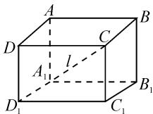
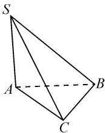
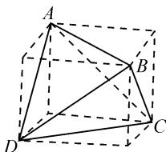
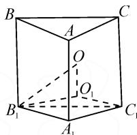
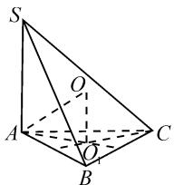

# 求简单多面体外接球的两妙招

# ● 陕西省西安市田家炳中学 田向红

摘要: 在高三复习备考中,有很多求简单多面体外接球表面积、体积的问题,这类题最终的落脚点就是求外接球的半径,本文中结合历年高考试题,重点介绍常用的补形法和交轨法两种妙招.

关键词：补形法；交轨法；多面体的外接球；立体几何

简单多面体外接球问题是高考中的重点和难点问题,近年来在高考考查中呈上升的趋势,涉及到的题型主要是求多面体外接球的表面积、体积以及球心到指定截面的距离等问题.

# 1 考情分析,明析方向

表 1 考情分析

<table><tr><td>高考试题</td><td>考查内容</td><td>题型</td><td>分值</td></tr><tr><td>2023 全国乙卷文 16</td><td>三棱锥的外接球</td><td>填空题</td><td>5</td></tr><tr><td>2022 年新高考I 卷 8</td><td>正四棱锥的外接球</td><td>选择题</td><td>5</td></tr><tr><td>2022 年新高考II 卷 7</td><td>正三棱台的外接球</td><td>选择题</td><td>5</td></tr><tr><td>2021 全国甲卷理 11</td><td>三棱锥的外接球</td><td>选择题</td><td>5</td></tr><tr><td>2020 全国卷I理 10,文 22</td><td>三棱锥的外接球</td><td>选择题</td><td>5</td></tr><tr><td>2020 全国卷II理 10,文 11</td><td>三棱锥的外接球</td><td>选择题</td><td>5</td></tr><tr><td>2019 全国卷I理 12</td><td>三棱锥的外接球</td><td>选择题</td><td>5</td></tr><tr><td>2018 全国卷III理 10,文 12</td><td>三棱锥的外接球</td><td>选择题</td><td>5</td></tr><tr><td>2017 全国卷I文 16</td><td>三棱锥的外接球</td><td>填空题</td><td>5</td></tr><tr><td>2017 全国卷III理 8,文 9</td><td>三棱锥的外接球</td><td>选择题</td><td>5</td></tr><tr><td>2016 全国卷III文 4</td><td>三棱锥的外接球</td><td>选择题</td><td>5</td></tr></table>

通过表 1 对 2016－2023 年全国卷高考试题进行分析, 发现关于棱锥(台)的外接球问题基本上每年都

会出现,题型集中在选择题、填空题.试题有一定的综合性,高考命题的角度主要有:求三棱锥(台)外接球的体积、表面积以及球心到某个截面的距离等问题.解决此类问题的实质是通过化归与转化思想,最终转化为求外接球半径R.这类题能有效培养学生的空间想象能力、逻辑推理能力和数学思维品质,更好地加强学生直观想象、数学建模、数学运算等数学核心素养的落实.

# 2 妙招展示,解类旁通

下面给出求简单多面体外接球的两个妙招.

妙招一:找支架

所谓找支架,就是把所给几何体补形为一些比较容易求出外接球半径的几何体.该方法也叫补形法,适用的几何体主要有正方体、正四面体、长方体、墙角型三棱锥(三条侧棱两两互相垂直).求解此类题的要点是,正方体和长方体的体对角线为其外接球的直径.

引例 已知长、宽、高分别为 3,4,5 的长方体 $ABCD-A_{1}B_{1}C_{1}D_{1}$ 的顶点都在同一球面上，求该球的表面积.

解析:如图1,设该长方体的体对角线长为l,外接球的半径为R,则l=2R,则 $l^{2}=3^{2}+4^{2}+5^{2}=50=4R^{2}$ .

  
图1

故球的表面积 $S_{球}=4\pi R^{2}=50\pi$ .

例 1 （2010 辽宁文数改编）《九章算术》中，将底面为长方形且有一条侧棱与底面垂直的四棱锥称之

为阳马,将四个面都为直角三角形的四面体称之为鳖臑.如图2,已知三棱锥S-ABC是一个鳖臑, $SA\perp$ 平面 $ABC,AB\perp BC,SA=AB=1,BC=\sqrt{2}$ ,求该三棱锥外接球O的表面积.

natural_image

Geometric diagram of a tetrahedron with vertices labeled S, A, B, C (no text or symbols beyond labels)

图2

解析: 将三棱锥 S-ABC 补形为

长方体，其长、宽、高分别为 $\sqrt{2}, 1, 1$ . 设其外接球的半

径为 R，则 R=1，所以球的表面积为 $4\pi$ .

点评:该题既考查了多面体外接球半径的求法,又很好地渗透了数学文化知识,可谓一举两得.

例 2 已知三棱锥 A-BCD 中, $AC = BD = \sqrt{13}$ , $AD = BC = 5$ , $AB = CD = 2\sqrt{5}$ , 求该三棱锥外接球的半径.

解析:由于给出的三棱锥满足对棱相等,因此可将该三棱锥补形成为长方体,则只需要计算长方体的体对角线长即可.

如图 3 所示, 设该长方体的长、宽、高依次为 a, b, c, 其外接球的半径为 R, 则

$$
\left\{ \begin{array}{l} a ^ {2} + b ^ {2} = 2 0, \\ b ^ {2} + c ^ {2} = 2 5, \\ a ^ {2} + c ^ {2} = 1 3. \end{array} \right.
$$

natural_image

Geometric diagram of a tetrahedron with vertices labeled A, B, C, D and solid/dashed edges indicating visible and hidden edges (no text or symbols)

图3

整理，得 $a^2 + b^2 + c^2 = 29$ .

所以 $(2R)^{2}=29$ ，得 $R=\frac{\sqrt{29}}{2}$ .

点评:这道题如果放到新课中学习,相信会难倒一大片学生,但放到高三复习备考,学生有了一定的知识积淀,很多学生会联想到补形法,问题便可迎刃而解.

# 妙招二:交轨法

交轨法:简单多面体外接球的球心是过各截面外接圆圆心,并且与各截面垂直的直线的交点.使用交轨法,先定截面圆圆心,再定球心,利用球的半径、截面圆的半径及球心到截面圆圆心的距离,构造直角三角形求解.

特别要注意的是：

(1)对于直棱柱或侧棱垂直于底面的锥体,找出底面多边形外接圆的圆心 $O_{1}$ ,其球心O在过点 $O_{1}$ 垂直于底面的直线上,且 $OO_{1}$ 的长度为侧棱长的一半.  
(2)若棱锥的顶点构成共斜边的直角三角形,则斜边的中点就是球心.

例 3 直三棱柱 $ABC-A_{1}B_{1}C_{1}$ 的各顶点都在同一球面上，若 $AB = AC = AA_{1} = 2, \angle BAC = 120^{\circ}$ ，求此球的表面积.

解析: 如图 4, 设 $\triangle A_{1}B_{1}C_{1}$ 的外接圆半径为 r, 圆心 $O_{1}$ 直三棱柱 $ABC-A_{1}B_{1}C_{1}$ 的外接球半径为 R, 球心为 O.

text_image

B
A
C
O
O₁
B₁
A₁
C₁

图4

由正弦定理, 得 $\frac{B_{1}C_{1}}{\sin120^{\circ}}=2r.$ 又易知 $B_{1}C_{1}=2\sqrt{3}$ ，则 r=2。

所以 $R^{2}=B_{1}O_{1}^{2}+OO_{1}^{2}=5.$

故外接球的表面积 $S_{球}=4\pi R^{2}=20\pi$ .

点评:此题用交轨法确定球心,思路流畅,运算简洁,很好地渗透了直观想象、数学运算等核心素养.

例 4 （2023 年全国乙卷文 16）已知点 S, A, B, C 均在半径为 2 的球面上， $\triangle ABC$ 是边长为 3 的等边三角形， $SA \perp$ 平面 ABC，则 SA = \_\_\_\_.

解析:如图5,取 $\triangle ABC$ 外接圆的圆心 $O_{1}$ ,球心为O,连接 $OO_{1}$ ,则 $O_{1}O\perp 圆O_{1}$ .设三棱锥的高SA=h,则 $O_{1}O=\frac{1}{2}h$ .设 $\triangle ABC$ 外接圆的半径为r.

text_image

S
O
A
O
B
C

图 5

由正弦定理，得 $\frac{3}{\sin 60^\circ} = 2r$ ，即 $r = \sqrt{3}$

在 Rt△AOO $_{1}$ 中，OO $_{1}^{2}$ =AO $^{2}$ -AO $_{1}^{2}$ =4-3=1，故 SA=2.

点评:解决此题的核心是明确 $OO_{1} \perp$ 圆 $O_{1}$ ，因为球心是过各截面外接圆圆心，并且与各截面垂直的直线的交点 $^{[1]}$ .

# 3 变式拓展,融会贯通

(1)一个四面体的所有棱长都为 $\sqrt{2}$ ，四个顶点在同一球面上，则此球的表面积为().

A. $3\pi$

B. $4\pi$

C. $3\sqrt{3}\pi$

D. $6\pi$

(2)(2021·四川南充市三模·理)在三棱锥P-ABC中， $PA \perp$ 平面ABC，若 $\angle BAC = 60^{\circ}$ ， $BC = \sqrt{3}$ ，PA=2，则此三棱锥外接球的体积为（）.

A. $8\pi$

B. $4\sqrt{3}\pi$

C. $\frac{4\sqrt{2}}{3}\pi$

D. $\frac{8\sqrt{2}}{3}\pi$

# 4 总结提升,精准备考

对于简单多面体的外接球问题,如墙角型、正四面体、对棱相等的三棱锥将其直接补形为长方体,然后利用长方体的体对角线长为外接球的直径,再用体对角线长公式 $2R=l=\sqrt{a^{2}+b^{2}+c^{2}}$ 进行求解.

对于截面是一般三角形的问题,先利用正弦定理

$$
\frac {a}{\sin A} = \frac {b}{\sin B} = \frac {c}{\sin C} = 2 r
$$

求出外接圆的半径 r，再确定球心及球心到截面的距离，构成直角三角形，则外接球的半径 $R = \sqrt{r^{2} + d^{2}}$ .

对于简单多面体的外接球问题, 只要掌握上述两个妙招, 有关外接球的问题便可迎刃而解.

# 参考文献：

[1]林云.衡中学案·高考一轮总复习·数学·理科[M].北京:中国和平出版社,2022:151.Z