# 2023 年数学新高考Ⅰ卷第 12 题的探究

# 河北省三河市第一中学 田育杰

高考是学生人生中的第一次大考,关乎着人生的走向,所以高考试题的变化牵动着亿万学生及家长的心.2023年数学新高考Ⅰ卷的第12题对正方体、球、棱锥、圆柱进行了综合考查.其中D选项难度较大,而且在网上给出的答案中,对D选项的说明是:圆柱高度可以忽略不计.这种解释在以往的解答中没有遇到过,它给课堂教学提出了新的问题.其实利用图形软件和高中数学知识,还是可以通过计算解决问题的.

# 1 试题呈现

(2023年数学新高考Ⅰ卷·第12题)(多选题)下列物体中,能够被整体放入棱长为1(单位:m)的正方体容器(容器壁厚度忽略不计)内的有().

A. 直径为 0.99 m 的球体  
B. 所有棱长均为 $1.4 \, m$ 的四面体  
C. 底面直径为 0.01 m, 高为 1.8 m 的圆柱体  
D. 底面直径为 1.2 m, 高为 0.01 m 的圆柱体

# 2 试题解析

对于 A 选项的考查非常简单,由于球的直径小于正方体的棱长,故球体可以放入正方体容器内,如图 1 所示.

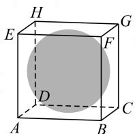  
图1

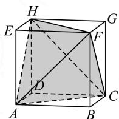  
图2

对于选项 B, 可以理解为从棱长为 1 m 的正方体中, 截出的最大正四面体(如图 2)的棱长为 $\sqrt{2}$ m, 大于 1.4 m, 故可以放进正方体容器内.

在 C 选项中, 圆柱的高度为 1.8 m, 而棱长为 1 m 的正方体的体对角线的长度为 $\sqrt{3}$ m, 由于 1.8 大于 $\sqrt{3}$ , 故选项 C 不正确.

对 D 选项的判断是本题的难点. 首先, 我们要解决的问题是, 直径为 1.2 m 的圆是否可以放进正方体内; 其次, 再解决圆柱的高度问题. 在正方体的所有截面中, 面积最大的是哪个? 其实这个问题在 2018 年的高考中已经出现过了.

(2018 全国Ⅰ卷·理科数学第 12 题)已知正方体的棱长为 1, 每条棱所在直线与平面 $\alpha$ 所成的角都相等, 则 $\alpha$ 截此正方体所得的截面面积的最大值为 ( ).

A. $\frac{3\sqrt{3}}{4}$

B. $\frac{2\sqrt{3}}{3}$

C. $\frac{3\sqrt{2}}{4}$

D. $\frac{\sqrt{3}}{2}$

分析:如图3,当截面过正方体中心,且与体对角线垂直的时候,截面面积最大,此时截面与正方体各个棱的交点M,L,K,J,I,N为所在边的中点,多边形MLKJIN为正六边形(如图4),边长为 $\frac{\sqrt{2}}{2}$ ,其面积可以利用六个边长为 $\frac{\sqrt{2}}{2}$ 的正三角形来计算,结果为 $\frac{3\sqrt{3}}{4}$ ,故选择A选项.

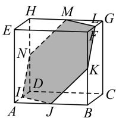  
图3

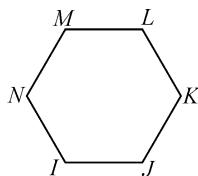  
图4

结合对 2018 年高考试题的分析, 网上给出了对于本题 D 选项的解答:

由于圆柱的高为 0.01 m，比较小，可以忽略不计，因此只要考虑直径为 1.2 m 的圆是否可以放入正方体内即可，也就是正六边形 MLKJIN 的内切圆（如图 5）直径是否大于 1.2 m.

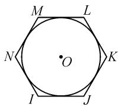  
图5

易得内切圆圆心 O 到边 IJ 的距离为 $\frac{\sqrt{6}}{4}$ .

同理, 圆心 O 到边 ML 的距离也为 $\frac{\sqrt{6}}{4}$ , 则正六边形内切圆的直径为 $\frac{\sqrt{6}}{2}$ .

因为 $\frac{\sqrt{6}}{2} = \sqrt{1.5} > 1.2 = \sqrt{1.44}$ ，所以直径为 $1.2\mathrm{m}$ 的圆可以放入正六边形MLKJIN中。由于圆柱的高度忽略不计，因此可得，圆柱可以放入正方体内。

圆柱的高度忽略不计这种情况在平时没有遇到过,学生很难想到,即使在看到答案后,也不是完全接受这种作答方法.那么,是否能够计算出正方体内部可以放入底面直径为1.2 m的圆柱的最大高度呢?

首先,我们要了解用过正方体体对角线上一点,且与体对角线垂直的平面去截正方体,截面有哪些形状?

截面形状如图 6、图 7、图 8 所示, 分别为正三角形、一般六边形、正六边形.

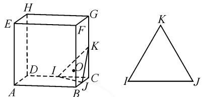

text_image

Geometric diagram showing a cube with labeled vertices and an adjacent triangle with internal points and lines.

图6 正三角形

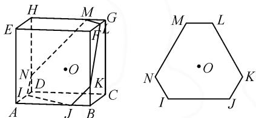

text_image

Geometric diagram showing a cube with labeled vertices and an adjacent hexagon with internal points marked.

图 7 六边形

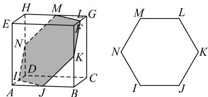

text_image

Geometric diagram showing a cube with labeled vertices and a hexagon with internal points, including shaded regions.

图8 正六边形

当截面为正三角形时,如图9,截面为 $\triangle BDG$ 时面积最大,其内切圆直径为 $\frac{\sqrt{6}}{3}$ (小于1.2),并且其最大高度为平面BDG与平面AHF间的距离即为 $\frac{\sqrt{3}}{3}$ ,故不符合题意.

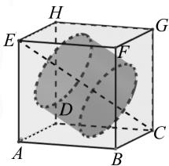

text_image

Geometric diagram of a cube with labeled vertices and internal shaded region, used for spatial geometry problems.

图 9

当截面为一般六边形时,由正方体的对称性可知,其内部的圆只能与 IJ,LK,MN 三边相切或是与另外的三边相切,如图 10 所示,则圆心 $O_{1}$ 到正方体中心 O 的距离即为圆柱高度的一半.

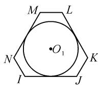  
图10

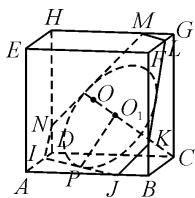  
图 11

如图 11, 设 AC 与 IJ 的交点为 P, 在 $\triangle PCO_{1}$ 中, $PO_{1} = \frac{1.2}{2} = 0.6$ , $\tan \angle PCO_{1} = \frac{\sqrt{2}}{2}$ (可以利用三角形 ACE 求解此角正切值), 则

$$
O _ {1} C = \frac {P O _ {1}}{\frac {\sqrt {2}}{2}} = \frac {3 \sqrt {2}}{5}.
$$

又因为 $OC = \frac{\sqrt{3}}{2}$ 所以 $OO_{1} = \frac{\sqrt{3}}{2} -\frac{3\sqrt{2}}{5}$ 则圆柱的高最大为 $2\left(\frac{\sqrt{3}}{2} -\frac{3\sqrt{2}}{5}\right)\approx 0.035 > 0.01$ ，故D选项满足题意.

当截面为正六边形时，点 $O_{1}$ 与 O 重合，则圆柱两个底面重合，圆柱高度为 0，圆柱不存在.

这种计算圆柱最大高度的方法,思路复杂,计算困难,而且要求学生有较强的空间想象能力,对学生平时的知识积累要求也很高,在考试中不一定是最好的选择.其实,学生可以根据自己的情况,分析适合自己的解题方法.比如一般的学生,应该很容易判定选项A正确,那么在高考这种时间紧迫、压力巨大的考试中,可以直接选择选项A,得两分,比不得分要好得多.有一定能力的学生可以很容易确定选项A,B正确,选项C错误,对于D选项不能判定的时候以得分为主,以免因错选而不得分.能力较强的学生可以仿照网上答案的思路,忽略圆柱的高度进行分析.

# 3 变式练习

半正多面体亦称“阿基米德多面体”，是由边数不全相同的正多边形为面围成的多面体，体现了数学的对称美。如图12，将棱长为2的正方体沿交于一顶点的三条棱的中点截去一个三棱锥，如此共可截去八个三棱锥，得到一个半正多面体，它们的棱长都相等，若该半正多面体可以在一个正四面体框架内任意转动，则该正四面体体积最小值为\_\_\_\_。

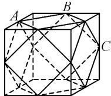  
图12

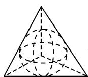  
图13

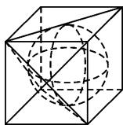  
图 14

分析:若“阿基米德多面体”可以在正四面体框架内任意转动,则此多面体的外接球与正四面体的六条棱均相切,如图13所示.又因为正四面体可由正方体截得,所以多面体的外接球即为正方体的内切球,如图14所示.由图12中可知半正多面体的外接球半径 $R=\sqrt{2}$ ,图13中正四面体的棱长为 $4\sqrt{3}$ ,则正四面体的体积 $V=\frac{1}{3}Sh=\frac{1}{3}\times\left(\frac{1}{2}\times4\sqrt{3}\times4\sqrt{3}\times\frac{\sqrt{3}}{2}\right)\times\left(4\sqrt{2}\right)=16\sqrt{6}$ .

此类题既考查了学生的基础知识,又考查了学生的逻辑推理、直观想象和数学运算等学科素养.试题在突出基础的同时,又彰显综合性要求和创新性要求,有助于推动高中课堂教学的优化与改革.Z