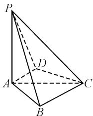
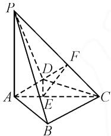
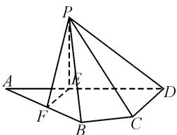

# 2024 年新高考卷立体几何解答题的分析及对作业命制的启示

安徽省蒙城县第二中学 阳纵天

# 1 真题及解析

真题 1 （2024 年新高考 I 卷第 17 题）如图 1，四棱锥 P-ABCD 中， $PA \perp$ 底面 ABCD， $PA = AC = 2, BC = 1, AB = \sqrt{3}$ .

(1) 若 $AD \perp PB$ ，证明： $AD \parallel$ 平面 PBC；  
(2) 若 $AD \perp DC$ ，且二面角 A-CP-D 的正弦值为 $\frac{\sqrt{42}}{7}$ ，求 AD.

(1)证明: 因为 $PA \perp$ 平面 ABCD，而 $AD \subset$ 平面 ABCD，所以 $PA \perp AD$ 。又 $AD \perp PB, PB \cap PA = P, PB, PA \subset$ 平面 PAB，所以 $AD \perp$ 平面 PAB。而 $AB \subset$ 平面 PAB，所以 $AD \perp AB$ 。因为 $BC^{2} + AB^{2} = AC^{2}$ ，所以 $BC \perp AB$ ，所以 $AD \parallel BC$ 。又 $AD \not\subset$ 平面 PBC， $BC \subset$ 平面 PBC，所以 $AD \parallel$ 平面 PBC。

(2) 解: 如图 2 所示, 过点 D 作 $DE \perp AC$ 于点 E, 再过点 E 作 $EF \perp CP$ 于 F, 连接 DF. 因为 $PA \perp$ 平面 ABCD, 所以平面 $PAC \perp$ 平面 ABCD, 而平面 $PAC \cap$ 平面 ABCD = AC, 所以 $DE \perp$ 平面 PAC. 又 $EF \perp CP$ , 所以 $CP \perp$ 平面 DEF, 根据二面角的定义可知， $\angle DFE$ 即为二面角 $A - CP - D$ 的平面角，即 $\sin \angle DFE = \frac{\sqrt{42}}{7}$ ，则 $\tan \angle DFE = \sqrt{6}$ .

text_image

P
D
A
B
C

图1

text_image

Geometric diagram of a triangular pyramid with labeled vertices and internal points, used for spatial geometry problems.

图2

因为 $AD \perp DC$ ，设 AD = x，所以 $CD = \sqrt{4 - x^{2}}$ ，由等面积法可得， $DE = \frac{x \sqrt{4 - x^{2}}}{2}$ 。又易得 $CE = \sqrt{(4 - x^{2}) - \frac{x^{2}(4 - x^{2})}{4}} = \frac{4 - x^{2}}{2}$ ，而 $\triangle EFC$ 为等腰直角三角形，可知 $EF = \frac{4 - x^{2}}{2\sqrt{2}}$ ，所以 $\tan \angle DFE = \frac{x \sqrt{4 - x^{2}}}{\frac{2}{\frac{4 - x^{2}}{2\sqrt{2}}}} = \sqrt{6}$ ，解得 $x = \sqrt{3}$ ，即 $AD = \sqrt{3}$ 。

真题 2 （2024 年新高考Ⅱ卷第 17 题）如图 3，平面四边形 ABCD 中，AB = 8, CD = 3, $AD = 5\sqrt{3}$ , $\angle ADC = 90^{\circ}$ , $\angle BAD = 30^{\circ}$ ，点 E, F 满足 $\overrightarrow{AE} = \frac{2}{5}\overrightarrow{AD}$ , $\overrightarrow{AF} = \frac{1}{2}\overrightarrow{AB}$ ，将$\triangle AEF$ 沿 EF 对折至 $\triangle PEF$ ，使得 $PC = 4\sqrt{3}$ .

text_image

Geometric diagram of a pyramid with labeled vertices and internal points, used in spatial geometry problems.

图3

(1) 证明: $EF \perp PD$ ;   
(2)求面 PCD 与面 PBF 所成的二面角的正弦值.

(1)证明:由题意,可得 $AE=PE=\frac{2}{5}AD=2\sqrt{3}$ , $AF=\frac{1}{2}AB=4,\angle FAE=\angle BAD=30^{\circ}$ , 则 $EF=\sqrt{AE^{2}+AF^{2}-2AE\cdot AF\cdot\cos30^{\circ}}=2$ , 所以 $EF^{2}+AE^{2}=AF^{2}$ , 即 $AE\perp EF$ , 亦即 $PE\perp EF$ . 又 $PE\cap AE=E,PE,AE\subset$ 平面 PAE, 所以 $EF\perp$ 平面 PAE. 又 $PD\subset$ 平面 PAE, 所以 $EF\perp PD$ .

(2) 解: $CD = 3, DE = 3\sqrt{3}, \angle ADC = 90^{\circ}$ ，则 $EC = \sqrt{DE^{2} + CD^{2}} = 6$ 。又 $PE = 2\sqrt{3}, PC = 4\sqrt{3}$ ，则 $EC^{2} + PE^{2} = PC^{2}$ ，所以 $EC \perp PE$ 。又 $PE \perp EF, EC \cap EF = E, EC, EF \subset$ 平面 EFC，则 $PE \perp$ 平面 EFC。又 $DE \subset$ 平面 EFC，所以 $PE \perp DE$ 。故 EF, ED, PE 两两垂直。以 E 为原点， $\overrightarrow{EF}, \overrightarrow{ED}, \overrightarrow{EP}$ 方向分别为 x, y, z 轴正方向建立空间直角坐标系，则 $A(0, -2\sqrt{3}, 0), P(0, 0, 2\sqrt{3})$ ， $F(2, 0, 0), D(0, 3\sqrt{3}, 0), C(3, 3\sqrt{3}, 0), B(4, 2\sqrt{3}, 0)$ ，易知 $\overrightarrow{PF} = (2, 0, -2\sqrt{3}), \overrightarrow{FB} = \overrightarrow{AF} = (2, 2\sqrt{3}, 0), \overrightarrow{DP} = (0, -3\sqrt{3}, 2\sqrt{3}), \overrightarrow{DC} = (3, 0, 0)$ 。设 $m = (x_{1}, y_{1}, z_{1}), n = (x_{2}, y_{2}, z_{2})$ 分别为平面 PBF，平面 PCD 的法向量。由 $\left\{\begin{aligned}&m \cdot \overrightarrow{PF} = 2x_{1} - 2\sqrt{3}z_{1} = 0, \\ &m \cdot \overrightarrow{FB} = 2x_{1} + 2\sqrt{3}y_{1} = 0,\end{aligned}\right.$ 取 $x_{1} = \sqrt{3}$ ，可以得到向量 $m = (\sqrt{3}, -1, 1)$ ；根据 $\left\{\begin{aligned}&n \cdot \overrightarrow{DP} = -3\sqrt{3}y_{2} + 2\sqrt{3}z_{2} = 0, \\ &n \cdot \overrightarrow{DC} = 3x_{2} = 0,\end{aligned}\right.$ 取 $y_{2} = 2$ ，得 n =

(0,2,3)，所以 $\cos\langle m,n\rangle=\frac{m\cdot n}{|m||n|}=\frac{1}{\sqrt{5}\times\sqrt{13}}=\frac{1}{\sqrt{65}}$ . 设面 PCD 与面 PBF 所成的二面角的大小为 $\theta$ ，则 $\sin\theta=\sqrt{1-(\cos\langle m,n\rangle)^{2}}=\frac{8}{\sqrt{65}}=\frac{8\sqrt{65}}{65}$ .

# 2 试题特征分析

# 2.1 相同点分析

# (1)空间关系的综合考查

新课标Ⅰ卷中的四棱锥 P-ABCD 涉及到点、线、面之间的垂直与平行关系，考生需要灵活运用平行和垂直的定义与性质对空间图形的三维位置关系进行合理推导。新高考Ⅱ卷的题目则通过对平面四边形 ABCD 的分析，引入了折叠变换，将二维问题转化为三维问题，通过对 $\triangle AEF$ 的折叠，问题的解答涉及到了空间中不同平面元素间的关系，如 EF 与 PD 之间的垂直关系，这同样考查了考生对空间图形关系的理解与掌握。

# (2)二面角的考查

二面角是立体几何的重要内容,两道真题都涉及到了这一考点.新课标Ⅰ卷要求考生根据二面角A-CP-D的正弦值求AD,这是对空间几何中的一个经典问题的考查.类似地,新高考Ⅱ卷也涉及到二面角的考查,题目要求求解面PCD与面PBF所成的二面角的正弦值.尽管题目背景有所不同,但两道题目均考查了考生对二面角的理解以及计算能力.这种考查方式不仅要求考生掌握二面角的定义与性质,还要求他们能够灵活运用三维空间中的几何关系进行推导与计算.

# (3) 向量法与几何推理的结合

两道题目都隐含了向量法与几何推理的结合应用.虽然题目本身可能并未明确要求使用向量法,但在解答过程中,考生可以选择通过向量的方式来简化计算与推理.在新课标Ⅰ卷中,考生可以借助向量分析来证明 $AD \parallel$ 平面PBC,或者计算二面角的正弦值.而在新高考Ⅱ卷中,考生同样可以利用向量法分析EF与PD的垂直关系,或者推导出二面角的正弦值.

# 2.2 不同点分析

# (1)空间图形的复杂性与多样性

新课标I卷的立体几何题目主要围绕四棱锥展开，这是一个典型的立体几何模型，涉及到空间中点、线、面之间的关系。而新高考Ⅱ卷的题目则从平面图形出发，通过折叠操作将问题延展到三维空间，这种设计使得题目在考查立体几何知识的同时，兼顾了平面几何的基本内容，考生不仅要掌握基本的空间几何知识，还需要在图形变化的过程中保持清晰的空间想象力.

# (2)变换与动态几何的引入

新高考Ⅱ卷的题目通过折叠操作将原本的平面几何问题转化为立体几何问题,这引入了动态几何的概念,这种动态几何的考查要求考生具备较强的空间想象能力,能够预见图形变换后的结果,并准确判断新的几何关系.相比之下,新课标Ⅰ卷的题目在解题过程中并未涉及动态几何的内容,主要考查的是静态的空间关系.

# (3) 综合应用与创新思维的不同

通过将平面几何问题延伸到立体几何，并引入折叠变换的元素，新高考Ⅱ卷的题目在考查考生几何能力的同时，也强调了他们在新情境下的应变能力与创新思维。这种创新性考查不仅要求考生具备扎实的几何基础，还要求他们能够灵活运用所学知识，在复杂多变的题目情境中作出准确的推理与判断。而新课标Ⅰ卷则更注重对传统几何知识的考查，要求考生在固定的空间图形中进行较为直接的推导与证明。

# 3 关于作业命制的启示

# 3.1 结合立体几何与平面几何,加强空间思维训练

在立体几何解答题的作业设计中,应充分结合平面几何与立体几何的内容,通过多角度、多层次的作业设计,促进学生的空间思维能力的发展.像新高考Ⅱ卷的题目设计不仅考查了学生对空间关系的理解,还强化了他们在立体几何中的思维转换能力.因此,作业命制时应设计一些能够从平面几何延伸到立体几何的问题,让学生在不同的几何维度之间进行思维迁移.此类作业可以包括通过折叠、旋转等几何变换,将平面几何问题转换为立体几何问题的题目,帮助学生自如地运用平面几何的知识进行推导与验证,从而提高空间想象力和几何思维能力.

# 3.2 强化二面角与几何关系的综合应用

高中数学作业的命制应注重二面角与多种几何元素的综合应用，帮助学生掌握空间几何中的核心概念和复杂关系。本文中的两道题目均涉及二面角的求解，分别在四棱锥与折叠后立体几何体中展现了二面角的计算过程。作业命制时，教师应设计一些涉及二面角的题目，不仅要考查学生对二面角定义及计算的掌握，还要结合垂直、平行等几何关系，要求学生在解答过程中综合运用立体几何、三角函数以及向量等知识进行推理。这类题目应当注重场景的多样性，如不同几何体间的二面角计算、结合向量法进行几何关系的推导等，提高应对复杂几何背景的能力，从而提升学生的综合解题能力和应用能力。Z