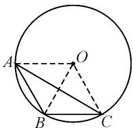
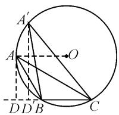
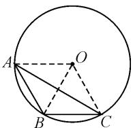

# 一道平面向量试题的多角度破解方法

# 广东省中山市烟洲中学 南兆文

摘要: 涉及平面向量的数量积的最值(或取值范围)问题, 是高考命题中比较常见的一类热点问题. 结合一道平面向量数量积问题, 根据题设的应用情景创设, 挖掘问题的本质与内涵, 合理选用与之相应的思维技巧与策略方法来分析与处理, 总结解题思维方法与技巧规律, 指导数学教学与复习备考.

关键词: 平面向量; 数量积; 三角形; 外接圆; 最值

作为平面向量的基本知识之一,平面向量的数量积成为近年高考的一个基本考点.特别是涉及数量积的最值(或范围)问题,基于平面几何,依托平面向量,融合函数与方程、三角函数、基本不等式等相关知识,成为该模块知识中考查的重中之重,也是课堂教学与复习备考中的一个基本专题.

# 1 问题呈现

问题 已知 $\triangle ABC$ 的外接圆半径为 1, 则 $\overrightarrow{AB} \cdot \overrightarrow{BC}$ 的最大值为 \_\_\_\_.

此题以三角形及其外接圆为问题场景,通过已知 $\triangle ABC$ 的外接圆为单位圆来创设,结合三角形的两边所对应的两平面向量的数量积的最值来设置.题目条件简单明了,求解目标明确简捷.

该问题看似简单,但实际操作与求解起来却有一定的难度.根据试卷的实际应用,以及学生做题情况,结合本题得分的统计信息可知,这道题的得分率极低,做对的学生寥寥无几.

合理分析问题条件,巧妙挖掘内涵与本质,从平面向量的数量积求解视角切入,可以借助基底法、投影法、极化恒等式法以及三角函数法等来应用,从不同层面加以突破与求解,实现问题的解决.

# 2 问题破解

# 2.1 基底思维

方法 1: 基底法 1.

解析:依题意,由于 $\overrightarrow{AB}\cdot\overrightarrow{BC}=(\overrightarrow{OB}-\overrightarrow{OA})\cdot\overrightarrow{BC}=\overrightarrow{OB}\cdot\overrightarrow{BC}-\overrightarrow{OA}\cdot\overrightarrow{BC}=-\frac{1}{2}\left|\overrightarrow{BC}\right|^{2}-\left|\overrightarrow{BC}\right|\cos\alpha\leqslant-\frac{1}{2}\left|\overrightarrow{BC}\right|^{2}+\left|\overrightarrow{BC}\right|$ ,其中O为外圆圆心, $\alpha$ 为 $\overrightarrow{OA}$ 与 $\overrightarrow{BC}$ 的夹角,当且仅当 $\overrightarrow{OA}$ 与 $\overrightarrow{BC}$ 的方向相反,即 $\cos\alpha=$

-1时等号成立，如图1所示.而 $-\frac{1}{2}\cdot|\overrightarrow{BC}|^{2}+|\overrightarrow{BC}|=-\frac{1}{2}(|\overrightarrow{BC}|-1)^{2}+\frac{1}{2}\leqslant\frac{1}{2}$ ，当且仅当 $|\overrightarrow{BC}|=1$ 时等号成立.

  
图1

所以 $\overrightarrow{AB}\cdot\overrightarrow{BC}$ 的最大值为 $\frac{1}{2}$ .

方法 2: 基底法 2.

$\overrightarrow{AB} \cdot \overrightarrow{BC} = (\overrightarrow{OB} - \overrightarrow{OA}) \cdot (\overrightarrow{OC} - \overrightarrow{OB}) = \overrightarrow{OB} \cdot \overrightarrow{OC} - \overrightarrow{OA} \cdot \overrightarrow{OC} + \overrightarrow{OA} \cdot \overrightarrow{OB} - \overrightarrow{OB}^2 = -\frac{1}{2} (\overrightarrow{OA} - \overrightarrow{OB} + \overrightarrow{OC})^2 + \frac{1}{2} (\overrightarrow{OA}^2 + \overrightarrow{OB}^2 + \overrightarrow{OC}^2) - \overrightarrow{OB}^2 = -\frac{1}{2} (\overrightarrow{OA} - \overrightarrow{OB} + \overrightarrow{OC})^2 + \frac{3}{2} - 1 = -\frac{1}{2} (\overrightarrow{OA} - \overrightarrow{OB} + \overrightarrow{OC})^2 + \frac{1}{2} \leqslant \frac{1}{2}$ , 当且仅当 $\overrightarrow{OA} - \overrightarrow{OB} + \overrightarrow{OC} = 0$ 时等号成立, 如图 1 所示.

所以 $\overrightarrow{AB}\cdot\overrightarrow{BC}$ 的最大值为 $\frac{1}{2}$ .

方法 3: 基底法 3.

$\overrightarrow{AB} \cdot \overrightarrow{BC} = \overrightarrow{AB} \cdot (\overrightarrow{BO} + \overrightarrow{OC}) = \overrightarrow{AB} \cdot \overrightarrow{BO} + \overrightarrow{AB} \cdot \overrightarrow{OC} = -\frac{1}{2}\overrightarrow{AB}^2 + \overrightarrow{AB} \cdot \overrightarrow{OC} = -\frac{1}{2} (\overrightarrow{AB} - \overrightarrow{OC})^2 + \frac{1}{2}\overrightarrow{OC}^2 = -\frac{1}{2} (\overrightarrow{AB} - \overrightarrow{OC})^2 + \frac{1}{2} \leqslant \frac{1}{2}$ , 当且仅当 $\overrightarrow{AB} = \overrightarrow{OC}$ 时等号成立, 如图 1 所示.

所以 $\overrightarrow{AB}\cdot\overrightarrow{BC}$ 的最大值为 $\frac{1}{2}$ .

点评: 基底法是处理平面向量及其综合问题中比较常见的一种“通性通法”. 借助基底的选取与平面向量的线性关系的转化, 将平面向量的数量积加以合理变形, 结合易于求解与分析的向量的模等的关系式加以合理放缩,实现数量积最值的确定.基底往往是基于对应向量的模或夹角比较容易确定加以有效选用,而不是盲目转化.

# 2.2 投影思维

方法 4: 投影法.

解析: 如图 2 所示, 设向量 $\overrightarrow{AB}$ 在向量 $\overrightarrow{BC}$ 方向上的投影长为 $|\overrightarrow{DB}|$ , 数形结合可知, 当 $AD \perp OA$ 时, 投影长 $|\overrightarrow{DB}|$ 最大, 此时 $|\overrightarrow{DB}| = |\overrightarrow{OA}| - \frac{1}{2} |\overrightarrow{BC}| = 1 - \frac{1}{2} |\overrightarrow{BC}|$ . 所以 $\overrightarrow{AB} \cdot$

  
图2

$$
\begin{array}{r l} & {\overrightarrow {B C} \leqslant \left(1 - \frac {1}{2} | \overrightarrow {B C} |\right) | \overrightarrow {B C} | = - \frac {1}{2} (| \overrightarrow {B C} | - 1) ^ {2} + \frac {1}{2} \leqslant} \\ & {\frac {1}{2}, \text {当且仅当} | \overrightarrow {B C} | = 1 \text {时等号成立}.} \end{array}
$$

所以 $\overrightarrow{AB}\cdot\overrightarrow{BC}$ 的最大值为 $\frac{1}{2}$ .

点评:利用投影法处理平面向量及其综合问题,特别对于解决数量积中的最值(或取值范围)问题有奇效.投影法是依托平面向量数量积的定义与投影向量的概念,进行“数”与“形”的巧妙结合与转化,通过投影向量体现平面向量中“形”的结构特征,在平面几何图形的直观想象下进行合理数形结合应用.投影法往往结合动点的变化规律和极端场景来分析最值或极值的取值情况而达到目的.

# 2.3 极化恒等式思维

方法 5: “极化恒等式 + 不等式” 法.

解析: 由 $\overrightarrow{AB} \cdot \overrightarrow{BC} = -\overrightarrow{BA} \cdot \overrightarrow{BC}$ ，取线段 AC 的中点 M，如图 3 所示.

  
图3

$$
\begin{array}{r l} & {\text {结合极化恒等式}, \text {可得} \overrightarrow {A B} \cdot} \\ & {\overrightarrow {B C} = - \overrightarrow {B A} \cdot \overrightarrow {B C} = - (\overrightarrow {B M ^ {2}} -} \\ & {\overrightarrow {A M ^ {2}}) = \overrightarrow {A M ^ {2}} - \overrightarrow {B M ^ {2}} = \overrightarrow {O A ^ {2}} -} \\ & {\overrightarrow {O M ^ {2}} - \overrightarrow {B M ^ {2}} = 1 - (\overrightarrow {O M ^ {2}} + \overrightarrow {B M ^ {2}}).} \end{array}
$$

由于 $\sqrt{\frac{|OM|^{2}+|BM|^{2}}{2}}\geqslant\frac{|OM|+|BM|}{2}\geqslant\frac{|OB|}{2}=\frac{1}{2}$ ，当且仅当 $|OM|=|BM|$ 且 O,M,B 三点共线时等号成立，因此 $\overrightarrow{OM^{2}}+\overrightarrow{BM^{2}}\geqslant\frac{1}{2}$ .

所以 $\overrightarrow{AB} \cdot \overrightarrow{BC} = 1 - (\overrightarrow{OM^2} + \overrightarrow{BM^2}) \leqslant 1 - \frac{1}{2} = \frac{1}{2}$ .故 $\overrightarrow{AB}\cdot\overrightarrow{BC}$ 的最大值为 $\frac{1}{2}$ .

# 2.4 三角函数思维

方法 6:三角函数法.

解析：若 $\angle ABC \leqslant \frac{\pi}{2}$ ，则可知 $\overrightarrow{AB} \cdot \overrightarrow{BC} \leqslant 0$ 。若 $\angle ABC > \frac{\pi}{2}$ ，则有 $\overrightarrow{AB} \cdot \overrightarrow{BC} > 0$ 。利用正弦定理有 $\frac{a}{\sin A} = \frac{b}{\sin B} = \frac{c}{\sin C} = 2R = 2$ ，则 $a = 2\sin A, c = 2\sin C$ 。所以 $\overrightarrow{AB} \cdot \overrightarrow{BC} = |\overrightarrow{AB}| |\overrightarrow{BC}| \cos (\pi - B) = |\overrightarrow{AB}| \cdot |\overrightarrow{BC}| (-\cos B) = -ac \cos B = -4\sin A \sin C \cdot \cos B = 2[\cos (A + C) - \cos (A - C)] \cos B = 2[-\cos B - \cos (A - C)] \cos B = -2\cos^2 B - 2\cos (A - C) \cdot \cos B \leqslant -2\cos^2 B - 2\cos B = -2\left(\cos B + \frac{1}{2}\right)^2 + \frac{1}{2} \leqslant \frac{1}{2}$ ，当且仅当 $\cos (A - C) = 1$ 且 $\cos B = -\frac{1}{2}$ ，即 $A = C = \frac{\pi}{6}, B = \frac{2\pi}{3}$ 时等号成立。

综上分析,可得 $\overrightarrow{AB}\cdot\overrightarrow{BC}$ 的最大值为 $\frac{1}{2}$ .

点评:利用三角函数法处理平面向量及其综合问题,是借助平面向量中“形”的结构特征加以直观想象.利用平面几何图形,结合平面向量的概念与运算等,综合解三角形思维,将平面向量问题转化为三角函数问题,合理利用三角函数中的基本概念、三角恒等变换公式等来转化与应用,结合函数与方程思维或三角函数的图象与性质等的应用,给平面向量数量积的最值(或范围)的求解提供条件.

# 3 变式拓展

变式 $\triangle ABC$ 中，已知 $|BC| = 1, |AB| = \sqrt{3}$ ， $|AC| = \sqrt{6}$ ， $P$ 是 $\triangle ABC$ 的外接圆上的一个动点，则 $\overrightarrow{BP} \cdot \overrightarrow{BC}$ 的最大值为 \_\_\_\_. (2)

# 4 教学启示

其实,解决平面向量数量积的最值(或范围)及其综合问题,从题设条件入手,合理寻觅并挖掘数量积的结构特征与题设条件,从“数”的代数属性或“形”的几何直观等视角切入与应用,合理进行恒等变形与转化.

特别在实际解题与应用过程中,合理借助平面向量数量积的最值(或范围)及其综合问题的解题经验的积累与技巧方法的应用,选取行之有效的数学思维方法与对应的技巧策略,实现数量积最值(或范围)问题的求解,从而有效养成良好的数学思维品质,提升数学解题能力,拓展数学应用与创新思维.