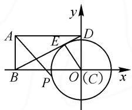
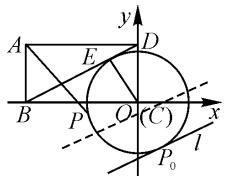
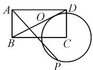
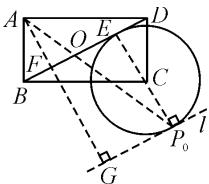
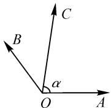

# 一道平面向量高考题的解法探究

# ● 贵州兴仁市凤凰中学 杨建民

摘要:高考作为高中课程教学的“指挥棒”,高考数学真题蕴涵的数学思想方法具有较高的研究价值,因此有必要研究历年高考经典真题,引领平时的课堂教学.而平面向量在高考数学中占有一定的地位,尤其是在解决立体几何相关问题时,向量作为一种工具,威力无穷,利用平面向量有关知识能巧妙解答一些用常规方法难解的问题.本文中对2017年高考数学全国卷Ⅲ第12题进行解法探究,提升对高考数学的认识,引发同行对高中数学教学的思考.

关键词: 平面向量; 课堂教学; 发散思维

# 1 考题呈现

(2017年高考数学全国卷Ⅲ)在矩形ABCD中， $AB = 1, AD = 2$ ，动点 $P$ 在以点 $C$ 为圆心且与 $BD$ 相切的圆上.若 $\overrightarrow{AP} = \lambda \overrightarrow{AB} +\mu \overrightarrow{AD}$ ，求 $\lambda +\mu$ 的最大值.

# 2 解法探究

本题考查平面向量与圆的知识.对于平面向量,高中阶段主要通过坐标运算或者线性运算来解答问题.虽然本题目中给出的向量是线性运算的形式,但涉及圆上的动点问题,可借助圆的参数方程,将动点的坐标用三角函数值来表示,然后进一步求解.因此可建立坐标系,求出圆的参数方程,将动点P的坐标用含参数的三角函数来表示,借助三角函数,将问题转化为求三角函数的最值问题.

解法 1: 如图 1 所示, 以 C 为坐标原点, BC 所在直线为 x 轴, 建立平面直角坐标系, 则 $C(0,0)$ , $A(-2,1)$ , $B(-2,0)$ , $D(0,1)$ .

设圆 C 与 BD 相切于点 E，
连接 CE，则 $CE \perp BD$ .

text_image

A
B
E
D
P
O (C)
x
y

图 1

因为 $\left|AB\right|=\left|CD\right|=1,\left|AD\right|=\left|BC\right|=2$ ，所以 $\left|BD\right|=\sqrt{5}$ .

由 $S_{\triangle BCD} = \frac{1}{2}|BC|\cdot |CD| = \frac{1}{2}|BD|\cdot |CE|$ ，可得 $\frac{1}{2}\times 2\times 1 = \frac{1}{2}\times \sqrt{5}\times |CE|$

所以 $|CE|=\frac{2\sqrt{5}}{5}$ .

设圆 C 的参数方程为 $\left\{\begin{aligned}x&=\frac{2\sqrt{5}}{5}\cos\theta,\\ y&=\frac{2\sqrt{5}}{5}\sin\theta\end{aligned}\right.$ ( $\theta$ 为参数).

若点 $P$ 对应的参数为 $\alpha$ ，则其坐标为 $\left(\frac{2\sqrt{5}}{5}\cos \alpha ,\frac{2\sqrt{5}}{5}\sin \alpha\right)$

所以 $\overrightarrow{AP} = \left(\frac{2\sqrt{5}}{5}\cos \alpha + 2, \frac{2\sqrt{5}}{5}\sin \alpha - 1\right), \overrightarrow{AB} = (0, -1), \overrightarrow{AD} = (2, 0)$ .

又 $\overrightarrow{AP} = \lambda \overrightarrow{AB} +\mu \overrightarrow{AD} = \lambda (0, - 1) + \mu (2,0)$ ，则

$$
\mu = \frac {\sqrt {5}}{5} \cos \alpha + 1,
$$

$$
\lambda = - \frac {2 \sqrt {5}}{5} \sin \alpha + 1.
$$

故 $\lambda + \mu = \frac{\sqrt{5}}{5} \cos \alpha - \frac{2\sqrt{5}}{5} \sin \alpha + 2 = \sin (\varphi - \alpha) + 2 \leqslant 3$ ，其中 $\sin \varphi = \frac{\sqrt{5}}{5}, \cos \varphi = \frac{2\sqrt{5}}{5}$ ，当且仅当 $\varphi - \alpha = \frac{\pi}{2} + 2k\pi (k \in \mathbf{Z})$ ，即 $\alpha = \varphi - \frac{\pi}{2} - 2k\pi (k \in \mathbf{Z})$ 时， $\lambda + \mu$ 取得最大值3.

运用圆的参数方程求解,我们发现其思维过程难度不大,但在解答问题的过程中计算量较大,占用的时间相对较多,那么有没有更好的方法来解决这个问题呢?这需要我们在日常的数学课堂教学中,一是要加强学生计算能力的训练,提高学生的计算速度与准确度,二是要培养学生发散思维、求异思维,在学生掌握通性通法之后,还需注重一题多解,提高学生快速解答问题的能力.事实上,解决与圆有关的某些问题时,若巧用圆的参数方程,常能化繁为简,化难为易,达到事半功倍的效果 $^{[1]}$ .

本题也可以运用线性规划思想来求解.线性规划是我们求最值的一种手段,可将圆的标准方程看作约束条件,P 是圆上的动点,故将圆上的所有点作为可行域,问题就转化为求 P 点最优解问题.

解法 2: 如图 2 所示, 以 C 为坐标原点, BC 所在直线为 x 轴, 建立平面直角坐标系, 则 $C(0,0)$ , $A(-2,1)$ , $B(-2,0)$ , $D(0,1)$ .

text_image

A
E
D
B
P
O
(C)
x
l
P₀

图2

由解法 1, 可知圆 C 的方程为 $x^{2} + y^{2} = \frac{4}{5}$ .

设 $P(x,y)$ ，由 $\overrightarrow{AP} = \lambda \overrightarrow{AB} + \mu \overrightarrow{AD}$ ，得

$$
\left\{ \begin{array}{l} \mu = \frac {x + 2}{2}, \\ \lambda = 1 - y. \end{array} \right.
$$

令 $z=\lambda+\mu=\frac{x}{2}-y+2$ ，问题即为求目标函数 z 的最大值.

因为点 P 在圆 C 上, 所以约束条件为 $x^{2} + y^{2} = \frac{4}{5}$ , 可行域为圆上的所有点, 如图 2, 则直线 $l: y = \frac{x}{2} + 2 - z$ 在点 $P_{0}(x_{0}, y_{0})$ 处时, z 取得最大值, 此时, 该直线与圆相切, 圆心到直线的距离为

$$
d = \frac {| 2 - z |}{\sqrt {\frac {1}{4} + 1}} = \frac {2 \sqrt {5}}{5}.
$$

解得 z=3 或 z=1(舍).

故 $\lambda + \mu$ 的最大值为 3.

解法 2 虽然简洁,但不容易想到,因此课堂教学中,要注意培养学生的发散思维,有的放矢地教学,提高学生举一反三、触类旁通的能力.另一方面,高中的线性规划问题一般是求最优解问题,常在在函数、解析几何等知识中交汇出现,具有应用多样性 $^{[2]}$ .

本题还可以运用平面向量“等和线”求解.

解法 3: 如图 3, 设 AP 与 BD 相交于点 O, 则 O, B, D 三点共线, 有

$$
\overrightarrow {A O} = t \overrightarrow {A B} + (1 - t) \overrightarrow {A D}.
$$

设 $\overrightarrow{AP}=k\overrightarrow{AO}$ ，则

$$
\overrightarrow {A P} = k t \overrightarrow {A B} + k (1 - t) \overrightarrow {A D}.
$$

  
图3

所以 $\lambda + \mu = k$ ，问题转化为求 k 的最值问题。

如图4，作直线 $l \parallel BD$ 且 $l$ 与圆 $C$ 相切于点 $P_0$ ，其中 $EP_0$ 为圆 $C$ 直径.设圆 $C$ 半径为 $r$ ，由等和线的定义可知，当点 $P$ 在 $P_0$ 处时， $\lambda +\mu = k$ 取得最大值.

过点 A 作 l 的垂线，垂足为 G，且 AG 交 BD 于点 F，则 $\left|AF\right| = \left|EC\right| = r$ .

所以 $(\lambda + \mu)_{\max} = \frac{|\overrightarrow{AG}|}{|\overrightarrow{AF}|} = \frac{2r + |AF|}{|AF|} = \frac{3r}{r} = 3.$

text_image

A
O
E
D
F
B
C
l
P₀
G

图4

故 $\lambda + \mu$ 的最大值为 3.

巧妙利用平面向量基本定理中的三点共线可以提高解决此题的效率,教学中要多给学生时间反思,提高学生的应变能力.

变换的观点与变换思想是对高中数形结合思想的进一步提升,也使高中阶段用代数方法研究几何问题达到了更高的层次,让解决问题变得简单而又自然 $^{[3]}$ .

# 3 试题延伸

(1)已知菱形ABCD的边长为 $2, \angle BAD = 120^{\circ}$ , 点 $E, F$ 分别在边 $BC, DC$ 上, $BE = \lambda BC, DF = \mu DC$ . 若 $\overrightarrow{AE} \cdot \overrightarrow{AF} = 1, \overrightarrow{CE} \cdot \overrightarrow{CF} = -\frac{2}{3}$ , 则 $\lambda + \mu$ 等于（ ）.

A. $\frac{1}{2}$

B. $\frac{2}{3}$

C. $\frac{5}{6}$

D. $\frac{7}{12}$

(2)如图5,在同一个平面内,向量 $\overrightarrow{OA},\overrightarrow{OB},\overrightarrow{OC}$ 的模分别为1,1, $\sqrt{2}$ , $\overrightarrow{OA}$ 与 $\overrightarrow{OC}$ 的夹角为 $\alpha$ ,且 $\tan\alpha=7,\overrightarrow{OB}$ 与 $\overrightarrow{OC}$ 的夹角为 $45^{\circ}$ .若 $\overrightarrow{OC}=m\overrightarrow{OA}+n\overrightarrow{OB}(m,n\in\mathbf{R})$ ,则 $m+n=$ \_\_\_\_.

  
图 5

以上两个问题留给读者完成.

# 4 总结

高考在考查学生的数学基本知识、基本思想的同时，着重考查学生的数学综合能力。因此，在高中数学课堂教学中，教师要注重对学生计算能力和发散思维的培养，加强对高考真题的研究，多做高考真题，将经典高考真题的解题思想融入到日常的课堂教学中，避免无效刷题，同时渗透高中基本数学思想，如数形结合、化归与转化思想等，提高课堂教学的效率。

# 参考文献：

[1] 彭利波. 巧用圆的参数方程解题 [J]. 中学数学, 2015 (17): 82-83.

[2] 张爱琴. 线性规划在高中数学中的应用 [J]. 数学学习与研究, 2015(17): 119-121.

[3]潘成银.平面向量基本定理系数等值线[J].数学通讯,2013(2):40-43.Z