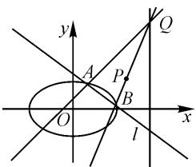

# 一道试题的探究与思考

# - 四川省攀枝花市第三高级中学校 郭志洪 冯蓉波

摘要:一道大联考试题的缺陷引发了探究的兴趣,该题复杂的几何关系与繁琐的代数运算让考生止步,不对称几何关系使得运算不对称,导致韦达定理的常规运用失效,探究为使试题变得合法合理,变换条件与结论使试题灵活生动.

关键词: 缺陷; 不对称; 合法合理; 灵活生动

# 1 试题呈现

(2020年名校大联考解析几何试题)已知椭圆 C: $\frac{x^{2}}{a^{2}}+\frac{y^{2}}{b^{2}}=1(a>b>0)$ 的离心率为 $\frac{\sqrt{6}}{3}$ ，过点 P(2,1) 且斜率为 0 的直线与椭圆 C 有且只有一个公共点.

(1)求椭圆 C 的标准方程.

(2) 若直线 l 与椭圆 C 交于 A, B 两点，点 Q 在直线 x = 3 上，且点 B, P, Q 三点共线，直线 AQ 的斜率为 1，试判断直线 l 是否过定点？若过定点，请求出定点的坐标；若不过定点，请说明理由.

# 2 试题解答(参考答案)

解析:(1)椭圆 C 的标准方程为 $\frac{x^{2}}{3} + y^{2} = 1$ , 过程略.

(2) 设直线 $l: y = kx + m, A(x_{1}, y_{1}), B(x_{2}, y_{2})$ , $Q(3, t)$ . 将直线 l 方程代入椭圆方程，得

$$
(1 + 3 k ^ {2}) x ^ {2} + 6 k m x + 3 m ^ {2} - 3 = 0. \tag {①}
$$

当 $\Delta=12(3k^{2}+1-m^{2})>0$ 时，有

$$
x _ {1} + x _ {2} = - \frac {6 k m}{1 + 3 k ^ {2}}, x _ {1} x _ {2} = \frac {3 m ^ {2} - 3}{1 + 3 k ^ {2}}.
$$

由已知 B, P, Q 三点共线, 直线 AQ 的斜率为 1, 得

$$
\left\{ \begin{array}{l} \frac {y _ {2} - 1}{x _ {2} - 2} = t - 1, \\ \frac {t - y _ {1}}{3 - x _ {1}} = 1. \end{array} \right.
$$

消去 t，得 $y_{2}-1=(x_{2}-2)(2-x_{1}+y_{1})$ .

消去 $y_{1}, y_{2}$ , 得

$$
\begin{array}{c} (k - 1) x _ {1} x _ {2} + (2 - 2 k) \left(x _ {1} + x _ {2}\right) + (m + k) x _ {2} - \\ 3 m - 3 = 0. \end{array}
$$

整理，得

$$
(m + k) \left[ 3 m k - 9 k - 3 m - 3 + (1 + 3 k ^ {2}) x _ {2} \right] = 0. \tag {②}
$$

所以 $m+k=0$ .

故直线 l 方程为 $y=k(x-1)$ ，过定点 $(1,0)$ .

当直线 l 斜率不存在时， $A(x_{1},y_{1}),B(x_{1},-y_{1})$ ，
由 $\left\{\begin{aligned}-y_{1}-1\\x_{1}-2\end{aligned}\right=t-1,$ 得 $(x_{1}-1)(y_{1}-x_{1}+3)=0.$ $\frac{t-y_{1}}{3-x_{1}}=1,$

所以 $x_{1}=1$ ，直线 l 过定点 $(1,0)$ .

# 3 解答过程中的疑点

上述解法有两个疑点：

(1)结论与所作图形不符.

笔者解题过程所作图形(图1)，发现直线 l 不过点 $(1,0)$ .

(2)由方程 $(m+k)\left[3mk-9k-3m-3+x_{2}(1+3k^{2})\right]=0$ 推出 $m+k=0$ 的逻辑推理不严谨.

text_image

y
A
P
B
O
l
x
Q

图1

若因式 $3mk - 9k - 3m - 3 + (1 + 3k^2)x_2$ 一定是一个变量，则一定能推出 $m + k = 0$ ；若存在 $m, k$ 使 $3mk - 9k - 3m - 3 + (1 + 3k^2)x_2 = 0$ ，则不一定能推出 $m + k = 0$ 。

# 4 缺陷分析

# (1)用图形检验

根据题意作图, 过直线 x=3 上的点 Q, 作斜率为 1 的直线交椭圆于点 $A_{1}, A_{2}$ , 作直线 QB 交椭圆于点 $B_{1}, B_{2}$ . 发现点 A, B 不唯一, 满足条件的直线 l 可以作出四条: $A_{1}B_{2}, A_{2}B_{1}, A_{1}B_{1}, A_{2}B_{2}$ . 利用几何画板移动主动点 Q, 分别追踪直线 $A_{1}B_{2}, A_{2}B_{1}$ , 可得直线 l 的轨迹为过定点 (1,0) 的直线束, 即当 A, B 两点在 x 轴异侧时, 直线 l 过定点 (1,0). 追踪直线 $A_{1}B_{1}$ 时, 直线 l 不过定点, 追踪直线 $A_{2}B_{2}$ 时直线 l 也不过定点. 故当 A, B 两点在 x 轴同侧时, 直线 l 不过定点.

# (2)用方程分析

若 $3mk - 9k - 3m - 3 + (1 + 3k^2)x_2 = 0$ ，由求根公式求出方程①的根，代入上式消去 $x_{2}$ ，得

$$
\pm \sqrt {9 k ^ {2} + 3 - 3 m ^ {2}} = 9 k + 3 m + 3.
$$

平方整理,得关于 k 的方程 $12k^{2}+9(m+1)k+2m^{2}+3m+1=0,\Delta=-15m^{2}+18m+33.$

从判别式大于0时方程有解可知，存在实数对 $(m,k)$ 可使 $3mk - 9k - 3m - 3 + (1 + 3k^2)x_2$ 的值为0；从判别式不是完全平方式可得， $m,k$ 不是线性关系，此时直线不过定点.

# 5 试题的完善与变式

# 5.1 试题完善

由以上分析可知,题目应增加条件:“当 A,B 两点在 x 轴异侧”,完善为

已知椭圆 $C: \frac{x^{2}}{a^{2}} + \frac{y^{2}}{b^{2}} = 1 (a > b > 0)$ 的离心率为 $\frac{\sqrt{6}}{3}$ ，过点 $P(2,1)$ 且斜率为 0 的直线与椭圆 C 有且只有一个公共点.

(1)求椭圆 C 的标准方程.

(2) 若直线 l 与椭圆 C 交于 A, B 两点, 当 A, B 两点在 x 轴异侧, 点 Q 在直线 x = 3 上, 且点 B, P, Q 三点共线, 直线 AQ 的斜率为 1 时, 试判断直线 l 是否过定点? 若过定点, 请求出定点的坐标; 若不过定点, 请说明理由.

# 5.2 试题分析

从对本试题研究的角度,可改变题目的条件与结论的顺序,探索条件、结论中的几何关系,进一步探索图形中的变与不变的关系,充分体现如何将几何条件转化成代数方程,如何对代数方程消元求解找到几何关系中的定点、定值.

本试题的几何条件:(1)点 A,B 在椭圆上;(2)点 Q 在直线 x=3 上;(3)直线 AQ 的斜率为 1;(4)直线 BQ 过定点 P(2,1);(5)直线 AB 过定点(1,0).

本题体现了(1)(2)(3)(4)对直线 AB 运动的制约, 即满足(5): 直线 AB 过定点(1,0).

# 5.3 试题变式

变式 1 将试题第(2)问改为:

若过点(1,0)的直线与椭圆 C 交于 A, B 两点，点 Q 在直线 x=3 上，直线 AQ 的斜率为 1，试判断直线 BQ 是否过定点？若过定点，请求出定点的坐标；若不过定点，请说明理由.

说明: 此变式将几何条件(4)中的点 P 与(5)中的定点(1,0)交换位置, 可以体现几何条件(1)(3)(4)(5)对(2)中直线 BQ 运动的制约, 用几何画板移动主动点 B 追踪直线 BQ, 观察可得直线 BQ 过定点 $P(2,1)$ , 求解过程与原试题相似, 运算难度更大.

变式 2 将试题第(2)问改为：

若过点 $(1,0)$ 斜率不为1的直线与椭圆C交于A,B两点,过点A作斜率为1的直线交直线BP于点Q,试判断点Q的横坐标是否为定值?若是,请求出点Q的横坐标;若不是,请说明理由.

说明: 此变式将几何条件(2)中的“点 Q 在直线 x=3 上”与(5)中的定点(1,0)交换位置, 可以体现(1)(2)(3)(5)对“点 Q”运动的制约.

解析: 令直线 AB: $x = my + 1 (m \neq 1)$ ，代入 C 的方程，得 $(m^{2} + 3)y^{2} + 2my - 2 = 0, \Delta > 0, y_{1} + y_{2} = -\frac{2m}{m^{2} + 3}, y_{1}y_{2} = -\frac{2}{m^{2} + 3}.$

由已知，令 $Q(t,n)$ ，则 $\left\{\begin{aligned}\frac{n-y_{1}}{t-x_{1}}&=1,\\ \frac{n-1}{t-2}&=\frac{y_{2}-1}{x_{2}-2}\end{aligned}\right.$

消去 $n$ ，得

$$
(x _ {2} - y _ {2} - 1) t = 2 - 2 y _ {2} + (x _ {2} - 2) (x _ {1} - y _ {1} + 1).
$$

消去 $x_{1}, x_{2}$ , 得

$$
(m - 1) y _ {2} t = 2 - 2 y _ {2} + \left(m y _ {2} - 1\right) \left(m y _ {1} - y _ {1} + 2\right).
$$

整理，得

$$
\begin{array}{r l} (m - 1) y _ {2} t & = m ^ {2} y _ {1} y _ {2} - m y _ {1} y _ {2} + (2 m - 2) y _ {2} + \\ (1 - m) y _ {1}. \end{array} \tag {③}
$$

由韦达定理, 可得 $my_{1}y_{2}=y_{1}+y_{2}$ , 代入③可得 $(m-1)y_{2}t=3(m-1)y_{2}$ . 由 $m\neq1$ 且 $y_{2}$ 为变量得 t=3, 所以点 Q 的横坐标为定值 3.

变式 3 将试题第(2)问改为：

若过点 $(1,0)$ 的直线与椭圆C交于A,B两点,直线BP交直线x=3于点Q,试证明直线AQ的斜率为定值.

说明:本变式将几何条件(3)中的“直线AQ的斜率为1”与(5)中的“直线AB过定点(1,0)”交换位置,体现“(1)(2)(4)(5)对(3)中直线AQ运动的制约,即其斜率为定值1.

解析: 令直线 AB: x = my + 1, 代入 C 的方程, 得 $(m^{2} + 3)y^{2} + 2my - 2 = 0$ , 则

$$
y _ {1} + y _ {2} = - \frac {2 m}{m ^ {2} + 3}, y _ {1} y _ {2} = - \frac {2}{m ^ {2} + 3}.
$$

令 $Q(3,t)$ ，则 $\frac{y_{2}-1}{x_{2}-2}=\frac{t-1}{3-2}$ ，可得 $t=\frac{y_{2}-1}{x_{2}-2}+1$ .

由韦达定理, 得 $my_{1}y_{2}=y_{1}+y_{2}$ , 则

$$
k _ {A Q} = \frac {t - y _ {1}}{3 - x _ {1}} = \frac {(m + 1) y _ {2} - 2 - \left(y _ {1} + y _ {2}\right) + y _ {1}}{2 m y _ {2} + m y _ {1} - m \left(y _ {1} + y _ {2}\right) - 2} =
$$

$$
\frac {m y _ {2} - 2}{m y _ {2} - 2} = 1.
$$

所以,直线 AQ 的斜率为定值 1.

# 5.4 试题改进

从试题的适用性来看,可以作如下改进:

将题目结论改为“试判断直线 l 是否过 x 轴上的定点”，即将第(2)问变为：

若直线 l 与椭圆 C 交于 A, B 两点，当 A, B 两点在 x 轴异侧，点 Q 在直线 x = 3 上，且点 B, P, Q 三点共线，直线 AQ 的斜率为 1 时，试判断直线 l 是否过 x 轴上的定点？若过定点，请求出定点的坐标；若不过定点，请说明理由.

改进意图:增加一个信息,为考生提供运算方向,学生可先用 A,B,Q 三点共线的特殊位置找到定点,对②式运算时找到 $m+k$ 的因式,或令方程中 m=-k 验证其成立,从而得到直线 AB 过定点,减少运算的盲目性.

变式 2 与变式 3 的运算方向很明确, 只需将韦达定理变形后再加以运用, 作为考题也是不错的选择. 若是作为联赛预赛或联赛一试试题, 则可选择变式 1.

# 6 反思

本试题几何关系复杂,代数方程中变量多,由条件不对称导致运算方向不明,运算过程繁琐.本校高三考生第二步平均得分不到一分,没有人得满分.

测试题的作用在于检验与导向,本题更多地考查了尖子学生的意志力与解复杂方程的能力,对几何关系的处理学生比较顺手,但对代数方程的处理明显能力不足;本题条件不严谨,有违科学性,教师在命制试题时一定要尽量避免.

通过对本试题缺陷的分析,以及对试题的完善与变式,灵活地变换几何条件的位置,进一步明晰几何、代数关系的转化与求解过程,力图为学生的训练提供素材,为教师的命题提供方向. Z

# (上接第70页)

②当 a=0 时， $g(x)=\frac{1}{4}x+1$ ，在 $x\to+\infty$ 时， $g(x)>h(x)$ ，不合题意.

③当 a<0 时，二次函数 $g(x)=\frac{1}{2}ax^{2}+\frac{1}{4}x+1$ 的对称轴方程为 $x=-\frac{1}{4a}>0$ ，欲使 $g(x)\leqslant h(x)$ 在 $[e^{3},+\infty)$ 恒成立。当且仅当 $g(e^{3})<h(e^{3})$ ，即 $\frac{1}{2}ae^{6}+\frac{1}{4}e^{3}+1\leqslant\ln e^{3}=3$ 。

解得 $a \leqslant \frac{8 - e^{3}}{2e^{6}}$ .

故实数 a 的范围是 $\left(-\infty, \frac{8 - e^{3}}{2e^{6}}\right]$ .

解法 2 通过式子变形, 将一个函数问题转化为两个函数间的问题予以解决, 利用函数增长模型及二次函数的相关知识来完成, 简便高效.

# 5 班级测试情况

对于本题,本班实测的基本情况如下:参考人数44人,满分12分,有4人取得满分,平均分5.13分,难度系数为0.4275,作为选拔性试题,基本符合要求.从

学生测试后再次分析试题:首先,题目设置两个参数a,n,基础薄弱、心理素质不高的学生会望题生畏,这样第(1)大问送分也有部分学生没有拿到;其次,从解答来看,部分学生利用了多次求导研究原函数,其基本逻辑欠缺,错误地直接用二阶导数的正负来判断原函数的单调性;再次,部分学生第(1)大问思路通畅,但计算粗心,结果出错;最后,本试题区分度适中,有利于选拔优生.

# 6 试题链接

题 1 已知函数 $f(x)=x\ln x-ax^{2}$ .

(1) 当 $a=\frac{1}{2}$ 时, 求函数 $f(x)$ 的单调区间;  
(2) 若 $f(x) < 2x$ 恒成立, 求实数 a 的取值范围.
说明:题1是本文中的第二稿试题的改编题.

题 2 已知函数 $f(x)=x\ln x-ax^{3}+\frac{1}{2}x^{2}-5x.$

(1) 当 $a=\frac{1}{3}$ 时, 求函数 $f(x)$ 的单调区间;

(2) 若任意 $x \in [e^{3}, +\infty)$ , $f(x) \leqslant 0$ 恒成立, 求实数 a 的取值范围.

说明:题 2 是本文中的第五稿试题的改编题.

题 1 和题 2 的解答可扫码查看. Z

  
扫码看解答