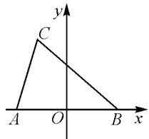
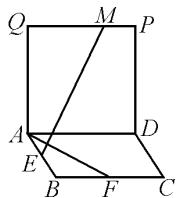
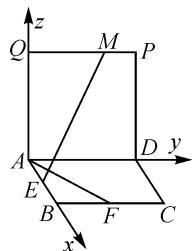
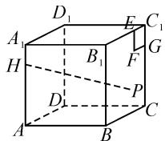
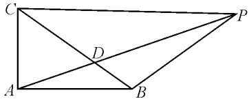
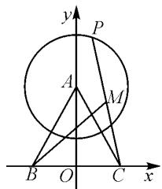

# 借力“坐标” 别有洞天\*

# - 四川省成都树德中学 张世军 熊忠婕 陈秀丽

摘要:本文中结合实例,论述了借助“坐标”这一工具解决解三角形、立体几何等数学问题,化繁为简,优化解题过程,降低思维难度.解题过程中,体现了数形结合等思想方法,培养了数学建模、数学运算等数学核心素养.

关键词: 坐标运算; 数形结合; 数学核心素养

坐标运算是处理和解决众多数学问题的一大“神器”.它可以运用在高中数学知识体系的众多方面.通过直角坐标系,结合题目条件,将数学知识用坐标形式呈现出来,通过坐标运算,确定其数量关系,可以将一些思维深度高的问题转化为简单的问题加以解决.借力“坐标”,不仅仅优化了解题过程,化繁为简,化陌生为熟悉,更能体现数学的数形结合等思想方法,培养学生的数学建模、数学运算等核心素养[1].

# 1 解三角形

建立平面直角坐标系,利用坐标运算,建构方程,化简方程,可以将三角形中的动点轨迹方程呈现出来,知晓动点轨迹,进而解决相关的定值、最值问题.

例 1 （2022 高中数学联赛四川省初赛·7）已知 $\triangle ABC$ 的三边 a, b, c 满足 $a^{2} + b^{2} + 3c^{2} = 7$ ，则 $\triangle ABC$ 面积的最大值为 \_\_\_\_.

分析:本题的常规方法是直接利用三角形面积公式直接解答.在解答过程中,结合余弦定理、均值不等式等,思维难度大,计算量也较大,学生操作起来不顺手.而巧妙借助坐标运算,动静结合,可以化陌生为熟悉,处理起来也比较方便.

解析: 不妨设 $c = 2m (m > 0)$ ，建立如图 1 所示的平面直角坐标系，则 $A(-m, 0)$ ， $B(m, 0)$ 。设 $C(x, y)$ ，结合 $a^{2} + b^{2} + 3c^{2} = 7$ ，可得 $(x + m)^{2} + y^{2} + (x - m)^{2} + y^{2} + 12m^{2} = 7$ 。

text_image

y
C
A O B x

图1

化简，得

$$
x ^ {2} + y ^ {2} = \frac {7 - 1 4 m ^ {2}}{2}, m \in \left(0, \frac {\sqrt {2}}{2}\right).
$$

所以点 C 的轨迹是以原点为圆心，半径为 $\sqrt{\frac{7-14m^{2}}{2}}$ 的圆（除去 x 轴上的两点），进而 $S_{\triangle ABC} \leqslant \frac{2m}{2} \times \sqrt{\frac{7-14m^{2}}{2}} \leqslant \frac{\sqrt{7}}{4}$ ，当且仅当 $m = \frac{1}{2}$ 时，等号成立。故 $\triangle ABC$ 面积的最大值为 $\frac{\sqrt{7}}{4}$ 。

点评:结合坐标运算可以为本题的解答指明方向,大大降低了思维难度,学生操作起来也方便,很容易上手,计算量也不大,解决问题易如反掌.同时,坐标运算方法具有普遍性,可以对题目条件进行推广变式,如将题目条件中 $a^{2}+b^{2}+3c^{2}=7$ 改为 $a^{2}+2b^{2}+3c^{2}=7$ ,也可以用坐标法来解决问题.

# 2 立体几何

建立空间直角坐标系,利用坐标运算方法,结合题目条件可以得到空间中异面直线所成的角、线面角、二面角、距离等动点问题所具有的代数关系式,运用函数观来解决空间中相关的定值、最值问题.

例 2 （2015 高考四川理·14）如图 2，四边形 ABCD 和 ADPQ 均为正方形，它们所在的平面互相垂直，动点 M 在线段 PQ 上，E, F 分别为 AB, BC 的中点。设异面直线 EM 与 AF 所成的角为 $\theta$ ，则 $\cos \theta$ 的最大值为 \_\_\_\_。

  
图2

分析:本题考查的是空间中异面直线成角的问题.若用几何方法需要将两直线平移至相交,再结合三角形运用正余弦定理来解决.但本题涉及动点、动直线,在平移过程中线动、形动,相关数据不易求得.借助坐标运算,可以降低思维难度,化繁为简,简单快捷.

解析: 建立如图 3 所示的空间直角坐标系, 设 AB=1, 则 $E\left(\frac{1}{2},0,0\right)$ , $F\left(1,\frac{1}{2},0\right)$ . 设 $M(0,y,1)(0\leqslant y\leqslant1)$ , 则 $\overrightarrow{EM}=\left(-\frac{1}{2},y,1\right),\overrightarrow{AF}=\left(1,\frac{1}{2},0\right)$ .

text_image

z
Q M P
A D y
E
B F C
x

图3

由于异面直线所成角的范围为 $\left(0, \frac{\pi}{2}\right]$ , 因此

$$
\begin{array}{l} \cos \theta = \frac {\left| - \frac {1}{2} + \frac {1}{2} y \right|}{\sqrt {1 + \frac {1}{4}} \cdot \sqrt {\frac {1}{4} + y ^ {2} + 1}} = \frac {2 (1 - y)}{\sqrt {5} \cdot \sqrt {4 y ^ {2} + 5}} = \\ \frac {1}{\sqrt {5}} \sqrt {1 - \frac {8 y + 1}{4 y ^ {2} + 5}}. \\ \end{array}
$$

令 $8y + 1 = t(1 \leqslant t \leqslant 9)$ ，则 $\frac{8y + 1}{4y^2 + 5} = \frac{16}{t + \frac{81}{t} - 2} \geqslant$

$\frac{1}{5}$ , 当 $t = 1$ 时取等号. 所以

$$
\cos \theta = \frac {1}{\sqrt {5}} \cdot \sqrt {1 - \frac {8 y + 1}{4 y ^ {2} + 5}} \leqslant \frac {1}{\sqrt {5}} \times \frac {2}{\sqrt {5}} = \frac {2}{5}.
$$

故填答案: $\frac{2}{5}$ .

点评: 解决空间中角与距离的相关问题时, 只要方便均可建立坐标系, 然后结合空间向量的方法, 将几何问题代数化, 运用代数工具解决问题, 方法简洁快捷, 思路流畅自然. 解决此类问题时要特别注意异面直线所成角、线面角及二面角的范围.

变式 如图 4 所示, 已知正方体 $ABCD-A_{1}B_{1}C_{1}D_{1}$ 棱长为 4, 点 H 在棱 $AA_{1}$ 上, 且 $HA_{1}=1$ , 在侧面 $BCC_{1}B_{1}$ 内作边长为 1 的正方形 $EFGC_{1}$ , P 是侧面 $BCC_{1}B_{1}$ 内一动点, 点 P 到平面 $CDD_{1}C_{1}$ 距离等于线段 PF 的长, 则当点 P 运动时, $\left|HP\right|^{2}$ 的最小值是().

  
图 4

A.21

B.22

C.23

D.25

解析:以 D 为坐标原点, $\overrightarrow{DA},\overrightarrow{DC},\overrightarrow{DD_{1}}$ 的方向分别为 x,y,z 轴正方向建立空间直角坐标系,则

$H(4,0,3), F(1,4,3), P(x,4,z) (x,z \in [0,4])$ .

因为点 $P$ 到平面 $CDD_{1}C_{1}$ 距离等于线段 $PF$ 的长，所以 $x = \sqrt{(x - 1)^2 + (4 - 4)^2 + (z - 3)^2}$ ，可得 $2x - 1 = (z - 3)^2$ 。故 $|PH| = \sqrt{(x - 4)^2 + (4 - 0)^2 + (z - 3)^2} = \sqrt{x^2 - 6x + 31}$ 。因为 $x \in [0, 4]$ ，所以 $|PH|_{\min}^2 = 22$ ，当x=3 时等号成立.故选答案:B.

# 3 平面向量

利用坐标运算方法,结合平面向量的代数和几何双重特征,将平面向量的共线和数量积等用坐标方式来呈现,确定其代数关系,可以将一些有思维深度的平面向量综合问题转化为较易理解和突破的代数运算题加以解决.

例 3 （2020 高考江苏·13）如图 5，在 $\triangle ABC$ 中，AB = 4，AC = 3， $\angle BAC = 90^{\circ}$ ，D 在边 BC 上，延长

text_image

Geometric diagram of a quadrilateral with labeled vertices A, B, C, D, and P, showing diagonals and segments.

图5

AD 到 P，使得 AP=9，若 $\overrightarrow{PA}=m\overrightarrow{PB}+\left(\frac{3}{2}-m\right)\overrightarrow{PC}$ (m 为常数)，则 CD 的长度是 \_\_\_\_。

分析:本题涉及的几何关系较多,单纯从平面向量的几何特征思考不易发现其数量关系.而题目条件AB=4,AC=3, $\angle BAC=90^{\circ}$ 埋下了坐标系的伏笔.根据题设条件B,D,C和A,D,P三点共线,可设 $\overrightarrow{CD}=\lambda\overrightarrow{CB}(\lambda\in[0,1]),\overrightarrow{AP}=\mu\overrightarrow{AD}(\mu>1)$ ,将共线关系用坐标来呈现,再把题目条件 $\overrightarrow{PA}=m\overrightarrow{PB}+\left(\frac{3}{2}-m\right)\overrightarrow{PC}$ 用坐标表示出来,巧妙借力坐标运算,即可快捷求解本题.

解析:以 A 为坐标原点, $\overrightarrow{AB}$ 方向为 x 轴正方向, $\overrightarrow{AC}$ 方向为 y 轴正方向建立平面直角坐标系,则 B(4,0),C(0,3).设 $\overrightarrow{CD}=\lambda\overrightarrow{CB}(\lambda\in[0,1])$ ,则 D(4λ,3-3λ).令 $\overrightarrow{AP}=\mu\overrightarrow{AD}(\mu>1)$ .由 $\overrightarrow{PA}=m\overrightarrow{PB}+\left(\frac{3}{2}-m\right)\overrightarrow{PC}$ ,可得 $\overrightarrow{PA}=m(\overrightarrow{PB}-\overrightarrow{PC})+\frac{3}{2}\overrightarrow{PC}=m\overrightarrow{CB}+\frac{3}{2}\overrightarrow{PC}=m(\overrightarrow{AB}-\overrightarrow{AC})+\frac{3}{2}(\overrightarrow{AC}-\overrightarrow{AP})$ ,所以 $\overrightarrow{AP}=2m\overrightarrow{AB}+(3-2m)\overrightarrow{AC}=(8m,9-6m)$ .

又 $\overrightarrow{AP}=\mu\overrightarrow{AD}=(4\lambda\mu,3\mu-3\lambda\mu)$ ，所以 $2m=\lambda\mu$ ， $3-2m=\mu-\lambda\mu$ ，得 $\mu=3$ 。

又因为 $AP = 9$ ，所以 $AD = 3$ ，则有 $(4\lambda)^{2} + (3 - 3\lambda)^{2} = 9$ ，解得 $\lambda = 0$ 或 $\frac{18}{25}$

所以 $|\overrightarrow{CD}| = \frac{18}{25}\times |\overrightarrow{CB}| = \frac{18}{5}$ ，或者 $|\overrightarrow{CD}| = 0.$

故填答案:0 或 $\frac{18}{5}$ .

点评:平面向量的几何和代数关系如三点共线、数量积等都可以通过建立直角坐标系,用坐标来呈现.

(下转第21页)

的结论 $k_{1}k_{2}=\frac{1}{4}$ 推广到一般椭圆中.

推广:已知 A, B 分别是椭圆 $\frac{x^{2}}{a^{2}} + \frac{y^{2}}{b^{2}} = 1 (a > b > 0)$ 的右顶点和上顶点, C, D 在椭圆上, $AB \parallel CD$ . 记 AD, BC 的斜率分别为 $k_{1}, k_{2}$ , 则 $k_{1}k_{2} = \frac{b^{2}}{a^{2}}$ , 为定值.

# 3 教学思考

# 3.1 明晰运算对象是提升运算素养的前提

《普通高中数学课程标准(2017年版)》指出,数学运算素养是在明晰运算对象的基础上,依据运算法则解决数学问题的素养.可见,明晰运算对象是思路探究、程序设计、方法选择的前提和基础.所以我们要结合运算情境,引导学生多角度、多层次剖析运算对象,得到不同的表达形式,即运算对象的多元表征,挖掘运算对象的内涵和背景,从而优化运算思路,简化运算程序 $^{[3]}$ .

# 3.2 厘清算理算法是提升运算素养的关键

教学中,很多教师在进行运算教学时侧重于技能的训练,将数学运算变成了追求速度、技巧、准确率的技能训练,这样的训练方式盲目低效,甚至是无效的.实际上,数学运算是演绎推理的一种形式,数学运算离不开算理的支撑.算理是客观存在的规律,能为数学运算提供科学有效的思维方式,从而保证运算的合理性和正确性,提高运算的严密性和可操作性.

# 3.3 亲身体验过程是提升运算素养的根本

很多教师在进行运算教学时,重视思路分析却忽视让学生真正动手去算,从而导致部分学生不愿算、不敢算、不会算.没有学生的亲身体验,运算经验的积累、运算素养的提升就是一句空话.因此,只有让学生亲身经历分析运算条件、选取运算对象、探求运算思路、设计运算程序、求解运算结果等完整的运算过程,才能真正培养和提升学生的运算素养.

# 参考文献：

[1]中华人民共和国教育部.普通高中数学课程标准(2017年版)[S].北京:人民教育出版社,2018.  
[2]史宁中,王尚志.普通高中数学课程标准(2017版)解读[M].北京:高等教育出版社,2018.  
[3]曾荣.优化解题路径 提升运算素养——以解析几何为例谈数学运算素养的培养[J].教学月刊·中学版(教学参考),2019(4):46-50.Z

# (上接第18页)

尤其是一些较综合的平面向量问题,学生在考场解答时不易找准其突破点,单纯利用代数或几何策略思维难度较大.通过坐标运算来转化和运用,能够快捷厘清数量关系,突破难点,彰显智慧.

变式（2016四川高考理科·10)在平面内，已知 $\overrightarrow{AB}\cdot\overrightarrow{AC}=\overrightarrow{BA}\cdot\overrightarrow{BC}=\overrightarrow{CA}\cdot\overrightarrow{CB}=6$ ，动点 $P,M$ 满足 $|\overrightarrow{AP}|=2,\overrightarrow{PM}=\overrightarrow{MC}$ ，则 $|\overrightarrow{BM}|$ 的最大值是（ ）.

A.3

B.4

C.8

D.16

解析:由 $\overrightarrow{AB}\cdot\overrightarrow{AC}=\overrightarrow{BA}\cdot\overrightarrow{BC}=\overrightarrow{CA}\cdot\overrightarrow{CB}=6$ ,得

$$
\begin{array}{l} \overrightarrow {A B} \cdot (\overrightarrow {A C} + \overrightarrow {B C}) = 0, \\ \overrightarrow {B C} \cdot (\overrightarrow {B A} + \overrightarrow {C A}) = 0, \\ \overrightarrow {A C} \cdot (\overrightarrow {A B} + \overrightarrow {C B}) = 0. \\ \end{array}
$$

所以 $\triangle ABC$ 是等边三角形.

设 $\triangle ABC$ 的边长为a，则 $\overrightarrow{AB}\cdot\overrightarrow{AC}=a^{2}\cos60^{\circ}=$

$$
\frac {a ^ {2}}{2} = 6, \text {解得} a = 2 \sqrt {3}.
$$

以 BC 所在直线为 x 轴, BC 的中垂线为 y 轴建立如图 6 所示的平面直角坐标系, 则 $B(-\sqrt{3},0)$ , $C(\sqrt{3},0)$ , $A(0,3)$ . 设 $P(x_{0},y_{0})$ , 由 $|\overrightarrow{AP}|=2$ , 得 $x_{0}^{2}+(y_{0}-3)^{2}=4$ .

text_image

y
P
A
M
B O C x

图6

因为 $\overrightarrow{PM}=\overrightarrow{MC}$ ，所以M为PC的中点.

设 $M(x,y)$ ，则可得 $P(2x - \sqrt{3},2y)$ ，于是有 $(2x - \sqrt{3})^2 +(2y - 3)^2 = 4$ ，整理可得 $\left(x - \frac{\sqrt{3}}{2}\right)^2 +$ $\left(y - \frac{3}{2}\right)^2 = 1$ ，即点 $M$ 在以 $D\left(\frac{\sqrt{3}}{2},\frac{3}{2}\right)$ 为圆心，1为半径的圆上，所以 $|\overrightarrow{BM} |$ 的最大值是 $|DB| + 1$ ，即最大值为 $\sqrt{\left(-\sqrt{3} - \frac{\sqrt{3}}{2}\right)^2 + \left(0 - \frac{3}{2}\right)^2} +1 = 3 + 1 = 4.$ 故选：B.

从上文不难发现,上述实例借助坐标工具,引入坐标运算,将数学知识体系中“数”与“形”的本质联系凸显出来.运用坐标运算方法,可以更好地降低思维深度,化繁为简,简单快捷地解决数学问题.坐标运算的灵活性、多样性和综合性,培养了数学建模和数学运算等核心素养,也能体现数形结合等思想方法的运用,具有很好的启智和导向作用.

# 参考文献：

[1]陈宣新.巧借导数应用 妙解创新问题[J].中学数学,2022(3):43-44.Z