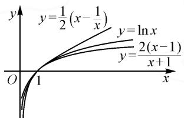
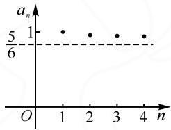

# 利用“飘带”函数不等式探究 2023 年天津高考导数题

# - 江苏省扬中高级中学 薛建龙

每一年的高考试题都是命题者的呕心沥血之作，无论从命题的角度、难度、方向等，都经过深思熟虑：既要考查知识，又要兼顾能力。而每一道题目又是出题人命题思路和思想的表达，具有典范性和权威性，高考本身就有强大的引导性，要掌握高考“风向”和高考脉搏，我们就要深入地研究高考真题。下面将从“飘带”函数不等式出发，对2023年天津高考数学卷的导数压轴题进行深入挖掘，探索其解决途径和蕴含的思想方法，以及作为一线教师，思考如何更好地进行导数教学，从而让学生“做一题，会一类，通一片”。

# 1 “飘带”函数不等式及其证明

“飘带”函数形式: $y=ax-\frac{b}{x}(ab>0)$ .

不等式形式: 若 $x \geqslant 1$ ，则 $\frac{2(x-1)}{x+1} \leqslant \ln x \leqslant \frac{1}{2} \cdot \left(x - \frac{1}{x}\right)$ ; 若 $1 \geqslant x > 0$ ，则 $\frac{1}{2} \left(x - \frac{1}{x}\right) \leqslant \ln x \leqslant \frac{2(x-1)}{x+1}$ .

只证明 $x \geqslant 1$ 的情况: 记函数 $F(x) = \ln x - \frac{1}{2}\left(x - \frac{1}{x}\right)$ , 则 $F'(x) = \frac{1}{x} - \frac{1}{2}\left(1 + \frac{1}{x^2}\right) = -\frac{(x - 1)^2}{2x^2} \leqslant 0$ , 又 $F(1) = 0$ , 故当 $x \geqslant 1, \ln x \leqslant \frac{1}{2}\left(x - \frac{1}{x}\right)$ . 设 $f(x) = \ln x - \frac{2(x - 1)}{x + 1}$ , 则 $f'(x) = \frac{(x - 1)^2}{x(x + 1)^2} \geqslant 0$ , 又 $f(1) = 0$ ,故当 $x \geqslant 1$ 时， $\ln x \geqslant \frac{2(x-1)}{x+1}$ . 如图 1.

在具体研究问题时,我们可能还需要用到它的一些其他形式,如将不等式中的 x 变为 $x+1$ , 得

line

| x | y = 1/2 (x - 1/x) | y = ln x | y = 2 (x - 1)/(x + 1) |
|---|---|---|---|
| 0 | 0 | 0 | 0 |
| 1 | 1/2 | ln x | 2 (x - 1) / (x + 1) |
| >1 | >1/2 | ln x | <ln x / (x + 1) |

图1

$$
\frac {x ^ {2} + 2 x}{2 (x + 1)} \leqslant \ln (x + 1) \leqslant \frac {2 x}{x + 2} (- 1 <   x <   0);
$$

$$
\frac {2 x}{x + 2} \leqslant \ln (x + 1) \leqslant \frac {x ^ {2} + 2 x}{2 (x + 1)} (x \geqslant 0).
$$

由“飘带”不等式不难推出对数的均值不等式和指数的均值不等式，即 $\frac{a + b}{2} >\frac{a - b}{\ln a - \ln b} >\sqrt{ab}$ ， $\mathrm{e}^{\frac{a + b}{2}} <   \frac{\mathrm{e}^a - \mathrm{e}^b}{a - b} <  \frac{\mathrm{e}^a + \mathrm{e}^b}{2}(a > b > 0).$

# 2 试题呈现

(2023 天津 20) 已知函数 $f(x) = \left(\frac{1}{x} + \frac{1}{2}\right) \ln (x + 1)$ .

(1)求曲线 $y=f(x)$ 在 x=2 处切线的斜率；  
(2) 当 x > 0 时, 证明 $f(x) > 1$ ;  
(3) 证明: $\frac{5}{6} < \ln(n!) - \left(n + \frac{1}{2}\right) \ln n + n \leqslant 1$ .

# 2.1 第(1)(2)问的解析

本题第(1)小问,考查学生的运算能力.求导,可得 $f'(x) = -\frac{1}{x^2} \ln(x + 1) + \left(\frac{1}{x} + \frac{1}{2}\right) \cdot \frac{1}{x + 1} = -\frac{\ln(x + 1)}{x^2} + \frac{x + 2}{2x(x + 1)}$ ,则 $k = f'(2) = \frac{1}{3} - \frac{\ln 3}{4}$ .

对于第(2)问,如果直接移项求导,则很复杂,我们采用转化的方式进行处理:

当 $x > 0$ 时， $f(x) > 1 \Leftrightarrow \ln (x + 1) - \frac{2x}{x + 2} > 0.$ 设 $F(x) = \ln (x + 1) - \frac{2x}{x + 2}$ ，则 $F(0) = 0, F'(x) = \frac{1}{x + 1} - \frac{4}{(x + 2)^2} = \frac{x^2}{(x + 1)(x + 2)^2} > 0$ ，故 $\ln (x + 1) > \frac{2x}{x + 2}$ ，证毕.

仔细观察第(2)问的证明,不难发现,要证的“ $\ln(x+1)>\frac{2x}{x+2}$ ”就是变形后的“飘带”不等式的一端.

# 2.3 第(3)问的解析

第(3)问的双向不等式,由于有 $\ln(n!)$ 这项的存在,因此高中阶段无法求导,可以考虑构造数列 $a_{n}=\ln(n!)-\left(n+\frac{1}{2}\right)\ln n+n$ ,转化为证: $\frac{5}{6}<a_{n}\leqslant1$ 对 n 恒成立的问题.先证右端,当 n=1 时, $a_{1}=1$ 成立.当

$n \geqslant 2$ 时，

$$
a _ {2} = \ln 2 - \frac {5}{2} \ln 2 + 2 = 2 - \frac {3}{2} \ln 2 <   a _ {1},
$$

$$
a _ {3} = \ln 6 - \frac {7}{2} \ln 3 + 3 <   a _ {2}.
$$

由此可以猜想: $\{a_{n}\}$ 是不是一个单调递减的数列呢?作差,可得

$$
\begin{array}{l} a _ {n} - a _ {n + 1} = \left[ \ln (n!) - \left(n + \frac {1}{2}\right) \ln n + n \right] - \\ \left[ \ln (n + 1)! - \left(n + \frac {3}{2}\right) \ln (n + \right. \\ 1) + (n + 1) ] \\ = \left(n + \frac {1}{2}\right) \ln \frac {n + 1}{n} - 1 \\ = f \left(\frac {1}{n}\right) - 1. \\ \end{array}
$$

由第(2)问结论易知 $a_{n}-a_{n+1}>0$ ，则 $\{a_{n}\}$ 为单减数列，故 $a_{n}\leqslant1$ 。但是 $a_{n}$ 为什么会大于 $\frac{5}{6}$ ？我们作出图象（如图2）进行分析：

scatter

| n | a_n |
|---|---|
| 1 | 5/6 |
| 2 | 5/6 |
| 3 | 5/6 |
| 4 | 5/6 |

图2

可以看出,这些离散的点 $(n,a_{n})$ 逐渐下降且都在直线 $y=\frac{5}{6}$ 的上方,即证:点的竖直方向的最大距离小于 $\frac{1}{6}$ ,即 $a_{1}-a_{n}<\frac{1}{6}(n\in\mathbf{N}^{*})$ .当 $n\to+\infty$ 时,可运用微积分的思想: $b_{i}=a_{i}-a_{i+1}=\left(i+\frac{1}{2}\right)\ln\left(1+\frac{1}{i}\right)-1(i=1,2,\cdots,n-1)$ ,若 $b_{1}+b_{2}+\cdots+b_{n}<\frac{1}{6}$ ,考虑到不等号的方向和上面的证明过程,可以很轻松地联想到“飘带”不等式的另一端,即当x>1时, $\ln x\leqslant\frac{1}{2}\left(x-\frac{1}{x}\right)$ ,即 $\ln\left(1+\frac{1}{n}\right)<\frac{1}{2}\left(1+\frac{1}{n}-\frac{1}{1+\frac{1}{n}}\right)=\frac{1}{2}\left(\frac{1}{n}+\frac{1}{n+1}\right)$ ,从而

$$
\begin{array}{l} b _ {i} = a _ {i} - a _ {i + 1} \\ = \left(i + \frac {1}{2}\right) \ln \left(1 + \frac {1}{i}\right) - 1 \\ <   \left(i + \frac {1}{2}\right) \frac {2 i + 1}{2 i (i + 1)} - 1 \\ = \frac {1}{4 i (i + 1)} \\ = \frac {1}{4} \left(\frac {1}{i} - \frac {1}{i + 1}\right). \\ \end{array}
$$

故 $b_{i}<\frac{1}{4}\left(\frac{1}{i}-\frac{1}{i+1}\right)$ .如果从 $b_{1}$ 就开始放缩，则 $b_{1}+b_{2}+\cdots+b_{n}<\frac{1}{4}$ ，但 $\frac{1}{4}>\frac{1}{6}$ ，还不够！

为提高“精度”，我们保留 $b_{1}$ ，则 $b_{1}=\frac{3}{2}\ln 2-1\approx0.039$ ，此时

$$
b _ {1} + b _ {2} + \dots \dots + b _ {n} <   \frac {3}{2} \ln 2 - 1 + \frac {1}{4} \left(\frac {1}{2} - \frac {1}{3} + \frac {1}{3} \right.
$$

$$
\left. \dots + \frac {1}{n} - \frac {1}{n + 1}\right) <   \frac {3}{2} \ln 2 - 1 + \frac {1}{8} <   0. 1 6 4 5 <   \frac {1}{6}.
$$

终于得到了理想的范围,不等式左端得证.这样我们就运用“飘带”不等式解决了问题.

反思:在上面的证明过程中,既然希望 $b_{1}+b_{2}+\cdots+b_{n}<\frac{1}{6}$ ,那么能否直接构造 $b_{i}<\frac{1}{6}\left(\frac{1}{i}-\frac{1}{i+1}\right)$ .为此,我们不妨记 $T(n)=\left(n+\frac{1}{2}\right)\ln\left(1+\frac{1}{n}\right)-\frac{1}{6}\left(\frac{1}{n}-\frac{1}{n+1}\right)-1(n\geqslant1)$ .若 $T(n)<0$ ,则即证： $\ln\left(1+\frac{1}{n}\right)<\frac{6n^{2}+6n+1}{3n(n+1)(2n+1)}$ .设 $x=\frac{1}{n}\in(0,1]$ ,则证 $F(x)=\ln(1+x)-\frac{x^{3}+6x^{2}+6x}{3(x+1)(x+2)}<0(x=1$ 时， $F(1)=\ln2-\frac{13}{18}<0$ .两边求导,得

$$
\begin{array}{l} F ^ {\prime} (x) = \frac {1}{1 + x} - \frac {x ^ {4} + 6 x ^ {3} + 1 8 x ^ {2} + 2 4 x + 1 2}{9 (x + 1) ^ {2} (x + 2) ^ {2}} \\ = \frac {- x ^ {4} + 3 x ^ {3} + 2 7 x ^ {2} + 4 8 x + 2 4}{9 (x + 1) ^ {2} (x + 2) ^ {2}} > 0. \\ \end{array}
$$

所以 $F(x)$ 单调递增，则 $F(x) \leqslant F(1) < 0$ .

故 $b_{1}+b_{2}+\cdots+b_{n}<\frac{1}{6}.$

再反思: 左端的边界 $\frac{5}{6}$ 如何达到最优？想到天津导数题的背景大都源于高等数学，笔者查阅华东师大版的数学分析教材，发现本题的背景实际上是斯特林 (stirling) 公式的应用，该公式的极限形式为：

当 $n \to \infty$ 时， $n! \sim \sqrt{2\pi n}\left(\frac{n}{\mathrm{e}}\right)^n$ .

我们可以两边取对数整理,得

$$
\lim _ {x \rightarrow + \infty} \left[ \ln (n!) - \left(n + \frac {1}{2}\right) \ln n + n \right] = \ln \sqrt {2 \pi},
$$

即 $\lim_{n\to +\infty}a_n = \ln \sqrt{2\pi}$

而数列 $\{a_{n}\}$ 单减，故不等式左端的最优界为 $\ln \sqrt{2\pi} (\ln \sqrt{2\pi}\approx 0.9189).$

(下转第124页)

$$
2 (2 + 2 d) = (1 + d) ^ {2}.
$$

解得 d=3 或 d=-1(舍去).

所以 $b_{n}=2+3(n-1)=3n-1$ .

(2)由(1)知 $a_{n} = \left(\frac{1}{2}\right)^{n}, b_{n} = 3n - 1$ ，可得 $c_{n} = a_{n}b_{n} = \frac{3n - 1}{2^{n}}$ .

那么 $T_{n}=\frac{3\times1-1}{2}+\frac{3\times2-1}{2^{2}}+\cdots\cdots+\frac{3n-1}{2^{n}}$ ，而 $\frac{1}{2}T_{n}=\frac{3\times1-1}{2^{2}}+\frac{3\times2-1}{2^{3}}+\cdots\cdots+\frac{3n-4}{2^{n}}+\frac{3n-1}{2^{n+1}}$ 以上两式对应相减，可得 $\frac{1}{2}T_{n}=1+\frac{3}{2^{2}}+\frac{3}{2^{3}}+\cdots\cdots+$ $\frac{3}{2^{n}}-\frac{3n-1}{2^{n+1}}=1+3\times\frac{\frac{1}{2^{2}}\left(1-\frac{1}{2^{n-1}}\right)}{1-\frac{1}{2}}-\frac{3n-1}{2^{n+1}}=\frac{5}{2}-$

$$
\frac {3}{2 ^ {n}} - \frac {3 n - 1}{2 ^ {n + 1}} = \frac {5}{2} - \frac {3 n + 5}{2 ^ {n + 1}}.
$$

所以 $T_{n}=5-\frac{3n+5}{2^{n}}$ .

点评:求解此类开放性试题或多选题,对加强考生高考认知、提升应试能力是有很大帮助的.在复习备考过程中,要强化对高考的认知,要逐步提升学生的应试能力.

其实,高考数学复习中的“三段论”也只是人为的一个区分与界定,在实际复习过程中,没有明显的区分与界限,只是一个分阶段、层层递进、螺旋上升、综合提升的渐进过程.因而,在实际的新高考数学备考中,教师应结合自身的教学经验与学生的实际情况,合理优化,不断修正,避免走弯路,从而不断优化复习过程,提升复习效益.Z

(上接第82页)

# 4 其他高考题中的“飘带”运用

例 1 （2022 年全国Ⅱ卷第 22 题第 3 问）设 $n \in N^{*}$ ，证明： $\frac{1}{\sqrt{1^{2}+1}} + \frac{1}{\sqrt{2^{2}+2}} + \cdots + \frac{1}{\sqrt{n^{2}+n}} > \ln(n+1)$ .

由 $\ln (n + 1) = \sum_{k=1}^{n}\left[\ln (k + 1) - \ln k\right]$ , 结合“飘带”不等式, 当 $x \geqslant 1$ 时, $\ln x \leqslant \frac{1}{2}\left(x - \frac{1}{x}\right)$ , 可取 $x = \sqrt{\frac{k+1}{n}}$ , 则 $2\ln \sqrt{\frac{k+1}{n}} < \sqrt{\frac{k+1}{n}} - \sqrt{\frac{n}{k+1}}$ .

由此可得 $\ln \frac{n + 1}{n} < \frac{1}{\sqrt{n^2 + n}}$ ，两边同时累加即可.

这道题的第(3)问可以不用前面两问的结果,直接运用“飘带”不等式解决.

例 2 （2022 年全国Ⅰ卷 7）设 $a=0.1e^{0.1}, b=\frac{1}{9}$ ， $c=-\ln 0.9$ ，则（）.

$$
\mathrm{A.} a <   b <   c \quad \mathrm{B.} c <   b <   a
$$

$$
\mathrm{C.} c <   a <   b \quad \mathrm{D.} a <   c <   b
$$

除了构造法外,这道题还有很多高等数学的解法.在本题中,我们也可以利用“飘带”不等式:

$$
c = - \ln 0. 9 = \ln \frac {1 0}{9} <   \frac {1}{2} \left(\frac {1 0}{9} - \frac {9}{1 0}\right) = \frac {1 9}{1 8 0} <   \frac {1}{9}.
$$

运用常见的切线不等式：

当 0 < x < 1 时， $1 + x < e^{x} < \frac{1}{1 - x}$ .

易得 $\frac{11}{100} < 0.1\mathrm{e}^{0.1} < \frac{1}{9}$ , 而 $\frac{19}{100} < \frac{11}{100}$ , 所以 $c < a < b$ .

故选：C.

# 5 一些感悟

回顾天津的这道高考导数题,设置的三个小问,梯度分明,层层递进,有利于人才的选拔.笔者在研究这题时,采用了化归转化的思想,利用“飘带”不等式进行放缩,其本质就是用多项式函数逼近对数函数,即“有理”逼近“无理”;并对放缩结果进行了优化处理.这也能看出,利用“飘带”不等式进行放缩,其精度比较高.为了直观解决第(3)问的左端,画出了图象,降低了思维的难度,并且有了一定的“方向”,提高了解题的效率,从而真正做到“以形助数,以数解形”.翻阅最近几年全国各地高考导数题,不难发现,函数问题中的不等式证明是常考的热点问题之一,它们大都有着高等数学中的思想和背景.例如,本题中数列的构造,也是入门的级数.但我们其实不需要让学生了解太多的高等数学内容,关键是培养学生解题时的数学直觉,熟练掌握平时学习中的一些有用结论,合理地进行分析和推演.作为一名普通的数学教育工作者,更应该在“高观点”的指导下,“低起点”进行教学,立足课本,吃透教材,让学生深刻理解教材中的典型问题,以达到举一反三的目的,争取让学生能够从容应对高考导数题.Z