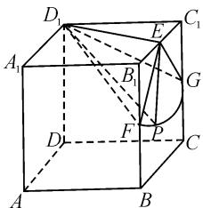
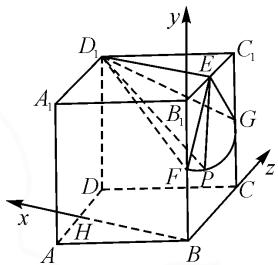
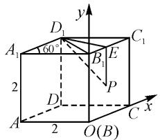
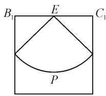

# 动点轨迹,串联立体几何与解析几何

——一道立体几何轨迹试题的探究

# 湖北省水果湖高级中学 罗超

摘要:立体几何中的轨迹及其应用问题在历年高考题中时有出现,是高考中一道亮丽的风景线.结合一道立几轨迹题,合理沟通平面与立体,“动”与“静”相结合,从不同思维视角切入与应用,归纳并总结解题技巧与策略方法,合理变式与拓展,指导数学教学与学习.

关键词: 立体几何; 解析几何; 交汇; 轨迹; 坐标; 变式

立体几何中的轨迹及其应用问题,在高中数学教材中并没有系统提及与专题介绍,但在历年高考命题中时有出现,是高考中一道亮丽的风景线.

新高考的一个重要指导思想是要求高考命题在“知识网络交汇处”设计试题，而立体几何中的轨迹及其应用问题恰好符合这一点，经常融入立体几何与平面几何等相关知识，其涉及的数学知识模块与内容更加宽广，同时也合理融合平面几何与立体几何中“动”与“静”之间的变形与结合，灵活机动，对于考生的数学“四基”以及数学“四能”的考查都有较高的要求，必定成为新高考命题的一个重要方向与基本趋势。

# 1 问题呈现

问题 在棱长均为 2 的直四棱柱 ABCD-A₁B₁C₁D₁ 中，满足 $\angle BAD = 60^{\circ}$ ，则以点 D₁ 为球心，半径为 $\sqrt{5}$ 的球面与侧面 BCC₁B₁ 的交线长是（）.

A. $\frac{\pi}{2}$ B. $\frac{\sqrt{2}\pi}{2}$ C. $\pi$ D. 2

此题以直四棱柱为问题背景,通过相应的长度与角度元素的确定,利用球面与侧面的交线长这一轨迹,串联起空间几何与平面几何.

对于立体几何中的轨迹及其应用问题,关键是把空间问题转化为平面问题,化“动”为“静”,结合直观想象,通过逻辑推理或代数运算,综合曲线的定义、立体几何的特征以及空间向量的坐标法等来破解.

# 2 追根溯源

其实,上述问题源自高考真题,借助高考真题中的填空题形式,改编为相应的选择题,进而考查立体几何中的轨迹与应用问题.

高考真题 （2020年山东卷第16题）已知直四棱柱 $ABCD-A_{1}B_{1}C_{1}D_{1}$ 的棱长均为 2， $\angle BAD=60^{\circ}$ . 以 $D_{1}$ 为球心， $\sqrt{5}$ 为半径的球面与侧面 $BCC_{1}B_{1}$ 的交线长为 \_\_\_\_.

当然,也时常会碰到以该高考真题为根源,合理改变相应的数据信息,进行合理的变式与应用.

# 3 问题破解

方法 1: 立体几何分析法.

解析:如图1,取 $B_{1}C_{1}$ 的中点为E, $BB_{1}$ 的中点为F, $CC_{1}$ 的中点为G.因为 $\angle BAD=60^{\circ}$ ，直四棱柱 $ABCD-A_{1}B_{1}C_{1}D_{1}$ 的棱长均为2，所以 $\triangle B_{1}C_{1}D_{1}$ 为等边三角形，则 $D_{1}E=\sqrt{3}$ ，所以 $D_{1}E\perp B_{1}C_{1}$ .结合直四棱柱$ABCD - A_{1}B_{1}C_{1}D_{1}$ 的几何性质，可得 $BB_{1}\perp$ 平面 $A_{1}B_{1}C_{1}D_{1}$ ，则有 $BB_{1}\perp D_{1}E.$

text_image

Geometric diagram of a cube with labeled vertices and internal points, used for spatial geometry problems.

图1

又由于 $BB_{1} \cap B_{1}C_{1} = B_{1}$ ，则有 $D_{1}E \perp$ 侧面 $BCC_{1}B_{1}$ 。设 $P$ 是对应球面与侧面 $BCC_{1}B_{1}$ 的交线上的点，则有 $D_{1}E \perp EP$ 。

因为球的半径为 $D_{1}P = \sqrt{5}$ ， $D_{1}E = \sqrt{3}$ ，所以 $EP = \sqrt{D_{1}P^{2} - D_{1}E^{2}} = \sqrt{2}$ .

所以侧面 $BCC_{1}B_{1}$ 与球面的交线上的点 P 到点 E 的距离为 $\sqrt{2}$ .

由于 $EF = EG = \sqrt{2}$ ，因此侧面 $BCC_{1}B_{1}$ 与球面的交线是扇形 EFG 所对应的弧 $\widehat{FG}$ .

结合 $\angle B_{1}EF = \angle C_{1}EG = 45^{\circ}$ ，可得 $\angle FEG = \frac{\pi}{2}$ 根据弧长公式可得 $\widehat{FG} = \frac{\pi}{2}\times \sqrt{2} = \frac{\sqrt{2}\pi}{2}.$

点评:构造空间几何体的辅助线,结合立体几何的直观分析与逻辑推理,利用几何元素之间的位置关系直接判断,将交线长问题转化为对应的弧长问题,将立体几何中的对应知识转化为平面几何中的弧长知识,进而结合弧长公式与相关知识来分析与求解即可.立体几何分析法具有较好的直观想象与逻辑推理的核心素养,也是破解此类问题的几何法处理的主要依据.

方法 2: 空间坐标法.

解析: 取 AD 的中点 H，
由题意知直四棱柱 ABCD- $A_{1}B_{1}C_{1}D_{1}$ 的棱长均为 2， $\angle BAD=60^{\circ}$

所以可知 $\triangle B_{1}C_{1}D_{1}$ 为等边三角形，且 $D_{1}B_{1}=2$ ，棱柱上下底面均是菱形，则有 $BH\perp BC$ .

text_image

y
D₁
C₁
A₁
B₁
G
D
F
P
C
x
H
A
B
z

图2

如图2所示，以点 $B$ 为坐标原点， $BH, BB_{1}, BC$ 所在直线分别为 $x$ 轴、 $y$ 轴、 $z$ 轴，建立空间直角坐标系 $B - xyz$ ，则可得 $B(0,0,0), C(0,0,2), B_{1}(0,2,0), C_{1}(0,2,2), D_{1}(\sqrt{3},2,1)$ .

所以，以 $D_{1}$ 为球心， $\sqrt{5}$ 为半径的球面方程为

$$
(x - \sqrt {3}) ^ {2} + (y - 2) ^ {2} + (z - 1) ^ {2} = 5.
$$

令 $x = 0$ ，整理可得 $(y - 2)^{2} + (z - 1)^{2} = 2$ ，其是以 $B_{1}C_{1}$ 的中点 $E(2,1)$ 为圆心，半径为 $\sqrt{2}$ 的一段圆弧.

因为 $\angle B_{1}EF = \angle C_{1}EG = 45^{\circ}$ ，所以 $\angle FEG = 90^{\circ}$

所以，以 $D_{1}$ 为球心， $\sqrt{5}$ 为半径的球面与侧面 $BCC_{1}B_{1}$ 的交线长为 $\frac{1}{4}\times2\sqrt{2}\pi=\frac{\sqrt{2}\pi}{2}$ .

点评:空间直角坐标系的建立,把立体几何中的相关问题转化为代数运算问题,通过代数运算得到交线的轨迹方程,将交线长问题转化为相应的圆弧长问题,利用平面解析几何与平面几何的知识来合理转化,最后利用圆中的弧长公式来分析与求解即可.空间坐标法可以有效化逻辑推理问题为代数运算问题,化空间问题为平面问题,是破解此类问题的运算性策略.

方法 3: 平面几何轨迹法.

解析:依题意可知 $\triangle B_{1}C_{1}D_{1}$ 为等边三角形,且 $D_{1}B_{1}=2$ ,同时直四棱柱的上、下底面均是菱形.

建立如图 3 所示的平面直角坐标系, 设 $P(x, y)$ 为侧面 $BCC_{1}B_{1}$ 与球面的交线上的点.

在 $\triangle B_{1}D_{1}E$ 中，利用余弦定理，可得 $D_{1}E^{2} = D_{1}B_{1}^{2} + x^{2} - 2\cdot D_{1}B_{1}\cdot x\cdot \cos 60^{\circ} = x^{2} - 2x + 4.$

而 $D_{1}P=\sqrt{5}$ ，所以可得 $D_{1}P^{2}=5=x^{2}-2x+4+(2-y)^{2}=5$ ，整理可得 $(x-1)^{2}+(y-2)^{2}=2$ ，则知点P 在侧面 $BCC_{1}B_{1}$ 的轨迹是以 $B_{1}C_{1}$ 的中点 E 为圆心，半径为 $\sqrt{2}$ 的圆弧（如图 4）. 余略.

text_image

y
D₁
C₁
A₁
60°
B₁
E
2
P
D₁
A
2
O(B)
C
x

图3

  
图4

点评:在处理空间立体几何问题时,除了空间坐标系的构建外,还可以借助某一确定平面上对应平面直角坐标系的构建来处理该平面上的相关问题,这里采用的就是这一特殊思维方式.在立体几何中渗透平面解析几何场景,结合平面解析几何中相关问题的分析与求解来分析与应用,实现问题的突破与求解.平面几何轨迹法综合了立体几何分析法与空间坐标法的优点,直接选取其中有用的一面加以展开.

# 4 变式拓展

变式 1 [2024 年山东省滨州市高三(上)期末] 在棱长均为 4 的直四棱柱 $ABCD-A_{1}B_{1}C_{1}D_{1}$ 中，满足 $\angle ABC=60^{\circ}$ ，则以点 A 为球心，半径为 $2\sqrt{5}$ 的球面与侧面 $CDD_{1}C_{1}$ 的交线长是 \_\_\_\_ . ( $\sqrt{2}\pi$ )

变式 2 在棱长均为 2 的直四棱柱 ABCD-A₁B₁C₁D₁ 中，满足 ∠BAD=60°，则以点 D₁ 为球心，半径为 $\sqrt{5}$ 的球面与侧面 BCC₁B₁ 的交线分侧面 BCC₁B₁ 所成的两部分平面图形的面积之比为 \_\_\_\_·( $\frac{2+\pi}{6-\pi}$ )

# 5 解后反思

其实,涉及立体几何场景下动点的轨迹问题及其综合应用问题,包含“二维”平面与“三维”空间的丰富内涵,问题立意深远,同时“动”与“静”巧妙结合,问题中既有立体几何的直观图形,又有解析几何的轨迹问题,对考生的空间想象能力、推理论证能力,以及逻辑推理、直观想象等核心素养要求很高.

此类问题架设了一座沟通立体几何与解析几何的“桥梁”，体现了“在知识交汇点处命题”的指导思想，同时对于平面几何与平面解析几何中的“二维”平面，与立体几何中的“三维”空间之间产生合理的转化与应用，在一定程度上可以有效完善考生的数学思维，实现“三维”向“二维”的转化，以及“动”与“静”巧妙结合的处理与应用，可以有效提升学生的数学“四能”，优化数学思维品质，养成良好的解题习惯.