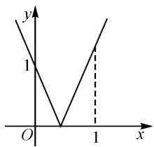
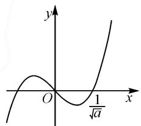

# 参变量融合,绝对值转化

——一道含参三次函数试题的探究

# 甘肃省古浪县第三中学 李永科 窦立群

绝对值不等式是初、高中皆有的内容，涉及不等式、函数等相关知识，备受命题者的青睐，时常在高考试题中“闪亮”登场。而以绝对值不等式为命题场景，合理融入其他复杂的函数模型，实现知识点之间的巧妙交汇，创新新颖，成为新高考命题与应用的一个基本点。

# 1 问题呈现

问题 已知 $a \in \mathbf{R}$ , 函数 $f(x) = ax^3 - x$ , 若存在 $t \in \mathbf{R}$ , 使得 $|f(t + 2) - f(t)| \leqslant 2$ , 则实数 $a$ 的最大值为 \_\_\_\_.

本题通过含参函数与不等式的巧妙结合,以存在性命题为依托,求参数的取值范围或最值.解决此类问题的关键是如何对参变量加以处理,有效结合函数图象,做到心中有数,数形结合,把对应的不等式问题直观化、具体化.

# 2 追根溯源

以上问题改编自高考真题,依托问题应用场景,合理改变不等式中的常数,进而得以变式与改编应用.

高考真题 （2019年高考数学浙江卷·16）已知 $a \in \mathbf{R}$ ，函数 $f(x) = ax^3 - x$ ，若存在 $t \in \mathbf{R}$ ，使得 $|f(t + 2) - f(t)| \leqslant \frac{2}{3}$ ，则实数 $a$ 的最大值是 \_\_\_\_.（答案为： $\frac{4}{3}$ .）

# 3 一题多解

方法 1: 参变量分离法.

解析:由 $f(x)=ax^{3}-x$ ，结合 $\left|f(t+2)-f(t)\right|\leqslant2$ ，可得 $\left|2a\left(3t^{2}+6t+4\right)-2\right|\leqslant2$ ，即 $\left|a\left(3t^{2}+6t+4\right)-1\right|\leqslant1$ ，可得 $\left|a\left(3t^{2}+6t+4\right)\right|\leqslant2$ .

由于 $3t^{2} + 6t + 4 = 3(t + 1)^{2} + 1 \in [1, +\infty)$ ，则存在 $t \in \mathbf{R}$ ，使得 $|a| \leqslant \frac{2}{3t^2 + 6t + 4} \leqslant \frac{2}{1} = 2$ .

所以 $|a|\leqslant2$ ，则a的最大值是2.

点评:利用分离参变量法,使得参数独立出来,把问题转化为求解相关新函数的值域或最值问题,从而达到求解相应参数取值范围或最值的目的.这也是平时处理相关多变量问题中比较常见的一类思维方法.

方法 2: 换元降幂法.

解析:由 $f(x)=ax^{3}-x$ ，可得 $f(t+2)-f(t)=2a(3t^{2}+6t+4)-2$ 。令 $m=3t^{2}+6t+4=3(t+1)^{2}+1\in[1,+\infty)$ ，则原不等式 $|f(t+2)-f(t)|\leqslant2$ 转化为存在 m 使得 $\left\{\begin{aligned}m&\geqslant1,\\ |am-1|&\leqslant1.\end{aligned}\right.$

line

| x | y |
|---|---|
| 0 | 0 |
| 1 | 1 |

图 1

如图 1, 结合折线函数图象可知, 只需 $a-1 \leqslant 1$ 即可, 解得 $a \leqslant 2$ , 故 a 的最大值是 2.

点评:通过换元降幂,结合二次函数的图象与性质确定所换变量的取值范围,进而结合原不等式加以转化,通过一次绝对值函数所对应的折线函数图象进行分析,进而得以求解相应的参数的取值范围或最值问题.降幂处理是数学破解中比较常见的思维方式,使得高次幂向低次幂转化,降低运算难度,提升效益.

方法 3: 绝对值定义转化法.

解析: 方法 2 可知, 原不等式 $\left|f(t+2)-f(t)\right|\leqslant2$ 可转化为存在 m 使得 $|am-1|\leqslant1$ 在 $[1,+\infty)$ 上有解.

(1) 当 $a < 0$ 时， $|am - 1| \leqslant 1$ 在 $[1, +\infty)$ 上无解；

(2) 当 $a = 0$ 时, $|am - 1| \leqslant 1$ 在 $[1, +\infty)$ 上恒成立;

(3) 当 $a > 0$ 时, $|am - 1| \leqslant 1$ 可化为 $\left|m - \frac{1}{a}\right| \leqslant \frac{1}{a}$ , 而 $m \in [1, +\infty)$ , 结合绝对值的定义, 可得 $\frac{1}{a} + \frac{1}{a} \geqslant 1$ , 解得 $a \leqslant 2$ .

综上可知，a 的最大值是 2.

点评:利用绝对值定义来解决一些绝对值不等式问题,充分回归绝对值的本质,将“绝对值”的问题转化为“数轴上两点间的距离”问题,把代数问题几何化,使得问题更加直接、直观.利用绝对值定义解决此类问题时,一定要注意变量的取值范围对整体的影响,不能出现遗漏.

方法 4: “化曲为直” 思维法.

解析: 同方法 2, 将原不等式 $\left|f(t+2)-f(t)\right|\leqslant2$ 转化为存在 m 使得 $|am-1|\leqslant1$ 在 $[1,+\infty)$ 上有解, 故只需满足 $|a\times1-1|\leqslant1$ 即可, 解得 $0\leqslant a\leqslant2$ , 则 a 的最大值是 2.

点评:采用“化曲为直”思维,巧妙把对应的“曲(线)”问题转化为“直(线)”问题来处理,可以简化条件,使得问题更加“理想化”,处理起来会更加顺手,经常借助“直(线)”问题加以数形结合,利用函数图象加以直观处理.在利用“化曲为直”思维处理问题时,要注意等价转化.

方法 5: 二次函数转化法.

解析:由 $f(x)=ax^{3}-x$ ，可得 $f(t+2)-f(t)=6at^{2}+12at+8a-2$ .

当 a=0 时， $\left|f(t+2)-f(t)\right|\leqslant2$ 恒成立.

当 $a \neq 0$ 时，设 $g(t) = 6at^2 + 12at + 8a - 2 = 6a(t + 1)^2 + 2a - 2$ ，则原问题转化为存在 $t \in \mathbf{R}$ ，使得 $|g(t)| \leqslant 2$ ，则有 $|g(t)|_{\min} \leqslant 2$ 。

因为要求 a 的最大值, 所以只需考虑 a > 0, 而 $\Delta = (12a)^{2} - 4 \times 6a \times (8a - 2) = 48a(1 - a)$ .

(1) 当 $\Delta \geqslant 0$ 时，即 $0 < a \leqslant 1$ ，此时 $\left| g(t) \right|_{\min} = 0$ ，满足条件；(2) 当 $\Delta < 0$ 时，即 a > 1，只要 $2a - 2 \leqslant 2$ 即可，解得 $1 < a \leqslant 2$ .

综上可知，a 的最大值是 2.

点评:通过关系式的等价转化,显示出“二次函数”的面貌,通过二次函数的图象与性质来处理是比较容易想到的基本方法.借助二次函数转化法来处理,回归熟悉的函数模型,有效转化,通过二次函数与对应的二次方程的基本关系,结合二次项系数、判别式等相关信息来数形结合,直观处理.

方法 6: 三次函数图象特点法.

解析: 函数 $f(x)=ax^{3}-x$ 是奇函数, 如图 2, 当 a>0 时, 令 $f(x)=0$ , 得 x=0 或 $x=\pm\frac{1}{\sqrt{a}}$ .由于当 $a$ 越大时， $\frac{1}{\sqrt{a}}$ 越接近于0，而在 $\frac{1}{\sqrt{a}}$ 的右侧附近一定存在一点

text_image

y
O
1/√a
x

图 2

$x_0$ ，使得 $\left|f(x_0 + 2) - f(x_0)\right|\leqslant 2$ ，因此只考虑 $\frac{1}{\sqrt{a}} < 1$ 的情形，且只需满足 $\left|f(1) - f(-1)\right|\leqslant 2$ ，即 $2a - 2\leqslant$ 2，解得 $a\leqslant 2$ ，则 $a$ 的最大值是2.

点评:利用三次函数图象的特点,巧妙把问题加以直观转化,从而数形结合来达到解题的目的.结合函数图象特征,有效合理分配“根”的分布与规律,把问题加以合理转化,结合直观处理,从而逐步特殊化处理,让人耳目一新.

方法 7: “两边夹” 思维法.

解析:由 $f(x)=ax^{3}-x$ ，结合 $\left|f(t+2)-f(t)\right|\leqslant2$ ，可得 $\left|2a\left(3t^{2}+6t+4\right)-2\right|\leqslant2$ ，则可以得到 $-2\leqslant2a\left(3t^{2}+6t+4\right)-2\leqslant2$ 有解，则 $0\leqslant a\leqslant\frac{2}{3t^{2}+6t+4}$ 有

解.而 $3t^{2}+6t+4=3(t+1)^{2}+1\in[1,+\infty)$ ，可得 $\frac{2}{3t^{2}+6t+4}\in(0,2]$ ，所以 $0\leqslant a\leqslant2$ ，则a的最大值是2.

点评:在解决一些不等式问题中,经常借助“两边夹”思维.“两边夹”思维可以使得问题更加明朗,从正向角度转化问题,直击问题的关键与问题的本质,从而更为直接明确问题的内涵以及命题的意图,能有效化复杂为简单,使得问题的解决更加具有目的性、针对性.

# 4 变式拓展

变式1 已知 $a \in \mathbf{R}$ , 函数 $f(x) = ax^3 - x$ , 若对任意 $t \in \left[-\frac{4}{3}, 0\right]$ , 使得 $|f(t + 2) - f(t)| \geqslant \frac{2}{3}$ , 则实数 $a$ 的取值范围是 \_\_\_\_.

解析:由 $f(x)=ax^{3}-x$ ，则有 $\left|f(t+2)-f(t)\right|=\left|2a\left(3t^{2}+6t+4\right)-2\right|\geqslant\frac{2}{3}$ ，可得 $a\left(3t^{2}+6t+4\right)\leqslant\frac{2}{3}$ 或 $a\left(3t^{2}+6t+4\right)\geqslant\frac{4}{3}$ 恒成立.

当 a>0 时， $3t^{2}+6t+4\leqslant\frac{2}{3a}$ 或 $3t^{2}+6t+4\geqslant\frac{4}{3a}$ 恒成立，只需 $(3t^{2}+6t+4)_{\max}\leqslant\frac{2}{3a}$ 或 $(3t^{2}+6t+4)_{\min}\geqslant\frac{4}{3a}$ .

而函数 $y = 3t^2 + 6t + 4 = 3(t + 1)^2 + 1, t \in \left[-\frac{4}{3}, 0\right]$ ，所以当 $t = -1$ 时， $y_{\min} = 1$ ；当 $t = 0$ 时， $y_{\max} = 4$ .

所以有 $4 \leqslant \frac{2}{3a}$ 或 $1 \geqslant \frac{4}{3a}$ , 解得 $a \leqslant \frac{1}{6}$ 或 $a \geqslant \frac{4}{3}$ , 又 $a > 0$ , 可得 $0 < a \leqslant \frac{1}{6}$ 或 $a \geqslant \frac{4}{3}$ .

当 $a \leqslant 0$ 时，

$|f(t+2)-f(t)|=2|a[3(t+1)^{2}+1]-1|\geqslant2>\frac{2}{3},$ 此时不等式 $|f(t+2)-f(t)|\geqslant\frac{2}{3}$ 恒成立.

综上可知， $a \leqslant \frac{1}{6}$ 或 $a \geqslant \frac{4}{3}$ ，即实数 a 的取值范围是 $\left(-\infty, \frac{1}{6}\right] \cup \left[\frac{4}{3}, +\infty\right)$ .

故填答案: $\left(-\infty,\frac{1}{6}\right]\cup\left[\frac{4}{3},+\infty\right)$ .

# 5 解后反思

在解决涉及绝对值与不等式恒成立、不等式存在性等交汇与综合问题时，既要紧扣“绝对值”定义与特征，又要有机联系相应的不等式，使得二者之间整体化、系统化。破解问题时，往往综合数形结合思想、化归与转化思想、分类讨论思想及函数思想等，使问题的破解得到大大简化，效果明显。Z