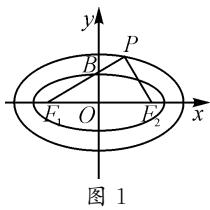
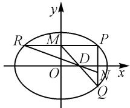

# 圆锥曲线最值(取值范围)问题的应对策略

# 江苏省常熟市海虞高级中学 高娜

涉及圆锥曲线中的基本元素、关系式、代数式等的最值(或取值范围)问题,立足圆锥曲线的基础知识与基本能力,成为高考命题中的热点与难点题型之一,能有效考查考生的数学“四基”与“四能”,具备较好的高考选拔性与区分度,备受各方关注.

# 1 几何特征法

几何特征法处理圆锥曲线中的最值(或取值范围)问题,往往是依托圆锥曲线的几何本质,利用平面几何的性质、图形直观、几何意义等解决问题.

例 1 已知 $A(x_{1}, y_{1}), B(x_{2}, y_{2})$ 为抛物线 $y^{2} = 8x$ 上两个不同的动点，且满足 $y_{1}y_{2} = -16$ ，则 $\left|x_{1} + y_{1} + 2\right| + \left|x_{2} + y_{2} + 2\right|$ 的最小值为 \_\_\_\_.

解析:设直线 AB 的方程为 $x=my+n, n>0$ . 联立 $\left\{\begin{aligned}x&=my+n,\\ y^{2}&=8x,\end{aligned}\right.$ 消去 x 并整理可得 $y^{2}-8my-8n=0$ ，则有 $y_{1}+y_{2}=8m, y_{1}y_{2}=-8n=-16$ ，解得 n=2，所以直线 AB 过焦点 $F(2,0)$ . 设 AB 的中点为 M，则 $y_{M}=\frac{1}{2}(y_{1}+y_{2})=4m, x_{M}=my_{M}+n=4m^{2}+2$ ，即 $M(4m^{2}+2,4m)$ .

设点 A, B, M 到直线 $l: x + y + 2 = 0$ 的距离分别为 $d_{1}, d_{2}, d$ ，结合梯形的中位线可得 $d_{1} + d_{2} = 2d$ .

又根据点到直线的距离公式，可得 $d_{1} = \frac{|x_{1} + y_{1} + 2|}{\sqrt{2}}, d_{2} = \frac{|x_{2} + y_{2} + 2|}{\sqrt{2}}, d = \frac{|x_{M} + y_{M} + 2|}{\sqrt{2}}.$

所以 $|x_1 + y_1 + 2| + |x_2 + y_2 + 2| = \sqrt{2}(d_1 + d_2) = 2\sqrt{2} d = 2|4m^2 +4m + 4| = 8(m^2 +m + 1) = 8\left[\left(m + \frac{1}{2}\right)^2 +\frac{3}{4}\right]\geqslant 6$ ，当且仅当 $m + \frac{1}{2} = 0$ ，即 $m = -\frac{1}{2}$ 时，等号成立.所以，应填：6.

点评:对于本题,几何特征法的依据是所求结果中代数式吻合点到直线的距离公式,自然联想到通过点到直线的距离公式来转化与应用.距离思维的应用离不开平面几何的基本性质,以及平面解析几何中的点、直线等要素的综合应用与转化,由此实现代数式的最值的求解.

# 2 三角函数法

三角函数法处理圆锥曲线中的最值(或取值范围)问题,往往是依托角参构建三角函数关系式,结合三角函数的图象与性质、有界性等解决问题.

例 2 如图 1 所示, 椭圆 $C_{1}$ : $\frac{x^{2}}{a_{1}^{2}} + \frac{y^{2}}{b_{1}^{2}} = 1 (a_{1} > b_{1} > 0)$ 和 $C_{2}$ : $\frac{x^{2}}{a_{2}^{2}} + \frac{y^{2}}{b_{2}^{2}} = 1 (a_{2} > b_{2} > 0)$ 有相同的焦点 $F_{1}, F_{2}$ , 两椭圆 $C_{1}$ 和 $C_{2}$

text_image

y
P
B
F₁ O F₂ x
图 1

的离心率分别为 $e_{1}, e_{2}, B$ 为椭圆 $C_{1}$ 的上顶点，满足 $F_{2}P \perp F_{1}P, F_{1}, B, P$ 三点共线且垂足 P 在椭圆 $C_{2}$ 上，则 $\frac{e_{1}}{e_{2}}$ 的最大值是 \_\_\_\_.

解析:依题,设 $\angle PF_{1}F_{2}=\alpha,\alpha\in\left(0,\frac{\pi}{2}\right),|F_{1}F_{2}|=2c$ ,结合题设条件 $F_{2}P\perp F_{1}P$ ,且 $B$ 为椭圆 $C_{1}$ 的上顶点,可知 $|PF_{1}|+|PF_{2}|=2c(\cos\alpha+\sin\alpha),|BF_{1}|=a_{1}=\frac{c}{\cos\alpha}$ .则有 $\frac{e_{1}}{e_{2}}=\frac{\frac{2c}{2a_{1}}}{\frac{2c}{2a_{2}}}=\frac{2a_{2}}{2a_{1}}=\frac{|PF_{1}|+|PF_{2}|}{2|BF_{1}|}=\frac{2c(\cos\alpha+\sin\alpha)}{\frac{2c}{\cos\alpha}}=(\cos\alpha+\sin\alpha)\cos\alpha=\frac{1+\cos 2\alpha}{2}+\frac{1}{2}\sin 2\alpha=\frac{\sqrt{2}}{2}\sin\left(2\alpha+\frac{\pi}{4}\right)+\frac{1}{2}\leqslant\frac{\sqrt{2}+1}{2}$ ,当且仅当 $2\alpha+\frac{\pi}{4}=\frac{\pi}{2}$ ,即 $\alpha=\frac{\pi}{8}$ 时,等号成立.所以填: $\frac{\sqrt{2}+1}{2}$ .

点评:借助圆锥曲线所对应的图形特征,利用垂直关系巧妙引入角参,利用直角三角形及三角函数的定义来表示对应边的长度,进而将所求的代数式合理转化为相应的三角函数表达式,为进一步利用三角函数法处理与解决问题创造条件.三角函数法的应用,是回归三角函数定义或平面几何图形本质,借助角参等的引入来合理构建三角函数表达式.

# 3 不等式思维法

不等式思维法处理圆锥曲线中的最值(或取值范围)问题,往往是依托不等式的基本性质来转化,借助不等式的合理放缩来分析与解决问题.

例 3 在平面直角坐标系 xOy 中, 定义 $d(A, B) = |x_{1} - x_{2}| + |y_{1} - y_{2}|$ 为 $A(x_{1}, y_{1}), B(x_{2}, y_{2})$ 两点间的“曼哈顿距离”. 已知椭圆 $C: \frac{x^{2}}{2} + y^{2} = 1$ , 点 P, Q, R 在椭圆 C 上, $PQ \perp x$ 轴. 点 M, N 满足 $\overrightarrow{RM} = \overrightarrow{MP}$ , $\overrightarrow{PN} = 2\overrightarrow{NQ}$ . 若直线 MQ 与 NR 的交点在 x 轴上, 则 $d(R, Q)$ 的最大值为 \_\_\_\_.

解析:依题,设 $P(x_{1},y_{1}), R(x_{2},y_{2})$ , 结合 $PQ \perp$ x 轴, 且点 M, N 满足 $\overrightarrow{RM} = \overrightarrow{MP}$ , $\overrightarrow{PN} = 2 \overrightarrow{NQ}$ , 则可得 $Q(x_{1}, -y_{1})$ , $M\left(\frac{x_{1} + x_{2}}{2}, \frac{y_{1} + y_{2}}{2}\right)$ , $N\left(x_{1}, -\frac{y_{1}}{3}\right)$ ,
如图2所示.设直线MQ与NR在
x 轴上的交点为 D(t,0)，则有

  
图2

$$
\frac {- y _ {1} - \frac {y _ {1} + y _ {2}}{2}}{x _ {1} - \frac {x _ {1} + x _ {2}}{2}} = \frac {- y _ {1} - 0}{x _ {1} - t}, \text {即}
$$

$$
\frac {3 y _ {1} + y _ {2}}{x _ {1} - x _ {2}} (x _ {1} - t) = y _ {1}. \tag {①}
$$

又有 $\frac{y_{2}+\frac{y_{1}}{3}}{x_{2}-x_{1}}=\frac{-\frac{y_{1}}{3}-0}{x_{1}-t}$ ，即

$$
\frac {y _ {1} + 3 y _ {2}}{x _ {1} - x _ {2}} (x _ {1} - t) = y _ {1}. \tag {②}
$$

由①②可知 $3y_{1} + y_{2} = y_{1} + 3y_{2}$ ，即 $y_{1} = y_{2}$ ，结合对称性可知 $x_{2} = -x_{1}$ .利用创新定义，可知 $d(R,Q) = |x_1 - x_2| + |y_1 + y_2| = 2(|x_1| + |y_1|)$ .结合柯西不等式，可得 $d(R,Q) = 2(|x_1| + |y_1|)\leqslant$ $2\sqrt{\left(\frac{x_1^2}{2} + y_1^2\right)(2 + 1)} = 2\sqrt{3}$ ，当且仅当 $\frac{x_1}{2} = y_1 = \frac{\sqrt{3}}{3}$ 时，等号成立.所以 $d(R,Q)$ 的最大值为 $2\sqrt{3}$

点评:解决此类问题时,回归平面解析几何本质,合理借助设点法,并依据点之间的位置关系以及平面向量的线性关系来确定其他相关点的坐标,利用直线的斜率或方程等来建立关系式,进而确定对应坐标之间的关系,为创新定义的应用奠定基础.而合理利用重要不等式(基本不等式、柯西不等式等)的放缩,为最值的求解创设条件,成为问题求解与突破的关键.

# 4 函数性质法

函数性质法处理圆锥曲线中的最值(或取值范围)问题,往往是依托对应参数的引入与函数关系式的构建,结合二次函数的基本性质、函数与导数的应用等来分析与解决问题.

例 4 在平面直角坐标系 xOy 中, 直线 l 与抛物线 W: $x^{2}=2y$ 相切于点 P, 且与椭圆 C: $\frac{x^{2}}{2}+y^{2}=1$ 交于 A, B 两点.

(1) 当 P 的坐标为 $(2,2)$ 时，求 $|AB|$ ;

(2) 若点 G 满足 $\overrightarrow{GO} + \overrightarrow{GA} + \overrightarrow{GB} = 0$ ，求 $\triangle GAB$ 面积的最大值.

解析:(1) $|AB|=\frac{10\sqrt{2}}{9}$ ，过程略.

(2) 设 $A(x_{1}, y_{1})$ , $B(x_{2}, y_{2})$ ，由题意知，切线 l 斜率存在，设 l 的方程为 $y = kx + b$ ，代入抛物线 W: $x^{2} = 2y$ 中，可得 $x^{2} - 2kx - 2b = 0$ 。所以 $\Delta = 4k^{2} + 8b = 0$ ，即 $k^{2} = -2b$ 。由 $\left\{\begin{aligned} y &= kx + b, \\ \frac{x^{2}}{2} + y^{2} &= 1, \end{aligned}\right.$ 得 $(2k^{2} + 1)x^{2} + 4kbx + 2b^{2} - 2 = 0$ 。所以 $x_{1} + x_{2} = \frac{-4kb}{1 + 2k^{2}}$ ， $x_{1}x_{2} = \frac{2b^{2} - 2}{1 + 2k^{2}}$ 。

由 $\Delta_{1}=8(1-4b-b^{2})>0$ , 得 $1-4b>b^{2}$

所以 $S_{\triangle OAB} = \frac{1}{2}|x_1y_2 - x_2y_1| = \frac{1}{2}|b||x_1 - x_2| =$ $\frac{1}{2}|b|\sqrt{\frac{16k^2b^2}{(1 + 2k^2)^2} - \frac{8(b^2 - 1)}{1 + 2k^2}} = \sqrt{2}\cdot \frac{|b|\sqrt{1 - 4b - b^2}}{1 - 4b} =$ $\sqrt{2}\cdot \frac{\sqrt{\frac{1}{b^2} - \frac{4}{b} - 1}}{\frac{1}{b^2} - \frac{4}{b}}.$

令 $\frac{1}{b^2} -\frac{4}{b} = t > 0$ ，所以 $S_{\triangle OAB} = \sqrt{2}\cdot \frac{\sqrt{t - 1}}{t} =$ $\sqrt{2}\cdot \sqrt{\frac{1}{t} - \frac{1}{t^2}} = \sqrt{2}\cdot \sqrt{-\left(\frac{1}{t} - \frac{1}{2}\right)^2 + \frac{1}{4}}\leqslant \frac{\sqrt{2}}{2}$ ，当且仅当 $t = 2$ ，即 $b = -1 - \frac{\sqrt{6}}{2}$ 时等号成立，代入 $\Delta_1 =$ $8(1 - 4b - b^2) > 0$ 成立，所以 $S_{\triangle OAB}$ 的最大值为 $\frac{\sqrt{2}}{2}$ 因为 $\overrightarrow{GO} +\overrightarrow{GA} +\overrightarrow{GB} = 0$ ，则 $G$ 为△OAB的重心，可得 $S_{\triangle GAB} = \frac{1}{3} S_{\triangle OAB}$ ，则△GAB面积的最大值为 $\frac{\sqrt{2}}{6}$

点评:解决此类问题时,特别是涉及三角形的面积或周长等的最值(或取值范围)问题,通过对应的公式应用构建含参的关系式,合理借助整体思维,巧妙利用换元法,通过二次函数的图象与性质、函数与导数的应用等来确定最值,往往是解决此类问题中比较常见的思维方式.

其实,涉及圆锥曲线中的基本元素、关系式、代数式等的最值(或取值范围)问题,可以较好地将平面解析几何知识与函数与方程、平面几何、三角函数、不等式等加以综合,体现数学知识点之间的交汇性、综合性与应用性等.在求解时,根据题设灵活合理地选用本文提到的方法,可以实现最值问题的求解与突破.Z