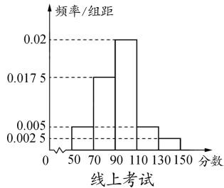
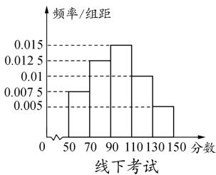
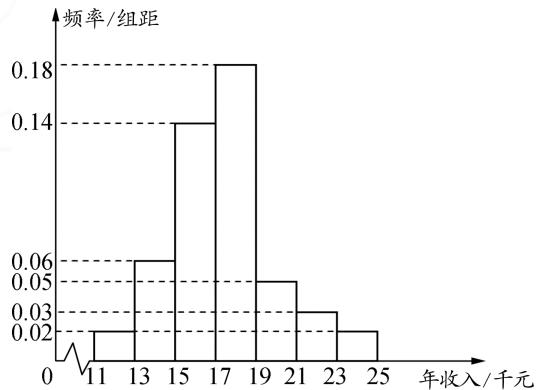

# 基于超几何分布与二项分布的最值问题例析

# - 江苏省海门中学 郭淼红

实际应用场景下的概率最值与综合应用问题,是概率与统计模块考查的一个基本方向.特别地,基于超几何分布与二项分布的最值与综合应用问题,一直是高考命题的基本考点与应用点,要引起高度重视.

# 1 超几何分布中的最值问题

例 1 某校参加某次大型考试时采用了线上考试和线下考试两种形式. 现随机抽取 200 名同学的数学成绩做分析, 其中线上人数占 40%, 线下人数占 60%, 分别统计他们的数学成绩, 得到了如图 1 所示的两个频率分布直方图.

histogram

| 分数 | 频率/组距 |
|---|---|
| 50-70 | 0.005 |
| 70-90 | 0.0175 |
| 90-110 | 0.02 |
| 110-130 | 0.005 |
| 130-150 | 0.0025 |

图1  

histogram

| 分数 | 频率/组距 |
|---|---|
| 50-70 | 0.0075 |
| 70-90 | 0.0125 |
| 90-110 | 0.015 |
| 110-130 | 0.01 |
| 130-150 | 0.005 |

其中 $(50,70]$ 称为合格， $(70,90]$ 称为中等， $(90,110]$ 称为良好， $(110,130]$ 称为优秀， $(130,150]$ 称为优异.

(1)根据频率分布直方图中的数据信息,求这200名同学的数学成绩的平均分(同一组数据可取该组区间的中点值代替);  
(2) 现从这 200 名学生中随机抽取一名同学的数学成绩为良好, 试分析他是来自线上考试的可能性大, 还是来自线下考试的可能性大;  
(3)现从样本中线下考试的学生中随机抽取10名同学,且抽到k个学生的数学成绩为中等的可能性最大,试求k的值.

解析:(1)由题意易得线上考试同学的平均分为93分;线下考试同学的平均分为97分.又200名同学中线上人数占40%,线下占60%,故这200名同学的平均分为 $93\times40\%+97\times60\%=95.4$ (分).

(2)线上、线下考试成绩良好的人数分别为 $0.02 \times 20 \times 200 \times 40\% = 32, 0.015 \times 20 \times 200 \times 60\% = 36$ . 因为抽取的数学成绩为良好，且 32 < 36，所以来自线下的可能性大.  
(3)线下考试成绩中等的人数为 $0.0125 \times 20 \times 200 \times 60\% = 30$ ，其他同学90人。所以，从线下学生中随机抽取10名同学，抽到k个学生的成绩为中等的概率 $P(X = k) = \frac{C_{30}^{k} C_{90}^{10 - k}}{C_{120}^{10}}$ ，其中1 < k < 10且 $k \in N^{*}$ 。

要使 $P(X = k)$ 最大，则 $\left\{ \begin{array}{l} P(X = k) > P(X = k - 1), \\ P(X = k) > P(X = k + 1), \end{array} \right.$ 即

$$
\left\{ \begin{array}{l} \frac {\mathrm{C} _ {3 0} ^ {k} \mathrm{C} _ {9 0} ^ {1 0 - k}}{\mathrm{C} _ {1 2 0} ^ {1 0}} > \frac {\mathrm{C} _ {3 0} ^ {k - 1} \mathrm{C} _ {9 0} ^ {1 1 - k}}{\mathrm{C} _ {1 2 0} ^ {1 0}}, \\ \frac {\mathrm{C} _ {3 0} ^ {k} \mathrm{C} _ {9 0} ^ {1 0 - k}}{\mathrm{C} _ {1 2 0} ^ {1 0}} > \frac {\mathrm{C} _ {3 0} ^ {k + 1} \mathrm{C} _ {9 0} ^ {9 - k}}{\mathrm{C} _ {1 2 0} ^ {1 0}}. \end{array} \right.
$$

所以 $\left\{\begin{aligned}k^{2}+80k&<k^{2}-42k+341,\\ k^{2}-40k&+300<k^{2}+82k+81,\end{aligned}\right.$ 解得 $\frac{219}{122}<k<\frac{341}{122}.$ 又 $k\in N^{*}$ ，故 k=2.

点评:在解决超几何分布的最值问题时,将从次品数为 a 的 $(a+b)$ 件产品中取出 n 件产品的可能组合全体作为样本点,总数为 $C_{a+b}^{n}$ ,其中次品出现 k 次的可能为 $C_{a}^{k}C_{b}^{n-k}$ ,令 $N=a+b$ ,则其概率为 $h_{k}(N)=$

$\frac{C_{a}^{k}C_{N-a}^{n-k}}{C_{N}^{n}}$ ，由此可以得到 $\frac{h_{k}(N)}{h_{k}(N-1)}=\frac{\frac{C_{a}^{k}C_{N-a}^{n-k}}{C_{N}^{n}}}{\frac{C_{a}^{k}C_{N-1-a}^{n-k}}{C_{N-1}^{n}}}=$ $\frac{N^{2}-aN-nN+an}{N^{2}-aN-nN+kN}.$ 令 $\frac{h_{k}(N)}{h_{k}(N-1)}=\lambda$ ，则当 an>kN时， $\lambda > 1$ 。当 $an < kN$ 时， $\lambda < 1$ 。故当 $N < \frac{an}{k}$ 时， $h_k(N)$ 是关于 $N$ 的增函数；当 $N > \frac{an}{k}$ 时， $h_k(N)$ 是关于 $N$ 的减函数。所以当 $N = \left[\frac{an}{k}\right]$ 时， $h_k(N)$ 达到最大值。

# 2 二项分布中“p 定 n 未知”的最值问题

例 2 某市为提升农民年收入, 统计了该年度 50 位农民的年收入情况, 并结合这 50 位农民的年收入的具体数据信息, 制成图 2 中的频率分布直方图.

histogram

| 年收入/千元 | 频率/组距 |
| :--- | :--- |
| 11 | 0.02 |
| 13 | 0.06 |
| 15 | 0.14 |
| 17 | 0.18 |
| 19 | 0.05 |
| 21 | 0.03 |
| 23 | 0.02 |
| 25 | 0.02 |

图2

(1)根据题中的数据信息,试估计这50位农民的年平均收入 $\overline{x}$ (单位:千元)(以对应数据区间的中点值来表示同一组数据).  
(2)根据题中的数据信息,近似地认为该市农民年收入 X 服从正态分布 $X \sim N(\mu, \sigma^{2})$ , 其中变量 $\mu$ , $\sigma^{2}$ 分别近似等于年平均收入 $\overline{x}$ , 样本方差 $s^{2}$ , 其中 $s^{2} = 6.92$ . 请利用该正态分布来合理解答下列问题.

①若该市制定农民的最低年收入标准,要使得大约84.14%的农民的年收入高于该标准,试问该市制定农民的最低年收入标准大约为多少千元?  
②随机走访了该市 1 000 位农民, 其个体之间的年收入互相独立, 那么这 1 000 位农民中, 其年收入不少于 12.14 千元的人数最有可能的数值是多少?

附： $\sqrt{6.92}\approx2.63$ ，假设 $X\sim N(\mu,\sigma^{2})$ ，则有 $P(\mu-\sigma\leqslant X\leqslant\mu+\sigma)\approx0.6827,P(\mu-2\sigma\leqslant X\leqslant\mu+2\sigma)\approx0.9545,P(\mu-3\sigma\leqslant X\leqslant\mu+3\sigma)\approx0.9973.$

解析:(1)由图中数据信息,利用数据区间的中点值,并结合平均数的公式可得 $\overline{x}=17.40$ (千元),故估计50位农民的年平均收入 $\overline{x}$ 为17.40千元.

(2)①依题可知,满足正态分布 $X \sim N(17.40, 6.92)$ . 而由正态曲线的对称性可知, $P(X > \mu - \sigma) \approx \frac{1}{2} + \frac{0.6827}{2} \approx 0.8414$ , 由此得到 $\mu - \sigma \approx 17.40 - 2.63 = 14.77$ , 满足题意, 所以该市制定农民的最低年收入标准大约为 14.77 千元.

②根据题意，结合正态曲线的对称性，则由于 $P(X \geqslant 12.14) = P(X \geqslant \mu - 2\sigma) \approx 0.5 + \frac{0.9545}{2} \approx 0.9773$ ，可知每个农民个体的年收入不少于12.14千元的概率为0.9773。记1000个农民中，其年收入不少于12.14千元的人数为 $\xi$ ，则其满足二项分布 $\xi \sim B(1000, p)$ ，其中 $p = 0.9773$ ，而 $P(\xi = k) = C_{1000}^{k} p^{k} \cdot (1 - p)^{1000 - k}$ 。

结合题设条件可知， $\frac{P(\xi=k)}{P(\xi=k-1)}=\frac{p(1001-k)}{k(1-p)}>1$ ，解得 k<1001p。而 p=0.9773，则有 1001p=978.2773，所以当 $0<k\leqslant978$ 时，可得 $P(\xi=k-1)<P(\xi=k)$ ；当 $979\leqslant k\leqslant1000$ 时，可得 $P(\xi=k-1)>P(\xi=k)$ 。

由此可知，在随机所走访的1000位农民中，其年收入不少于12.14千元的人数最有可能的数值是978.

点评:在解决二项分布中“p 定 n 未知”的最值问题时,设随机变量 $X \sim B(n, p)$ , 若 $(n+1)p$ 为整数, 则当 $X = (n+1)p - 1$ 或 $X = (n+1)p$ 时, 对应概率最大; 若 $(n+1)p$ 为非整数, 则当 $X = [(n+1)p]$ 时, 对应概率最大.

# 3 二项分布中“n 定 p 未知”的最值问题

例 3 高性能计算芯片的智能检测在生产线上自动完成,往往由安全检测、蓄能检测、性能检测这三项指标构成,且该三项指标达标的概率分别为 $\frac{49}{50},\frac{48}{49},\frac{47}{48}$ .人工检测是基于生产线上自动完成的智能检测达标的产品(即安全检测、蓄能检测、性能检测这三项指标均达标),进行人工的抽样检测,人工检测仅设置一个综合检测指标,其不达标的概率为 $p(0<p<1)$ .

(1)试求每个该高性能计算芯片在智能检测环节不达标的概率. $\left(\text{答案}:\frac{3}{50}\right)$   
(2)在智能检测达标的基础上,从中抽检50个芯片进行人工检测,记恰有1个芯片不达标的概率为 $f(p)$ ,若当 $p=p_{0}$ 时,概率 $f(p)$ 取得最大值,求此时 $p_{0}$ 的值. $\left(\text{答案: }p_{0}=\frac{1}{50}\right)$   
(3)若该芯片的合格率不超过93%，则需对自动化生产工序进行合理的改良与优化，以(2)中确定的 $p_{0}$ 作为p的值，试判断该企业是否需对自动化生产工序进行合理的改良与优化。(92.12%＜93%，因此需要对生产工序进行合理的改良与优化)

点评:在解决二项分布中“n 定 p 未知”的最值问题时,由二项分布确定概率表达式 $f(p)=\mathrm{C}_{n}^{k}p^{k}(1-p)^{n-k}$ (n,k 为常数),求导得 $f'(p)=\mathrm{C}_{n}^{k}p^{k-1}(1-p)^{n-k-1}\cdot(k-np)$ .接下来通过 k 的取值进行分类讨论:

(1) 当 k=0 时, $f'(p)<0$ 恒成立, $f(p)$ 在 $(0,1)$ 上单调递减, $f(p)$ 无最值.  
(2) 当 k=n 时, $f'(p)>0$ 恒成立, $f(p)$ 在 $(0,1)$ 上单调递增, $f(p)$ 无最值.  
(3) 当 $k=1,2,\cdots,n-1$ 时，由于当 $0<p<\frac{k}{n}$ 时， $f'(p)>0,f(p)$ 单调递增，当 $1>p>\frac{k}{n}$ 时， $f'(p)<0,f(p)$ 单调递减，故当 $p=\frac{k}{n}$ 时， $f(p)$ 取得最大值， $f(p)_{\max}=f\left(\frac{k}{n}\right)$ . 又当 $p\to0$ 时， $f(p)\to0$ ，当 $p\to1$ 时， $f(p)\to0$ ，从而 $f(p)$ 无最小值.

其实,基于超几何分布与二项分布等条件场景下的概率最值与综合应用问题,可以有效交汇并融合概率与统计、函数与方程、函数与导数以及不等式等相关知识,结合现实场景下的实际应用问题,综合考查考生的阅读理解能力、数据处理能力、分析推理能力与数学运算能力等,全面落实数学“四基”,提升数学“四能”,形成良好的数学解题习惯与数学思维品质,培养数学核心素养. Z