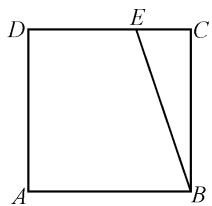
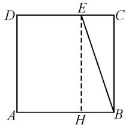
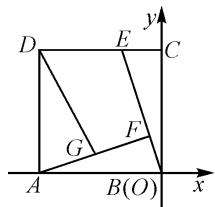
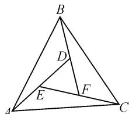

# 基底几何坐标,破解向量问题三要素

——以 2024 年高考数学天津卷第 14 题为例

# 浙江省安吉县高级中学 蔡小华

摘要: 平面向量数量积的求值或最值(或取值范围)问题是平面向量模块知识中的重点与难点之一,破解此类问题有一定的基本策略与规律可循.结合一道高考真题,通过平面几何图形,结合平面向量数量积的常规技巧方法加以展开与应用,归纳总结解题策略与规律,指导数学教学与复习备考.

关键词: 正方形; 向量; 最值; 基底; 几何; 坐标

平面向量数量积成为近年高考试卷中常考常新的基本考点之一.在实际求解平面向量数量积的综合问题时,借助平面向量“数”与“形”的双重属性,抓住数量积自身或“数”的应用,或“形”的特征,并结合不同的应用场景,选择行之有效的方法来处理对应的平面向量数量积,使得数量积求解问题的解决更加合理、有效、可行、正确、快捷,达到“数”与“形”的紧密结合,知识与能力的有效融合.

# 1 真题呈现

高考真题（2024年高天津卷·14）在边长为1的正方形ABCD中，E为线段CD的三等分点， $CE=\frac{1}{2}DE,\overrightarrow{BE}=\lambda\overrightarrow{BA}+\mu\overrightarrow{BC}$ ，则 $\lambda+\mu=$ \_\_\_\_；若F为线段BE上的动点，G为AF中点，则 $\overrightarrow{AF}\cdot\overrightarrow{DG}$ 的最小值为\_\_\_\_。

涉及平面向量的线性运算与数量积问题,通常是平面向量模块的一大基本考点.常见的思维方法,或通过“数”的基本属性进行基底法运算,或通过“形”的几何结构进行直观化处理,或通过“数形结合”的综合应用进行坐标法求解等,很好地考查“四能”与关键能力等.

# 2 真题破解

方法 1: 基底法.

解析:如图1,由于E为线段CD的三等分点, $CE=\frac{1}{2}DE$ ,则有 $\overrightarrow{CE}=\frac{1}{3}\overrightarrow{BA}$ .

所以 $\overrightarrow{BE} = \overrightarrow{BC} +\overrightarrow{CE} = \frac{1}{3}\overrightarrow{BA} +$

text_image

D
E
C
A
B

图1

$\overrightarrow{BC} = \lambda \overrightarrow{BA} + \mu \overrightarrow{BC}$ , 可得 $\lambda = \frac{1}{3}, \mu = 1$ , 故 $\lambda + \mu = \frac{1}{3} + 1 = \frac{4}{3}$ .

由题意可知， $|\overrightarrow{BA}| = |\overrightarrow{BC}| = 1, \overrightarrow{BA} \cdot \overrightarrow{BC} = 0.$

而由 F 为线段 BE 上的动点，可得 $\overrightarrow{BF}=k\overrightarrow{BE}=k\left(\frac{1}{3}\overrightarrow{BA}+\overrightarrow{BC}\right)=\frac{1}{3}k\overrightarrow{BA}+k\overrightarrow{BC}, k\in[0,1]$ ，则知 $\overrightarrow{AF}=\overrightarrow{AB}+\overrightarrow{BF}=-\overrightarrow{BA}+\frac{1}{3}k\overrightarrow{BA}+k\overrightarrow{BC}=\left(\frac{1}{3}k-1\right)\overrightarrow{BA}+k\overrightarrow{BC}$ 。而 G 为线段 AF 中点，则有 $\overrightarrow{DG}=\overrightarrow{DA}+\overrightarrow{AG}=-\overrightarrow{BC}+\frac{1}{2}\overrightarrow{AF}=-\overrightarrow{BC}+\frac{1}{2}\left[\left(\frac{1}{3}k-1\right)\overrightarrow{BA}+k\overrightarrow{BC}\right]=\frac{1}{2}\left(\frac{1}{3}k-1\right)\overrightarrow{BA}+\left(\frac{1}{2}k-1\right)\overrightarrow{BC}.$

所以

$$
\begin{array}{l} \overrightarrow {A F} \cdot \overrightarrow {D G} \\ = \left[ \left(\frac {1}{3} k - 1\right) \overrightarrow {B A} + k \overrightarrow {B C} \right] \cdot \left[ \frac {1}{2} \left(\frac {1}{3} k - 1\right) \overrightarrow {B A} + \right. \\ \left(\frac {1}{2} k - 1\right) \overrightarrow {B C} \\ = \frac {1}{2} \left(\frac {1}{3} k - 1\right) ^ {2} + k \left(\frac {1}{2} k - 1\right) \\ = \frac {5}{9} k ^ {2} - \frac {4}{3} k + \frac {1}{2} \\ = \frac {5}{9} \left(k - \frac {6}{5}\right) ^ {2} - \frac {3}{1 0}. \\ \end{array}
$$

由于 $k \in [0,1]$ ，则当 k = 1 时， $\overrightarrow{AF} \cdot \overrightarrow{DG}$ 取得最小值，最小值为 $\frac{5}{9}\left(1 - \frac{6}{5}\right)^2 - \frac{3}{10} = -\frac{5}{18}$ .

点评:根据平面向量的线性运算与数量积的应用场景,基底法是体现平面向量“数”的基本属性的一种基本技巧方法.合理选取平面向量的一组基底,借助平面向量的数量积公式及其应用来分析与求解,往往是解决此类问题中比较常用的一种“通性通法”.选取基底时,关键在于确定对应基底向量的模以及基底间的夹角,合理通过平面向量的线性运算并结合数量积运算来分析与应用.在实际解题与应用过程中,平面向量中往往不同的基底组合的选取,对应不同的技巧方法.

方法 2: 几何法.

解析:如图2,过点E作 $EH\perp AB$ 交AB于点H,则知四边形BCEH为矩形.由于E为线段CD的三等分点, $CE=\frac{1}{2}DE$ ,则有 $\overrightarrow{BH}=\frac{1}{3}\overrightarrow{BA}$ .而利用平行四边形法则有 $\overrightarrow{BE} = \overrightarrow{BH} +\overrightarrow{HE} = \frac{1}{3}\overrightarrow{BA} +\overrightarrow{BC} = \lambda \overrightarrow{BA} +\mu \overrightarrow{BC}$ ，可得 $\lambda = \frac{1}{3},\mu = 1$ ，故 $\lambda +\mu = \frac{1}{3} +1 = \frac{4}{3}.$ 余略.

text_image

D
E
C
A
H
B

图2

点评:根据平面向量的线性运算与数量积的应用场景,几何法是体现平面向量“形”的几何特征的一种基本技巧方法.合理借助平面几何图形的直观形象,结合平面几何中的图形直观与几何性质来综合与应用,也是解决此类问题的一种基本技巧方法.回归平面向量中“形”的结构特征,合理抓住平面几何图形的直观性,应用平面几何的基本性质,综合平面向量及其数量积的应用来分析与突破.平面向量中几何法的应用,往往离不开平面几何图形的直观性,以及平面几何中辅助线的构建与应用等.

方法 3: 坐标法.

解析:以 B 为坐标原点建立平面直角坐标系,如图 3 所示,则 $A(-1,0)$ , $B(0,0)$ , $C(0,1)$ , $D(-1,1)$ , $E\left(-\frac{1}{3},1\right)$ . 于是 $\overrightarrow{BA}=(-1,0)$ , $\overrightarrow{BC}=(0,1)$ , $\overrightarrow{BE}=(-\frac{1}{3},1)$ .

text_image

D
E
C
G
F
A
B(O)
x
y

图3

又 $\overrightarrow{BE} = \lambda \overrightarrow{BA} +\mu \overrightarrow{BC} = (-\lambda ,\mu) = \left(-\frac{1}{3},1\right)$ ，所以 $\lambda = \frac{1}{3},\mu = 1$ ，故 $\lambda +\mu = \frac{1}{3} +1 = \frac{4}{3}.$

由题意可知点 $F$ 在线段 $BE: y = -3x, x \in \left[-\frac{1}{3}, 0\right]$ 上，可设 $F(a, -3a), a \in \left[-\frac{1}{3}, 0\right]$ . 而 $G$ 为 $AF$ 中点，则有 $G\left(\frac{a-1}{2}, -\frac{3}{2}a\right)$ ，可得 $\overrightarrow{AF} = (a+1, -3a)$ ，

$\overrightarrow{DG} = \left(\frac{a + 1}{2}, -\frac{3}{2} a - 1\right)$ . 所以 $\overrightarrow{AF} \cdot \overrightarrow{DG} = (a + 1, -3a) \cdot$

$$
\left(\frac {a + 1}{2}, - \frac {3}{2} a - 1\right) = 5 a ^ {2} + 4 a + \frac {1}{2} = 5 \left(a + \frac {2}{5}\right) ^ {2} - \frac {3}{1 0}.
$$

由于 $a \in \left[-\frac{1}{3}, 0\right]$ , 则当 $a = -\frac{1}{3}$ 时, $\overrightarrow{AF} \cdot \overrightarrow{DG}$ 的最小值为 $5\left(-\frac{1}{3} + \frac{2}{5}\right)^2 - \frac{3}{10} = -\frac{5}{18}$ .

点评:根据平面向量的线性运算与数量积的应用场景,坐标法是体现平面向量“数”与“形”结合的一种基本技巧方法.合理借助平面向量“数”与“形”的双重属性,以“形”的几何特征,结合坐标系的构建,引入坐标,通过“数”的运算来达到目的.回归平面向量中“形”的结构特征与“数”的基本属性,坐标法是突出平面向量的双重属性中最为重要的一种解题技巧与方法.平面向量中坐标法的关键在于合理构建相应的平面直角坐标系,确定相应点的坐标,为进一步的数学运算与逻辑推理创造条件.

# 3 变式拓展

变式（2024年天津市滨海新区塘沽一中等八校高考数学模拟试卷)如图4， $\triangle ABC$ 是由三个全等的钝角三角形和一个小的正三角形拼成的一个大的正三角形，若 $AD = 4, BD = 2$ ，那么$\overrightarrow{BE} \cdot \overrightarrow{CD}=$ \_\_\_\_; M 为线段 CE 上的动点, 则 $\overrightarrow{MA} \cdot \overrightarrow{MC}$ 的最小值为 \_\_\_\_. $\left(-6; -\frac{25}{4}\right)$

text_image

B
D
E
F
A
C

图 4

# 4 教学启示

在实际解决平面向量数量积的求值与最值等综合问题时,借助代数思维或几何思维,通过不同思维下的代数法与几何法的应用,合理构建成一幅完美和谐统一的“画卷”,成为新高考数学试卷命题中的一个创新点与热点.

解此类问题时,往往借助平面向量“数”与“形”的双重属性,抓住数量积自身“数”的属性应用或“形”的几何特征,并结合不同的应用场景,选择行之有效的方法与解题策略来处理对应的平面向量数量积问题.“数”与“形”的不同视角,使得数量积综合问题的求解与应用更加合理、有效、可行、正确、快捷,或通过“数”来代数运算,或通过“形”来直观想象,也可以实现“数”与“形”的紧密结合,有效实现知识与能力的有效融合. Z