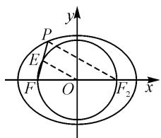
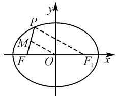

# 巧方法应用,妙类比拓展:一道椭圆题的应用

# 山东省莱阳市第一中学 于艺英

圆锥曲线间由于其特殊的关系,往往在一些相关问题上具有一定的类比性与拓展性.借助其中某一圆锥曲线的相关性质、结论,进行深入分析、探究拓展,往往可以得到有效的类比与拓展,给深度学习与创新应用创造条件.

# 1 问题呈现

(2024年河南省信阳高级中学高考数学三模试卷)设 F 是椭圆 $C: \frac{x^{2}}{9} + \frac{y^{2}}{5} = 1$ 的左焦点，x 轴上方的点 P 在椭圆 C 上. 若线段 PF 的中点在以原点 O 为圆心， $|OF|$ 为半径的圆上，则直线 PF 的斜率是().

A. $\sqrt{15}$

B. $\sqrt{3}$

C. $2\sqrt{3}$

D.2

本题主要结合椭圆图形,巧妙把圆锥曲线、平面几何、直线的方程与斜率、轨迹问题以及线段的距离问题等加以有机交汇与融合,利用题目条件与图形特点,根据三角形中位线定理来转化,或借助椭圆的定义法来处理,或借助点 P 的轨迹通过坐标法来处理,或借助焦半径公式通过坐标法来处理,都可以达到解决问题的目的.

本题结合椭圆的相关性质来确定相应直线的斜率,难度中等,通过深层次的分析与拓展,有效地进行类比与提升.此题综合考查化归与转化思想及运算求解能力,是一道很好的圆锥曲线综合问题.本文中在此题的基础上,从一般性椭圆问题角度类比到双曲线问题加以进一步的探究与拓展.

# 2 追根溯源

上述试题改编自以下对应的高考真题：

高考真题（2019年浙江卷·15）已知椭圆 $\frac{x^{2}}{9}+\frac{y^{2}}{5}=1$ 的左焦点为F，点P在椭圆上且在x轴的上方，若线段PF的中点在以原点O为圆心， $|OF|$ 为半径的圆上，则直线PF的斜率是\_\_\_\_.（ $\sqrt{15}$ ）

# 3 问题破解

方法 1: 椭圆定义法.

解析:由题可得 $F(-2,0)$ . 设椭圆的右焦点为 $F_{2}$ , PF 的中点为 E, 连接 OE, $PF_{2}$ , 如图 1 所示. 由三角形的中位线定理可知, $\left|PF_{2}\right|=2\left|OE\right|=2\left|OF\right|=4$ . 由椭圆的定义可知, $\left|PF\right|=2a-\left|PF_{2}\right|=2$ , 可得 $\left|EF\right|=1$ .

text_image

y
P
E
F O F₂ x

图1

在 $\triangle EFO$ 中， $|OE|=|OF|=2,|EF|=1$ ，可得

直线 $PF$ 的斜率 $k = \tan \angle EFO = \frac{\sqrt{2^2 - \left(\frac{1}{2}\right)^2}}{\frac{1}{2}} = \sqrt{15}$ .

点评:根据题目条件,结合三角形的中位线定理得到 $\left|PF_{2}\right|=2\left|OE\right|=4$ ,从而结合椭圆的定义得到线段PF的值,进而确定线段EF的长度,再结合直角三角形,利用三角函数的定义来求解相应角的正切值,即为所求直线PF的斜率.

方法 2: 轨迹坐标法.

解析:由题可得 $F(-2,0)$ . 设椭圆的右焦点为

$F_{1}, PF$ 的中点为 M，连接 OM， $PF_{1}$ ，如图 2 所示，依题可得 $|OF| = |OM| = c = 2$ 。由三角形的中位线定理，可知 $|PF_{1}| = 2|OM| = 4$ 。设 $P(x, y)$ ，根据 $F_{1}(2, 0)$ ，可得 $(x - 2)^{2} + y^{2} =$

text_image

y
P
M
F O F₁ x

图2

16, 与 $\frac{x^2}{9} + \frac{y^2}{5} = 1$ 联立，整理可得 $4x^{2} - 36x - 63 = 0$ 解得 $x = -\frac{3}{2}$ 或 $x = \frac{21}{2}$ （舍去）. 而点 $P$ 在椭圆 $\frac{x^2}{9} + \frac{y^2}{5} = 1$ 上且在 $x$ 轴的上方，可解得 $P\left(-\frac{3}{2}, \frac{\sqrt{15}}{2}\right)$ ，

所以直线 PF 的斜率 $k=\frac{\frac{\sqrt{15}}{2}-0}{-\frac{3}{2}+2}=\sqrt{15}$ .

点评:根据题目条件,结合三角形的中位线定理得到 $\left|PF_{1}\right|=2\left|OM\right|=4$ ,进而确定点P的轨迹方程 $(x-2)^{2}+y^{2}=16$ ,与椭圆方程联立,通过求解二次方程确定点 P 的坐标, 再利用直线的斜率公式求解直线 PF 的斜率.

方法 3: 三角函数法.

解析: 同方法 2, 得 $\left|PF_{1}\right|=4$ .

由椭圆的定义, 得 $\left|PF\right|=2a-\left|PF_{1}\right|=6-4=2.$

又在 $\triangle PFF_{1}$ 中， $|FF_{1}| = 2c = 4$ ，利用余弦定理可得 $\cos \angle PFF_{1} = \frac{4 + 16 - 16}{2 \times 2 \times 4} = \frac{1}{4}$ ，则 $\sin \angle PFF_{1} = \frac{\sqrt{15}}{4}$ .

故 PF 的斜率为 $k=\tan\angle PFF_{1}=\frac{\sin\angle PF F_{1}}{\cos\angle PF F_{1}}=\sqrt{15}$ .

点评:回归平面解析几何中的几何本质,通过构建三角形,借助椭圆的定义以及平面几何的基本性质,确定三角形中各边长,并结合余弦定理来求解对应内角的余弦值,综合三角函数的相关知识,以及直线的斜率的定义来分析与求解.

方法 4: 焦半径公式法.

解析:由题可得 $a=3, b=\sqrt{5}$ ，则 $c=2, e=\frac{c}{a}=\frac{2}{3}$ ，而 $F(-2,0)$ 。同方法 2，得 $\left|PF_{1}\right|=2\left|OM\right|=4$ 。根据焦半径公式可得 $\left|PF_{1}\right|=a-ex_{P}=3-\frac{2}{3}\times x_{P}=4$ ，解得 $x_{P}=-\frac{3}{2}$ ，而点 P 在 $\frac{x^{2}}{9}+\frac{y^{2}}{5}=1$ 上且在 x 轴的上方，可解得 $P\left(-\frac{3}{2}, \frac{\sqrt{15}}{2}\right)$ 。

所以直线 PF 的斜率 $k=\frac{\frac{\sqrt{15}}{2}-0}{-\frac{3}{2}+2}=\sqrt{15}$ .

点评:根据题目条件,确定椭圆的相关参数值与离心率,结合三角形的中位线定理得到 $\left|PF_{1}\right|=4$ ,由焦半径公式 $\left|PF_{1}\right|=a-ex_{P}$ ,进而确定点P的坐标,再利用直线的斜率公式来求解直线PF的斜率.

# 4 变式拓展

探究 1: 回归到一般的椭圆方程, 其他条件不变, PF 的斜率可以怎么表示呢?

变式 1 设 F 是椭圆 $C: \frac{x^{2}}{a^{2}} + \frac{y^{2}}{b^{2}} = 1 (a > b > 0)$ 的左焦点，x 轴上方的点 P 在椭圆 C 上。若线段 PF 的中点在以原点 O 为圆心， $|OF|$ 为半径的圆上，则直线 PF 的斜率是 \_\_\_\_。

解析:由题意可得 $F(-c,0)$ . 设椭圆的右焦点为$F_{2}$ , PF 的中点为 E, 连接 OE, $PF_{2}$ . 由中位线定理可知, $\left|PF_{2}\right|=2c$ . 结合椭圆的定义, 可知 $\left|PF\right|=2a-2c$ , 可得 $\left|EF\right|=a-c$ .

在 $\triangle EFO$ 中， $|OE| = |OF| = c, |EF| = a - c$ ，则直线 $PF$ 的斜率 $k = \tan \angle EFO = \frac{\sqrt{c^2 - \left(\frac{a - c}{2}\right)^2}}{\frac{a - c}{2}} = \frac{\sqrt{3c^2 + 2ac - a^2}}{a - c}$ .

其实,进一步转化,将上面结论的分式中的分子与分母同时除以 a, 整理可以得到 $k=\frac{\sqrt{3e^{2}+2e-1}}{1-e}$ $\left(e>\frac{1}{3}\right)$ , 变式 1 实质是一个与离心率 e 有关的定值问题.

结论 1 设 F 是椭圆 $C: \frac{x^{2}}{a^{2}} + \frac{y^{2}}{b^{2}} = 1 (a > b > 0)$ 的左焦点，x 轴上方的点 P 在椭圆 C 上。若线段 PF 的中点在以原点 O 为圆心， $|OF|$ 为半径的圆上，则 PF 的斜率是 $\frac{\sqrt{3e^{2} + 2e - 1}}{1 - e} \left( e > \frac{1}{3} \right)$ ，其中 e 是椭圆的离心率。

探究 2: 从思维的类比性展开, 由椭圆类比到双曲线, 是否有类似的结论呢?

变式 2 设 F 是双曲线 $C: \frac{x^{2}}{a^{2}} - \frac{y^{2}}{b^{2}} = 1 (a > 0, b > 0)$ 的左焦点，x 轴上方的点 P 在双曲线 C 上。若线段 PF 的中点在以原点 O 为圆心， $|OF|$ 为半径的圆上，则直线 PF 的斜率是 \_\_\_\_。 $\left(\frac{\sqrt{3c^{2} + 2ac - a^{2}}}{c - a}\right)$

结论 2 设 F 是双曲线 $C: \frac{x^{2}}{a^{2}} - \frac{y^{2}}{b^{2}} = 1 (a > 0, b > 0)$ 的左焦点，x 轴上方的点 P 在双曲线 C 上。若线段 PF 的中点在以原点 O 为圆心， $|OF|$ 为半径的圆上，则 PF 的斜率是 $\frac{\sqrt{3e^{2} + 2e - 1}}{e - 1}$ ，其中 e 是双曲线的离心率。

# 5 规律总结

其实,对于圆锥曲线中的一些相关问题,不同圆锥曲线之间往往有一定的可类比的相关性质或结论,只要认真分析,深入挖掘,就可很好地得以拓展,有所收获,真正有效培养学生的转向机智以及思维的应变能力,提升发散思维的变通性与拓展性,提高数学关键能力,培养数学核心素养. Z