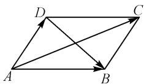
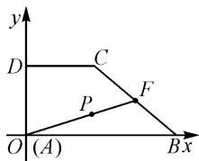
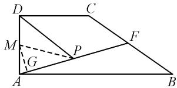
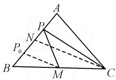
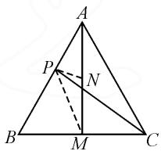
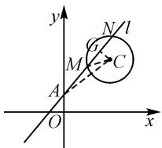

# 平面向量中极化恒等式及应用

# 浙江省奉化高级中学 蒋成飞

摘要:极化恒等式是数学中的常用公式,在向量内积的教学中扮演着重要角色.在理解极化恒等式的表达式的基础上,分析其在解决平面向量数量积问题、界定数量积取值范围以及探求数量积最值等实际问题中的妙用.通过引入情境、引导发现、强化练习和拓展应用四个环节,探讨极化恒等式的教学策略,并结合具体案例分析其在教学中的实际应用,提高学生对极化恒等式的理解和应用能力.

关键词: 平面向量; 极化恒等式; 意义; 应用

极化恒等式是高中数学中研究平面向量相关内容的一个重要的等式,它联系了数量积与范数,为向量空间的研究提供了有力的工具.内积作为向量空间中的一个重要概念,可以衡量两个向量之间的相似程度.极化恒等式则为我们提供了一种用范数表示内积的方法,使得在向量空间的研究中更加便捷.本文旨在深入解析极化恒等式,并探讨其在高中数学平面向量中的应用.

# 1 极化恒等式的推导及几何意义

极化恒等式源于人教 A 版教材必修第二册“6.4 平面向量的应用”中例题的拓展,本质上讲平行四边形是表示向量加法和减法的几何模型.

问题 请你用向量方法证明: 平行四边形的对角线的平方和等于两条邻边平方和的两倍.

证明: 如图 1, 不妨设 $\overrightarrow{AB} = a, \overrightarrow{AD} = b$ , 则 $\overrightarrow{AC} = a + b, \overrightarrow{DB} = a - b$ , 于是有

  
图 1

$$
\begin{array}{c} \mid \overrightarrow {A C} \mid^ {2} = \overrightarrow {A C ^ {2}} = (\boldsymbol {a} + \boldsymbol {b}) ^ {2} = \\ \boldsymbol {a} ^ {2} + 2 \boldsymbol {a} \cdot \boldsymbol {b} + \boldsymbol {b} ^ {2}. \end{array} \tag {①}
$$

$$
\left| \overrightarrow {D B} \right| ^ {2} = \overrightarrow {D B} ^ {2} = (\boldsymbol {a} - \boldsymbol {b}) ^ {2} = \boldsymbol {a} ^ {2} - 2 \boldsymbol {a} \cdot \boldsymbol {b} + \boldsymbol {b} ^ {2}. \tag {②}
$$

两式相加，得

$$
\begin{array}{l} \left| \overrightarrow {A C} \right| ^ {2} + \left| \overrightarrow {B D} \right| ^ {2} \\ = 2 \left(\left| \boldsymbol {a} \right| ^ {2} + \left| \boldsymbol {b} \right| ^ {2}\right) \\ = 2 \left(\left| \overrightarrow {A B} \right| ^ {2} + \left| \overrightarrow {A D} \right| ^ {2}\right). \\ \end{array}
$$

结论:平行四边形对角线的平方和等于两条邻边平方和的两倍

思考:如果将①②两式相减,能得到什么结论呢?

极化恒等式: $a \cdot b = \frac{1}{4}[(a + b)^2 - (a - b)^2]$ .

几何意义:两向量的数量积可以表示为以这两组向量为邻边的平行四边形的“和对角线”与“差对角

线”平方差的 $\frac{1}{4}$ ，即

$a \cdot b = \frac{1}{4} \left( \overrightarrow{AC^{2}} - \overrightarrow{DB^{2}} \right)$ (平行四边形模式).

# 2 极化恒等式的应用

# 2.1 在平面四边形中的应用

例 1 在直角梯形 ABCD 中, $AB \parallel CD$ , $\angle DAB = 90^{\circ}$ , AB = 2AD = 2DC = 4, F 是 BC 边的中点, 若 P 是线段 AF 上的动点(含端点), 求 $\overrightarrow{AP} \cdot \overrightarrow{DP}$ 的取值范围.

解法 1: 如图 2, 以 A 为坐标原点, AB 为 x 轴, AD 为 y 轴建立平面直角坐标系, 则 $F(3,1)$ , $D(0,2)$ .

text_image

y
D C
P F
O (A) B x

图 2

令 $\overrightarrow{AP} = t\overrightarrow{AF},t\in [0,1]$ ，则可得 $\overrightarrow{AP} = t(3,1) = (3t,t)$ ，所以 $\overrightarrow{DP} = \overrightarrow{AP} -\overrightarrow{AD} = (3t,t - 2).$

所以 $\overrightarrow{AP} \cdot \overrightarrow{DP} = (3t, t) \cdot (3t, t - 2) = 10t^2 - 2t$ , $t \in [0, 1]$ , 可得 $\overrightarrow{AP} \cdot \overrightarrow{DP} \in \left[-\frac{1}{10}, 8\right]$ .

解法 2: 如图 3, 取 AD 中点 M, 作 $MG \perp AF$ , 垂足为 G.

text_image

Geometric diagram of a parallelogram ABCD with internal points and lines labeled A, B, C, D, F, G, M, P

图 3

所以可得 $\overrightarrow{AP} \cdot \overrightarrow{DP} = \overrightarrow{PA} \cdot \overrightarrow{PD} = \overrightarrow{PM^2} - \overrightarrow{AM^2} = \overrightarrow{PM^2} - 1$ .

显然, 当点 P 位于点 F 时, PM 取到最大值 3; 当点 P 位于点 G 时, PM 取到最小值 $\frac{3\sqrt{10}}{10}$ .

所以 $\overrightarrow{AP} \cdot \overrightarrow{DP} \in \left[-\frac{1}{10}, 8\right]$ .

# 2.2 在三角形问题中的应用

例 2 设 $\triangle ABC, P_{0}$ 是边 AB 上一定点，满足 $P_{0}B = \frac{1}{4}AB$ ，且对于边 AB 上任意一点 P，恒有 $\overrightarrow{PB} \cdot \overrightarrow{PC} \geqslant \overrightarrow{P_{0}B} \cdot \overrightarrow{P_{0}C}$ ，则（）.

$$
\angle A B C = 9 0 ^ {\circ}
$$

$$
\angle B A C = 9 0 ^ {\circ}
$$

$$
\mathrm{C.AB} = A C
$$

$$
\mathrm{D.} A C = B C
$$

分析: 此题若采用常规方法, 只能通过一个个检验排除不满足条件的情况, 然后对满足条件的情况进行论证; 而若能采用极化恒等式进行突破, 再结合三角形的特点, 就可以将问题转化为点到直线的距离最小值问题, 使复杂多变的几何问题变得单一和直观, 破解效率大大提高.

解:(借助极化恒等式)如图4所示,设M为BC的中点,N为AB的中点,则 $\overrightarrow{PB}\cdot\overrightarrow{PC}=|\overrightarrow{PM}|^{2}-|\overrightarrow{BM}|^{2}$ ,则当 $\overrightarrow{PB}\cdot\overrightarrow{PC}$ 取得最小值时, $MP_{0}\perp AB$ ,也就说明 $CN\perp AB$ ,故AC=BC.

  
图4

例 3 设 P 是边长为 2 的正三角形 ABC 的三边上的一动点，则 $\overrightarrow{PA} \cdot (\overrightarrow{PB} + \overrightarrow{PC})$ 的取值范围是 \_\_\_\_.

解:如图 5, 取 BC 的中点 M,
则 $\overrightarrow{PA} \cdot (\overrightarrow{PB} + \overrightarrow{PC}) = 2 \overrightarrow{PA} \cdot \overrightarrow{PM}.$

取 AM 中点 N，则由极化恒等式易知 $\overrightarrow{PA} \cdot \overrightarrow{PM} = |\overrightarrow{PN}|^{2} - |\overrightarrow{MN}|^{2} = |\overrightarrow{PN}|^{2} - \frac{3}{4}, |\overrightarrow{PN}| \in \left[\frac{\sqrt{3}}{4}, \frac{\sqrt{7}}{2}\right]$ .

text_image

A
P
N
B
M
C

图5

故 $\overrightarrow{PA} \cdot (\overrightarrow{PB} + \overrightarrow{PC}) \in \left[-\frac{9}{8}, 2\right]$ .

点评:在三角形问题中运用极化恒等式,可将复杂问题具体化,通过极化恒等式可使综合问题单一化,从而使数学问题变得更加直观和形象,便于化解和突破.本例和例2的解法有异曲同工之妙.

# 2.3 在解析几何中的应用

例 4 已知过点 A(0,1) 且斜率为 k 的直线 l 与圆 C: $(x-2)^{2}+(y-3)^{2}=1$ 相交于 M, N 两点，求 $\overrightarrow{AM} \cdot \overrightarrow{AN}$ 的值.

分析:对于这类向量数量积问题,采用普通方法也可以化解,即将平面向量问题坐标化突破求解.

解法1:设直线 l 与圆 C 的交点为 $M(x_{1},y_{1})$ ， $N(x_{2},y_{2})$ ，则 $\overrightarrow{AM}=(x_{1},y_{1}-1),\overrightarrow{AN}=(x_{2},y_{2}-1)$ .

由直线 $y=kx+1$ 与圆 $(x-2)^{2}+(y-3)^{2}=1$ 联立，得 $(1+k^{2})x^{2}-4(1+k)x+7=0$ .

于是 $x_{1}x_{2}=\frac{7}{1+k^{2}},x_{1}+x_{2}=\frac{4(1+k)}{1+k^{2}}.$

所以

$$
\begin{array}{l} \overrightarrow {A M} \cdot \overrightarrow {A N} \\ = (x _ {1}, y _ {1} - 1) (x _ {2}, y _ {2} - 1) \\ = x _ {1} x _ {2} + \left(y _ {1} - 1\right) \left(y _ {2} - 1\right) \\ = x _ {1} x _ {2} + y _ {1} y _ {2} - \left(y _ {1} + y _ {2}\right) + 1 \\ = \frac {6 k ^ {2} + 6}{1 + k ^ {2}} + 1 \\ = 7. \\ \end{array}
$$

解法 2: 如图 6, 取 MN 的中点 G, 则 $CG \perp MN$ , 由极化恒等式可得

$$
\begin{array}{r l} \overrightarrow {A M} \cdot \overrightarrow {A N} & = \overrightarrow {A G ^ {2}} - \overrightarrow {M G ^ {2}} = \\ (\overrightarrow {A C ^ {2}} - \overrightarrow {C G ^ {2}}) - (\overrightarrow {M C ^ {2}} - \overrightarrow {C G ^ {2}}) = \\ \overrightarrow {A C ^ {2}} - \overrightarrow {M C ^ {2}} & = \overrightarrow {A C ^ {2}} - 1 = 7. \end{array}
$$

text_image

y
N l
G
M
C
A
O
x

图 6

点评:本例若采用一般解法计

算向量数量积,运算量大,也容易出错;若能结合极化恒等式就能化繁为简,数形结合效果好.

例 5 已知 $P(x_{0}, y_{0})$ 为椭圆 $\frac{x^{2}}{16} + \frac{y^{2}}{8} = 1$ 上任意一点，EF 为圆 $M: x^{2} + (y - 2)^{2} = 1$ 的直径，求 $\overrightarrow{PE} \cdot \overrightarrow{PF}$ 的取值范围.

解:由题意,可知

$$
\begin{array}{c} \overrightarrow {P E} \cdot \overrightarrow {P F} = (\overrightarrow {P M} + \overrightarrow {M E}) (\overrightarrow {P M} - \overrightarrow {M E}) = \overrightarrow {P M ^ {2}} - \\ \overrightarrow {M E ^ {2}} = \overrightarrow {P M ^ {2}} - 1 = x _ {0} ^ {2} + (y _ {0} - 2) ^ {2} - 1. \end{array}
$$

因为 $P(x_0, y_0)$ 在椭圆 $\frac{x^2}{16} + \frac{y^2}{8} = 1$ 上，所以有 $\frac{x_0^2}{16} + \frac{y_0^2}{8} = 1$ ，即 $x_0^2 = 16 - 2y_0^2 (y_0 \in [-2\sqrt{2}, 2\sqrt{2}])$ .

所以 $\overrightarrow{PE} \cdot \overrightarrow{PF} = -y_0^2 - 4y_0 + 19 \in [11 - 8\sqrt{2}, 23]$ .

通过近几年的高考试题分析,发现平面向量有关知识常与三角函数、三角形、解析几何结合在一起出现在解答题中,主要以三角函数、三角形、解析几何等为载体,考查数量积的定义、性质等,若会运用平面向量中的极化恒等式,结合相关知识,效果非常不错,既体现了极化恒等作为工具的应用之美,也体现了数学的几何之美.

# 3 结论

极化恒等式作为数学的一个重要公式,具有广泛的应用价值.通过上述实例,我们看到了极化恒等式在解决平面向量数量积问题、界定数量积取值范围以及探求数量积最值等方面的强大功能.因此,应该加强对极化恒等式的学习和理解,以便更好地将其应用于实际问题的解决中.Z