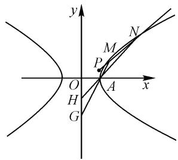

# 理解运算对象,优化运算策略

# ● 江苏省海安高级中学 罗湘军

摘要:解析几何往往涉及复杂的运算问题,解题时需要充分理解题意.而要实现高效正确的解答,就要抓住问题的本质,探究合理的运算策略.本文中以高二复习课上一道双曲线习题为例,引导学生分析问题中的显性条件和隐性信息,侧重于强化运算策略的选择,达到优化思路和运算的目标.

关键词: 运算策略; 优化思路; 逆向思考; 理解运算对象

新高考数学命题一个明显的趋势是素养导向，而高中数学的脉络是思维，根基在于运算。运算能力的薄弱、运算策略的欠缺等问题会极大影响学生学习数学的热情，成为学科素养提升路径上的障碍。新课标对于运算素养的总结是清晰、明确的，主要有理解运算对象、掌握运算法则、探究运算思路、求得运算结果四大主要特征。解析几何往往涉及复杂的运算问题，不少试题呈现“入口宽，巷子窄”的情况，若不能充分理解题意并寻找到有效的解决途径，往往会陷入杂乱无序的运算纠缠中，难以得到正确的结果。而要实现高效正确的解答，就要抓住问题的本质，探究合理的运算策略，达到优化思路和运算的目标。

本文中以一节高二数学复习课上一道双曲线习题为例,根据学生现场解题过程中的多种思路,谈谈解析几何运算策略的选择.

例如图 1, 已知双曲线 C 的中心为坐标原点, 对称轴分别为 x 轴和 y 轴, 且曲线 C 过 A(2,0), B(4,3) 两点.

text_image

y
N
M
P
O
A
x
H
G

图 1

(1)求双曲线 C 的方程；
(2)已知点 $P(2,1)$ ，设过点 P 的直线 l 交 C 于M, N 两点, 直线 AM, AN 分别与 y 轴交于点 G, H, 当 $\left|GH\right|=6$ 时, 求直线 l 的斜率.

对于本题第一问,双曲线 C 的方程为 $\frac{x^{2}}{4}-\frac{y^{2}}{3}=1$ . 以下只讨论第二问.

法1:(2)由题意,设直线l的方程为 $y-1=k(x-2)$ , $M(x_{1},y_{1})$ , $N(x_{2},y_{2})$ ,将l与曲线 $C:\frac{x^{2}}{4}-\frac{y^{2}}{3}=1$ 联立,得 $(4k^{2}-3)x^{2}-(16k^{2}-8k)x+16k^{2}-16k+16=0$ ,则 $4k^{2}-3\neq0$ 且 $\Delta=(16k^{2}-8k)^{2}-4(4k^{2}-3)\cdot(16k^{2}-16k+16)=64(3-3k)>0$ .

所以 k<1，且 $k\neq\pm\frac{\sqrt{3}}{2}$ .

由韦达定理，得

$$
x _ {1} + x _ {2} = \frac {1 6 k ^ {2} - 8 k}{4 k ^ {2} - 3}, x _ {1} x _ {2} = \frac {1 6 k ^ {2} - 1 6 k + 1 6}{4 k ^ {2} - 3}.
$$

由 $l_{AM}: y = \frac{y_{1}}{x_{1} - 2} (x - 2)$ ，令 x = 0，得 $y_{G} = \frac{2y_{1}}{2 - x_{1}}$ ;

由 $l_{AN}: y = \frac{y_{2}}{x_{2} - 2} (x - 2)$ ，令 x = 0，得 $y_{H} = \frac{2y_{2}}{2 - x_{2}}$ .

所以 $|GH| = |y_G - y_H| = \left|\frac{2y_1}{2 - x_1} - \frac{2y_2}{2 - x_2}\right| = 2\left|\frac{x_1 - x_2}{x_1x_2 - 2(x_1 + x_2) + 4}\right|$ .

于是结合 $|x_{1} - x_{2}| = \sqrt{(x_{1} + x_{2})^{2} - 4x_{1}x_{2}} = \frac{8\sqrt{3}\sqrt{1 - k}}{4k^{2} - 3}$ ，得 $|GH| = 4\sqrt{3}\sqrt{1 - k}$ 。

由 $\left|GH\right|=6$ , 解得 $k=\frac{1}{4}$ .

评注:这种做法会被多数学生采用,主要原因是点P已知,且过点P的直线l交曲线C于M,N两点,设直线l的方程仅需要一个参数,可顺利与双曲线方程联立.其优点是前半段容易切入,属于常规操作,思维难度不高,同时在处理 $|GH|=6$ 这个条件时采用直译法,纵坐标的差在化简时要面对较复杂的算式,解题过程对运算能力有一定的要求.

法 2: (2) 设 $G(0, y_{1})$ , $H(0, y_{2})$ ，则 $l_{AM}: y = -\frac{y_{1}}{2}(x - 2)$ , $l_{AN}: y = -\frac{y_{2}}{2}(x - 2)$ .

将直线 AM 方程与曲线 $C: \frac{x^{2}}{4}-\frac{y^{2}}{3}=1$ 联立，得

$$
(3 - y _ {1} ^ {2}) x ^ {2} + 4 y _ {1} ^ {2} x - (4 y _ {1} ^ {2} + 1 2) = 0. \tag {①}
$$

由 2 与 $x_{M}$ 为方程①的两个实根, 可得

$$
x _ {M} = \frac {2 y _ {1} ^ {2} + 6}{y _ {1} ^ {2} - 3}, y _ {M} = \frac {- 6 y _ {1}}{y _ {1} ^ {2} - 3}.
$$

同理， $x_{N} = \frac{2y_{2}^{2} + 6}{y_{2}^{2} - 3}$ ，则 $y_{N} = \frac{-6y_{2}}{y_{2}^{2} - 3}$

根据 P, M, N 三点共线，可得 $k_{PM} = k_{PN}$ ，所以 $\frac{y_{M} - 1}{x_{M} - 2} = \frac{y_{N} - 1}{x_{N} - 2}$ ，化简得 $6y_{1} + y_{1}^{2} = 6y_{2} + y_{2}^{2}$ .

因为 $y_{1} \neq y_{2}$ ，所以 $y_{1} + y_{2} = -6$ 。

又 $|GH|=6$ ，则 $|y_{1}-y_{2}|=6$ 。

解得 $y_{1}=0, y_{2}=-6$ ，或 $y_{1}=-6, y_{2}=0$ 。

易得 $k=\frac{1}{4}$ .

评注: 在直线 AM, AN 与曲线 C 相交且已知交点 A 的情况下, 可以将直线 AM, AN 分别与曲线 C 联立, 利用韦达定理解出 M, N 两点坐标, 再利用 P, M, N 三点共线构造方程, 设出 G, H 两点坐标既方便表示直线 AM, AN 的斜率, 同时也可以将条件 $\left|GH\right|=6$ 直接表示为两点纵坐标的差, 得到关于 G, H 两点纵坐标的方程组并求解, 进而得到直线 l 的斜率 k. 这样的处理避免了法 1 中对条件 $\left|GH\right|=6$ 的复杂化简, 整体运算量“瘦身”明显.

法3:(2)设直线 l 的方程 $y=kx+m$ ，代入点 $P(2,1)$ ，得 $2k+m=1$ 。

将 $l:y = kx + m$ 与曲线 $C:\frac{x^2}{4} -\frac{y^2}{3} = 1$ 联立，得

$$
(3 - 4 k ^ {2}) x ^ {2} - 8 k m x - 4 m ^ {2} - 1 2 = 0.
$$

因为直线 l 交 C 于 M, N 两点，所以 $3 - 4k^{2} \neq 0$ 且 $\Delta = 64k^{2}m^{2} + 4(3 - 4k^{2})(4m^{2} + 12) > 0.$

设 $M(x_{1},y_{1}), N(x_{2},y_{2})$ . 根据韦达定理, 得

$$
x _ {1} + x _ {2} = \frac {8 k m}{3 - 4 k ^ {2}}, x _ {1} x _ {2} = \frac {4 m ^ {2} + 1 2}{4 k ^ {2} - 3}.
$$

由题意， $|GH|=6$ ，得

$$
\left| k _ {A M} - k _ {A N} \right| = \left| \frac {| O G | - | O H |}{2} \right| = 3. \tag {②}
$$

又可得到 $k_{AM} + k_{AN} = \frac{y_1}{x_1 - 2} +\frac{y_2}{x_2 - 2} =$

$$
\frac {k x _ {1} x _ {2} + (m - 2 k) \left(x _ {1} + x _ {2}\right) - 4 m}{x _ {1} x _ {2}} = \frac {2 4 k + 1 2 m}{4 m ^ {2} + 1 6 k m + 1 6 k ^ {2}} =
$$

$\frac{12(2k+m)}{4(2k+m)^{2}}=\frac{3}{2k+m}=3$ ，结合②，不妨令 $k_{AM}=3$ ，则 $k_{AN}=0$ ，可得 $N(-2,0)$ .

故 $k=\frac{y_{P}-y_{N}}{x_{P}-x_{N}}=\frac{1}{4}.$

评注:学生常常遇到这样一类圆锥曲线问题,若直线 l 交曲线 C 交于相异两点,且存在一定点与两交点所连直线斜率之和为定值,则直线 l 往往经过定点.部分学生通过逆向思考, 直线 l 过点 P 且交曲线 C 于相异两点, 猜想点 A 与两交点所连直线斜率和为定值, 得到了直线 AM 和直线 AN 斜率和为定值 3, 而直线 $y = kx + m$ 与曲线 C 的联立, 与法一相比也体现了字母运算的便捷优势. 再根据 $|GH| = 6$ 这个条件, 得到直线 AM 和直线 AN 斜率差也为 3, 分别计算出直线 AM 和直线 AN 的斜率, 直线 l 的斜率即为直线 PN 的斜率, 整个运算过程整体性强, 逆向思考使得问题的解决变得简洁高效.

法 4:(2) 设直线 l 的方程为 $m(x-2)+ny=1$ ，直线 AM, AN 的斜率分别为 $k_{1}, k_{2}$ .

由题意, $k_{1}=\frac{|OG|}{2},k_{2}=\frac{|OH|}{2}.$

由 $|GH|=6$ ，得 $|k_{1}-k_{2}|=\left|\frac{|OG|-|OH|}{2}\right|=3.$

将直线 l 的方程与曲线 $C: \frac{x^{2}}{4}-\frac{y^{2}}{3}=1$ 联立，得 $(12m+3)(x-2)^{2}-4y^{2}+12n(x-2)y=0$ ，即

$$
- 4 \left(\frac {y}{x - 2}\right) ^ {2} + 1 2 n \left(\frac {y}{x - 2}\right) + 1 2 m + 3 = 0. \tag {③}
$$

由于 $k_{1}, k_{2}$ 为方程③的两个不同实根，则有

$$
k _ {1} + k _ {2} = 3 n, k _ {1} k _ {2} = - \frac {1 2 m + 3}{4}.
$$

所以可得 $|k_{1} - k_{2}| = \sqrt{(k_{1} + k_{2})^{2} - 4k_{1}k_{2}} = \sqrt{9n^{2} + 12m + 3} = 3$ ，整理为 $3n^{2} + 4m = 2.$

又点 P 在直线 l 上，则 $m(2-2)+n=1$ ，即 n=1，所以 $m=-\frac{1}{4}$ .

故直线 l 的斜率为 $\frac{1}{4}$ .

评注： $|GH|=6$ 本质上是直线 AM, AN 的斜率差为 3，因此可以构造关于斜率 $\frac{y}{x-2}$ 的方程，然后按照需要完成“配套工程”，设直线 l 的方程为 $m(x-2)+ny=1$ ，与曲线 C 方程联立，则直线 AM, AN 的斜率为相关二次方程的两个实根，结合韦达定理和斜率差为 3，得到直线 l 的斜率。这种处理充分体现了对运算对象的理解，考虑了结构的整体性，因而减少了运算量。

学生常常认为解析几何的难点在运算,而其难点更体现在运算策略的选择和运用上.新高考背景下的解析几何问题不再套路化、脸谱化,并不是单纯设直线联立方程与运用韦达定理的解题模式就能解决的,要提高对理解运算对象、探究运算思路方面的教学要求,引导学生分析问题中的显性条件和隐性信息,不一味地纠结于繁与简,更侧重于强化运算策略的选择,让学生对后续的运算过程有一个基本的预判,从而达到优化解题过程的目标.Z