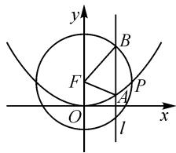
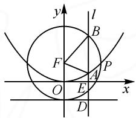

# 高考数学复习的“三段论”

# 南京市板桥中学 张 亚

本文中结合实际,在新高考数学复习过程中进行“三段论”的复习与备考,借助三个不同的阶段与案例展示,对有效进行复习提供一点个人看法.

# 1 强化落实“四基”目标

高考数学复习的第一阶段就是强化数学基础知识、基本技能、基本思想、基本活动经验这“四基”的落实情况.

数学“四基”目标中,第一维度是数学基础知识的整合与积累过程;第二维度是数学基本技能的融合与演练过程;第三维度是数学基本思想方法的抽象与形成过程等.

针对“四基”目标的强化与落实,高考数学复习第一阶段的主要策略是:抓疑点、惑点,再造经验.具体表现为:(1)以点带面,心态务实平和,跟踪目标;(2)了解学生需要,选择问题驱动;(3)强化知识、思想、方法的对接.

例 1 [2022 年广东省深圳市高三年级第一次调研考试数学试卷(2 月)·16] 古希腊数学家托勒密于公元 150 年在他的名著《数学汇编》里给出了托勒密定理, 即圆的内接凸四边形的两对对边乘积的和等于两条对角线的乘积. 已知 AC, BD 为圆的内接四边形 ABCD 的两条对角线, 且 $\sin\angle ABD: \sin\angle ADB: \sin\angle BCD=2:3:4$ , 若 $|AC|^{2}=\lambda|BC|\cdot|CD|$ , 则实数 $\lambda$ 的最小值为 \_\_\_\_.

分析:以数学文化背景来创设题目,综合圆的内接四边形及其基本性质,结合解三角形中相关定理与知识,依托托勒密定理的数学文化背景,以及基本不等式等基础知识来合理整合与交汇,从而实现参数最值的求解.

解析: 因为四边形 ABCD 是圆的内接四边形, 所以 $\sin\angle BAD=\sin\angle BCD$ , 则

$$
\sin \angle A B D: \sin \angle A D B: \sin \angle B A D = 2: 3: 4.
$$

在 $\triangle ABD$ 中,利用正弦定理,可得

$$
\mid A D \mid : \mid A B \mid : \mid B D \mid = 2: 3: 4.
$$

设 $|AD|=2t,|AB|=3t,|BD|=4t$ ，根据托勒密定理有 $|AC|\cdot|BD|=|AB|\cdot|CD|+|AD|\cdot|BC|$ ，整理有 $4t|AC|=3t|CD|+2t|BC|$ ，化简可得 $4|AC|=3|CD|+2|BC|$ .

由 $|AC|^{2}=\lambda|BC|\cdot|CD|$ ，得 $\lambda=\frac{|AC|^{2}}{|BC|\cdot|CD|}=$ $\frac{(2|BC|+3|CD|)^{2}}{16|BC|\cdot|CD|}\geqslant\frac{(2\sqrt{2|BC|\cdot3|CD|})^{2}}{16|BC|\cdot|CD|}=\frac{3}{2},$

当且仅当 $2|BC|=3|CD|$ ，即 $|BC|=|AC|$ 时，等号成立，所以实数 $\lambda$ 的最小值为 $\frac{3}{2}$ .

点评:借助基本不等式合理放缩、解三角形等,这些都是高中数学中最为基本的知识点之一.抓住基础知识与基本技巧来引领复习,才能真正强化并落实“四基”目标.

# 2 巩固提升活动经验

高考数学复习的第二阶段就是巩固数学中直接的经验、间接的经验、设计的经验和思考的经验等方面活动经验的提升情况.

什么是数学基本活动经验？“活动经验”与“活动”密不可分；“活动经验”与“经验”也密不可分。其中，合理整合学生自身的直接经验与教师创设的间接经验，借助巧妙的设计，利用解题经验与思维经验加以不断提升，以获得数学的解题经验与解题收获。

针对活动经验的巩固与提升,高考数学复习的第二阶段的主要策略是:抓难点、生长点,巩固成果.具体表现为:(1)以生长点引路,突破难点,促进目标生成;(2)在思维能力上付诸行动;(3)强化数学问题的表征与思维链接.

例 2 [2021 届山东省青岛市高三年级统一质量检测数学试卷(青岛一模)·16]2021 年是中国传统的“牛”年, 可以在平面坐标系中用抛物线与圆勾勒出牛的形象(如图 1). 已知抛物线 Z:$x^{2}=4y$ 的焦点为F，圆 $F:x^{2}+(y-1)^{2}=4$ 与抛物线Z在第一象限的交点为 $P\left(m,\frac{m^{2}}{4}\right)$ ，直线 $l:x=t(0<t<m)$ 与抛物线Z的交点为A，直线l与圆F在第一象限的交点为B，则m=\_\_\_\_；△FAB周长的取值范围为\_\_\_\_。

text_image

y
B
F
A
P
O
l
x

图1

解析 1: 函数转化法.

将 $x^{2}=4y$ 代入 $x^{2}+(y-1)^{2}=4$ ，消去参数 x，可

得 $y^{2}+2y-3=0$ ，解得 y=-3（舍去）或 y=1。

将 y=1 代入 $x^{2}=4y$ ，可解得 x=2（负值舍去），所以 m=2。

联立 $\left\{\begin{aligned}x=t,\\ x^{2}=4y,\end{aligned}\right.$ 可得 $A\left(t,\frac{t^{2}}{4}\right).$

联立 $\left\{\begin{aligned}x=t,\\ x^{2}+(y-1)^{2}=4,\end{aligned}\right.$ 可得 $B(t,1+\sqrt{4-t^{2}})$ .

而 $F(0,1), 0 < t < 2$ ，所以 $\triangle FAB$ 周长为 $|FA| + |FB| + |AB| = \left(\frac{t^2}{4} + 1\right) + 2 + \left(1 + \sqrt{4 - t^2} - \frac{t^2}{4}\right) = 4 + \sqrt{4 - t^2} \in (4,6)$ .

故填答案:2;(4,6).

解析 2: 数形直观法.

将点 $P\left(m,\frac{m^{2}}{4}\right)$ 代入 $x^{2}+(y-1)^{2}=4$ ，有 $m^{4}+8m^{2}-48=0$ ，解得 $m^{2}=4$ （负值舍去），则 m=2（负值舍去），即 $\frac{m^{2}}{4}=1$ 。

如图 2 所示, 直线 l 交抛物线 Z 的准线 y = -1 于点 D, 交 x 轴于点 E.

text_image

y
l
B
F
A
P
O
E
x
D

图2

由抛物线定义, 可得 $\left|FA\right| = \left|AD\right|$ .

$$
\begin{array}{r l} & {\text {所以,} \triangle F A B \text {周长为} | F A | + \qquad \qquad \qquad \qquad \qquad \qquad \qquad \text {图2}} \\ & {| F B | + | A B | = | A D | + 2 + | A B | = | B D | + 2 =} \\ & {| B E | + 1 + 2 = | B E | + 3.} \end{array}
$$

数形结合可知 $\left|BE\right|\in(1,3)$ ，则 $\left|BE\right|+3\in(4,6)$ .

故填答案:2;(4,6).

点评:本题常规求解思维就是利用函数转化法来分析与处理,但运算量大;而利用数形直观法,结合抛物线的定义来求解,更加直观有效,也是高考数学复习过程中数学基本活动经验的积累与体现.在巩固基础知识的基础上,不断提升并巩固解题经验是数学复习备考过程中的一个重要环节.

# 3 加强应试策略认知

高考数学复习的第三阶段就是加强数学应试策略的认知.

新高考有其显著的特点,主要表现在坚持贯彻落实“立德树人”根本任务,实现“教”“学”“考”一体化的目标,形成“一个中心,两个维度,六大素养,四条路径”的评价体系,在试题的命制与创新方面也有其独特的亮点.

针对应试策略的加强与认知,高考数学复习的第三阶段的主要策略是:抓考点、盲点,强化认知行为.具体表现为:(1)以模拟测评为主,加固思维短板,提高规范程度；(2)抓好应试的心理行为,树立规则意识;
(3)留出空间,组织反思修补,提升数学活动经验.

精选模拟题,进行目标训练,落实规范操作,提高操作思维能力.

例 3 （2021 年河北省张家口市高考数学二模试卷）在① $2S_{n+1}=S_{n}+1$ ; ② $a_{2}=\frac{1}{4}$ ; ③ $S_{n}=1-2a_{n+1}$ 这三个条件中任选两个, 补充在下面问题中, 并解答.

已知数列 $\{a_{n}\}$ 的前 $n$ 项和为 $S_{n}$ ，满足 \_\_\_\_, \_\_\_\_.又知正项等差数列 $\{b_{n}\}$ 满足 $b_{1} = 2$ ，并且 $b_{1}, b_{2} - 1, b_{3}$ 成等比数列.

(1) 求 $\{a_{n}\}$ 和 $\{b_{n}\}$ 的通项公式；  
(2) 若 $c_{n}=a_{n}b_{n}$ ，求数列 $\{c_{n}\}$ 的前 n 项和 $T_{n}$ .

分析:(1)根据“多选二”开放性试题的背景,通过三个条件中任选两个所对应的不同组合来合理选择(只能选择①②或②③),结合等比数列的定义与通项来确定数列 $\{a_{n}\}$ 的通项公式,进而结合等比数列的性质与等差数列的通项来确定数列 $\{b_{n}\}$ 的通项公式.(2)利用(1)中的结论,结合错位相减法以及等比数列的求和公式来求相应数列的前n项和.

解析:(1)分三种情况.

选择①②: 当 $n \geqslant 2$ 时, 由 $2S_{n+1} = S_n + 1$ , 得 $2S_n = S_{n-1} + 1$ .

两式相减，得 $2a_{n+1}=a_{n}$ ，即 $\frac{a_{n+1}}{a_{n}}=\frac{1}{2}(n\geqslant2)$ .

由①得 $2S_{2}=S_{1}+1$ ，即 $2(a_{1}+a_{2})=a_{1}+1$ ，所以 $a_{1}=1-2a_{2}=1-\frac{1}{2}=\frac{1}{2}$ ，得 $a_{1}=\frac{1}{2}$ ，所以 $\frac{a_{2}}{a_{1}}=\frac{1}{2}$ .

所以 $\{a_{n}\}$ 是首项 $a_1 = \frac{1}{2}$ ，公比为 $\frac{1}{2}$ 的等比数列.

故 $a_{n} = \frac{1}{2}\times \left(\frac{1}{2}\right)^{n - 1} = \left(\frac{1}{2}\right)^{n}.$

选择②③: 当 $n \geqslant 2$ 时, 由 $S_{n} = 1 - 2a_{n+1}$ , 得 $S_{n-1} = 1 - 2a_{n}$ .

两式相减，得 $a_{n} = 2a_{n} - 2a_{n + 1}$ ，即 $a_{n} = 2a_{n + 1}$

所以 $\frac{a_{n + 1}}{a_n} = \frac{1}{2} (n\geqslant 2).$

又 $S_{1} = 1 - 2a_{2}$ ，得 $a_1 = \frac{1}{2}$ 所以 $\frac{a_2}{a_1} = \frac{1}{2}$

所以 $\{a_{n}\}$ 是首项 $a_1 = \frac{1}{2}$ ，公比为 $\frac{1}{2}$ 的等比数列.

故 $a_{n} = a_{1}q^{n - 1} = \frac{1}{2}\times \left(\frac{1}{2}\right)^{n - 1} = \left(\frac{1}{2}\right)^{n}.$

选择①③: 由于 $2S_{n+1}=S_{n}+1$ 和 $S_{n}=1-2a_{n+1}$ 等价, 故不能选择.

设等差数列 $\{b_n\}$ 的公差为 $d, d \geqslant 0$ ，且 $b_1, b_2 - 1, b_3$ 成等比数列，则 $b_1 b_3 = (b_2 - 1)^2$ ，即

$$
2 (2 + 2 d) = (1 + d) ^ {2}.
$$

解得 d=3 或 d=-1(舍去).

所以 $b_{n}=2+3(n-1)=3n-1$ .

(2)由(1)知 $a_{n} = \left(\frac{1}{2}\right)^{n}, b_{n} = 3n - 1$ ，可得 $c_{n} = a_{n}b_{n} = \frac{3n - 1}{2^{n}}$ .

那么 $T_{n}=\frac{3\times1-1}{2}+\frac{3\times2-1}{2^{2}}+\cdots\cdots+\frac{3n-1}{2^{n}}$ ，而 $\frac{1}{2}T_{n}=\frac{3\times1-1}{2^{2}}+\frac{3\times2-1}{2^{3}}+\cdots\cdots+\frac{3n-4}{2^{n}}+\frac{3n-1}{2^{n+1}}$ 以上两式对应相减，可得 $\frac{1}{2}T_{n}=1+\frac{3}{2^{2}}+\frac{3}{2^{3}}+\cdots\cdots+$ $\frac{3}{2^{n}}-\frac{3n-1}{2^{n+1}}=1+3\times\frac{\frac{1}{2^{2}}\left(1-\frac{1}{2^{n-1}}\right)}{1-\frac{1}{2}}-\frac{3n-1}{2^{n+1}}=\frac{5}{2}-$

$$
\frac {3}{2 ^ {n}} - \frac {3 n - 1}{2 ^ {n + 1}} = \frac {5}{2} - \frac {3 n + 5}{2 ^ {n + 1}}.
$$

所以 $T_{n}=5-\frac{3n+5}{2^{n}}$ .

点评:求解此类开放性试题或多选题,对加强考生高考认知、提升应试能力是有很大帮助的.在复习备考过程中,要强化对高考的认知,要逐步提升学生的应试能力.

其实,高考数学复习中的“三段论”也只是人为的一个区分与界定,在实际复习过程中,没有明显的区分与界限,只是一个分阶段、层层递进、螺旋上升、综合提升的渐进过程.因而,在实际的新高考数学备考中,教师应结合自身的教学经验与学生的实际情况,合理优化,不断修正,避免走弯路,从而不断优化复习过程,提升复习效益.Z

(上接第82页)

# 4 其他高考题中的“飘带”运用

例 1 （2022 年全国Ⅱ卷第 22 题第 3 问）设 $n \in N^{*}$ ，证明： $\frac{1}{\sqrt{1^{2}+1}} + \frac{1}{\sqrt{2^{2}+2}} + \cdots + \frac{1}{\sqrt{n^{2}+n}} > \ln(n+1)$ .

由 $\ln (n + 1) = \sum_{k=1}^{n}\left[\ln (k + 1) - \ln k\right]$ , 结合“飘带”不等式, 当 $x \geqslant 1$ 时, $\ln x \leqslant \frac{1}{2}\left(x - \frac{1}{x}\right)$ , 可取 $x = \sqrt{\frac{k+1}{n}}$ , 则 $2\ln \sqrt{\frac{k+1}{n}} < \sqrt{\frac{k+1}{n}} - \sqrt{\frac{n}{k+1}}$ .

由此可得 $\ln \frac{n + 1}{n} < \frac{1}{\sqrt{n^2 + n}}$ ，两边同时累加即可.

这道题的第(3)问可以不用前面两问的结果,直接运用“飘带”不等式解决.

例 2 （2022 年全国Ⅰ卷 7）设 $a=0.1e^{0.1}, b=\frac{1}{9}$ ， $c=-\ln 0.9$ ，则（）.

$$
\mathrm{A.} a <   b <   c \quad \mathrm{B.} c <   b <   a
$$

$$
\mathrm{C.} c <   a <   b \quad \mathrm{D.} a <   c <   b
$$

除了构造法外,这道题还有很多高等数学的解法.在本题中,我们也可以利用“飘带”不等式:

$$
c = - \ln 0. 9 = \ln \frac {1 0}{9} <   \frac {1}{2} \left(\frac {1 0}{9} - \frac {9}{1 0}\right) = \frac {1 9}{1 8 0} <   \frac {1}{9}.
$$

运用常见的切线不等式：

当 0 < x < 1 时， $1 + x < e^{x} < \frac{1}{1 - x}$ .

易得 $\frac{11}{100} < 0.1\mathrm{e}^{0.1} < \frac{1}{9}$ , 而 $\frac{19}{100} < \frac{11}{100}$ , 所以 $c < a < b$ .

故选：C.

# 5 一些感悟

回顾天津的这道高考导数题,设置的三个小问,梯度分明,层层递进,有利于人才的选拔.笔者在研究这题时,采用了化归转化的思想,利用“飘带”不等式进行放缩,其本质就是用多项式函数逼近对数函数,即“有理”逼近“无理”;并对放缩结果进行了优化处理.这也能看出,利用“飘带”不等式进行放缩,其精度比较高.为了直观解决第(3)问的左端,画出了图象,降低了思维的难度,并且有了一定的“方向”,提高了解题的效率,从而真正做到“以形助数,以数解形”.翻阅最近几年全国各地高考导数题,不难发现,函数问题中的不等式证明是常考的热点问题之一,它们大都有着高等数学中的思想和背景.例如,本题中数列的构造,也是入门的级数.但我们其实不需要让学生了解太多的高等数学内容,关键是培养学生解题时的数学直觉,熟练掌握平时学习中的一些有用结论,合理地进行分析和推演.作为一名普通的数学教育工作者,更应该在“高观点”的指导下,“低起点”进行教学,立足课本,吃透教材,让学生深刻理解教材中的典型问题,以达到举一反三的目的,争取让学生能够从容应对高考导数题.Z