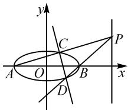
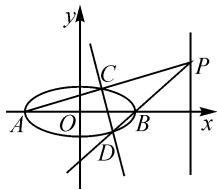

# 一道高考圆锥曲线题的解法探究与反思

# ● 安徽省芜湖市无为县第二中学 高玉立

高考数学真题是众多优秀命题专家精心设计出来的.其中解析几何压轴题,紧扣教材,立足考查学生的能力.

# 1 试题呈现

试题 （2020 全国 I 卷理科 20 题,文科 21 题) 已知 A, B 分别为椭圆 $E: \frac{x^{2}}{a^{2}} + y^{2} = 1 (a > 1)$ 的左、右顶点, G 为 E 的上顶点, $\overrightarrow{AG} \cdot \overrightarrow{GB} = 8$ , P 为直线 x = 6 上的动点, PA 与 E 的另一个交点为 C, PB 与 E 的另一交点为 D.

(1) 求 E 的方程；  
(2)证明:直线 CD 过定点.

# 2 解法探究

第(1)问常规解法,过程略.答案为 $\frac{x^{2}}{9}+y^{2}=1$ .下面只对第(2)问的解法作多角度探索.

思路一:如图1,注意到 $k_{PB}=3k_{PA}$ ,以及A,B是椭圆的左、右顶点,从而可以借助椭圆第三定义,利用 $k_{AC}$ 与 $k_{AD}$ 关系进行求解.

解法 1: 利用椭圆的第三定义将非对称式转化为对称式问题.

text_image

y
C
P
A O B x
D

图1

设 $P(6,t)$ , $C(x_{1},y_{1})$ , $D(x_{2},y_{2})$ .

(i) 若 $t \neq 0$ ，设直线 CD: $x = my + n (-3 < n < 3)$ ,

则有 $\left\{\begin{aligned}k_{AC}&=k_{PA}=\frac{t}{9},\\ k_{BD}&=k_{PB}=\frac{t}{3},\end{aligned}\right.$ 可得 $k_{BD}=3k_{AC}$ .

又由椭圆的第三定义, 知 $k_{AD} \cdot k_{BD} = -\frac{1}{9}$ , 所以 $k_{AC} \cdot k_{AD} = -\frac{1}{27}$ , 即

$$
\frac {y _ {1}}{x _ {1} + 3} \cdot \frac {y _ {2}}{x _ {2} + 3} = - \frac {1}{2 7}. \tag {①}
$$

将 $x = my + n$ 代入 $\frac{x^2}{9} + y^2 = 1$ ，得

$$
(m ^ {2} + 9) y ^ {2} + 2 m n y + n ^ {2} - 9 = 0.
$$

所以 $\left\{ \begin{array}{l} y_{1} + y_{2} = -\frac{2mn}{m^{2} + 9}, \\ y_{1}y_{2} = \frac{n^{2} - 9}{m^{2} + 9}, \end{array} \right.$ 可得

$$
\left\{ \begin{array}{l} x _ {1} + x _ {2} = m y _ {1} + n + m y _ {2} + n = \frac {1 8 n}{m ^ {2} + 9}, \\ x _ {1} x _ {2} = (m y _ {1} + n) (m y _ {2} + n) = \frac {9 n ^ {2} - 9 m ^ {2}}{m ^ {2} + 9}, \end{array} \right.
$$

代入①,化简可得 $2n^{2}+3n-9=0$ .

解得 $n=\frac{3}{2}$ 或 n=-3(舍去).

所以直线 CD 的方程为 $x = my + \frac{3}{2}$ ，即直线 CD 过定点 $\left(\frac{3}{2}, 0\right)$ .

（ii）若 $t = 0$ ，则直线 $CD$ 的方程为 $y = 0$ ，过点 $\left(\frac{3}{2},0\right)$

综上, 直线 CD 过定点 $\left(\frac{3}{2}, 0\right)$ .

评注:本解法通过椭圆的第三定义巧妙得到直线AC和AD的斜率之积为常数,从而转化为我们熟悉的斜率之积问题.

思路二:如图 2, 注意到 $k_{PB} = 3k_{PA}$ , 利用椭圆的方程实现斜率的转换, 建立 $k_{AC}$ 与 $k_{AD}$ 的关系进行求解.

解法 2: 利用椭圆的方程将非对称式转化为对称式问题.

text_image

y
C
P
A O B x
D

图2

设 $P(6,t)$ , $C(x_{1},y_{1})$ , $D(x_{2},y_{2})$ .

(i) 若 $t \neq 0$ ，设直线 $CD: x = my + n (-3 < n < 3)$ ，则

$$
\left\{ \begin{array}{l} k _ {A C} = k _ {P A} = \frac {t}{9} = \frac {y _ {1}}{x _ {1} + 3}, \\ k _ {B D} = k _ {P B} = \frac {t}{3} = \frac {y _ {2}}{x _ {2} - 3}. \end{array} \right. \tag {②}
$$

由点 C 在椭圆 E 上, 得 $\frac{x_{1}^{2}}{9} + y_{1}^{2} = 1$ , 则有

$$
y _ {1} ^ {2} = \frac {- (x _ {1} ^ {2} - 9)}{9} = \frac {- (x _ {1} + 3) (x _ {1} - 3)}{9},
$$

即 $\frac{y_1}{x_1 + 3} = -\frac{x_1 - 3}{9y_1}$ , 代入②, 得

$$
3 y _ {1} y _ {2} = - (x _ {1} - 3) (x _ {2} - 3). \tag {③}
$$

将 $x = my + n$ 代入 $\frac{x^2}{9} + y^2 = 1$ ，得

$$
(m ^ {2} + 9) y ^ {2} + 2 m n y + n ^ {2} - 9 = 0.
$$

所以 $\left\{\begin{aligned}y_{1}+y_{2}&=-\frac{2mn}{m^{2}+9},\\ y_{1}y_{2}&=\frac{n^{2}-9}{m^{2}+9},\end{aligned}\right.$ 可得

$$
\left\{ \begin{array}{l} x _ {1} + x _ {2} = m y _ {1} + n + m y _ {2} + n = \frac {1 8 n}{m ^ {2} + 9}, \\ x _ {1} x _ {2} = (m y _ {1} + n) (m y _ {2} + n) = \frac {9 n ^ {2} - 9 m ^ {2}}{m ^ {2} + 9}, \end{array} \right.
$$

代入③，化简可得 $2n^{2}+3n-9=0$ .

解得 $n=\frac{3}{2}$ 或 n=-3(舍去).

所以直线 $CD$ 的方程为 $x = my + \frac{3}{2}$ , 即直线 $CD$ 过定点 $\left(\frac{3}{2}, 0\right)$ .

（ii）若 $t = 0$ ，则直线 $CD$ 的方程为 $y = 0$ ，过点 $\left(\frac{3}{2},0\right)$

综上, 直线 CD 过定点 $\left(\frac{3}{2}, 0\right)$ .

评注:本解法通过椭圆的方程,将非对称性韦达定理转化成传统的对称性韦达定理,从而通过基础联立使问题得到解决.

思路三: 注意到 $k_{AC} = \frac{1}{3} k_{BD}$ ，两次利用斜率建立对偶式，从而实现不联立方程使问题得到解决.

解法 3: 利用椭圆的方程构造对偶式.

设 $P(6,t)$ , $C(x_{1},y_{1})$ , $D(x_{2},y_{2})$ .

(i) 若 $t \neq 0$ , 设直线 $CD: x = my + n (-3 < n < 3)$ , 则

$$
\left\{ \begin{array}{l} k _ {A C} = k _ {P A} = \frac {t}{9} = \frac {y _ {1}}{x _ {1} + 3}, \\ k _ {B D} = k _ {P B} = \frac {t}{3} = \frac {y _ {2}}{x _ {2} - 3}, \end{array} \right. \tag {④}
$$

从而有 $3 \cdot \frac{y_{1}}{x_{1} + 3} = \frac{y_{2}}{x_{2} - 3}$ , 即

$$
x _ {1} y _ {2} + 3 y _ {2} = 3 x _ {2} y _ {1} - 9 y _ {1}. \tag {⑤}
$$

由点 C 在椭圆 E 上，得 $\frac{x_{1}^{2}}{9} + y_{1}^{2} = 1$ ，从而有

$$
y _ {1} ^ {2} = \frac {- (x _ {1} ^ {2} - 9)}{9} = \frac {- (x _ {1} + 3) (x _ {1} - 3)}{9},
$$

即 $\frac{y_1}{x_1 + 3} = -\frac{x_1 - 3}{9y_1}$

同理，有 $\frac{y_2}{x_2 - 3} = -\frac{x_2 + 3}{9y_2}$

所以 $3 \cdot \frac{x_{1}-3}{9y_{1}} = \frac{x_{2}+3}{9y_{2}}$ ，即

$$
3 x _ {1} y _ {2} - 9 y _ {2} = x _ {2} y _ {1} + 3 y _ {1}. \tag {6}
$$

由对偶式⑤⑥, 解得 $n=\frac{x_{1}y_{2}-x_{2}y_{1}}{y_{2}-y_{1}}=\frac{3}{2}$ ，即直线 CD 过定点 $\left(\frac{3}{2},0\right)$ .

（ii）若 $t = 0$ ，则直线 $CD$ 的方程为 $y = 0$ ，过点 $\left(\frac{3}{2},0\right)$

综上, 直线 CD 过定点 $\left(\frac{3}{2}, 0\right)$ .

评注:本解法通过两次使用椭圆方程得到斜率的两个对称式,真正实现了设而不求,大大简化了计算.

思路四:从题干中的构图顺序,按图索骥,逐个计算出各个点的坐标,从而使问题得到解决.

解法 4: 从构图顺序逐点计算.

设 $P(6,t)$ , $C(x_{1},y_{1})$ , $D(x_{2},y_{2})$ .

(i) 若 $t \neq 0$ ，设直线 CD: $x = my + n (-3 < n < 3)$ .

易知直线 $PA$ 的方程为 $y = \frac{t}{9} x + \frac{t}{3}$ .

联立 $\left\{\begin{aligned}y&=\frac{t}{9}x+\frac{t}{3},\\ \frac{x^{2}}{9}+y^{2}&=1,\end{aligned}\right.$ 消去 y，得

$$
(t ^ {2} + 9) x ^ {2} + 6 t ^ {2} x + 9 t ^ {2} - 8 1 = 0,
$$

从而有 $\left\{\begin{aligned}-3+x_{1}&=\frac{-6t^{2}}{t^{2}+9},\\ -3x_{1}&=\frac{9t^{2}-81}{t^{2}+9},\end{aligned}\right.$ 解得 $x_{1}=\frac{-3t^{2}+27}{t^{2}+9},y_{1}=$

$\frac{6t}{t^2 + 9}$ , 即点 $C$ 的坐标为 $\left(\frac{-3t^2 + 27}{t^2 + 9}, \frac{6t}{t^2 + 9}\right)$ .

同理,可得点 D 的坐标为 $\left(\frac{3t^{2}-3}{t^{2}+1},\frac{-2t}{t^{2}+1}\right)$ .

解得 $n=\frac{x_{1}y_{2}-x_{2}y_{1}}{y_{2}-y_{1}}=\frac{3}{2}.$

所以直线 CD 过定点 $\left(\frac{3}{2},0\right)$ .

（ii）若 $t = 0$ ，则直线 $CD$ 的方程为 $y = 0$ ，过点 $\left(\frac{3}{2},0\right)$

综上, 直线 CD 过定点 $\left(\frac{3}{2}, 0\right)$ .

评注:本解法依据题干中图形的形成顺序,从直线 PA 与椭圆方程联立求出点 C 坐标,再从直线 PB 与椭圆方程联立求出点 D 坐标,进而求出直线 CD 的方程,这种思路更加自然,不足之处是运算量比较大,因此需要学生平常反复训练计算.

# 3 思路总结

对于上述四种思路, 前三种思路都是直接从直线 CD: $x = my + n$ 出发.

思路一利用了椭圆的第三定义 $k_{DA}k_{BD}=e^{2}-1$ 将非对称式 $x_{1}y_{2}+3y_{2}=3x_{2}y_{1}-9y_{1}$ 转化成了对称式.

思路二利用了椭圆方程 $\frac{x_{1}^{2}}{9}+y_{1}^{2}=1$ 的变形形式 $\frac{y_{1}}{x_{1}+3}=-\frac{x_{1}-3}{9y_{1}}$ 将非对称式 $x_{1}y_{2}+3y_{2}=3x_{2}y_{1}-9y_{1}$ 转化成了对称式.

思路三两次利用了椭圆方程 $\frac{x_{1}^{2}}{9}+y_{1}^{2}=1,\frac{x_{2}^{2}}{9}+y_{2}^{2}=1$ 的变形形式得到两个非对称式 $x_{1}y_{2}+3y_{2}=3x_{2}y_{1}-9y_{1},3x_{1}y_{2}-9y_{2}=x_{2}y_{1}+3y_{1}$ 构成的对偶式，从而确定定点.

思路四是基于图形的形成顺序,依次算出 C,D 两点的坐标,然后求出 CD 的方程,最后算出定点坐标.

四种思路的关联如图 3 所示：

$$
\begin{array}{r l} & {\text {设出} \left\{ \begin{array}{l l} {\text {思路一:通过第三定义实现}} \\ {\text {非对称式化对称式}} \\ {\text {思路二:通过椭圆方程将非}} \\ {\text {对称式化为对称式}} \\ {\text {思路三:通过椭圆方程得到两个}} \\ {\text {非对称式构成的对偶式}} \end{array} \right.} \\ & {\text {直线CD} \quad \text {过定点} \left\{ \begin{array}{l l} {C D: x = m y + n} \\ {\text {思路四:分别通过直线PA,PB求出C,D的坐标}} \\ {\text {——写出直线CD的方程得到定点}} \end{array} \right.} \end{array}
$$

图3

韦达定理是解决直线与圆锥曲线相交问题的常见工具,可以有效解决 $x_{1}+x_{2}, x_{1}^{2}+x_{2}^{2}, \frac{1}{x_{1}}+\frac{1}{x_{2}}$ 之类的式子,而像本题中出现的 $3 \cdot \frac{y_{1}}{x_{1}+3}=\frac{y_{2}}{x_{2}-3}$ ,由于对应的变量前的系数是不相等的非对称结构,就可以采用本文中的思路进行非对称转化.下面提供的一道练习题,就可以采用本文中的思路去解决.

练习 已知 F 为椭圆 $E: \frac{x^{2}}{4} + \frac{y^{2}}{3} = 1$ 的右焦点，A, B 分别为其左、右顶点，过点 F 作直线 l 与椭圆交于 M, N 两点（不与 A, B 重合），记直线 AM 与 BN 的斜率分别为 $k_{1}, k_{2}$ ，证明： $\frac{k_{1}}{k_{2}}$ 为定值.

# 4 解后反思

# 4.1 注意条件的转化

很多学生之所以认为解析几何问题较难,是因为不会使用题中的条件.因此,教师需要引导学生加强用代数运算的方式解决几何曲线问题这一思想的渗透,用合理的代数方式转化条件中的几何表述,在注重积累的基础上提高条件转化的合理性.比如,本题中通过椭圆定义的使用,将非对称的韦达定理问题转化成对称性的韦达这理问题,从而简化了计算.

# 4.2 注重计算能力的训练

数学运算是指在明晰运算对象的基础上,依据法则解决数学问题的素养 $^{[1]}$ .

高考试题是为了选拔适合高校并为将来社会服务的人才,因此对计算能力的要求很高.在平常的教学中,要加强学生计算能力的培养,让学生在遇到复杂运算时不畏惧并保持高度的细心,这也是今后从事科研工作所不可或缺的品质.

# 4.3 注重微专题的变式精讲

这类非对称的定点与定值问题,其实并不是全新的问题,这就要求我们在日常教学中对于一些典型性问题要精编精整理,以微专题的形式实现知识方法的串联、整合,由易到难,层次分明,循序渐进,力求贴近学生的知识经验和能力基础,贴近学生的情感态度与思维水平,使得学生的技能水平自然而然得到提高.

# 4.4 注重学生思维能力的培养,适应新高考要求

高考是选拔性考试,是为了给高等学校尤其是高水平大学挑选合适的人才.我们的数学教学也要培养学生的思维能力,能够创新性地解决问题.通过对一道题的多角度、多方法的思考,不断提升数学学科素养,以适应时代发展的要求.

当然,本题也涉及到极点、极线的背景,对于一些学有余力的学生,在日常教学中也不妨给他们适当补充点课外知识,激发他们的兴趣.教师要让学生尽可能完成“跳一跳”可以完成的任务 $^{[2]}$ .总之,这道高考题内容丰富,解法多样,立足基础,又能充分发挥学生的创新性,让人回味无穷,实在是一道好题!

# 参考文献：

[1]中华人民共和国教育部.普通高中数学课程标准(2017年版)[S].北京:人民教育出版社,2018.  
[2]波利亚.怎样解题[M].北京:科学出版社,1982.Z