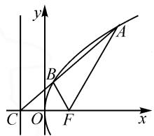
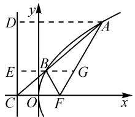
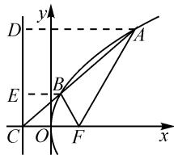

# 一题多解和一题多变:一道有关抛物线焦半径问题的探究\*

# 江苏省新沂市第一中学 吴玉章 苗庆硕

抛物线的焦半径问题是抛物线综合问题中的一类特殊类型,其可以联系起抛物线的定义(问题的本质)、几何性质(“数”的属性)与几何特征(“形”的特征)、焦半径公式(三角形式)等,“串联”起平面解析几何、平面几何、函数与方程、三角函数等众多相关知识,为问题的切入与解决提供较多的思维视角,给问题的解决提供更多的方案与技巧方法,是有效发散数学思维,考查学生“四基”、数学能力以及数学思想方法等方面比较有效的一个重要载体,备受各方关注.

# 1 问题呈现

问题 已知抛物线 $y^{2}=8x$ 的焦点为 F，准线与 x 轴的交点为 C，过点 C 的直线 l 与抛物线交于 A，B 两点，若 $\angle AFB = \angle CFB$ ，则 $|AF| =$ \_\_\_\_ .

此题以抛物线为问题场景,通过设置过准线与 x 轴交点的直线 l 与抛物线交于两点,利用两个角相等来创设定交点问题,进而求解相应焦半径的长度.

涉及抛物线的焦半径问题,可以从解析几何的实质入手,利用解析几何思维来合理进行数学运算与分析处理;也可以从平面几何的图形入手,利用平面几何思维进行逻辑推理与分析处理;还可以从焦半径的公式入手,利用三角函数思维来合理数学运算、逻辑推理与综合应用等.不同思维视角的切入,都给问题的解决提供了切实可行的技巧与方法,实现问题的巧妙解决.

# 2 问题破解

# 2.1 解析几何思维

解法 1: 设线法.

依题意可得 p=4，则 $F(2,0)$ ， $C(-2,0)$ .

根据已知可得直线 l 的斜率存在且不为 0，利用图形的对称性，不失一般性，设点 A, B 位于 x 轴的上方，如图 1 所示.

设直线 l 的方程为 x=my-2，其中 m>0。设 $A(x_{1},y_{1}), B(x_{2},y_{2}), y_{1}>y_{2}>0$ 。

联立 $\left\{ \begin{array}{l}x = my - 2,\\ y^2 = 8x, \end{array} \right.$ 消去参数 $x$ 并整理，可得

$$
y ^ {2} - 8 m y + 1 6 = 0.
$$

利用韦达定理, 可得 $y_{1} + y_{2} = 8m, y_{1}y_{2} = 16$ , 则

text_image

y
A
B
C O F x

图1

$$
\begin{array}{l} \mid A B \mid = \sqrt {1 + m ^ {2}} \mid y _ {1} - y _ {2} \mid = \sqrt {1 + m ^ {2}} \cdot \\ \begin{array}{l} \sqrt {6 4 m ^ {2} - 6 4} = 8 \sqrt {m ^ {4} - 1}, | B C | = \sqrt {1 + m ^ {2}} | y _ {2} | = \\ \sqrt {1 + m ^ {2}} \cdot y _ {2}. \end{array} \\ \end{array}
$$

由抛物线的定义,可得

$$
\left| A F \right| = x _ {1} + \frac {p}{2} = m y _ {1} - 2 + 2 = m y _ {1}.
$$

由于 $\angle AFB = \angle CFB$ ，则 $FB$ 是 $\angle AFC$ 的角平分线.由三角形内角平分线定理，得 $\frac{|CF|}{|AF|} = \frac{|BC|}{|AB|}$ 即 $\frac{4}{my_1} = \frac{\sqrt{1 + m^2}\cdot y_2}{8\sqrt{m^4 - 1}}.$

整理并化简, 可得 $my_{1}y_{2}=32\sqrt{m^{2}-1}$ , 即 16m=32 $\sqrt{m^{2}-1}$ , 则 $m^{2}=\frac{4}{3}$ , 解得 $m=\frac{2\sqrt{3}}{3}$ .

所以 $y_{1} + y_{2} = 8m = \frac{16\sqrt{3}}{3}$ 又 $y_{1}y_{2} = 16$ ，解得 $y_{1} = 4\sqrt{3}$ ，则 $|AF| = my_1 = \frac{2\sqrt{3}}{3}\times 4\sqrt{3} = 8.$

解后反思:设线法是借助解析几何思维处理问题的一种“通性通法”,成为解决直线与圆锥曲线位置关系问题时首选的一种基本方法.

# 2.2 平面几何思维

解法 2: 几何法.

依题意可得,p=4.

根据已知可得直线 l 的斜率存在且不为 0，利用图形的对称性，不失一般性，设点 A, B 位于 x 轴的上方，如图 2 所示.

过点 A, B 作抛物线准线的垂线, 垂足分别为 D,

E, 延长 EB 交 AF 于点 G.

由于 $EG \parallel CF$ ，因此 $\angle GBF = \angle CFB$ ，又 $\angle AFB = \angle CFB$ ，所以 $\angle AFB = \angle GBF$ ，可得 $|BG| = |FG|$ .

text_image

y
D
A
E
B
G
C
O
F
x

图 2

由 $\angle AFB = \angle CFB$ ，则 $FB$ 是 图2 $\angle AFC$ 的角平分线，利用三角形内角平分线定理可得 $\frac{|AB|}{|BC|} = \frac{|AF|}{|CF|}$

结合抛物线的定义有 $|AD|=|AF|$ ，可得 $|AB|\cdot|CF|=|BC|\cdot|AD|$ 。由于 $EG\parallel CF\parallel DA$ ，因此 $\frac{|BG|}{|CF|}=\frac{|AB|}{|AC|},\frac{|BE|}{|AD|}=\frac{|BC|}{|AC|}$ 。

所以有 $|BG|\cdot|AC|=|BE|\cdot|AC|$ ，可得 $|BG|=|BE|$ ，又结合抛物线的定义有 $|BE|=|BF|$ ，故 $|BG|=|FG|=|BF|$ ，即 $\triangle BFG$ 是正三角形，从而 $\angle BFG=60^{\circ}$ ，可得 $\angle AFx=60^{\circ}$ .

利用抛物线的焦半径公式, 可得 $\left|AF\right|=\frac{p}{1-\cos\theta}=\frac{4}{1-\cos60^{\circ}}=8.$

解后反思:平面解析几何侧重“数”与“形”的结合与转化,借助代数思维中的数学运算来处理几何图形中的逻辑推理问题等,实现问题的突破与应用.

# 2.3 三角函数思维

解法 3: 性质法.

依题意可得, p=4.

根据已知可得直线 l 的斜率存在且不为 0，利用图形的对称性，不失一般性，设点 A, B 位于 x 轴的上方，如图 3 所示，过点 A, B 作抛物线的准线的垂线，垂足分别为 D, E.

text_image

y
D
A
E
B
C O F x

图 3

设 $\angle AFx = \theta$ ，其中 $\theta$ 为锐角.结合 $\angle AFB = \angle CFB$ ，利用抛物线的焦半径公式可得 $|AF| = \frac{p}{1 - \cos\theta} = \frac{p}{2\sin^2\frac{\theta}{2}}, |BF| = \frac{p}{1 - \cos\left(\theta + \frac{\pi - \theta}{2}\right)} = \frac{p}{1 + \sin\frac{\theta}{2}}.$

由 $\angle AFB = \angle CFB$ 知， $FB$ 是 $\angle AFC$ 的角平分线，则利用三角形内角平分线定理可得 $\frac{|CF|}{|AF|} = \frac{|BC|}{|AB|}$ .

结合比例性质,可得 $\frac{|CF|}{|AF|+|CF|}=\frac{|BC|}{|AB|+|BC|}=\frac{|BC|}{|AC|}$ .而由 $EB\parallel DA$ ,可得 $\frac{|BE|}{|AD|}=\frac{|BC|}{|AC|}$ .结合抛物线的定义有 $|AD|=|AF|$ , $|BE|=|BF|$ ,即 $\frac{|BC|}{|AC|=}$

$\frac{|BE|}{|AD|}=\frac{|BF|}{|AF|}$ ，所以 $\frac{|CF|}{|AF|+|CF|}=\frac{|BF|}{|AF|}$ ，即 $\frac{p}{\frac{p}{2\sin^{2}\frac{\theta}{2}}+p}=\frac{\frac{p}{1+\sin\frac{\theta}{2}}}{\frac{p}{2\sin^{2}\frac{\theta}{2}}}$ ，整理可得 $\sin\frac{\theta}{2}-2\sin^{2}\frac{\theta}{2}=0.$

解得 $\sin\frac{\theta}{2}=\frac{1}{2}$ ，或 $\sin\frac{\theta}{2}=0$ （舍去），结合 $\theta$ 为锐角，解得 $\theta=60^{\circ}$ 。所以 $|AF|=\frac{p}{1-\cos\theta}=\frac{4}{1-\cos60^{\circ}}=8$ 。

解后反思: 抛物线的焦半径三角公式 $\left|AF\right|=\frac{p}{1-\cos\theta}$ ( $\theta$ 为直线 AF 的倾斜角), 是解决与抛物线的焦半径相关问题常用的结论. 借助三角函数思维, 结合三角函数的相关知识来巧妙综合与应用.

# 3 变式拓展

# 3.1 同源变式

变式 1 己知抛物线 $y^{2}=8x$ 的焦点为 F，准线与 x 轴的交点为 C，过点 C 的直线 l 与抛物线交于 A, B 两点，若 $\angle AFB = \angle CFB$ ，则 $|BF| =$ \_\_\_\_ .

在此基础上,可以对问题进行一般化的归纳与总结.

结论:已知抛物线 $y^{2}=2px(p>0)$ 的焦点为 F, 准线与 x 轴交于点 C, 过点 C 的直线 l 与抛物线交于 A, B 两点, 若 $\angle AFB=\angle CFB$ , 则 $|AF|=2p, |BF|=\frac{2p}{3}$ .

变式 2 已知抛物线 $y^{2}=8x$ 的焦点为 F，准线与 x 轴交于点 C，过点 C 的直线 l 与抛物线交于 A, B 两点，若 $\angle AFB = \angle CFB$ ，则 $|AB| =$ \_\_\_\_ .

# 3.2 同阶变式

变式 3 已知抛物线 $y^{2}=8x$ 的焦点为 F，准线与 x 轴交于点 C，过点 C 的直线 l 与抛物线交于 A，B 两点，若 $\angle AFB = \angle CFB$ ，则直线 AF 的斜率为 \_\_\_\_.

变式 1,2,3 的参考答案分别为: $\frac{8}{3}$ , $\frac{8\sqrt{7}}{3}$ , $\pm\sqrt{3}$ .

# 4 教学启示

此类涉及抛物线的焦半径问题,往往是多知识点交汇与融合的产物,这样的创设契合高考数学命题精神,而多知识点交汇也为问题的切入提供了更多的思维视角,给各层面的学生提供了更多的机会,从而更加有效地体现数学试题的选拔性与区分性.

在数学学习中,针对此类涉及圆锥曲线的焦半径问题,要深刻体会并加以系统学习,把握问题的实质与内涵,构建知识体系,理解技巧方法,形成解题习惯,培养数学品质.Z