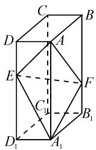
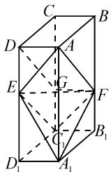
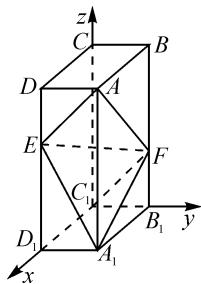
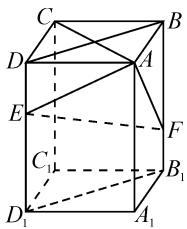

# 四点共面,链接教材,变式拓展

——以一道高考题为例

# 江苏省张家港市沙洲中学 陶贤

空间中的四点共面的判断与证明是空间向量与立体几何部分的一个基本知识点,也是一大难点,历年高考数学试题中较少涉及,没有引起大家的高度重视.而在2020年高考数学全国卷Ⅲ的文科和理科试题中,都出现了空间四点共面的证明问题,也充分说明了该部分知识的基础性与重要性.借助空间中四点共面的判断与证明,很好地考查考生的数形结合思想、空间想象能力与推理论证能力,以及直观想象、逻辑推理等数学核心素养.

# 1 真题呈现

高考真题 （2020 年高考数学全国卷Ⅲ理科第 19 题）如图 1，在长方体 $ABCD-A_{1}B_{1}C_{1}D_{1}$ 中，点 E, F 分别在棱 $DD_{1}, BB_{1}$ 上，且 $2DE = ED_{1}, BF = 2FB_{1}$ .

text_image

Geometric diagram of a rectangular prism with labeled vertices and internal diagonals

图 1

(1) 证明: 点 $C_{1}$ 在平面 AEF 内.  
(2) 若 AB = 2, AD = 1, $AA_{1} = 3$ ,
求二面角 $A-EF-A_{1}$ 的正弦值.

此题以长方体为问题背景,通过相应线段的长度关系,证明点在平面内(其实就是证明四点共面)以及求解二面角的平面角的正弦值,改变以往传统的证明直线与平面之间的平行或垂直关系,令人耳目一新.

# 2 问题破解

(I)第(1)问的证法如下：

证法 1: 几何法.

如图 2, 在棱 $CC_{1}$ 上取点 G, 使得 $C_{1}G = \frac{1}{2}CG$ , 连接 DG, FG, $C_{1}E$ , $C_{1}F$ .

在长方体 $ABCD-A_{1}B_{1}C_{1}D_{1}$ 中， $AD \parallel BC$ 且 AD = BC, $BB_{1} \parallel CC_{1}$ 且 $BB_{1} = CC_{1}$ .

由 $C_{1}G=\frac{1}{2}CG, BF=2FB_{1}$ ，可得 $CG=\frac{2}{3}CC_{1}=\frac{2}{3}BB_{1}=BF$ ，所以四边

text_image

Geometric diagram of a rectangular prism with labeled vertices and internal points, used for spatial geometry problems.

图 2

形 BCGF 为平行四边形, 则 $GF \parallel BC$ 且 GF = BC.

又 $BC \parallel AD$ 且 $BC = AD$ , 所以 $AD \parallel GF$ 且 $AD = GF$ , 即四边形 $AFDG$ 是平行四边形, 则 $AF \parallel DG$ 且 $AF = DG$ .

同理可证, 四边形 $DEC_{1}G$ 为平行四边形, 则 $C_{1}E \parallel DG$ 且 $C_{1}E = DG$ .

所以 $C_{1}E \parallel AF$ 且 $C_{1}E = AF$ ，则四边形 $AEC_{1}F$ 为平行四边形。因此，点 $C_{1}$ 在平面 AEF 内。

证法 2: 基底法 1——共面向量定理.

在长方体 $ABCD-A_{1}B_{1}C_{1}D_{1}$ 中， $BB_{1} \parallel CC_{1} \parallel DD_{1}$ 且 $BB_{1}=CC_{1}=DD_{1}$ ，结合 $2DE=ED_{1}, BF=2FB_{1}$ ，可得 $ED_{1}=BF$ 。

由 $\overrightarrow{AC_1} = \overrightarrow{AC} +\overrightarrow{CC_1} = \overrightarrow{AB} +\overrightarrow{AD} +\overrightarrow{DE} +\overrightarrow{ED_1} =$ $\overrightarrow{AB} +\overrightarrow{AD} +\overrightarrow{DE} +\overrightarrow{BF} = (\overrightarrow{AB} +\overrightarrow{BF}) + (\overrightarrow{AD} +\overrightarrow{DE}) =$ $\overrightarrow{AF} +\overrightarrow{AE}$ ，知 $A,E,F,C_{1}$ 四点共面，所以点 $C_1$ 在平面 $AEF$ 内.

证法 3: 基底法 2——共面向量定理的推论.

设 $\overrightarrow{D_1A_1} = a, \overrightarrow{D_1C_1} = b, \overrightarrow{D_1D} = c$ ，则 $\overrightarrow{D_1A} = a + c$ ， $\overrightarrow{D_1E} = \frac{2}{3} c$ ，可得 $c = \frac{3}{2}\overrightarrow{D_1E}$ ，于是 $a = \overrightarrow{D_1A} - \frac{3}{2}\overrightarrow{D_1E}$ .

由 $\overrightarrow{D_1F} = \overrightarrow{D_1A_1} +\overrightarrow{A_1B_1} +\overrightarrow{B_1F} = \overrightarrow{D_1A_1} +\overrightarrow{D_1C_1}+$ $\frac{1}{3}\overrightarrow{B_1B} = \overrightarrow{D_1A_1} +\overrightarrow{D_1C_1} +\frac{1}{3}\overrightarrow{D_1D} = \pmb {a} + \pmb {b} + \frac{1}{3}\pmb {c} =$ $\left(\overrightarrow{D_1A} -\frac{3}{2}\overrightarrow{D_1E}\right) + \overrightarrow{D_1C_1} +\frac{1}{3}\times \frac{3}{2}\overrightarrow{D_1E} = \overrightarrow{D_1A}+$ $\overrightarrow{D_1C_1} -\overrightarrow{D_1E}$ （其中 $1 + 1 - 1 = 1$ )，知 $A,E,F,C_{1}$ 四点共面，所以点 $C_1$ 在平面AEF内.

证法 4: 坐标法.

设AB=a,AD=b, $AA_{1}=c$ ，如图3所示，以 $C_{1}$ 为坐标原点， $\overrightarrow{C_{1}D_{1}}$ 的方向为x轴正方向，建立空间直角坐标系 $C_{1}-xyz$ .

连接 $C_{1}F$ ，则 $C_{1}(0,0,0)$ ， $A(a, b,c)$ ， $E\left(a,0,\frac{2}{3}c\right)$ ， $F\left(0,b,\frac{1}{3}c\right)$ ，于是 $\overrightarrow{EA} = \left(0, b, \frac{1}{3} c\right), \overrightarrow{C_1F} = \left(0, b, \frac{1}{3} c\right)$ ，可得 $\overrightarrow{EA} = \overrightarrow{C_1F}$ ，因此 $EA // C_1F$ ，即 $A, E, F, C_1$ 四点共面，所以点 $C_1$ 在平面 $AEF$ 内.

text_image

z
C
B
D
A
E
F
C₁
y
D₁
A₁
B₁
x

图3

点评:证明空间中的四点共面问题,常见的证明方法就是以上三大类——(1)利用空间几何图形的特征,借助几何法的推理与论证,通过空间问题平面化来证明;(2)利用共面向量定理或推论,借助空间向量的基底法,通过向量的线性运算与转化来证明;(3)利用空间直角坐标系的建立,借助坐标法的运算,通过向量的平行判断与转化来证明等.特别地,对于共面向量定理及其推论,是立体几何中的一个重要的定理,可以用来处理一些与之相关的问题,往往可以使问题处理得更加简捷、巧妙.

(Ⅱ)第(2)问的解法如下：

解: 以 $C_{1}$ 为坐标原点, $\overrightarrow{C_{1}D_{1}}$ 的方向为 x 轴正方向, 建立空间直角坐标系 $C_{1}-xyz$ , 则由已知可得 $A(2,1,3)$ , $E(2,0,2)$ , $F(0,1,1)$ , $A_{1}(2,1,0)$ , 则 $\overrightarrow{AE}=(0,-1,-1)$ , $\overrightarrow{AF}=(-2,0,-2)$ , $\overrightarrow{A_{1}E}=(0,-1,2)$ , $\overrightarrow{A_{1}F}=(-2,0,1)$ .

设平面 AEF 的法向量为 $\boldsymbol{m}=(x_{1},y_{1},z_{1})$ .

由 $\left\{ \begin{array}{l} m \cdot \overrightarrow{AE} = 0, \\ m \cdot \overrightarrow{AF} = 0, \end{array} \right.$ 得 $\left\{ \begin{array}{l} -y_1 - z_1 = 0, \\ -2x_1 - 2z_1 = 0, \end{array} \right.$ 取 $z_1 = -1$ 得 $x_1 = y_1 = 1$ ，则 $m = (1,1,-1)$ .

设平面 $A_{1}EF$ 的法向量为 $\boldsymbol{n}=(x_{2},y_{2},z_{2})$ .

由 $\left\{ \begin{array}{l} n \cdot \overrightarrow{A_1E} = 0, \\ n \cdot \overrightarrow{A_1F} = 0, \end{array} \right.$ 得 $\left\{ \begin{array}{l} -y_2 + 2z_2 = 0, \\ -2x_2 + z_2 = 0, \end{array} \right.$ 取 $z_2 = 2$ ，得 $x_{2} = 1, y_{2} = 4$ ，则 $n = (1,4,2)$ .

所以 $\cos \langle m, n \rangle = \frac{m \cdot n}{|m||n|} = \frac{1 + 4 - 2}{\sqrt{3} \times \sqrt{21}} = \frac{\sqrt{7}}{7}$ .

设二面角 $A - EF - A_{1}$ 的平面角为 $\theta$ ，则 $|\cos \theta| = \frac{\sqrt{7}}{7}$ ，可得 $\sin \theta = \sqrt{1 - \cos^2\theta} = \frac{\sqrt{42}}{7}$

因此，二面角 $A-EF-A_{1}$ 的正弦值为 $\frac{\sqrt{42}}{7}$ .

点评:坐标法是求解二面角的平面角的三角函数值问题中一个比较常见的方法,借助空间直角坐标系的建立,以及对应的点、向量的坐标的表示,结合相应两半平面的法向量的设置与确定,结合向量的数量积公式的转化与应用来确定相应的二面角的平面角问题.坐标法实现了用代数方法处理立体几何问题中的四点共面、线面位置关系、空间角、距离等几何推理与求解问题.

# 3 链接教材

以上基于向量的四点共面的判断,其对应的共面向量定理及其推论是数学教材中的一个基本知识点,来源于教材,又服务于证明,可以很好地证明或求解与四点共面有关的数学问题.

普通高中课程标准实验教科书《数学·选修2-1》(人教A版)第87页：

结论 1: 共面向量定理.

空间一点 P 位于平面 ABC 内的充要条件是存在有序实数对 $(x, y)$ ，使 $\overrightarrow{AP} = x \overrightarrow{AB} + y \overrightarrow{AC}$ .

普通高中课程标准实验教科书《数学·选修2-1》(人教A版)第88页“思考”：

结论 2: 共面向量定理的推论.

空间任意一点 O 和不共线的三点 A, B, C 满足向量关系式 $\overrightarrow{OP} = x \overrightarrow{OA} + y \overrightarrow{OB} + z \overrightarrow{OC} (x + y + z = 1)$ 的点 P 与点 A, B, C 共面.

共面向量定理是共线向量定理在空间中的推广与拓展,共线向量定理用来证明三点共线,共面向量定理用来证明四点共面.

# 4 变式拓展

高考真题 （2020 年高考数学全国卷Ⅲ文科第 19 题）如图 4，在长方体 $ABCD-A_{1}B_{1}C_{1}D_{1}$ 中，点 E, F 分别在棱 $DD_{1}, BB_{1}$ 上，且 $2DE = ED_{1}, BF = 2FB_{1}$ . 证明：

(1) 当 AB = BC 时, $EF \perp AC$ ;   
(2) 点 $C_{1}$ 在平面 AEF 内.

证明:(1)连接 BD, $B_{1}D_{1}$ .

text_image

Geometric diagram of a cube with labeled vertices and internal diagonals, used for spatial geometry problems.

图 4

因为 AB=BC，所以四边形 ABCD 为正方形，故 $AC \perp BD$ .

又因为 $BB_{1} \perp$ 平面 ABCD，于是 $BB_{1} \perp AC$ ，而 $BD, BB_{1} \subset$ 平面 $BB_{1}D_{1}D$ ，所以 $AC \perp$ 平面 $BB_{1}D_{1}D$ 。

因为 $EF \subset BB_{1}D_{1}D$ ，所以 $EF \perp AC$ 。

(2)可以参照上述理科真题第(1)问的证明方法.

# 5 解后反思

新一轮课程改革的核心就是培育学生的核心素养,发展学生的综合能力.承载着“立德树人、服务选才和引导教学”功能的数学高考,应借助试题“情境”的变革,夯实基础,以教材为本并超越教材,着眼于基础知识、基本技能、基本方法的考查,特别重视对数学思想方法、关键能力和学科素养的考查.因而在平时的数学教学与复习中,教师应在拓展延伸中紧扣课本,链接教材,注重归类迁移能力培养,聚焦思维品质,培养关键能力,从而有效实现学生数学素养的渐进式提升.Z