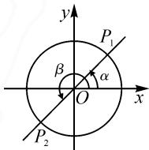
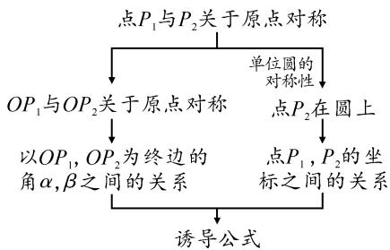
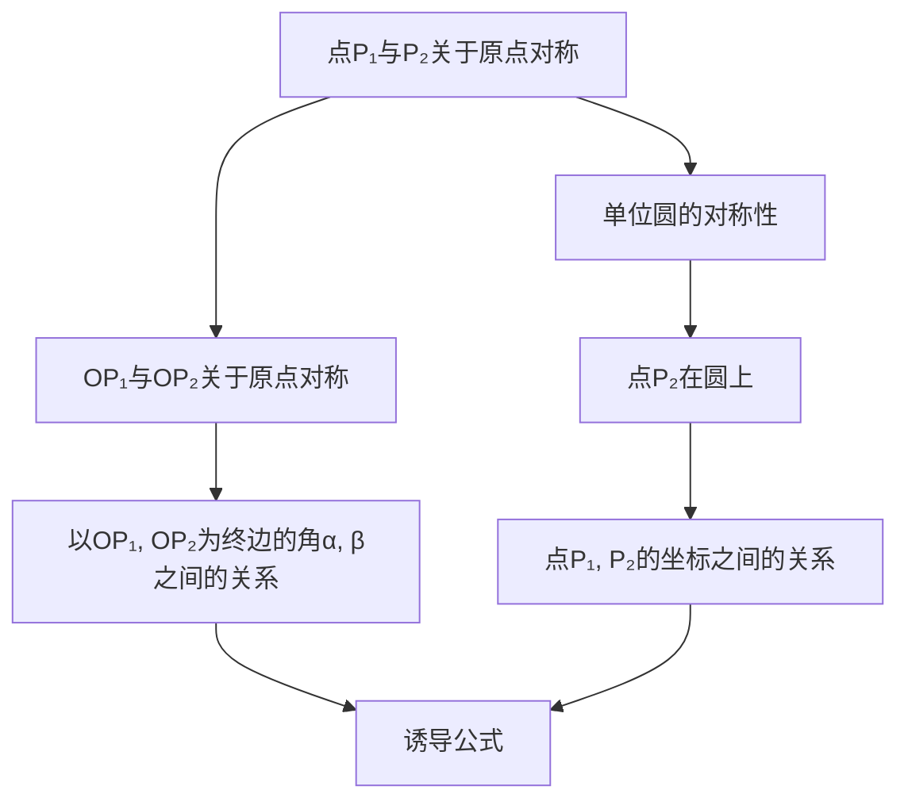
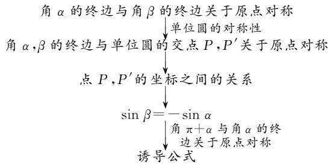
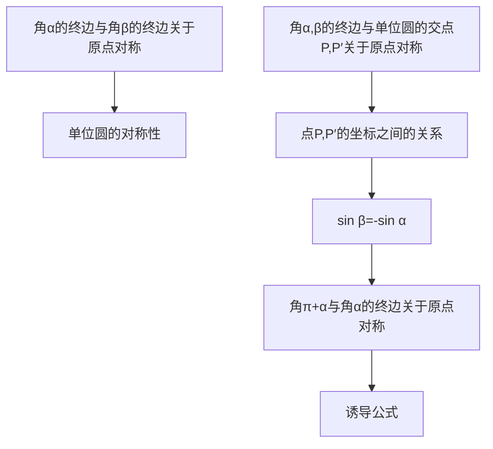
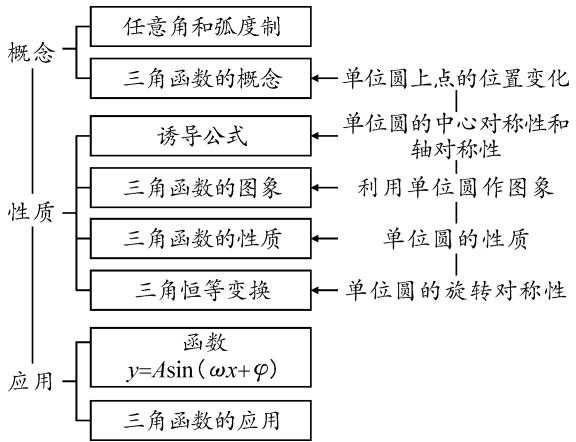
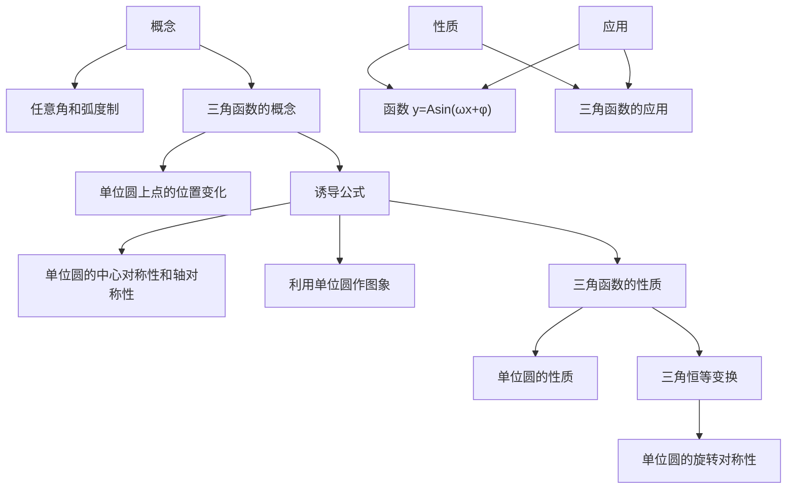

# 基于数学抽象的高中数学教材分析与比较

——以人教 A 版和苏教版“三角函数”为例

● 南京师范大学教师教育学院 赵健滢 张怡文

摘要: 数学抽象是高中阶段的六个数学学科核心素养之一.本文中从数学抽象的视角对人教 A 版教材和苏教版教材中“三角函数”一章的内容进行分析和比较,探寻教材落实发展学生数学抽象素养的要求以及两版教材在这一方面的区别,以期为教师教学提供参考.

关键词: 数学抽象; 人教 A 版; 苏教版; 三角函数

# 1 研究问题

数学抽象主要包括从数量与数量关系、图形与图形关系中抽象出数学概念及概念之间的关系，从事物的具体背景中抽象出一般规律和结构，并用数学语言予以表征[1].《普通高中数学课程标准（2017年版2020年修订）》中将数学抽象置于六个核心素养之首，这表明了数学抽象素养的重要地位.

教材是教与学的重要材料.教师只有仔细研读教材才能用好教材,充分发挥教材的价值.教材是如何将发展学生的数学抽象素养融入到教学内容之中?对此不同版本教材之间存在哪些区别?“获得数学概念和规则,提出数学命题和模型,形成数学方法与思想,认识数学结构与体系”是数学抽象的四种表现 $^{[1]}$ .这四种表现可视为数学学习中的四个过程,这些过程有赖于数学抽象的参与,因此有助于发展学生的数学抽象素养.“三角函数”一章内容丰富,是发展学生数学抽象素养的良好载体.为此,本文中选取高中数学人教A版教材(2019)和苏教版教材(2020)(以下简称“人教A版教材”和“苏教版教材”)中“三角函数”一章,以数学抽象的四种表现为分析维度尝试回答上述两个问题,以期为教师教学提供参考.

# 2 研究内容

# 2.1 获得数学概念和规则

数学抽象的一个重要表现是获得数学概念和规则.数学概念的获得往往源于数学问题,而数学问题是抽象概念的源头.具体到概念获得的过程,有概念形成和概念同化两种方式.概念形成模式包括“具体例子—观察共性—抽象本质—形成定义—强化概念—概念应用”,概念同化模式包括“先行组织者—定义概念—强化概念—概念应用”[2].“三角函数”一章中最重要的概念是三角函数的概念,对于三角函数概念的获得,

两版教材都采用了概念形成的方式.此外,苏教版教材还安排了对正弦、余弦、正切概念的学习,并用概念同化的方式获得这三个概念.基于以上说明,下面按照获得概念的顺序从“提出问题”“抽象本质”“强化概念”三个方面对两版教材中的相关内容展开分析.

# (1) 提出问题

三角函数在近代数学中的快速发展得益于其与圆周运动等周期现象的紧密联系,两版教材都注重向学生渗透这种联系,提出用数学模型刻画圆周上一点的运动情况,如表1所示.此外,苏教版教材引导学生对这个问题进行初步分析后,将问题进一步明确为用模型刻画两种表示方法的关系.

表 1 两版教材提出的问题对比

<table><tr><td></td><td>人教A版</td><td>苏教版</td></tr><tr><td>提出问题</td><td>单位圆 $\odot O$ 上的点P以A为起点做逆时针方向旋转,建立一个数学模型,刻画点P的位置变化情况.</td><td>1 $P$ 是半径为 $r$ 的圆 $O$ 上一点,用什么样的数学模型来刻画点 $P$ 的运动规律?为此,需要将点 $P$ 表示出来.2以圆心 $O$ 为端点的水平射线为始边,射线 $OP$ 为终边形成的角为 $\alpha$ .以水平线为 $x$ 轴,圆心 $O$ 为坐标原点,建立平面直角坐标系.有序数对 $(r,\alpha)$ 与坐标 $(x,y)$ 都可表示点 $P$ ,用怎样的数学模型刻画 $(x,y)$ 与 $(r,\alpha)$ 之间的关系?</td></tr></table>

# (2) 抽象本质

抽象本质是概念形成的重要环节.承接前面的问题,两版教材中对三角函数概念本质的抽象过程如表2所示.苏教版教材中,三角函数概念的建立需要借助任意角的正弦、余弦、正切概念.对于这三个概念的获得,教材是在锐角的正弦、余弦、正切概念的基础上直接给出定义.在这个过程中,苏教版教材将初中和高中阶段学习的正弦、余弦、正切的概念进行衔接,利于学生在旧知的基础上学习新知.但是对学生而言,在经历从锐角到任意角这一思维跨越时,他们是根据两个定义之间形式上的相似而非本质上的相通来理解的.三角函数不以“代数运算”为媒介,是几何量(角与有向线段)之间的直接对应,这是一个学习难点 $^{[3]}$ .人教A版教材从角与坐标之间唯一确定的关系中抽象出正弦函数的概念,直接展示了正弦函数中几何量之间的对应,利于突破这一难点.苏教版教材从角与正弦值之间唯一确定的关系中抽象出正弦函数的概念,实际上正弦值是由坐标计算得来的,因此建立的也是几何量之间的对应.但是学生在理解时,需要借助正弦值的概念才能“看到”这种对应,这可能会增加理解正弦函数对应关系的难度.

表 2 两版教材在抽象本质阶段的内容对比

<table><tr><td></td><td>人教A版</td><td>苏教版</td></tr><tr><td>抽象本质</td><td>1以单位圆的圆心O为原点,以射线OA为x轴的非负半轴,建立平面直角坐标系,点P的坐标为(x,y).射线OA从x轴的非负半轴开始,绕点O按逆时针方向旋转角α,终止位置为OP.当 $\alpha = \frac{\pi}{6},\frac{\pi}{2}$ , $\frac{2\pi}{3}$ 时,点P的坐标是什么?是否唯一确定?对于任意给定的一个角α也是如此吗?2一般地,任意给定一个角 $\alpha \in \mathbf{R}$ ,它的终边OP与单位圆交点P的横坐标、纵坐标都是唯一确定的.点P的横坐标x、纵坐标y都是角α的函数.</td><td>1当 $\alpha$ 为锐角时,由初中阶段所学“锐角的正弦、余弦、正切”,有 $\sin \alpha = \frac{y}{r},\cos \alpha = \frac{x}{r}$ , $\tan \alpha = \frac{y}{x}$ .一般地,将锐角推广到任意角,在角终边上任意取一点(异于原点),由形式上的相似给出任意角的正弦、余弦、正切的概念.2当 $\alpha = 0,\frac{\pi}{6},\frac{\pi}{3},\frac{\pi}{2},......,\frac{11\pi}{6},2\pi$ 时,计算 $\sin \alpha$ 的值.把 $\alpha$ 的值看作横坐标,对应的 $\sin \alpha$ 的值看作纵坐标,在平面直角坐标系中描出点( $\alpha$ , $\sin \alpha$ ).3从以上计算过程和所画的图中可以得到:对于每一个实数 $\alpha$ ,都有唯一实数 $\sin \alpha$ 与之对应,故 $\sin \alpha$ 是 $\alpha$ 的函数.</td></tr></table>

# (3) 强化概念

在强化概念环节中,学生将加深对概念的理解.选取人教 A 版教材对三角函数概念与苏教版教材对正弦、余弦、正切概念的强化内容,具体见表 3. 下面围绕其中的两点区别进行分析.第一,关于对锐角三角函数与任意角的三角函数关系的处理,人教 A 版教材在得到任意角的三角函数后,再通过探究活动让学生思考二者之间的关联,进而认识到锐角三角函数与任意角的三角函数虽然来自不同的背景,但是存在联系.苏教版教材在锐角三角函数的基础上得到任意角的三角函数,这样的内容安排再现了历史上由锐角三角函数再到任意角三角函数的发展历程,但是学生可能会据此认为任意角的三角函数是由锐角三角函数推广而来.第二,人教 A 版教材与苏教版教材分别用“角终边与单位圆交点的坐标”“角终边上任意一点(异于原点)的坐标比”来定义三角函数,这是三角函数的两种定义方式.在强化概念阶段,两版教材虽然没有直接点明另外一种定义方式,但是对其有所渗透.人教 A 版教材引导学生通过证明认识到,由角 $\alpha$ 终边上任意一

点(不与原点 O 重合)的坐标都可求得角 $\alpha$ 的各个三角函数值.苏教版教材在计算正弦、余弦、正切值的例题后指出:可以选择角 $\alpha$ 的终边与单位圆的交点计算角 $\alpha$ 的正弦、余弦、正切值.

表 3 两版教材在强化概念阶段的内容对比

<table><tr><td></td><td>人教A版</td><td>苏教版</td></tr><tr><td>强化概念</td><td>1按照初中所学的锐角三角函数定义和本节所学的三角函数定义计算锐角的正弦、余弦、正切,探究结果是否相等.2设α是一个任意角,它的终边上任意一点P(不与原点O重合)的坐标为(x,y),点P与原点的距离为r.求证:sinα=y/r,cosα=x/r,tanα=y/x.</td><td>sinα,cosα,tanα的值与角α的终边上的点的位置无关,因此为了方便可以选择角α的终边与单位圆的交点来计算sinα,cosα,tanα的值.</td></tr></table>

# 2.2 提出数学命题和模型

# (1) 提出数学命题

“三角函数”一章中的数学命题主要有诱导公式.诱导公式的抽象过程是将图形的对称性用数学语言表达成三角函数的对称性的过程.以公式 $\sin(\pi+\alpha)=-\sin\alpha$ 为例,分析两版教材中抽象出诱导公式的过程,其他诱导公式与此类似.

人教 A 版教材以“利用圆的对称性研究三角函数的对称性”导入. 如图 1, 任意角 $\alpha$ 的终边与单位圆交于点 $P_{1}$ , 作 $P_{1}$ 关于原点的对称点 $P_{2}$ , 以 $OP_{2}$ 为终边的角记作 $\beta$ . 如图 2, 从点 $P_{1}, P_{2}$ 的对称关系出发, 一

  
图1

方面得到角 $\alpha, \beta$ 终边的对称关系，进而得出两角的关系为 $\beta = 2k\pi + (\pi + \alpha)(k \in \mathbf{Z})$ 。另一方面由单位圆的中心对称性可知，点 $P_{2}$ 就在圆上，因此角 $\alpha, \beta$ 的终边与单位圆的交点即为点 $P_{1}, P_{2}$ ，进而利用这两个点的对称关系可以得到坐标的关系。由前者确定角的关系，由后者确定对应的正弦值的关系，两相结合就得到诱导公式。

flowchart

图 2 人教 A 版教材中诱导公式的抽象路径

苏教版教材以“终边具有对称关系的两个角的三角函数值之间有什么关系”导入.已知角 $\alpha$ 的终边与角 $\beta$ 的终边关于原点 O 对称,且分别与单位圆交于点 P, $P'$ .如图 3,从角 $\alpha,\beta$ 终边的对称关系出发,由单位圆的中心对称性得到交点 P, $P'$ 的对称关系,由此可得到它们坐标的关系,进而得到角 $\alpha,\beta$ 正弦值的关系为 $\sin\beta=-\sin\alpha$ . 最后将角 $\beta$ 特殊化, 因为角 $\pi+\alpha$ 与角 $\alpha$ 的终边关于原点 O 对称, 所以用角 $\pi+\alpha$ 代替角 $\beta$ 即得到诱导公式.

flowchart

图 3 苏教版教材中诱导公式的抽象路径

# (2) 提出数学模型

数学抽象的一个表现是“提出数学模型”，这也体现了数学抽象与数学建模两种素养之间的联系：通过数学抽象建立数学模型，在数学建模过程中发展数学抽象。“三角函数”一章主要涉及用函数 $y = A \sin (\omega x + \varphi)$ 刻画的匀速圆周运动模型和一般的周期运动模型。人教A版教材以“用数学模型刻画匀速圆周运动”为问题，选取我国古代的筒车作为问题情境，用符号表示筒车运动过程中的若干物理量，分析这些量之间的关系，进而抽象出函数 $y = A \sin (\omega x + \varphi)$ ，回答了开始的问题。苏教版教材由“确定时刻 $t$ 时，摩天轮上一点 $P$ 距离地面的高度”引入，通过分析与点 $P$ 高度有关的物理量得到函数 $y = A \sin (\omega x + \varphi)$ ，再点明它的模型作用——描述匀速圆周运动。最后，两版教材都以函数 $y = A \sin (\omega x + \varphi)$ 为基础，通过确定其中的参数建立了刻画简谐运动等一般周期运动的数学模型。

# 2.3 形成数学方法与思想

通过数学抽象可以挖掘出数学知识背后隐含的数学方法与思想，揭示知识的本质。除概念形成过程中从特殊到一般的思想，以及函数研究中常用的数形结合思想外，教材在三角函数这一章的内容设计还有助于学生形成以下数学方法与思想。两版教材都从对称的角度引入和推导诱导公式，另外人教A版教材从旋转的角度推导两角差的余弦公式，分别向学生渗透了对称变换思想和旋转变换思想。两版教材中都只对诱导公式二给出了详细的推导过程，公式三和公式四则仿照公式二的证明方式得到，在这个过程中学生可以领悟到类比推理思想。得到前四组诱导公式后，两版教材都设置了求三角函数值的例题，引导学生发现利用这四组公式可以将任意角的三角函数转化为区间 $\left[0, \frac{\pi}{2}\right]$ 内的角的三角函数。此外，人教A版教材在得到公式五和公式六后，指出利用它们实现正弦函数与余弦函数的相互转化.这些都利于学生形成转化与化归思想.人教A版教材在研究正切函数时,采用了“周期性和奇偶性—图象—其他性质”的方式.苏教版教材在研究正弦函数、正切函数时,采用了“周期性—图象—其他性质”的方式.两版教材的内容虽然在具体安排上略有差别,但是正如苏教版教材在“本章回顾”中指出的“依性作图,以图识性”,都能体现出图象与性质之间的相互关系,强化图象与性质之间“双向研究”的方法.

# 2.4 认识数学结构与体系

认识数学结构与体系是数学抽象的一个较高水平的表现.三角函数是一类具体的函数,遵循函数研究的一般规律的“概念—性质—应用”,两版教材的章节结构都体现了这一规律,这可以看成是这一章结构体系的“明线”.除此以外,两版教材在内容中都设置了“暗线”.人教A版教材将单位圆作为暗线贯穿本章的主要内容,如图4所示.苏教版教材将三角函数线作为暗线贯穿三角函数值的几何表示—诱导公式六—三角函数的图象—三角函数的性质.

flowchart

图 4 人教 A 版教材中“三角函数”一章的明线与暗线

数学抽象素养内涵丰富,本文中以“三角函数”一章为例,从数学抽象的四种表现解读了人教A版教材和苏教版教材是如何发展学生数学抽象素养的,并揭示了两版教材在这一方面各自的特点.实际教学中,教师应把握所用教材的特点,借鉴其中的先进理念,将发展学生的数学抽象素养真正地落实到课堂中.

# 参考文献：

[1]中华人民共和国教育部.普通高中数学课程标准(2017年版2020年修订)[S].北京:人民教育出版社,2020:4-5.  
[2]喻平.数学教学心理学[M].2版.北京:北京师范大学出版社,2018:242-245.  
[3]章建跃.用几何直观和代数运算的方法研究三角函数[J].数学通报,2020,59(11):4-13,57.Z