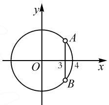

# 复数场景创设,几何意义应用

# 山东省华侨中学 孙宝庆

摘要: 复数的几何意义是复数自身的延伸与拓展,也是“数”“形”结合的很好例证.结合复数几何意义应用的一些常见场景实例,结合概念、运算、综合问题以及创新问题等方面,剖析复数几何意义应用的内涵实质,归纳总结解题规律与技巧,本文中指导数学教学与复习备考.

关键词: 复数; 几何意义; 概念; 运算; 综合

通过建立平面直角坐标系,引入复平面,就可以把相应的复数(代数问题)转化为复平面内的点(几何问题)来分析与研究,建立了数形结合的通道,实现“数”与“形”的结合,为进一步利用复数来解决相应的数学问题提供了方便.建立了复平面内的点 $Z(a,b)$ 、向量 $\overrightarrow{OZ}=(a,b)$ 与复数 $z=a+bi(a,b\in\mathbf{R})$ 三者之间的一一对应关系,为我们用复数方法解决几何问题、复数方法解决向量问题、向量方法解决复数问题,以及它们反过来解决对应的问题等创造了条件.

# 1 复数中的概念问题

例 1 在复平面内, 复数 $z = -\sin 2 - \cos 2$ 的共轭复数所对应的点位于().

A. 第一象限

B. 第二象限

C. 第三象限

D.第四象限

分析:根据题设条件,结合三角函数的概念、性质,确定对应三角函数值的正负,再利用共轭复数的概念,进而确定对应复数的实部与虚部的正负,利用复数的几何意义等判断相应点的位置.

解析: 因为 2 弧度对应的角的终边在第二象限, 则有 $\sin 2 > 0, \cos 2 < 0$ .

又复数 $z = -\sin 2 - \mathrm{i}\cos 2$ 的共轭复数为 $\overline{z} = -\sin 2 + \mathrm{i}\cos 2$ ，可得 $-\sin 2 < 0, \cos 2 < 0.$

结合复数的几何意义,知复数 $\overline{z}=-\sin2+\mathrm{i}\cos2$ 所对应的点位于第三象限.

故选：C.

点评:借助复数的几何意义,合理构建起复数 $z=a+bi(a,b\in\mathbb{R})$ 在复平面内的对应点的坐标 $Z(a,b)$ ，结合复数的概念,利用点 $Z(a,b)$ 所满足的条件来判断复数所对应的点的几何特征等.涉及复数的基本概念问题,要充分把握概念的实质,挖掘概念的内涵,不要产生混淆,否则容易出错.

# 2 复数中的线性运算问题

例 2 已知复数 $z_{1}$ 对应的向量 $\overrightarrow{OZ_{1}}$ 的终点在第四象限，复数 $z_{2}$ 对应的向量 $\overrightarrow{OZ_{2}}$ 的终点也在第四象限，那么复数 $z_{1} + z_{2}$ 对应的向量 $\overrightarrow{OZ}$ 的终点在（）.

A. 第一象限

B. 第二象限

C. 第三象限

D. 第四象限

分析:根据题设条件,结合两复数所对应的向量的终点均在第四象限,利用复数的几何意义以及对应的复数的加法运算,从几何视角来直观分析与处理,进而确定两复数的和所对应的向量的终点位置.

解析:依题意可知,复数 $z_{1}$ 对应的向量 $\overrightarrow{OZ_{1}}$ 的终点在第四象限,复数 $z_{2}$ 对应的向量 $\overrightarrow{OZ_{2}}$ 的终点也在第四象限,结合复数的加法运算的几何意义,借助平行四边形法则,可知复数 $z_{1} + z_{2}$ 对应的向量 $\overrightarrow{OZ}$ 的终点一定在复数 $z_{1}, z_{2}$ 对应的向量所在的直线的之间位置,即其终点也是在第四象限.

故选:D.

另解：设 $z_{1}=a+bi, z_{2}=c+\mathrm{d}i(a,b,c,d\in\mathbf{R})$ .

由题意可知, 复数 $z_{1}$ 对应的点在第四象限, 则 a > 0, b < 0.

同理 c>0, d<0.

又 $z_{1} + z_{2} = a + bi + c + di = (a + c) + (b + d)i,$ 所以 $a+c>0, b+d<0.$

故 $z_{1} + z_{2}$ 对应的向量 $\overrightarrow{OZ}$ 的终点在第四象限.

点评: 直接抓住复数加法运算的几何意义, 从“形”的视角切入, 将复数问题转化为对应的向量问题, 直观明了, 易于分析. 特别地, 涉及两个复数的加法运算, 借助对应的几何意义解题时, 既可以使用平行四边形法则, 也可以使用三角形法则.

# 3 复数中的综合运算问题

例 3 复数 $z=1+i$ 在复平面内对应的点为 A，将点 A 向右平移一个单位长度得到点 B，将点 B 绕坐标原点按逆时针方向旋转 $90^{\circ}$ 得到点 C，再将点 C 向上平移一个单位长度得到点 D，则点 D 所对应的复数为 \_\_\_\_.

分析:根据题设条件,结合复数的几何意义,由条件中给出的复数确定对应点A的坐标,利用复平面内点的平移变换、旋转变换等依次确定对应点的坐标,进而由点的坐标还原对应的复数.

解析:依题意可知,点 A 为 $(1,1)$ , 将点 A 向右平移一个单位得到点 $B(2,1)$ , 而将点 B 绕坐标原点按逆时针方向旋转 $90^{\circ}$ 得到点 C, 结合对称性知, 点 C 为 $(-1,2)$ , 再将点 C 向上平移一个单位长度得到点 $D(-1,3)$ .

所以点 D 所对应的复数为 $-1+3i$ .

故填答案: $-1+3i$ .

点评:熟练掌握平面直角坐标系中点的平移变换、旋转变换(以 $90^{\circ}$ 旋转等)、对称变换(以坐标原点为对称中心的中心对称变换,以坐标轴、象限的角平分线等为对称轴的轴对称变换)等,巧妙融入复数或平面向量的相关知识,借助复数的几何意义加以综合.

# 4 复数的综合问题

例 4 已知复数 $z=3+a\mathrm{i}(a\in\mathbf{R})$ ，且满足 $|z|<4$ ，则实数 a 的取值范围是 \_\_\_\_.

分析:根据题设条件,结合复数的模的条件,可以从代数思维与几何思维视角切入,分别通过模的代数运算与不等式求解,以及复数的几何意义的应用等来分析与解决,各有千秋,殊途同归.

解法一:代数思维.

依题意可知， $z = 3 + a\mathrm{i}(a\in \mathbf{R})$ ，可得 $|z| = \sqrt{3^2 + a^2}$

由已知可得 $3^{2} + a^{2} < 4^{2}$ ，即 $a^2 < 7$ ，解得 $-\sqrt{7} < a < \sqrt{7}$ .

所以实数 a 的取值范围是 $(- \sqrt{7}, \sqrt{7})$ .

故填答案： $(- \sqrt{7}, \sqrt{7})$ .

解法二: 几何思维.

如图 1 所示, 由 $|z| < 4$ 知, 复数 z 在复平面内对应的点在以原点为圆心, 以 4 为半径的圆内 (不包括边界).

text_image

y
A
O 3 4 x
B

图 1

由 $z = 3 + a\mathrm{i}$ 知，复数 $z$ 对应 图1的点在直线 $x = 3$ 上，所以线段 $AB$ （除去端点）为动点 $Z$ 的集合，由图可得 $-\sqrt{7} <  a <   \sqrt{7}$

所以实数 a 的取值范围是 $(- \sqrt{7}, \sqrt{7})$ .

故填答案: $(- \sqrt{7}, \sqrt{7})$ .

点评:涉及复数的模的综合问题,有其“数”的基本属性,也有其“形”的结构特征,具有对应的几何意义.借助复数的几何意义来解决一些与复数的模相关的综合问题,可以进一步拓展复数中的代数本质,以更直观形象的视角来挖掘复数中的几何内涵,为综合问题的解决提供更加广阔的空间.

# 5 复数的创新问题

例 5 18 世纪末, 挪威测量学家维塞尔首次利用坐标平面上的点来表示复数, 使复数及其运算具有了几何意义, 例如 $|z| = |OZ|$ , 也即复数 z 的模的几何意义为 z 对应的点 Z 到原点的距离. 已知复数 z 满足 $|z| = 1$ , i 为虚数单位, 则 $|z + 3 - 4i|$ 的最小值为 \_\_\_\_.

分析:根据题设条件,由题设场景中给出的复数z的模的几何意义,将复数问题转化为对应的几何问题,利用图形直观,结合点与圆的位置关系加以分析与判断,进而确定相应的最值问题.

解析:依题意可设 $z=x+y\mathrm{i}(x,y\in\mathbf{R})$ .

由题意可知 $|z| = 1$ ，利用复数的模的概念可知， $x^{2} + y^{2} = 1$ ，其几何意义为以 $O(0,0)$ 为圆心，半径为 $r = 1$ 的圆.

由于 $|z + 3 - 4\mathrm{i}|$ 的几何意义是圆 $O$ 上的点到定点 $P(-3,4)$ 的距离，又 $|OP| = \sqrt{3^2 + 4^2} = 5$ ，因此根据点与圆的位置关系可知， $|z + 3 - 4\mathrm{i}|$ 的最小值为 $|OP| - r = 5 - 1 = 4.$

故填答案:4.

点评:我们知道,复数的概念、复数的模、复数的四则运算等都具有各自对应的几何意义,有其“形”的几何特征,充分挖掘并利用这些相关要素的几何意义,可以很好地将相应的“代数”问题巧妙转化为“几何”问题,从不同思维视角、不同知识层面等方面来分析、解决问题,实现问题的突破与应用.

复数的几何意义是复数中的“数”与几何中的“形”之间衔接的桥梁，是“数”与“形”结合的体现。通过复数几何意义的引入与应用，淡化了繁琐的数学运算和技巧方法训练，可以更好地体会数学体系的建构过程、数形结合思想以及理性思维在数学发展中的作用，达到利用复数几何意义的“形”的意识，结合复数的基本概念、四则运算等，明确现实生活中存在的“数”，真正达到数形结合。Z