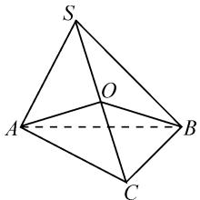
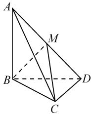
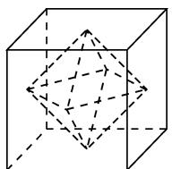
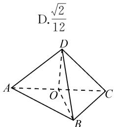
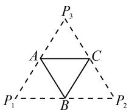
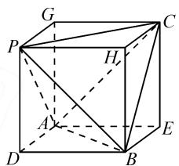
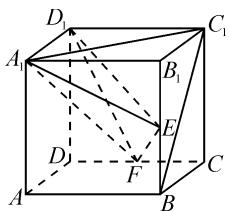
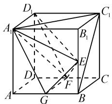
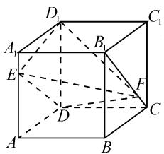
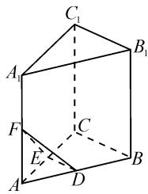

# 多面体体积计算中的多种思维方法

● 陕西省铜川市王益中学 徐海军  
陕西省汉中市四〇五学校 侯有岐

空间几何体的体积,依据题设的特殊性可直接用公式、作棱的直截面割补法、三棱锥等体积变换法、分割法、补形法等求解,凸显“化非规则为规则,化不可求为可求,或化不易求为易求”的整体思维的具体应用.下文主要探究几何体体积计算中的多种思维方法.

# 1 整体法

例 1 已知长方体的三个面面积分别为 $\sqrt{2}$ , $\sqrt{3}$ , $\sqrt{6}$ , 则长方体的体积等于().

A. $\sqrt{6}$

B.6

C. $6\sqrt{6}$

D. 36

解析:设此长方体的长、宽、高分别为 x, y, z.

由题意，得 $\left\{ \begin{array}{l} xy = \sqrt{2}, \\ yz = \sqrt{3}, \\ xz = \sqrt{6}. \end{array} \right.$ 相乘得 $(xyz)^2 = 6$ ，所以 $V = xyz = \sqrt{6}$ . 故选：B.

上述三元方程组中的未知数 x, y, z 在每个方程中呈现轮换式, 对于此类方程组采用三式相乘, 求解 x, y, z 的值尤为方便. 当然三元轮换的方程组还可以三式相加, 同样可获得理想的效果.

# 2 公式法

例 2 （2017 课标 1 文·16）已知三棱锥 S-ABC 的所有顶点都在球 O 的球面上，SC 是球 O 的直径。若平面 SCA ⊥ 平面 SCB, SA = AC, SB = BC，三棱锥 S-ABC 的体积为 9，则球 O 的表面积为 \_\_\_\_.

分析:由已知易证 $OA \perp$ 平面 SCB, 可选 $\triangle SCB$ 为底面, OA 为高直接用三棱锥的体积公式沟通关系求半径.

解析: 如图 1, 连接 OA, OB. 因为 SO = OC, SA = AC, SB = BC, 所以 $OA \perp SC$ , $OB \perp SC$ . 又平面 SCA ⊥ 平面 SCB, 所以 OA ⊥ 平面 SCB.

text_image

S
O
A
B
C

图1

设 OA=r，因为 SC 是球 O 的
直径，SA=AC, SB=BC，所以 Rt△SBC, Rt△SAC 是等腰直角三角形，且斜边为 2r，高为 r. 于是 $V_{A-SBC}=$

$$
\frac {1}{3} \times S _ {\triangle S B C} \times O A = \frac {1}{3} \times \frac {1}{2} \times 2 r \times r \times r = \frac {1}{3} r ^ {3} = 9.
$$

从而得 r=3 。故球的表面积为 $4\pi r^{2}=36\pi$

例 2 用到的公式法也叫直接法,一般适用于几何体形状整齐,有较明显的垂直关系且长度已知的题型.用公式法求几何体的体积要先确定高和底面积,对于高的确定一定要先证明该直线垂直于底面,不可以凭感觉判定.

# 3 等体积法

例 3 （2014 福建高考）如图 2 所示，三棱锥 A-BCD 中， $AB \perp$ 平面 BCD， $CD \perp BD$ .

(1) 求证: $CD \perp$ 平面 ABD.  
(2) 若 AB = BD = CD = 1, M 为 AD 的中点, 求三棱锥 A-MBC 的体积.

text_image

Geometric diagram of a tetrahedron with labeled vertices A, B, C, D and internal point M, showing solid and dashed edges.

图2

分析: 利用等体积法, 可得 $V_{A-MBC} = V_{C-ABM} = \frac{1}{3} \cdot CD \cdot S_{\triangle ABM}$ , 即可求出三棱锥 A-MBC 的体积.

解析:(1)证明略.

(2)由 $AB \perp$ 平面 BCD，得 $AB \perp BD$ 。因为 AB = BD = 1，所以 $S_{\triangle ABD} = \frac{1}{2} \times 1 \times 1 = \frac{1}{2}$ 。又 M 是 AD 的中点，所以 $S_{\triangle ABM} = \frac{1}{2} S_{\triangle ABD} = \frac{1}{2} \times \frac{1}{2} = \frac{1}{4}$ 。

由(1)知, $CD \perp$ 平面 ABD,所以三棱锥 C-ABM 的高为 CD=1,因此三棱锥 A-MBC 的体积 $V_{A-MBC}=V_{C-ABM}=\frac{1}{3}\cdot CD\cdot S_{\triangle ABM}=\frac{1}{3}\times1\times\frac{1}{4}=\frac{1}{12}.$

立体几何中的等体积法(换顶点)大多用于与锥体体积有关的问题,尤其是三棱锥,这是因为三棱锥的任何一个面都可以作为底面.转换原则是换底时高易求或底面放在已知几何体的某个面上.

# 4 分割法

例 4 （2018·江苏卷·10）正方体的棱长为 2，以其所有面的中心为顶点的多面体的体积为 \_\_\_\_.

分析:由题意可知所求多面体是正八面体,可将其看作是由两个大小相同的正四棱锥组合而成的组合体,这样问题等价于求正四棱锥体积的两倍.

由图 3 可知, 所求多面体的体积为 $2 \times \frac{1}{3} \times 1 \times (\sqrt{2})^{2} = \frac{4}{3}$ .

  
图3

例 5 将边长为 O 的正方形 ABCD 沿对角线 AC 折起，使 $\triangle ABD$ 为正三角形，则三棱锥 A-BCD 的体积为（）.

A. $\frac{1}{6}$

B. $\frac{1}{12}$

C. $\frac{\sqrt{3}}{12}$

分析:如图4,取AC的中点O,连接BO,DO,由已知易证 $AC\perp$ 平面BOD,因此可将三棱锥A-BCD分割成以 $\triangle BOD$ (棱AC的直截面)为底面,以棱AC为高的两个共底面的三棱锥直接求解.答案是选项D.

text_image

D.√2/12
A
O
B
C
D

图4

分割法是求几何体体积比较常规的方法,但需要有整体与局部的结构意识.常见的分割方法有直接分割(如例4)或直截面分割(如例5).

# 5 补形法

例 6 （2014 上海文）底面边长为 2 的正三棱锥 P-ABC，其表面展开图是三角形 $P_{1}P_{2}P_{3}$ ，如图 5，求 $\triangle P_{1}P_{2}P_{3}$ 的各边长及此三棱锥的体积.

text_image

P₃
A C
P₁ B P₂

图 5

分析:由于展开图是 $\triangle P_{1}P_{2}P_{3}$ ,

且 A, B, C 分别是其所在边的中点，根据三角形的性质，易得 $\triangle P_{1}P_{2}P_{3}$ 是边长为 4 的正三角形，原三棱锥是棱长为 2 的正四面体，这样可将正四面体纳入正方体中来求解，从而简化运算.

解析: 在 $\triangle P_{1}P_{2}P_{3}$ 中, $P_{1}A = P_{3}A$ , $P_{2}C = P_{3}C$ , 所以 AC 是 $\triangle P_{1}P_{2}P_{3}$ 的中位线, 故 $P_{1}P_{2} = 2AC = 4$ . 同理, $P_{2}P_{3} = 4$ , $P_{3}P_{1} = 4$ . 所以 $\triangle P_{1}P_{2}P_{3}$ 是等边三角形, 各边长均为 4, 则三棱锥 P-ABC 是边长为 2 的正四面体. 如

text_image

Geometric diagram of a cube with labeled vertices and internal diagonals, used for spatial geometry problems.

图6

图6，把正四面体 $P - ABC$ 补形为正方体ADBE-GPHC，设正方体棱长为 $a$ ，则有 $a = \sqrt{2}$ ，所以 $V = (\sqrt{2})^3 - 4 \times \frac{1}{3} \times \sqrt{2} \times \frac{1}{2} (\sqrt{2})^2 = \frac{2\sqrt{2}}{3}$ .

对于多面体体积计算问题,可总结如下:

(1)一般地,若三棱锥的三条侧棱互相垂直且相等,则此三棱锥可以补形为一个正方体;若三棱锥的三条侧棱互相垂直但不相等，则此三棱锥可以补形为一个长方体，且长方体的体对角线长就是该三棱锥的外接球的直径.

(2)在棱长为1的正方体中割出一个内接正四面体后,还“余下”4个正三棱锥,且每个正三棱锥的体积均为 $\frac{1}{6}$ ,故内接正四面体的体积为 $\frac{1}{3}$ .正四面体的内切球、棱切球、外接球这三类球的半径比为 $1:\sqrt{2}:\sqrt{3}$ ,可借助等积法和体积分割法探究.  
(3)设正四面体的棱长为1,其外接球和内切球半径依次为R,r.由正四面体三个球心重合的特征,则正四面体的高为 $\frac{\sqrt{6}}{3}=R+r$ ,体积为 $V=\frac{1}{3}\times\frac{\sqrt{6}}{3}\times\frac{\sqrt{3}}{4}$ ,又 $V=\frac{1}{3}\times r\times\frac{\sqrt{3}}{4}\times4$ ,所以内切球和外接球的半径比为1:3;而与棱相切的球的直径即为正四面体对棱的距离 $\frac{\sqrt{2}}{2}$ ,则内切球、棱切球、外接球的半径之比为 $\left(\frac{\sqrt{6}}{3}\times\frac{1}{4}\right):\frac{\sqrt{2}}{4}:\left(\frac{\sqrt{6}}{3}\times\frac{3}{4}\right)=1:\sqrt{3}:3.$

# 6 转移法

例 7 已知三棱锥 S-ABC 的所有顶点都在球 O 的球面上， $\triangle ABC$ 是边长为 1 的正三角形，SC 为球 O 的直径，且 SC=2，则此棱锥的体积为（）.

A. $\frac{\sqrt{2}}{6}$

B. $\frac{\sqrt{3}}{6}$

C. $\frac{\sqrt{2}}{3}$

D. $\frac{\sqrt{2}}{2}$

分析: 计算三棱锥 S-ABC 的体积时, 需要确定锥体的高, 即点 S 到平面 ABC 的距离, 直接求解比较困难, 可利用线段中点的性质转化为点 O 到平面 ABC 的距离来求解.

解析:(中点转移法)由于三棱锥 S-ABC 与三棱锥 O-ABC 的底面都是 $\triangle ABC$ , O 是 SC 的中点, 因此三棱锥 S-ABC 的高是三棱锥 O-ABC 高的 2 倍, 所以三棱锥 S-ABC 的体积也是三棱锥 O-ABC 体积的 2 倍. 在三棱锥 O-ABC 中, 棱长都是 1, 所以 $S_{\triangle ABC} = \frac{\sqrt{3}}{4} \times AB^{2} = \frac{\sqrt{3}}{4}$ , 高 $h = \sqrt{1^{2} - \left(\frac{\sqrt{3}}{3}\right)^{2}} = \frac{\sqrt{6}}{3}$ .

故 $V_{S-ABC}=2V_{O-ABC}=2\times\frac{1}{3}\times\frac{\sqrt{3}}{4}\times\frac{\sqrt{6}}{3}=\frac{\sqrt{2}}{6}.$

例 8 如图 7, 在棱长为 a 的正方体 $ABCD-A_{1}B_{1}C_{1}D_{1}$ 中, E, F 分别是 $BB_{1}, CD$ 的中点, 求三棱锥 $F-A_{1}ED_{1}$ 的体积.

分析: 计算三棱锥 $F-A_{1}ED_{1}$ 的体积时, 需要确定锥体的高,即点 F 到平面 $A_{1}ED_{1}$ 的距离，直接求解比较困难。但利用等体积的方法，调换顶点与底面，如 $V_{F-A_{1}ED_{1}} = V_{A_{1}-EFD_{1}}$ ，也不易计算，因此可以考虑使用平移转换法等价求解。

text_image

Geometric diagram of a cube with labeled vertices and internal points, showing solid and dashed edges for spatial relationships.

图 7

解析:(平移转换法)如图8,取AB中点G,连接FG,EG, $A_{1}G$ .因为 $GF\parallel AD\parallel A_{1}D_{1}$ ,所以 $GF\parallel$ 平面 $A_{1}ED_{1}$ ,则点F到平面 $A_{1}ED_{1}$ 的距离等于点G到平面 $A_{1}ED_{1}$ 的距离.

text_image

Geometric diagram of a cube with labeled vertices and internal points, showing solid and dashed edges for spatial relationships.

图8

所以 $V_{F-A_{1}ED_{1}} = V_{G-A_{1}ED_{1}} =$

$$
V _ {D _ {1} - A _ {1} E G} = \frac {1}{3} S _ {\triangle A _ {1} E G} \cdot A _ {1} D _ {1} = \frac {1}{3} \times \frac {3}{8} a ^ {2} \times a = \frac {1}{8} a ^ {3}.
$$

对于有些不易求高的不规则几何体的体积,除常用的分割法或补形法外,还可以利用几何图形的性质(如中点、三等分点等)和点到平面距离的定义,将其转化为易求高的规则几何体来求解.

# 7 特殊化法

例 9 （2012·山东高考）如图 9，正方体 $ABCD-A_{1}B_{1}C_{1}D_{1}$ 的棱长为 1, E, F 分别为线段 $AA_{1}, B_{1}C$ 上的点，则三棱锥 $D_{1}-EDF$ 的体积 \_\_\_\_.

text_image

Geometric diagram of a cube with labeled vertices and internal points, used for spatial geometry problems.

图9

分析:本题常用方法是等体积法,但根据选填题的特点,利

用点的特殊性移动两个动点 E, F，进行极端化处理，使不规则四面体体积转化为特殊四面体的体积来求解，凸显等价转化思想的具体应用.

解析:(特殊位置法)将 E 点移到 A 点,F 点移到 C 点,则 $V_{D_{1}-EDF}=V_{D_{1}-ADC}=\frac{1}{3}\times\frac{1}{2}\times1\times1\times1=\frac{1}{6}$ .

例 10 （2013 年江苏高考）如图 10，在三棱柱 $A_{1}B_{1}C_{1}-ABC$ 中，D，E，F 分别是 AB，AC， $AA_{1}$ 的中点。设三棱锥 F-ADE 的体积为 $V_{1}$ ，三棱柱 $A_{1}B_{1}C_{1}-ABC$ 的体积为 $V_{2}$ ，则 $V_{1}:V_{2}=$ \_\_\_\_.

text_image

C₁
A₁
B₁
F
C
E
A
D
B

图10

分析:本题常用方法一是根据

所求三棱锥和三棱柱底面和高之间的关系用公式法直接求体积比；二是构造辅助三棱锥 $A_{1} - ABC$ ，利用三棱锥 $F - ADE$ 、三棱锥 $A_{1} - ABC$ 和三棱柱 $A_{1}B_{1}C_{1}-$ ABC体积之间的大小关系求体积比，但根据选填题的特点，利用特殊图形法求解更简单.

解析:(特殊图形法)若三棱柱 $A_{1}B_{1}C_{1}-ABC$ 为正三棱柱, 设 AB=2, $AA_{1}=2$ , 则 $V_{2}=\frac{\sqrt{3}}{4}\times2^{2}\times2=$

$2\sqrt{3}, V_{1}=\frac{1}{3}\times\frac{\sqrt{3}}{4}\times1=\frac{\sqrt{3}}{12}$ ，所以 $\frac{V_{1}}{V_{2}}=\frac{1}{24}$ .

高考中立体几何的选择题和填空题,除了用通性通法解决外,还可以依据题目的特点,根据矛盾的普遍性寓于特殊性之中的原理,适时采用特殊化法(特殊位置法、特殊图形法等)来巧解.

# 8 函数法

例 11 （2022·新高考Ⅰ卷·8）已知正四棱锥的侧棱长为 l，其各顶点都在同一球面上。若该球的体积为 $36\pi$ ，且 $3 \leqslant l \leqslant 3\sqrt{3}$ ，则该正四棱锥体积的取值范围是（）。

A. $\left[18,\frac{81}{4}\right]$ B. $\left[\frac{27}{4},\frac{81}{4}\right]$ C. $\left[\frac{27}{4},\frac{64}{3}\right]$ D.[18,27]

分析:设正四棱锥的高为 h, 由球的截面性质列方程求出正四棱锥的底面边长与高的关系, 由此确定正四棱锥体积的取值范围.

解析: 因为球的体积为 $36\pi$ , 所以球的半径 R=3. 设正四棱锥的底面边长为 2a, 高为 h, 则

$$
l ^ {2} = 2 a ^ {2} + h ^ {2}, 3 ^ {2} = 2 a ^ {2} + (3 - h) ^ {2}.
$$

所以正四棱锥的体积 $V=\frac{1}{3}Sh=\frac{1}{3}\times4a^{2}\times h=\frac{2}{3}\times\left(l^{2}-\frac{l^{4}}{36}\right)\times\frac{l^{2}}{6}=\frac{1}{9}\left(l^{4}-\frac{l^{6}}{36}\right)$ ， $3\leqslant l\leqslant3\sqrt{3}$ .

所以 $V'=\frac{1}{9}\left(4l^{3}-\frac{l^{5}}{6}\right)=\frac{1}{9}l^{3}\left(\frac{24-l^{2}}{6}\right)$ .

当 $3 \leqslant l < 2\sqrt{6}$ 时， $V' > 0$ ; 当 $2\sqrt{6} < l \leqslant 3\sqrt{3}$ 时， $V' < 0$ . 所以当 $l = 2\sqrt{6}$ 时，正四棱锥的体积 V 取最大值，且最大值为 $\frac{64}{3}$ .

又 l=3 时， $V=\frac{27}{4}$ ; $l=3\sqrt{3}$ 时， $V=\frac{81}{4}$ . 所以正四棱锥的体积 V 的最小值为 $\frac{27}{4}$ . 故选：C.

立体几何中求体积的最值(或范围)问题,利用函数思想,特别是利用导函数或均值不等式求最值,是一次精彩的综合交汇.首先要厘清数量关系,然后将图形和文字转化至数学语言,建立函数模型,最后通过函数求最值的方法解决问题.

求空间几何体体积还有向量法、相似比法、祖暅原理法和积分法等，由于篇幅所限，就不再一一赘述.

总之，立体几何中的有关体积问题，高考考查的形式已经由原来的简单套用公式逐渐变为与三视图以及柱、锥、球的接切问题相结合的复杂情境。但无论怎样变化，都要运用整体和联系的观点整合对应的知识点，而不能用碎片化的知识解决整体性问题，那样就如同盲人摸象，不得要领。Z