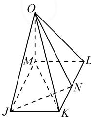
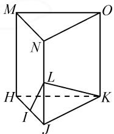
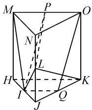
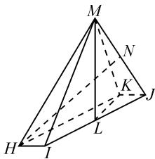
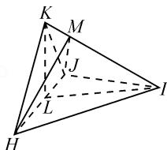

# 立体几何垂直证明思路探究

# ● 吉林师范大学数学与计算机学院 王恩泽

摘要: 立体几何的主要目的是培养学生的空间想象能力,但立体几何的学习对学生而言普遍感到困难.本文中结合具体案例对立体几何垂直关系的证明思路进行了探究,为学生学习立体几何主题提供一些参考.

关键词: 立体几何; 垂直证明; 解题思路

立体几何的垂直证明问题可以分为三类,分别是直线与直线、直线与平面、平面与平面.核心分析思路是通过假设待证的结论成立,然后结合已知条件,再进行逆向推理,得到关键信息,从而完成证明.

# 1 直线与平面垂直证明思路探究

例 1 如图 1 所示, 在四棱锥 O-JKLM 中, 底面 JKLM 是矩形, OM = ML = 1, $OL = \sqrt{2}$ , N 为 KL 上的点, 且 $JN \perp$ 平面 OMK. 求证: $OM \perp$ 平面 JKLM.

text_image

O
M
L
N
J
K

图 1

分析:欲证 $OM \perp$ 平面 JKLM，
先证直线 OM 和平面 JKLM 内的两条相交直线垂直,而条件给出 $JN \perp$ 平面 OMK, 则 $JN \perp OM$ , 所以只需要在平面 JKLM 内找到另外一条不与 JN 平行且与 OM 垂直的直线即可. 又根据 OM = ML = 1, $OL = \sqrt{2}$ , 可得到 $OM \perp LM$ . 而 LM 与 JN 都在平面 JKLM 内且相交, 所以证得 $OM \perp$ 平面 JKLM.

证明：∵JN⊥平面OMK，

$$
\therefore J N \perp O M.
$$

$$
\because O M = M L = 1, O L = \sqrt {2},
$$

$$
\therefore O M ^ {2} + L M ^ {2} = O L ^ {2}.
$$

$$
\therefore O M \perp M L.
$$

∵OM⊥JN, OM⊥ML, 直线 JN 与 ML 都在平面 JKLM 内且相交，

∴OM⊥平面JKLM.

思路:例 1 中证明垂直的方法为利用直线与平面垂直的判定定理,把直线与平面的垂直证明转化为直线与平面内两条相交直线的垂直证明.

启示:学生在立体几何主题学习过程中,要精准识记相关定理与公式,准确把握相关定理的核心内容与本质.教师在教学过程中要注意引导学生深刻理解相关概念与定理,把学过的旧知识与新知识进行串联,增强新旧知识之间的联系,帮助学生构建知识体系.

# 2 直线与直线垂直证明思路探究

例 2 如图 2, 直三棱柱 HJK-MNO 的侧面 HKOM 为正方形, HK = JK = 2, I, L 分别为 HJ 和 JN 的中点, P 为棱 MO 上的点, $LK \perp MO$ . 证明: $LK \perp PI$ .

text_image

M
O
N
L
H
K
I
J

图 2

分析: 把异面直线的垂直证明 图2
转化为直线与平面的垂直证明. 先假设结论 $KL \perp PI$ 成立, 然后结合条件 $KL \perp MO$ 进行逆推, 发现两条直线正好相交于点 P, 所以把待证明的线线垂直问题转化为 KL 垂直于 PI 与 MO 所在平面的线面垂直问题, 最后通过直线与平面垂直的性质定理得出待证明问题 $KL \perp PI$ .

证明: 设 KJ 的中点为 Q, 连接 MI, IQ, QO, PL, 如图 3, 则直线 MO, IP 均在平面 MIQO 内.

∵直三棱柱 HKJ-MON 中, 侧面 HMOK 为正方形,

text_image

Geometric diagram of a cube with labeled vertices and internal points, used for spatial geometry problems.

图3

$$
\therefore H K = K J = K O = J N = 2.
$$

$\because L,Q$ 分别为 JN,KJ 的中点，

$$
\therefore J L = K Q = 1.
$$

又 $\angle NJK=\angle JKO=90^{\circ}$ ,

$$
\therefore \triangle K J L \cong \triangle O K Q.
$$

$$
\therefore \angle Q O K = \angle L K J.
$$

$$
\because \angle L K J + \angle O K L = 9 0 ^ {\circ},
$$

$$
\therefore \angle Q O K + \angle O K L = 9 0 ^ {\circ}.
$$

$$
\therefore K L \perp O Q.
$$

又 $KL \perp MO, MO$ 和 OQ 在平面 MOQI 内相交，

∴KL⊥平面MOQI.

$\because PI\subset$ 平面 MOQI,

$\therefore KL \perp PI.$

例 3 在四棱锥 M-HIJK 中, 底面 HIJK 是平行四边形, $\angle HIJ = 120^{\circ}$ , HI = 1, IJ = 4, HM = $\sqrt{15}$ , L, N 分别是 IJ, MJ 的中点, $MK \perp KJ$ , ML $\perp LK$ , 如图 4. 证明: $HI \perp ML$ .

text_image

Geometric diagram of a pyramid with labeled vertices and internal points, including dashed lines for hidden edges.

图 4

证明: 在 $\triangle JKL$ 中, 2LJ = IJ = 4, JK = HI = 1, $\angle IJK = 180^{\circ} - \angle HIJ = 60^{\circ}$ , 由余弦定理, 得 $KL = \sqrt{3}$ .

$$
\therefore K J ^ {2} + K L ^ {2} = L J ^ {2}.
$$

$\therefore \angle JKL=90^{\circ}$ ，即 $JK \perp KL$ .

$$
\because H I \parallel K J,
$$

$$
\therefore H I \perp K L.
$$

$$
\because H I \parallel K J, M K \perp K J,
$$

$$
\therefore H I \perp M K.
$$

∴HI⊥平面 MKL.

$$
\therefore H I \perp M L.
$$

思路: 直线与直线的垂直证明问题按照两条直线是否共面可分为共面直线垂直和异面直线垂直. 异面直线的垂直证明比共面直线的垂直证明略显复杂, 既可以把异面直线转化为共面直线后再证明垂直, 又可以把异面直线的垂直证明转化为直线与平面的垂直证明. 后者的思路是假设待证明的问题成立, 通过将待证问题与题干中给出的垂直条件相结合, 把直线与直线的垂直证明问题转化为直线与平面的垂直证明问题解答即可.

启示:学生在立体几何主题学习过程中应该合理运用逆向思维,把待证结论变为已知条件合理加以使用,改变从条件到结论的思维定势.教师在教学过程中注意合理引导学生理解并掌握逆向思维方式,提升思维的广度.

# 3 平面与平面垂直证明思路探究

例 4 如图 5, 四面体 HIJK 中, $HK \perp KJ$ , HK = KJ, $\angle HKI = \angle IKJ$ , L 为 HJ 的中点. 证明: 平面 $ILK \perp$ 平面 HJK.

分析: 利用两个平面垂直的判定定理, 需要在其中一个平面内找到一条与另外一个平面垂直的直线.题干给出了 $HK=JK,L$ 为HJ中点,利用等腰三角形的性质可知 $KL\perp HJ$ ,又因为 $\angle HKI$ 和 $\angle IKJ$ 相等,所以三

text_image

K
M
J
L
H
I

图 5

角形 HKI 和三角形 JKI 全等, 可知三角形 HIJ 为等腰三角形, 则 IL 与 HJ 垂直. 再证明 HJ 与平面 ILK 垂直, 即可证明平面 HJK 与平面 ILK 垂直.

证明：∵在△HKJ中，HK=JK，HL=LJ，

$$
\therefore K L \perp H J.
$$

$$
\because \angle H K I = \angle I K J,
$$

$$
\therefore \triangle H K I \cong \triangle J K I.
$$

$$
\therefore H I = I J.
$$

$$
\therefore I L \perp H J.
$$

又 KL, IL 都在平面 IKL 内且相交，

∴HJ⊥平面IKL.

又 $HJ \subset$ 平面 HJK，

∴平面 HJK⊥平面 IKL.

思路: 平面与平面垂直的具体证明方法是在其中一个平面内找到一条直线与另一个平面垂直, 把面面垂直问题转化为线面垂直问题, 然后利用线面垂直证明思路完成证明.

启示:学生在立体几何主题学习过程中应该学会总结各种方法之间的联系,理解不同方法间的共性.教师在教学过程中应该总结提炼每种方法的精华之处,帮助学生搭建桥梁,建立全面完整的知识系统.

在高中数学学习过程中,立体几何主题是重难点 $^{[1]}$ .学生在学习立体几何主题时,应该精准识记相关定理与公式,准确把握相关定理的核心内容与本质,合理运用逆向思维,把待证结论变为已知条件合理分析,改变从条件到结论的思维定势,养成逆向思考的方式,总结各种方法之间的联系,理解不同方法间的共性.教师应在教学过程中注意引导学生主动思考 $^{[2]}$ ,深刻理解相关概念与定理,把学过的旧知识与新知识进行串联,增强新旧知识之间的联系;合理引导学生理解并掌握逆向思维方式,提升思维的广度;注意总结提炼每种方法的精华之处,帮助学生搭建桥梁,建立全面的知识系统,同时进行必要的习题练习,促进学生构建完整的知识体系 $^{[3]}$ .

# 参考文献：

[1]任霞.高中生立体几何学习现状分析及有效对策[J].知识文库,2022(12):178-180.   
[2]顾银丽.一题多想,提升学生立体几何解题能力[J].数理天地(高中版),2023(1):35-36.  
[3] 张敏, 杨耘. 高中数学课堂立体几何教学研究 [J]. 新世纪智能, 2022(A0): 26-27. Z