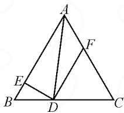
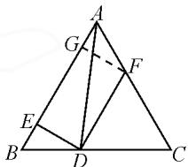
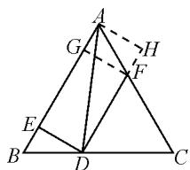
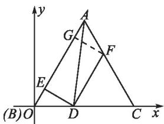

# “数”“形”合作,巧妙破解

——对 2021 年高考数学天津卷第 15 题的探究

● 江苏省宜兴市丁蜀高级中学 谈琴

平面向量的数量积问题涉及平面向量的基本概念、模、投影、夹角、坐标等相关知识，同时具备“数”的特征与“形”的直观，一直是历年高考中的热点题型与常考题型之一，背景新颖，方式创新，难度适中，倍受命题者的关注与青睐。特别是新高考的天津卷，对平面向量的数量积考查已经形成了“天津”特色。

# 1 真题呈现

高考真题 （2021年高考数学天津卷第15题）如图1，已知等边三角形ABC的边长为1，D在线段BC上，且 $DE\perp AB$ ，垂足为E， $DF\parallel AB$ 交AC于点F，则 $|2\overrightarrow{BE}+\overrightarrow{DF}|=$ \_\_\_\_； $(\overrightarrow{DE}+\overrightarrow{DF})\cdot\overrightarrow{DA}$ 的最小值为\_\_\_\_。

text_image

Geometric diagram of triangle ABC with internal points D, E, F and connecting line segments

图1

# 2 真题剖析

此题是新高考天津卷中对平

面向量考查的一大特色,以正三角形为问题背景,以平面向量的线性关系以及数量积作为条件,通过两问设置,求解相应平面向量线性关系式的模以及平面向量数量积的最值问题.

破解此类问题最常见的“招数”就是利用平面几何思维、平面向量思维、代数思维与极化恒等式思维等，从平面向量相关概念入手，利用平面向量的自身“形”的特点，结合向量的线性运算与逻辑推理，或通过平面几何的几何特征加以“形”的转化，或通过平面向量的基底运算、投影定义、坐标运算以及极化恒等式等加以“数”的运算，从而得以应用与求解.

# 3 真题破解

解法 1(平面几何法): 由题可知, 四边形 ABDF 是等腰梯形, $\triangle CDF$ 是正三角形.

设 $|BD|=2t,2t\in(0,1)$ ，即 $t\in(0,\frac{1}{2})$ ，则有 $|BE|=t,|DE|=\sqrt{3}t,|AE|=1-t,|DF|=|FC|=$ $|DC|=1-2t,|AF|=2t.$

在 Rt△AED 中, 可得 $\left|DA\right| = \sqrt{3t^{2} + (1-t)^{2}} =$

$$
\sqrt {4 t ^ {2} - 2 t + 1}.
$$

因为 $DF \parallel AB$ ，所以 $\left|2\overrightarrow{BE}+\overrightarrow{DF}\right|=2t+1-2t=1$ .

结合余弦定理的向量式,可得

$$
\begin{array}{l} (\overrightarrow {D E} + \overrightarrow {D F}) \cdot \overrightarrow {D A} \\ = \overrightarrow {D E} \cdot \overrightarrow {D A} + \overrightarrow {D F} \cdot \overrightarrow {D A} \\ = \overrightarrow {D E ^ {2}} + \frac {\left| D F \right| ^ {2} + \left| D A \right| ^ {2} - \left| A F \right| ^ {2}}{2} \\ = 3 t ^ {2} + \frac {(1 - 2 t) ^ {2} + 4 t ^ {2} - 2 t + 1 - 4 t ^ {2}}{2} \\ = 5 t ^ {2} - 3 t + 1 = 5 \left(t - \frac {3}{1 0}\right) ^ {2} + \frac {1 1}{2 0}. \\ \end{array}
$$

所以当 $t=\frac{3}{10}$ 时， $(\overrightarrow{DE}+\overrightarrow{DF})\cdot\overrightarrow{DA}$ 的最小值为 $\frac{11}{20}$ .

故填答案:(1)1;(2) $\frac{11}{20}$ .

点评:借助平面几何图形的直观,没有添加任何的辅助线,直观形象,有效破解.

解法 2(平面向量——基底法):

如图 2 所示, 过点 F 作 $FG \perp AB$ , 垂足为 G, 易证得 $\triangle BED \cong \triangle AGF$ .

由四边形 EDFG 为矩形, 可得 $\overrightarrow{BE} = \overrightarrow{GA}, \overrightarrow{DF} = \overrightarrow{EG}$ , 则有 $2\overrightarrow{BE} + \overrightarrow{DF} = \overrightarrow{BA}$ , 所以 $|2\overrightarrow{BE} + \overrightarrow{DF}| = 1$ .

text_image

Geometric diagram of triangle ABC with internal points D, E, F, G and connecting line segments

图2

由于 $\overrightarrow{DE} +\overrightarrow{DF} = \overrightarrow{DG}$ ，可得 $(\overrightarrow{DE} +\overrightarrow{DF})\cdot \overrightarrow{DA} =$ $\overrightarrow{DG}\cdot \overrightarrow{DA}.$

设 $|BD|=2t,2t\in(0,1)$ ，即 $t\in\left(0,\frac{1}{2}\right)$ ，则有 $|BE|=|GA|=t,|EG|=1-2t$ ，而 $\overrightarrow{DG}=\overrightarrow{DB}+\overrightarrow{BG}=\overrightarrow{DB}+(1-t)\overrightarrow{BA},\overrightarrow{DA}=\overrightarrow{DB}+\overrightarrow{BA}.$

所以 $\overrightarrow{DG} \cdot \overrightarrow{DA} = [\overrightarrow{DB} + (1 - t)\overrightarrow{BA}] \cdot (\overrightarrow{DB} + \overrightarrow{BA}) = \overrightarrow{DB^2} + (2 - t)\overrightarrow{DB} \cdot \overrightarrow{BA} + (1 - t)\overrightarrow{BA^2} = 4t^2 + (2 - t) \cdot 2t \cdot 1 \cdot \cos 120^\circ + (1 - t) = 5t^2 - 3t + 1 = 5\left(t - \frac{3}{10}\right)^2 + \frac{11}{20}$ .

故当 $t=\frac{3}{10}$ 时， $(\overrightarrow{DE}+\overrightarrow{DF})\cdot\overrightarrow{DA}$ 的最小值为 $\frac{11}{20}$ .

点评:结合平面几何中辅助线的构造和三角形的全等判定与性质,确定四边形 EDFG 为矩形,进而确定对应的向量关系,从而得以确定对应向量的线性关系式的模;设出 $\left|BD\right|=2t$ , 结合平面向量的线性运算,通过基底的选取与线性变形,利用数量积加以转化与变形,得到含参的二次函数关系式,通过配方处理,利用二次函数的图象与性质来确定对应的最值问题.合理选取基底是简化数量积运算的关键.

解法 3(平面向量——投影法): 以上部分同方法 2, 可得 $\left|2\overrightarrow{BE}+\overrightarrow{DF}\right|=1$ .

如图 3 所示, 过点 A 作 $AH \perp DF$ , 垂足为 H.

设 $|BD|=2t,2t\in(0,1)$ ，即 $t\in(0,\frac{1}{2})$ ，则 $|DE|=\sqrt{3}t,|BE|=|GA|=t,|EG|=|DF|=1-2t,|DH|=|EA|=1-t.$

text_image

Geometric diagram of triangle ABC with internal points D, E, F, G, H and connecting lines, including dashed auxiliary lines.

图 3

结合投影的定义,可得 $(\overrightarrow{DE}+\overrightarrow{DF})\cdot\overrightarrow{DA}=\overrightarrow{DE}\cdot\overrightarrow{DA}+\overrightarrow{DF}\cdot\overrightarrow{DA}=\overrightarrow{DE}^{2}+|DF||DH|=3t^{2}+(1-2t)\cdot(1-t)=5t^{2}-3t+1=5(t-\frac{3}{10})^{2}+\frac{11}{20}.$

所以当 $t=\frac{3}{10}$ 时， $(\overrightarrow{DE}+\overrightarrow{DF})\cdot\overrightarrow{DA}$ 的最小值为 $\frac{11}{20}$ .

点评:结合平面几何图形中相应辅助线的构建,在矩形背景中,根据垂直关系,将对应的数量积加以展开,分别利用投影的定义,将对应数量积加以转化与变形,得到含参的二次函数关系式,通过配方处理,利用二次函数的图象与性质来确定对应的最值问题.投影可以有效将数量积中的相关问题加以合理转化,是破解此类问题中比较常用的一类技巧方法.

解法 4(坐标法): 以上部分同方法 2, 可得 $\left|2\overrightarrow{BE}+\overrightarrow{DF}\right|=1$ .

如图 4 所示, 以点 B 为坐标原点, BC 所在直线为 x 轴建立平面直角坐标系.

设 $|BD|=2t,2t\in(0,1)$ ，即 $t\in(0,\frac{1}{2})$ ，则 $|BE|=t,|DF|=1-2t.$

text_image

y
A
G
F
E
B)O
D
C
x

图4

又 $D(2t,0),E(\frac{1}{2} t,\frac{\sqrt{3}}{2} t),A(\frac{1}{2},\frac{\sqrt{3}}{2}),F(t + \frac{1}{2},$ $\frac{\sqrt{3}}{2} -\sqrt{3} t)$

所以 $\overrightarrow{DE} = (-\frac{3}{2} t, \frac{\sqrt{3}}{2} t), \overrightarrow{DF} = (-t + \frac{1}{2}, \frac{\sqrt{3}}{2} - \sqrt{3} t), \overrightarrow{DA} = (\frac{1}{2} - 2t, \frac{\sqrt{3}}{2})$ .

故 $(\overrightarrow{DE}+\overrightarrow{DF})\cdot\overrightarrow{DA}=(-\frac{5}{2}t+\frac{1}{2},\frac{\sqrt{3}}{2}-\frac{\sqrt{3}}{2}t)\cdot(\frac{1}{2}-2t,\frac{\sqrt{3}}{2})=5t^{2}-3t+1=5(t-\frac{3}{10})^{2}+\frac{11}{20}.$

所以当 $t=\frac{3}{10}$ 时， $(\overrightarrow{DE}+\overrightarrow{DF})\cdot\overrightarrow{DA}$ 的最小值为 $\frac{11}{20}$ .

点评:通过平面直角坐标系的建立,设出 $|BD|=2t$ ,结合平面几何图形的几何性质以及正三角形的特征确定各对应点的坐标,根据向量的坐标以及数量积公式,将对应数量积转化为含参的二次函数关系式,通过配方处理,利用二次函数的图象与性质来确定对应的最值问题.坐标法处理平面几何中的数量积的最值问题,就是合理引入参数,确定对应的坐标,转化为函数问题,利用函数相关知识来确定最值问题.

解法 5(极化恒等式法): 以上部分同方法 2, 可得 $\left|2\overrightarrow{BE}+\overrightarrow{DF}\right|=1$ .

取线段 GA 的中点 O，由于 $\overrightarrow{DE} + \overrightarrow{DF} = \overrightarrow{DG}$ ，结合极化恒等式，可得 $(\overrightarrow{DE} + \overrightarrow{DF}) \cdot \overrightarrow{DA} = \overrightarrow{DG} \cdot \overrightarrow{DA} = |DO|^{2} - |GO|^{2}$ .

设 $|BD|=2t,2t\in(0,1)$ ，即 $t\in(0,\frac{1}{2})$ ，则有 $|BE|=|GA|=t,|DE|=\sqrt{3}t,|EG|=1-2t.$

于是 $|DO|^{2}=|DE|^{2}+|EO|^{2}=3t^{2}+(1-2t+\frac{1}{2}t)^{2}=3t^{2}+(1-\frac{3}{2}t)^{2},|GO|^{2}=(\frac{1}{2}t)^{2}.$

所以 $(\overrightarrow{DE} + \overrightarrow{DF}) \cdot \overrightarrow{DA} = |DO|^2 - |GO|^2 = 3t^2 + (1 - \frac{3}{2} t)^2 + (\frac{1}{2} t)^2 = 5t^2 - 3t + 1 = 5(t - \frac{3}{10})^2 + \frac{11}{20}$ .

故当 $t=\frac{3}{10}$ 时， $(\overrightarrow{DE}+\overrightarrow{DF})\cdot\overrightarrow{DA}$ 的最小值为 $\frac{11}{20}$ .

点评:通过平面向量线性运算的转化,引入线段GA的中点O,合理将有关的数量积问题加以巧妙转化,借助平面向量的极化恒等式来变形;结合 $|BD|=2t$ ,通过线段的关系,以及勾股定理的应用,建立含参的二次函数关系式;通过配方处理,利用二次函数的图象与性质来确定对应的最值问题.极化恒等式是平面向量中有效转化数量积的技巧,往往可以出奇制胜.

# 4 解后反思

以上各种不同的解法,或平面几何,或平面向量,或直角坐标,或极化恒等式等,都充分体现了平面向量“数”与“形”的和谐统一与巧妙转化,“数”与“形”协同作战、密切合作,也可以从“数”的角度加以代数运算,可以从“形”的角度加以直观想象,有效提升解题思维层次,发散解题思维,提升解题能力.