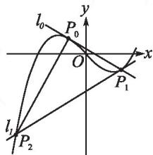
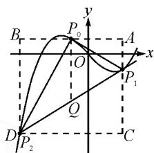
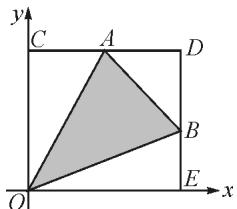
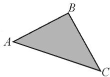

# 三疑三思三次函数\*

# ●浙江省宁波市北仑明港高级中学 贺旭

摘要:对说题比赛中一道三次函数的综合问题进行释疑、探究,并总结出解决运算量大的问题可以采用且算且思、先思后算、算后反思的策略.

关键词:三次函数;面积;推广;思考

# 1 问题提出

浙江省 2021 年高中数学教学活动评审比赛的一个环节是说题,题目分为 A,B 组,给选手的准备时间是 40 分钟,现场说题 15 分钟.笔者选取 A 组一道题进行探究.

已知三次函数 $f(x) = x^3 - x$ ，设 $P_0(x_0, y_0)$ 为函数 $y = f(x)$ 曲线上异于对称中心的任一点，在点 $P_0$ 处的切线 $l_0$ 交曲线点于点 $P_1$ ，在 $P_1$ 点处的切线 $l_1$ 交曲线于点 $P_2$ ，求三角形 $P_0P_1P_2$ 的面积 $S_{\triangle P_0P_1P_2}$ .

解: 对三次函数 $f(x)=x^{3}-x$ 求导, 得 $f'(x)=3x^{2}-1$ .

画出三次函数的图象(如图1)，设 $P_{0}(x_{0}, x_{0}^{3} - x_{0})$ ，则切线 $l_{0}$ 方程为 $y - (x_{0}^{3} - x_{0}) = (3x_{0}^{3} - 1) \cdot (x - x_{0})$ .

text_image

l₀
P₀
O
x
P₁
l₁
P₂
y

图 1

联立

$$
\left\{ \begin{array}{l} y - \left(x _ {0} ^ {3} - x _ {0}\right) = \left(3 x _ {0} ^ {2} - 1\right) \left(x - x _ {0}\right), \\ y = x ^ {3} - x, \end{array} \right.
$$

消去 y，得 $x^{3}-3x_{0}^{2}x+2x_{0}^{3}=0$ ，拆项得 $x^{3}-x_{0}^{2}x-2x_{0}^{2}x+2x_{0}^{3}=0$ ，因式分解得 $(x-x_{0})^{2}(x+2x_{0})=0$ ，所以 $x=-2x_{0}$ ，则 $P_{1}(-2x_{0},-8x_{0}^{3}+2x_{0})$ 。

同理求点 $P_{2}$ 的坐标.

由 $\left\{\begin{aligned}y&-(-8x_{0}^{3}+2x_{0})=(12x_{0}^{2}-1)(x+2x_{0}),\\ y&=x^{3}-x,\end{aligned}\right.$

可得 $x^{3} - 12x_{0}^{2}x - 16x_{0}^{3} = 0$ ，即 $(x + 2x_0)^2$ $(x - 4x_0) = 0$ ，所以 $x = 4x_0$ ，则 $P_{2}(4x_{0},64x_{0}^{3} - 4x_{0})$

$S_{\triangle P_{0}P_{1}P_{2}}$ 的求法有两种: 割和补.

法 1(割法): 如图 2, 过 $P_{0}$ 作 x 轴的垂线交直线 $P_{1}P_{2}$ 于 Q, 则 $Q(x_{0}, 28x_{0}^{3}-x_{0})$ .

所以 $S_{\triangle P_{0}P_{1}P_{2}}$

$$
\begin{array}{l} = \frac {1}{2} \left| P _ {0} Q \right| \left| x _ {P _ {1}} - x _ {P _ {2}} \right| \\ = \frac {1}{2} \left| 2 7 x _ {0} ^ {3} \right| \left| 6 x _ {0} \right| \\ = 8 1 x _ {0} ^ {4} \\ \end{array}
$$

法 2(补法): 如图 2, 补出矩形 ABCD.

text_image

B
P₀
A
x
O
Q
P₁
D
P₂
C

图2

所以 $S_{\triangle P_0P_1P_2}$

$$
= S _ {\text {矩形} A B P _ {2} C} - S _ {\triangle A P _ {0} P _ {1}} - S _ {\triangle B P _ {0} P _ {2}} - S _ {\triangle C P _ {1} P _ {2}}
$$

$$
= 1 8 \left(2 1 x _ {0} ^ {4} - x _ {0} ^ {2}\right) + \frac {9}{2} \left(3 x _ {0} ^ {4} - x _ {0} ^ {2}\right) - \frac {9}{2} \times
$$

$$
(2 1 x _ {0} ^ {4} - x _ {0} ^ {2}) - 1 8 (1 2 x _ {0} ^ {4} - x _ {0} ^ {2})
$$

$$
= 8 1 x _ {0} ^ {4}.
$$

# 2 三疑

说题比赛时,选手们主要有3个疑问:①无法求出交点 $P_{1},P_{2}$ ;②无法求出三角形面积;③没有将这道题进行推广.

# 2.1 求交点

对于疑问①,可以直接利用拆项进行因式分解从而求出点 $P_{1}$ 的横坐标;也可以观察图形,发现直线 $P_{0}P_{1}$ 与曲线只有两个交点,而方程联立得到的是三次方程,因此必有一个重根,易知重根是 $x=x_{0}$ ,这样就可以求得另一个根 $x=-2x_{0}$ .求点 $P_{2}$ 时,可以根据点 $P_{1}$ 的横坐标直接进行迭代,也可以类比点 $P_{1}$ 的坐标求法,一模一样求一遍.

# 2.2 求面积

三角形面积的求法常用的有三种: 直接法、割法、补法. 对这道题而言, 运算量最小的是割法, 直接法最繁琐, 不推荐, 补法普适性强, 易于推广. 现对三角形的面积用补形法进行深入探究.

如图 3, 已知三角形的三个顶点 $O(0,0)$ , $A(x_{1},y_{1})$ , $B(x_{2},y_{2})$ , 求三角形 OAB 的面积 $S_{\triangle OAB}$ .

text_image

y
C A D
O B E x

图3

$$
\begin{array}{l} S _ {\triangle O A B} \\ = S _ {\text {矩形} O E D C} - S _ {\triangle D A B} - S _ {\triangle C A O} \\ - S _ {\triangle E B O} \\ = x _ {2} y _ {1} - \frac {1}{2} \left(x _ {2} - x _ {1}\right) \left(y _ {1} - y _ {2}\right) - \frac {1}{2} x _ {1} y _ {1} - \frac {1}{2} x _ {2} y _ {2} \\ = \frac {1}{2} \left| x _ {2} y _ {1} - x _ {1} y _ {2} \right| \\ = \frac {1}{2} \left| \begin{array}{c c} x _ {1} & y _ {1} \\ x _ {2} & y _ {2} \end{array} \right| \\ = \frac {1}{2} \left| \left| \begin{array}{c c c} 1 & 0 & 0 \\ 1 & x _ {1} & y _ {1} \\ 1 & x _ {2} & y _ {2} \end{array} \right| \right|. \\ \end{array}
$$

通过补形法,计算出三角形的面积是 $\frac{1}{2}|x_{2}y_{1}-x_{1}y_{2}|$ ,这个形式可以联想到2阶行列式,再变形成3阶行列式的形式,就可以将这个三角形推广为平面内任意三角形.

如图 4, 已知 $\triangle ABC, A(x_{1}, y_{1}), B(x_{2}, y_{2}), C(x_{3}, y_{3})$ ，求三角形 ABC 的面积 $S_{\triangle ABC}$ .

任意三角形通过平移都能经过原点,变成图3,这里将图4的A点平移到原点,则

  
图4

$$
\overrightarrow {A B} = \left(x _ {2} - x _ {1}, y _ {2} - y _ {1}\right), \overrightarrow {A C} = \left(x _ {3} - x _ {1}, y _ {3} - y _ {1}\right).
$$

根据上面的结论,则

$$
\begin{array}{l} S _ {\triangle A B C} = \frac {1}{2} \left| \left(x _ {3} - x _ {1}\right) \left(y _ {2} - y _ {1}\right) - \left(x _ {2} - x _ {1}\right) \left(y _ {3} - y _ {1}\right) \right| \\ = \frac {1}{2} \left| \left| \begin{array}{c c c} 1 & x _ {1} & y _ {1} \\ 1 & x _ {2} & y _ {2} \\ 1 & x _ {3} & y _ {3} \end{array} \right| \right|. \\ \end{array}
$$

这样就推导出平面内任意三角形的面积公式.

# 2.3 再推广

已知三次函数 $f(x)=ax^{3}+bx+c$ ，设 $P_{0}(x_{0},y_{0})$ 为曲线 $y=f(x)$ 上异于对称中心的任一点，在 $P_{0}$ 处的切线 $l_{0}$ 交曲线于点 $P_{1}$ ，在 $P_{1}$ 处的切线 $l_{1}$ 交曲线于点 $P_{2}$ ，求三角形 $P_{0}P_{1}P_{2}$ 的面积 $S_{\triangle P_{0}P_{1}P_{2}}$ 。

解: 对三次函数 $f(x)=ax^{3}+bx+c$ 求导, 得 $f'(x)=3ax^{2}+b$ .

设 $P_{0}(x_{0}, ax_{0}^{3} + bx_{0} + c)$ ，联立切线方程 $l_{P_{0}P_{1}}$ 与曲线方程 $f(x) = ax^{3} + bx + c$ ，求出 $P_{1}$ .

由 $\left\{\begin{aligned}y&=3ax_{0}^{2}+bx-2ax_{0}^{3}+c,\\ y&=ax^{3}+bx+c\end{aligned}\right.$ 消去y，整理得

$$
a \left(x + 2 x _ {0}\right) \left(x - x _ {0}\right) ^ {2} = 0.
$$

所以 $x_{1}=x_{0}, x_{2}=-2x_{0}$ ，即 $P_{1}(-2x_{0}, f(-2x_{0}))$ .
用迭代法直接写出 $P_{2}(4x_{0},f(4x_{0}))$ .所以

$$
S _ {\triangle P _ {0} P _ {1} P _ {2}} = \frac {1}{2} \left| \begin{array}{c c c} 1 & x _ {0} & f (x _ {0}) \\ 1 & - 2 x _ {0} & f (- 2 x _ {0}) \\ 1 & 4 x _ {0} & f (4 x _ {0}) \end{array} \right| = 8 1 | a | x _ {0} ^ {4}.
$$

因此,我们可以发现三角形的面积只与三次函数的三次项系数有关.

# 3 三思

# 3.1 且算且思

综合性强的数学题常常难以一眼望穿，需要且算且思，摸着石头过河，边算边想边观察，答案可能在不经意间露出端倪，再通过细细揣摩完善解题过程。本文中在求点 $P_{1}$ 的横坐标时，有如雾中的感觉，在经历了一系列复杂的运算后，求得 $x = -2x_0$ ，通过迭代的思想就能猜出想点 $P_{2}$ 的横坐标为 $x = 4x_{0}$ 。踏破铁鞋无觅处，轻松得到点 $P_{1}, P_{2}$ 的坐标。

# 3.2 多思少算

三思而后行,做事前多思考,谋定而后动能避免很多麻烦,少走许多冤枉路.高中阶段求面积的方法很多,就公式法来说有三种:

$$
① S _ {\triangle} = \frac {1}{2} a h; ② S _ {\triangle} = \frac {1}{2} a b \sin C;
$$

③ $S_{\triangle}=\sqrt{p(p-a)(p-b)(p-c)}$ （海伦公式）.另外还有割补法.做题时必须要先思考用哪种方法，磨刀不误砍柴工，方法选择对了，答案才能呼之欲出.本文中的面积若是不假思索直接以 $P_{1}P_{2}$ 作底， $P_{0}$ 到线段 $P_{1}P_{2}$ 的距离为高进行求解，恐怕要大费周章，求而不得.

# 3.3 算后反思

一道题解完后并不代表着结束,而是要反问自己“还有其他方法吗?”“能不能推广到一般情况?”“这道题考查的本质是什么?”通过反思,优化解法,深度理解题意,提升自身素养.对于文中的面积问题,思考如何求平面内任意三角形的面积;将题目中的特殊三次函数换成一般三次函数,又会有什么结论.在不断反问与反思中,探索发现,真可谓:涉浅水者见虾,其颇深者察鱼鳖,其尤甚者观蛟龙 $^{[1]}$ .

# 参考文献：

[1] 卓斌. 数学解题应遵循“多想少算”原则 [J]. 数学通报, 2021(1): 60-62, 66. Z